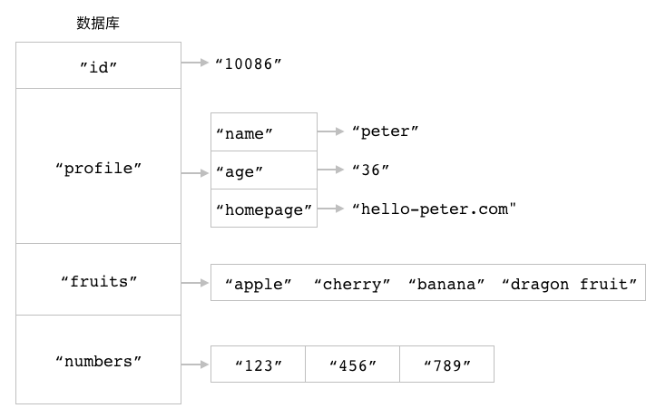

数据库
===============

在前面的章节中，
我们学习了如何使用不同的 Redis 命令去创建各种不同类型的键，
比如使用 ``SET`` 命令去创建字符串键，
使用 ``HSET`` 命令去创建散列键，
又或者使用 ``RPUSH`` 和 ``LPUSH`` 命令去创建列表键，
诸如此类。

但无论字符串键也好，
散列键又或者列表键也好，
它们都会被储存到一个名为数据库的容器里面。
因为 Redis 是一个键值对数据库服务器，
所以它的数据库跟我们之前介绍过的散列键一样，
都可以根据键的名字对数据库中的键值对进行索引：
比如说，
通过使用 Redis 提供的命令，
我们可以从数据库中移除指定的键，
又或者将指定的键从一个数据库移动到另一个数据库，
诸如此类。

作为例子，
图 11-1 展示了一个包含四个键的数据库，
其中 ``id`` 为字符串键，
``profile`` 为散列键，
``fruits`` 为集合键，
而 ``numbers`` 则为列表键。

----

图 11-1 一个数据库示例

----

Redis 为数据库提供了非常丰富的操作命令，
通过这些命令，
用户可以：

- 指定自己想要使用的数据库。

- 一次性获取数据库包含的所有键，
  迭代地获取数据库包含的所有键，
  又或者随机地获取数据库中的某个键。

- 根据给定键的值进行排序。

- 检查给定的一个或多个键，看它们是否存在于数据库当中。

- 查看给定键的类型。

- 对给定键进行改名。

- 移除指定的键，
  又或者将它从一个数据库移动到另一个数据库。

- 清空数据库包含的所有键。

- 交换给定的两个数据库。

本章接下来的内容将对以上提到的各个命令进行介绍，
并说明如何使用这些命令去实现诸如数据库迭代器和数据库取样器这样的实用程序。

SELECT：切换至指定的数据库
----------------------------------------------------

一个 Redis 服务器可以包含多个数据库。
在默认情况下，
Redis 服务器在启动时将会创建 16 个数据库：
这些数据库都使用号码进行标识，
其中第一个数据库为 0 号数据库，
第二个数据库为 1 号数据库，
而第三个数据库则为 2 号数据库，
以此类推。

Redis 虽然不允许在同一个数据库里面使用两个同名的键，
但是由于不同数据库拥有不同的命名空间，
因此在不同数据库里面使用同名的键是完全没有问题的，
而用户也可以通过使用不同数据库来储存不同的数据，
以此来达到重用键名并且减少键冲突的目的。

比如说，
如果我们将用户的个人信息和会话信息都存放在同一个数据库里面，
那么为了区分这两种信息，
程序就需要使用 ``user::<id>::profile`` 格式的键来储存用户信息，
并使用 ``user::<id>::session`` 格式的键来储存用户会话；
但如果我们将这两种信息分别储存在 0 号数据库和 1 号数据库里面，
那么程序就可以在 0 号数据库中使用 ``user::<id>`` 格式的键来储存用户信息，
并在 1 号数据库中继续使用 ``user::<id>`` 格式的键来储存用户会话。

当用户使用客户端与 Redis 服务器进行连接时，
客户端一般默认都会使用 0 号数据库，
但是通过使用 ``SELECT`` 命令，
用户可以从当前正在使用的数据库切换到自己想要使用的数据库：

::

    SELECT db

``SELECT`` 命令在切换成功之后将返回 ``OK`` 。

举个例子，
当我们以默认方式启动 ``redis-cli`` 客户端时，
``redis-cli`` 将连接至服务器的 0 号数据库：

::

    $ redis-cli
    redis>

这时，
如果我们想要从 0 号数据库切换至 3 号数据库，
那么只需要执行以下命令即可：

::

    redis> SELECT 3
    OK

    redis[3]>

客户端提示符末尾的 ``[3]`` 表示客户端现在正在使用 3 号数据库。
（\ ``redis-cli`` 在使用默认的 0 号数据库时不会打印出数据库号码。）

在此之后，
我们就可以通过执行命令，
对 3 号数据库进行设置了：

::

    redis[3]> SET msg "hello world"    -- 在 3 号数据库创建一个 msg 键
    OK

    redis[3]> SET counter 10086        -- 在 3 号数据库创建一个 counter 键
    OK

其他信息
^^^^^^^^^^^^^^^^^

+-----------+-----------------------------------------------+
| 属性      | 值                                            |
+===========+===============================================+
| 复杂度    | O(1)                                          |
+-----------+-----------------------------------------------+
| 版本要求  | ``SELECT`` 命令从 Redis 1.0.0 版本开始可用。  |
+-----------+-----------------------------------------------+

KEYS：获取所有与给定匹配符相匹配的键
----------------------------------------------------

``KEYS`` 命令接受一个全局匹配符作为参数，
然后返回数据库里面所有与这个匹配符相匹配的键作为结果：

::

    KEYS pattern

举个例子，
如果我们想要获取数据库包含的所有键，
那么可以执行以下命令：

::

    redis> KEYS *
    1) "fruits"
    2) "user::12312::profile"
    3) "user::ip"
    4) "user::id"
    5) "cache::/user/peter"
    6) "todo-list"

又或者说，
如果我们想要获取所有以 ``user::`` 为前缀的键，
那么可以执行以下命令：

::

    redis> KEYS user::*
    1) "user::12312::profile"
    2) "user::ip"
    3) "user::id"

最后，
如果数据库里面没有任何键与给定的匹配符相匹配，
那么 ``KEYS`` 命令将返回一个空值：

::

    redis> KEYS article::*
    (empty list or set)    -- 数据库里面没有任何以 article:: 为前缀的键

全局匹配符
^^^^^^^^^^^^^^^^^^^^^

``KEYS`` 命令允许使用多种不同的全局匹配符作为 ``pattern`` 参数的值，
表 11-1 展示了一些常见的全局匹配符，
并举例说明了这些匹配符的作用。

----

表 11-1 Glob 匹配符的作用及其示例

+-----------+-------------------------------+-----------------------------------------------------------------------------------------------------------------------------------------+
| 匹配符    | 作用                          | 例子                                                                                                                                    |
+===========+===============================+=========================================================================================================================================+
| ``*``     | 匹配零个或任意多个任意字符    | ``user::*`` 可以匹配任何以 ``user::`` 为前缀的字符串，比如 ``user::ip`` 、 ``user::12312::profile`` 等等，以及 ``user::`` 本身；        |
|           |                               | ``*z`` 可以匹配任何以字母 ``z`` 结尾的字符串，比如 ``antirez`` 、 ``matz`` 和 ``huangz`` ，以及字母 ``z`` 本身；                        |
|           |                               | ``*::*`` 可以匹配任何使用了 ``::`` 作为间隔符的字符串，比如 ``user::ip`` 和 ``cache::/user/peter`` ，但不能匹配 ``todo-list`` 。        |
+-----------+-------------------------------+-----------------------------------------------------------------------------------------------------------------------------------------+
| ``?``     | 匹配任意的单个字符            | ``user::i?`` 可以匹配任何以 ``user::i`` 为前缀，后跟单个字符的字符串，比如 ``user::ip`` 、 ``user::id`` 等，但不能匹配 ``user::ime`` 。 |
+-----------+-------------------------------+-----------------------------------------------------------------------------------------------------------------------------------------+
| ``[]``    | 匹配给定字符串中的单个字符    | ``user::i[abc]`` 可以匹配 ``user::ia`` 、 ``user::ib`` 和 ``user::ic`` ，但不能匹配 ``user::id`` 或者 ``user::ime`` ，诸如此类。        |
+-----------+-------------------------------+-----------------------------------------------------------------------------------------------------------------------------------------+
| ``[?-?]`` | 匹配给定范围中的单个字符      | ``user::i[a-d]`` 可以匹配 ``user::ia`` 、 ``user::ib`` 、 ``user::ic`` 和 ``user::id`` ，但不能匹配除此以外的其他字符串，               |
|           |                               | 比如 ``user::ip`` 或者 ``user::ime`` 。                                                                                                 |
+-----------+-------------------------------+-----------------------------------------------------------------------------------------------------------------------------------------+

----

关于全局匹配符的更多信息可以参考维基百科
`https://en.wikipedia.org/wiki/Glob_(programming) <https://en.wikipedia.org/wiki/Glob_(programming)>`_
或者 ``glob`` 程序的手册页面：
http://man7.org/linux/man-pages/man7/glob.7.html 。

其他信息
^^^^^^^^^^^^^^^^^

+-----------+-----------------------------------------------+
| 属性      | 值                                            |
+===========+===============================================+
| 复杂度    | O(N) ，其中 N 为数据库包含的键数量。          |
+-----------+-----------------------------------------------+
| 版本要求  | ``KEYS`` 命令从 Redis 1.0.0 版本开始可用。    |
+-----------+-----------------------------------------------+

SCAN：以渐进方式迭代数据库中的键
----------------------------------------------------

因为 ``KEYS`` 命令需要检查数据库包含的所有键，
并一次性将符合条件的所有键全部返回给客户端，
所以当数据库包含的键数量比较大时，
使用 ``KEYS`` 命令可能会导致服务器被阻塞。

.. TODO 此处添加 KEYS * 的 benchmark ，说明 KEYS 可能造成的问题

为了解决这个问题，
Redis 从 2.8.0 版本开始提供 ``SCAN`` 命令，
该命令是一个迭代器，
它每次被调用的时候都会从数据库里面获取一部分键，
用户可以通过重复调用 ``SCAN`` 命令来迭代数据库包含的所有键：

::

    SCAN cursor

``SCAN`` 命令的 ``cursor`` 参数用于指定迭代时使用的游标，
游标记录了迭代进行的轨迹和进度。
在开始一次新的迭代时，
用户需要将游标设置为 ``0`` ：

::

    SCAN 0

``SCAN`` 命令的执行结果由两个元素组成：

- 第一个元素是进行下一次迭代所需的游标，
  如果这个游标为 ``0`` ，
  那么说明客户端已经对数据库完成了一次完整的迭代。

- 第二个元素是一个列表，
  这个列表包含了本次迭代取得的数据库键；
  如果 ``SCAN`` 命令在某次迭代中没有获取到任何键，
  那么这个元素将是一个空列表。

关于 ``SCAN`` 命令返回的键列表，
有两个需要注意的地方：

1. ``SCAN`` 命令可能会返回重复的键，
   用户如果不想在结果里面包含重复的键，
   那么就需要自己在客户端里面进行检测和过滤。

2. ``SCAN`` 命令返回的键数量是不确定的，
   有时候甚至会不返回任何键，
   但只要命令返回的游标不为 ``0`` ，
   迭代就没有结束。

一次简单的迭代示例
^^^^^^^^^^^^^^^^^^^^^^^^^^^^^

在对 ``SCAN`` 命令有了基本的了解之后，
让我们来试试使用 ``SCAN`` 命令去完整地迭代一个数据库。

为了开始一次新的迭代，
我们将以 ``0`` 作为游标，
调用 ``SCAN`` 命令：

::

    redis> SCAN 0
    1) "25"             -- 进行下次迭代的游标
    2)  1) "key::16"    -- 本次迭代获取到的键
        2) "key::2"
        3) "key::6"
        4) "key::8"
        5) "key::13"
        6) "key::22"
        7) "key::10"
        8) "key::24"
        9) "key::23"
        10) "key::21"
        11) "key::5"

这个 ``SCAN`` 调用告知我们下次迭代应该使用 ``25`` 作为游标，
并返回了十一个键的键名。

为了继续对数据库进行迭代，
我们使用 ``25`` 作为游标，
再次调用 ``SCAN`` 命令：

::

    redis> SCAN 25
    1) "31"
    2)  1) "key::20"
        2) "key::18"
        3) "key::19"
        4) "key::7"
        5) "key::1"
        6) "key::9"
        7) "key::12"
        8) "key::11"
        9) "key::17"
        10) "key::15"
        11) "key::14"
        12) "key::3"

这次的 ``SCAN`` 调用返回了十二个键，
并告知我们下次迭代应该使用 ``31`` 作为游标。

跟之前的情况类似，
这次我们使用 ``31`` 作为游标，
再次调用 ``SCAN`` 命令：

::

    redis> SCAN 31
    1) "0"
    2) 1) "key::0"
       2) "key::4"

这次的 ``SCAN`` 调用只返回了两个键，
并且它返回的下次迭代游标为 ``0`` ——
这说明本次迭代已经结束，
整个数据库已经被迭代完毕。

SCAN 命令的迭代保证
^^^^^^^^^^^^^^^^^^^^^^^^^^^^^

针对数据库的一次完整迭代（full iteration）以用户给定游标 ``0`` 调用 ``SCAN`` 命令为开始，
直到 ``SCAN`` 命令返回游标 ``0`` 为结束。
``SCAN`` 命令为完整迭代提供以下保证：

1. 从迭代开始到迭代结束的整个过程中，
   一直存在于数据库里面的键总会被返回。

2. 如果一个键在迭代的过程中被添加到了数据库里面，
   那么这个键是否会被返回是不确定的。

3. 如果一个键在迭代的过程中被移除了，
   那么 ``SCAN`` 命令在它被移除之后将不再返回这个键；
   但是这个键在被移除之前仍然有可能被 ``SCAN`` 命令返回。

4. 无论数据库如何变化，
   迭代总是有始有终的，
   不会出现循环迭代或者其他无法终止迭代的情况。

游标的使用
^^^^^^^^^^^^^^^^^^^^^^

在很多数据库里面，
使用游标都要显式地进行申请，
并在迭代完成之后释放游标，
否则的话就会造成内存泄露。

与此相反，
``SCAN`` 命令的游标不需要申请，
也不需要释放，
它们不占用任何资源，
每个客户端都可以使用自己的游标独立地对数据库进行迭代。

此外，
用户可以随时在迭代的途中停止进行迭代，
又或者随时开始一次新的迭代，
这不会浪费任何资源，
也不会引发任何问题。

迭代与给定匹配符相匹配的键
^^^^^^^^^^^^^^^^^^^^^^^^^^^^^^^^^^^^

在默认情况下，
``SCAN`` 命令会向客户端返回数据库包含的所有键，
它就像 ``KEYS *`` 命令调用的一个迭代版本。
但是通过使用可选的 ``MATCH`` 选项，
我们同样可以让 ``SCAN`` 命令只返回与给定全局匹配符相匹配的键：

::

    SCAN cursor [MATCH pattern]

带有 ``MATCH`` 选项的 ``SCAN`` 命令就像是 ``KEYS pattern`` 命令调用的迭代版本。

举个例子，
假设我们想要获取数据库里面所有以 ``user::`` 开头的键，
但是因为这些键的数量比较多，
直接使用 ``KEYS user::*`` 有可能会造成服务器阻塞，
所以我们可以使用 ``SCAN`` 命令来代替 ``KEYS`` 命令，
对符合 ``user::*`` 匹配符的键进行迭代：

::

    redis> SCAN 0 MATCH user::*
    1) "208"
    2) 1) "user::1"
       2) "user::65"
       3) "user::99"
       4) "user::51"

    redis> SCAN 208 MATCH user::*
    1) "232"
    2) 1) "user::13"
       2) "user::28"
       3) "user::83"
       4) "user::14"
       5) "user::61"

    -- 省略后续的其他迭代……

指定返回键的期望数量
^^^^^^^^^^^^^^^^^^^^^^^^^^^^^

在一般情况下，
``SCAN`` 命令返回的键数量是不确定的，
但是我们可以通过使用可选的 ``COUNT`` 选项，
向 ``SCAN`` 命令提供一个期望值，
以此来说明我们希望得到多少个键：

::

    SCAN cursor [COUNT number]

这里特别需要注意的是，
``COUNT`` 选项向命令提供的只是期望的键数量，
但并不是精确的键数量。
比如说，
执行 ``SCAN cursor COUNT 10`` 并不是说 ``SCAN`` 命令最多只能返回 ``10`` 个键，
又或者一定要返回 ``10`` 个键：

- ``COUNT`` 选项只是提供了一个期望值，
  告诉 ``SCAN`` 命令我们希望返回多少个键，
  但每次迭代返回的键数量仍然是不确定的。

- 不过在通常情况下，
  设置一个较大的 ``COUNT`` 值将有助于获得更多键，
  这一点是可以肯定的。

以下代码展示了几个使用 ``COUNT`` 选项的例子：

::

    redis> SCAN 0 COUNT 5
    1) "160"
    2) 1) "key::43"
       2) "key::s"
       3) "user::1"
       4) "key::83"
       5) "key::u"

    redis> SCAN 0 MATCH user::* COUNT 10
    1) "208"
    2) 1) "user::1"
       2) "user::65"
       3) "user::99"
       4) "user::51" 

    redis> SCAN 0 MATCH key::* COUNT 100
    1) "214"
    2)  1) "key::43"
        2) "key::s"
        3) "key::83"
        -- 其他键……
        50) "key::28"
        51) "key::34"

在用户没有显式地使用 ``COUNT`` 选项的情况下，
``SCAN`` 命令将使用 ``10`` 作为 ``COUNT`` 选项的默认值，
换句话说，
以下两条命令的作用是相同的：

::

    SCAN cursor

    SCAN cursor COUNT 10

数据结构迭代命令
^^^^^^^^^^^^^^^^^^^^^^^^^

跟获取数据库键的 ``KEYS`` 命令一样，
Redis 的各个数据结构也存在着一些可能会导致服务器阻塞的命令：

- 散列的 ``HKEYS`` 命令、 ``HVALS`` 命令和 ``HGETALL`` 命令在处理包含键值对较多的散列时，
  可能会导致服务器阻塞。

- 集合的 ``SMEMBERS`` 命令在处理包含元素较多的集合时，
  可能会导致服务器阻塞。

- 有序集合的一些范围型获取命令，
  比如 ``ZRANGE`` ，
  也有阻塞服务器的可能。
  比如说，
  为了获取有序集合包含的所有元素，
  用户可能会执行命令调用 ``ZRANGE key 0 -1`` ，
  这时如果有序集合包含的成员数量较多的话，
  这个 ``ZRANGE`` 命令可能就会导致服务器阻塞。

为了解决以上这些问题，
Redis 为散列、集合和有序集合也提供了与 ``SCAN`` 命令类似的游标迭代命令，
它们分别是 ``HSCAN`` 命令、 ``SSCAN`` 命令和 ``ZSCAN`` 命令，
以下三个小节将分别介绍这三个命令的用法。

1. 散列迭代命令
"""""""""""""""""""""""

``HSCAN`` 命令可以以渐进的方式迭代给定散列包含的键值对：

::

    HSCAN hash cursor [MATCH pattern] [COUNT number]    

除了需要指定被迭代的散列之外，
``HSCAN`` 命令的其他参数跟 ``SCAN`` 命令的参数保持一致，
并且作用也一样。

作为例子，
以下代码展示了如何使用 ``HSCAN`` 命令去迭代 ``user::10086::profile`` 散列：

::

    redis> HSCAN user::10086::profile 0
    1) "0"            -- 下次迭代的游标
    2)  1) "name"     -- 键
        2) "peter"    -- 值
        3) "age"
        4) "32"
        5) "gender"
        6) "male"
        7) "blog"
        8) "peter123.whatpress.com"
        9) "email"
        10) "peter123@example.com"

当散列包含较多键值对的时候，
我们应该尽量使用 ``HSCAN`` 去代替 ``HKEYS`` 、 ``HVALS`` 和 ``HGETALL`` ，
以免造成服务器阻塞。

2. 渐进式集合迭代命令
"""""""""""""""""""""""

``SSCAN`` 命令可以以渐进的方式迭代给定集合包含的元素： 

::

    SSCAN set cursor [MATCH pattern] [COUNT number]

除了需要指定被迭代的集合之外，
``SSCAN`` 命令的其他参数跟 ``SCAN`` 命令的参数保持一致，
并且作用也一样。

举个例子，
假设我们想要对 ``fruits`` 集合进行迭代的话，
那么可以执行以下命令：

::

    redis> SSCAN fruits 0
    1) "0"           -- 下次迭代的游标
    2) 1) "apple"    -- 集合元素
       2) "watermelon"
       3) "mango"
       4) "cherry"
       5) "banana"
       6) "dragon fruit"

当集合包含较多元素的时候，
我们应该尽量使用 ``SSCAN`` 去代替 ``SMEMBERS`` ，
以免造成服务器阻塞。

3. 渐进式有序集合迭代命令
""""""""""""""""""""""""""""

``ZSCAN`` 命令可以以渐进的方式迭代给定有序集合包含的成员和分值：

::

    ZSCAN sorted_set cursor [MATCH pattern] [COUNT number]

除了需要指定被迭代的有序集合之外，
``ZSCAN`` 命令的其他参数跟 ``SCAN`` 命令的参数保持一致，
并且作用也一样。

比如说，
通过执行以下命令，
我们可以对 ``fruits-price`` 有序集合进行迭代：

::

    redis> ZSCAN fruits-price 0
    1) "0"                 -- 下次迭代的游标
    2)  1) "watermelon"    -- 成员
        2) "3.5"           -- 分值
        3) "banana"
        4) "4.5"
        5) "mango"
        6) "5"
        7) "dragon fruit"
        8) "6"
        9) "cherry"
        10) "7"
        11) "apple"
        12) "8.5"

当有序集合包含较多成员的时候，
我们应该尽量使用 ``ZSCAN`` 去代替 ``ZRANGE`` 以及其他可能会返回大量成员的范围型获取命令，
以免造成服务器阻塞。

4. 迭代命令的共通性质
"""""""""""""""""""""""""

``HSCAN`` 、 ``SSCAN`` 、 ``ZSCAN`` 这三个命令除了与 ``SCAN`` 命令拥有相同的游标参数以及可选项之外，
还与 ``SCAN`` 命令拥有相同的迭代性质：

- ``SCAN`` 命令对于完整迭代所做的保证，
  其他三个迭代命令也能够提供。
  比如说，
  使用 ``HSCAN`` 命令对散列进行一次完整迭代，
  在迭代过程中一直存在的键值对总会被返回，
  诸如此类。

- 跟 ``SCAN`` 命令一样，
  其他三个迭代命令的游标也不耗费任何资源。
  用户可以在这三个命令中随意地使用游标，
  比如随时开始一次新的迭代，
  又或者随时放弃正在进行的迭代，
  这不会浪费任何资源，
  也不会引发任何问题。

- 跟 ``SCAN`` 命令一样，
  其他三个迭代命令虽然也可以使用 ``COUNT`` 选项设置返回元素数量的期望值，
  但命令具体返回的元素数量仍然是不确定的。

其他信息
^^^^^^^^^^^^^^^^^

+---------------+-----------------------------------------------------------------------------------------------+
| 属性          | 值                                                                                            |
+===============+===============================================================================================+
| 复杂度        | ``SCAN`` 命令、 ``HSCAN`` 命令、 ``SSCAN`` 命令和 ``ZSCAN`` 命令单次执行的复杂度为 O(1) ，    |
|               | 而使用这些命令进行一次完整迭代的复杂度则为 O(N) ，其中 N 为被迭代的元素数量。                 |
+---------------+-----------------------------------------------------------------------------------------------+
| 版本要求      | ``SCAN`` 命令、 ``HSCAN`` 命令、 ``SSCAN`` 命令和 ``ZSCAN`` 命令从 Redis 2.8.0 版本开始可用。 |
+---------------+-----------------------------------------------------------------------------------------------+

示例：构建数据库迭代器
-----------------------------------------------

``SCAN`` 命令虽然可以以迭代的形式访问数据库，
但它使用起来并不是特别方便，
比如说：

- ``SCAN`` 命令每次迭代都会返回一个游标，
  而用户需要手动地将这个游标用作下次迭代时的输入参数，
  如果用户不小心丢失或者弄错了这个游标的话，
  那么就可能会给迭代带来错误或者麻烦。

- ``SCAN`` 命令每次都会返回一个包含两个元素的结果，
  其中第一个元素为游标，
  而第二个元素才是当前被迭代的键，
  如果迭代器能够直接返回被迭代的键，
  那么它使用起来就会更加方便。

为了解决以上这两个问题，
我们可以在 ``SCAN`` 命令的基础上进行一些修改，
实现出代码清单 11-1 所示的迭代器：
这个迭代器不仅会自动记录每次迭代的游标以防丢失，
它还可以直接返回被迭代的数据库键以供用户使用。

----

代码清单 11-1 数据库迭代器：\ ``/database/db_iterator.py``

.. literalinclude:: code/database/db_iterator.py

----

作为例子，
以下代码展示了如何使用这个迭代器去迭代一个数据库：

::

    >>> from redis import Redis
    >>> from db_iterator import DbIterator
    >>> client = Redis(decode_responses=True)
    >>> for i in range(50):             # 向数据库插入 50 个键
    ...   key = "key{0}".format(i)
    ...   value = i
    ...   client.set(key, value)
    ... 
    True
    True
    ...
    True
    >>> iterator = DbIterator(client)
    >>> iterator.next()  # 开始迭代
    ['key46', 'key1', 'key27', 'key39', 'key15', 'key0', 'key43', 'key12', 'key49', 'key41', 'key10']
    >>> iterator.next()
    ['key23', 'key7', 'key9', 'key20', 'key18', 'key3', 'key5', 'key34', 'key32', 'key40']
    >>> iterator.next()
    ['key4', 'key33', 'key30', 'key45', 'key38', 'key31', 'key6', 'key16', 'key25', 'key14', 'key13']
    >>> iterator.next()
    ['key29', 'key2', 'key42', 'key11', 'key48', 'key28', 'key8', 'key44', 'key21', 'key26']
    >>> iterator.next()
    ['key22', 'key47', 'key36', 'key17', 'key19', 'key24', 'key35', 'key37']
    >>> iterator.next()  # 迭代结束
    >>> 

.. note:: redis-py 提供的迭代器

    实际上，
    redis-py 客户端也为 ``SCAN`` 命令实现了一个迭代器 ——
    用户只需要调用 redis-py 的 ``scan_iter()`` 方法，
    就会得到一个 Python 迭代器，
    然后就可以通过这个迭代器对数据库中的键进行迭代：

    ::

        scan_iter(self, match=None, count=None) unbound redis.client.Redis method
            Make an iterator using the SCAN command so that the client doesn't
            need to remember the cursor position.
                    
            ``match`` allows for filtering the keys by pattern
                            
            ``count`` allows for hint the minimum number of returns

    redis-py 提供的迭代器跟 ``DbIterator`` 一样，
    都可以让用户免去手动输入游标的麻烦，
    但它们之间也有不少区别：

    1. redis-py 的迭代器每次迭代只返回一个元素。

    2. 因为 redis-py 的迭代器是通过 Python 的迭代器特性实现的，
       所以用户可以直接以 ``for key in redis.scan_iter()`` 的形式进行迭代。
       （``DbIterator`` 实际上也可以实现这样的特性，
       但是由于 Python 迭代器的相关知识并不在本书的介绍范围之内，
       所以我们这个自制的迭代器才没有配备这一特性。）

    3. redis-py 的迭代器也拥有 ``next()`` 方法，
       但这个方法每次被调用时只会返回单个元素，
       并且它在所有元素都被迭代完毕时将抛出一个 ``StopIteration`` 异常。

    以下是一个 redis-py 迭代器的使用示例：

    ::

        >>> from redis import Redis
        >>> client = Redis(decode_responses=True)
        >>> client.mset({"k1":"v1", "k2":"v2", "k3":"v3"})
        True
        >>> for key in client.scan_iter():
        ...   print(key)
        ... 
        k1
        k3
        k2

    因为 redis-py 为 ``scan_iter()`` 提供了直接支持，
    它比需要额外引入的 ``DbIterator`` 更为方便一些，
    所以本书之后展示的所有迭代程序都将使用 ``scan_iter()`` 而不是 ``DbIterator`` 。
    不过由于这两个迭代器的底层实现是相仿的，
    所以使用哪个其实差别都并不大。

RANDOMKEY：随机返回一个键
----------------------------------------------------

``RANDOMKEY`` 命令可以从数据库里面随机地返回一个键：

::

    RANDOMKEY

``RANDOMKEY`` 命令不会移除被返回的键，
它们会继续留在数据库里面。

以下代码展示了如何通过 ``RANDOMKEY`` 命令，
从数据库里面随机地返回一些键：

::

    redis> RANDOMKEY
    "user::123::profile"

    redis> RANDOMKEY
    "cache::/user/peter"

    redis> RANDOMKEY
    "favorite-animal"

    redis> RANDOMKEY
    "fruit-price"

另一方面，
当数据库为空时，
``RANDOMKEY`` 命令将返回一个空值：

::

    redis> RANDOMKEY
    (nil)

其他信息
^^^^^^^^^^^^^^^^^^

+-----------+---------------------------------------------------+
| 属性      | 值                                                |
+===========+===================================================+
| 复杂度    | O(1)                                              |
+-----------+---------------------------------------------------+
| 版本要求  | ``RANDOMKEY`` 命令从 Redis 1.0.0 版本开始可用。   |
+-----------+---------------------------------------------------+

SORT：对键的值进行排序
----------------------------------------------------

用户可以通过执行 ``SORT`` 命令，
对列表元素、集合元素或者有序集合成员进行排序。
为了让用户能够以不同的方式进行排序，
Redis 为 ``SORT`` 命令提供了非常多的可选项，
如果我们以不给定任何可选项的方式直接调用 ``SORT`` 命令，
那么命令将对指定键储存的元素执行数字值排序：

::

    SORT key

在默认情况下，
``SORT`` 命令将按照从小到大的顺序，
依次返回排序后的各个值。

比如说，
以下例子就展示了如何对 ``lucky-numbers`` 集合储存的六个数字值进行排序：

::

    redis> SMEMBERS lucky-numbers    -- 以乱序形式储存的集合元素
    1) "1024"
    2) "123456"
    3) "10086"
    4) "3.14"
    5) "888"
    6) "256"

    redis> SORT lucky-numbers        -- 排序后的集合元素
    1) "3.14"
    2) "256"
    3) "888"
    4) "1024"
    5) "10086"
    6) "123456"

而以下例子则展示了如何对 ``message-queue`` 列表中的数字值进行排序：

::

    redis> LRANGE message-queue 0 -1    -- 根据插入顺序进行排列的列表元素
    1) "1024"
    2) "256"
    3) "128"
    4) "512"
    5) "64"

    redis> SORT message-queue           -- 排序后的列表元素
    1) "64"
    2) "128"
    3) "256"
    4) "512"
    5) "1024"

指定排序方式
^^^^^^^^^^^^^^^^^^^^^^^^

在默认情况下，
``SORT`` 命令执行的是升序排序操作：
较小的值将被放到结果的较前位置，
而较大的值则会被放到结果的较后位置。

通过使用可选的 ``ASC`` 选项或者 ``DESC`` 选项，
用户可以指定 ``SORT`` 命令的排序方式，
其中 ``ASC`` 表示执行升序排序操作，
而 ``DESC`` 则表示执行降序排序操作：

::

    SORT key [ASC|DESC]

降序排序操作的做法跟升序排序操作的做法正好相反，
它会把较大的值放到结果的较前位置，
而较小的值则会被放到结果的较后位置。

举个例子，
如果我们想要对 ``lucky-numbers`` 集合的元素实施降序排序，
那么只需要执行以下代码就可以了：

::

    redis> SORT lucky-numbers DESC
    1) "123456"
    2) "10086"
    3) "1024"
    4) "888"
    5) "256"
    6) "3.14"

因为 ``SORT`` 命令在默认情况下进行的就是升序排序，
所以 ``SORT key`` 命令和 ``SORT key ASC`` 命令产生的效果是完全相同的，
因此我们在一般情况下并不会用到 ``ASC`` 选项 ——
除非你有特别的理由，
需要告诉别人你正在进行的是升序排序。

对字符串值进行排序
^^^^^^^^^^^^^^^^^^^^^^^^^^^^

``SORT`` 命令在默认情况下进行的是数字值排序，
如果我们尝试直接使用 ``SORT`` 命令去对字符串元素进行排序，
那么命令将产生一个错误：

::

    redis> SMEMBERS fruits
    1) "cherry"
    2) "banana"
    3) "apple"
    4) "mango"
    5) "dragon fruit"
    6) "watermelon"

    redis> SORT fruits
    (error) ERR One or more scores can't be converted into double

为了让 ``SORT`` 命令能够对字符串值进行排序，
我们必须让 ``SORT`` 命令执行字符串排序操作而不是数字值排序操作，
这一点可以通过使用 ``ALPHA`` 选项来实现：

::

    SORT key [ALPHA]

作为例子，
我们可以使用带 ``ALPHA`` 选项的 ``SORT`` 命令去对 ``fruits`` 集合进行排序：

::

    redis> SORT fruits ALPHA
    1) "apple"
    2) "banana"
    3) "cherry"
    4) "dragon fruit"
    5) "mango"
    6) "watermelon"

又或者使用以下命令，
对 ``test-record`` 有序集合的成员进行排序：

::

    redis> ZRANGE test-record 0 -1 WITHSCORES    -- 在默认情况下，有序集合成员将根据分值进行排序
    1) "ben"
    2) "70"
    3) "aimee"
    4) "86"
    5) "david"
    6) "99"
    7) "cario"
    8) "100"

    redis> SORT test-record ALPHA                -- 但使用 SORT 命令可以对成员本身进行排序
    1) "aimee"
    2) "ben"
    3) "cario"
    4) "david"

只获取部分排序结果
^^^^^^^^^^^^^^^^^^^^^^^^^^^

在默认情况下，
``SORT`` 命令将返回所有被排序的元素，
但如果我们只需要其中一部分排序结果的话，
那么可以使用可选的 ``LIMIT`` 选项：

::

    SORT key [LIMIT offset count]

其中 ``offset`` 参数用于指定返回结果之前需要跳过的元素数量，
而 ``count`` 参数则用于指定需要获取的元素数量。

举个例子，
如果我们想要知道 ``fruits`` 集合在排序之后的第 3 个元素是什么，
那么只需要执行以下调用就可以了：

::

    redis> SORT fruits ALPHA LIMIT 2 1
    1) "cherry"

注意，
因为 ``offset`` 参数的值是从 ``0`` 开始计算的，
所以这个命令在获取第三个被排序元素时使用了 ``2`` 而不是 ``3`` 来作为偏移量。

获取外部键的值作为结果
^^^^^^^^^^^^^^^^^^^^^^^^^^^^^^^^

在默认情况下，
``SORT`` 命令将返回被排序的元素作为结果，
但如果用户有需要的话，
也可以使用 ``GET`` 选项去获取其他别的值作为排序结果：

::

    SORT key [[GET pattern] [GET pattern] ...]

一个 ``SORT`` 命令可以使用任意多个 ``GET pattern`` 选项，
其中 ``pattern`` 参数的值可以是：

1. 包含 ``*`` 符号的字符串；
2. 包含 ``*`` 符号和 ``->`` 符号的字符串；
3. 一个单独的 ``#`` 符号；

接下来的三个小节将分别介绍这三种值的用法和用途。

1. 获取字符串键的值
""""""""""""""""""""""

当 ``pattern`` 参数的值是一个包含 ``*`` 符号的字符串时，
``SORT`` 命令将把被排序的元素与 ``*`` 符号实行替换，
构建出一个键名，
然后使用 ``GET`` 命令去获取该键的值。

----

表 11-2 储存水果价格的各个字符串键，以及它们的值

+---------------------------+-------+
| 字符串键                  | 值    |
+===========================+=======+
| ``"apple-price"``         | 8.5   |
+---------------------------+-------+
| ``"banana-price"``        | 4.5   |
+---------------------------+-------+
| ``"cherry-price"``        | 7     |
+---------------------------+-------+
| ``"dragon fruit-price"``  | 6     |
+---------------------------+-------+
| ``"mango-price"``         | 5     |
+---------------------------+-------+
| ``"watermelon-price"``    | 3.5   |
+---------------------------+-------+

----

举个例子，
假设数据库里面储存着表 11-2 所示的一些字符串键，
那么我们可以通过执行以下命令，
对 ``fruits`` 集合的各个元素进行排序，
然后根据排序后的元素去获取各种水果的价格：

::

    redis> SORT fruits ALPHA GET *-price
    1) "8.5"
    2) "4.5"
    3) "7"
    4) "6"
    5) "5"
    6) "3.5"

这个 ``SORT`` 命令的执行过程可以分为以下三个步骤：

1. 对 ``fruits`` 集合的各个元素进行排序，
   得出一个由 ``"apple"`` 、 ``"banana"`` 、 ``"cherry"`` 、 ``"dragon fruit"`` 、 ``"mango"`` 、 ``"watermelon"`` 组成的有序元素排列。

2. 将排序后的各个元素与 ``*-price`` 模式进行匹配和替换，
   得出键名 ``"apple-price"`` 、 ``"banana-price"`` 、 ``"cherry-price"`` 、 ``"dragon fruit-price"`` 、 ``"mango-price"`` 和 ``"watermelon-price"`` 。

3. 使用 ``GET`` 命令去获取以上各个键的值，
   并将这些值依次放入到结果列表里面，
   最后把结果列表返回给客户端。

图 11-2 以图形方式展示了整个 ``SORT`` 命令的执行过程。

----

图 11-2 ``SORT fruits ALPHA GET *-price`` 命令的执行过程

.. image:: image/database/IMAGE_SORT_GET_PROCESS.png

----

2. 获取散列中的键值
"""""""""""""""""""""

当 ``pattern`` 参数的值是一个包含 ``*`` 符号和 ``->`` 符号的字符串时，
``SORT`` 命令将使用 ``->`` 左边的字符串为散列名，
``->`` 右边的字符串为字段名，
调用 ``HGET`` 命令，
从散列里面获取指定字段的值。
此外，
用户传入的散列名还需要包含 ``*`` 符号，
这个 ``*`` 符号将被替换成被排序的元素。

----

表 11-3 储存着水果信息的散列

+-----------------------+-------------------------------+
| 散列名                | 散列中 ``inventory`` 字段的值 |
+=======================+===============================+
| ``apple-info``        | "1000"                        |
+-----------------------+-------------------------------+
| ``banana-info``       | "300"                         |
+-----------------------+-------------------------------+
| ``cherry-info``       | "50"                          |
+-----------------------+-------------------------------+
| ``dragon fruit-info`` | "500"                         |
+-----------------------+-------------------------------+
| ``mango-info``        | "250"                         |
+-----------------------+-------------------------------+
| ``watermelon-info``   | "324"                         |
+-----------------------+-------------------------------+

----

举个例子，
假设数据库里面储存着表 11-3 所示的 ``apple-info`` 、 ``banana-info`` 等散列，
而这些散列的 ``inventory`` 键则储存着相应水果的存货量，
那么我们可以通过执行以下命令，
对 ``fruits`` 集合的各个元素进行排序，
然后根据排序后的元素去获取各种水果的存货量：

::

    redis> SORT fruits ALPHA GET *-info->inventory
    1) "1000"
    2) "300"
    3) "50"
    4) "500"
    5) "250"
    6) "324"

这个 ``SORT`` 命令的执行过程可以分为以下三个步骤：

1. 对 ``fruits`` 集合的各个元素进行排序，
   得出一个由 ``"apple"`` 、 ``"banana"`` 、 ``"cherry"`` 、 ``"dragon fruit"`` 、 ``"mango"`` 、 ``"watermelon"`` 组成的有序元素排列。

2. 将排序后的各个元素与 ``*-info`` 模式进行匹配和替换，
   得出散列名 ``"apple-info"`` 、 ``"banana-info"`` 、 ``"cherry-info"`` 、 ``"dragon fruit-info"`` 、 ``"mango-info"`` 和 ``"watermelon-info"`` 。

3. 使用 ``HGET`` 命令，
   从以上各个散列中取出 ``inventory`` 字段的值，
   并将这些值依次放入到结果列表里面，
   最后把结果列表返回给客户端。

图 11-3 以图形方式展示了整个 ``SORT`` 命令的执行过程。

----

图 11-3 ``SORT fruits ALPHA GET *-info->inventory`` 命令的执行过程

.. image:: image/database/IMAGE_SORT_HASH_GET_PROCESS.png

----

3. 获取被排序元素本身
"""""""""""""""""""""""

当 ``pattern`` 参数的值是一个 ``#`` 符号时，
``SORT`` 命令将返回被排序的元素本身。

因为 ``SORT key`` 命令和 ``SORT key GET #`` 命令返回的是完全相同的结果，
所以单独使用 ``GET #`` 并没有任何实际作用：

::

    redis> SORT fruits ALPHA
    1) "apple"
    2) "banana"
    3) "cherry"
    4) "dragon fruit"
    5) "mango"
    6) "watermelon"

    redis> SORT fruits ALPHA GET #    -- 与上一个命令的结果完全相同
    1) "apple"
    2) "banana"
    3) "cherry"
    4) "dragon fruit"
    5) "mango"
    6) "watermelon"

因此，
我们一般只会在同时使用多个 ``GET`` 选项时，
才使用 ``GET #`` 获取被排序的元素。
比如说，
以下代码就展示了如何在对水果进行排序的同时，
获取水果的价格和库存量：

::

    redis> SORT fruits ALPHA GET # GET *-price GET *-info->inventory
    1) "apple"    -- 水果
    2) "8.5"      -- 价格
    3) "1000"     -- 库存量
    4) "banana"
    5) "4.5"
    6) "300"
    7) "cherry"
    8) "7"
    9) "50"
    10) "dragon fruit"
    11) "6"
    12) "500"
    13) "mango"
    14) "5"
    15) "250"
    16) "watermelon"
    17) "3.5"
    18) "324"

使用外部键的值作为排序权重
^^^^^^^^^^^^^^^^^^^^^^^^^^^^^^^^^^^^^

在默认情况下，
``SORT`` 命令将使用被排序元素本身作为排序权重，
但在有需要时，
用户可以通过可选的 ``BY`` 选项，
指定其他键的值作为排序的权重：

::

    SORT key [BY pattern]

``pattern`` 参数的值既可以是包含 ``*`` 符号的字符串，
也可以是包含 ``*`` 符号和 ``->`` 符号的字符串，
这两种值的作用和效果跟它们在 ``GET`` 选项时的作用和效果一样：
前者用于获取字符串键的值，
而后者则用于从散列里面获取指定字段的值。

举个例子，
通过执行以下命令，
我们可以使用储存在字符串键里面的水果价格作为权重，
对水果进行排序：

::

    redis> SORT fruits BY *-price
    1) "watermelon"
    2) "banana"
    3) "mango"
    4) "dragon fruit"
    5) "cherry"
    6) "apple"

因为上面这个排序结果只展示了水果的名字，
却没有展示水果的价格，
所以这个排序结果并没有清楚地展示水果的名字和价格之间的关系。
相反地，
如果我们在使用 ``BY`` 选项的同时，
使用两个 ``GET`` 选项去获取水果的名字以及价格，
那么就能够直观地看出水果是按照价格进行排序的了：

::

    redis> SORT fruits BY *-price GET # GET *-price
    1) "watermelon"  -- 水果的名字
    2) "3.5"         -- 水果的价格
    3) "banana"
    4) "4.5"
    5) "mango"
    6) "5"
    7) "dragon fruit"
    8) "6"
    9) "cherry"
    10) "7"
    11) "apple"
    12) "8.5"

同样地，
我们还可以通过执行以下命令，
使用散列中记录的库存量作为权重，
对水果进行排序并获取它们的库存量：

::

    redis> SORT fruits BY *-info->inventory GET # GET *-info->inventory
    1) "cherry"  -- 水果的名字
    2) "50"      -- 水果的库存量
    3) "mango"
    4) "250"
    5) "banana"
    6) "300"
    7) "watermelon"
    8) "324"
    9) "dragon fruit"
    10) "500"
    11) "apple"
    12) "1000"

保存排序结果
^^^^^^^^^^^^^^^^^^^^^

在默认情况下，
``SORT`` 命令会直接将排序结果返回给客户端，
但如果用户有需要的话，
也可以通过可选的 ``STORE`` 选项，
以列表形式将排序结果储存到指定的键里面：

::

    SORT key [STORE destination]

如果用户给定的 ``destination`` 键已经存在，
那么 ``SORT`` 命令会先移除该键，
然后再储存排序结果。
带有 ``STORE`` 选项的 ``SORT`` 命令在成功执行之后将返回被储存的元素数量作为结果。

作为例子，
以下代码展示了如何将排序 ``fruits`` 集合所得的结果储存到 ``sorted-fruits`` 列表里面：

::

    redis> SORT fruits ALPHA STORE sorted-fruits
    (integer) 6    -- 有六个已排序元素被储存了

    redis> LRANGE sorted-fruits 0 -1    -- 查看排序结果
    1) "apple"
    2) "banana"
    3) "cherry"
    4) "dragon fruit"
    5) "mango"
    6) "watermelon"

其他信息
^^^^^^^^^^^^^^^^^

+---------------+-------------------------------------------------------------------------------+
| 属性          | 值                                                                            |
+===============+===============================================================================+
| 平均复杂度    | O(N*log(N)+M) ，其中 N 为被排序元素的数量，而 M 则为命令返回的元素数量。      |
+---------------+-------------------------------------------------------------------------------+
| 版本要求      | ``SORT`` 命令从 Redis 1.0.0 版本开始可用。                                    |
+---------------+-------------------------------------------------------------------------------+

..
    示例：带权重排序的反向索引
    --------------------------------

    对《集合》一章的反向索引进行修改，
    让它在每次添加索引的时候，
    可以通过 ``add_index(item, weight, *keywords)`` 为物品添加权重，
    这些权重将被储存到一个散列里面，
    然后每当用户调用 ``get_item(*keywords)`` 查找物品的时候，
    程序会先按照之前的方法，
    用 sinter 命令计算出并集，
    然后再通过 SORT ... ORDER BY hash ，
    返回一个按照权重值大小进行排序的反向索引。

    COMMENT：实现带权重的反向索引，似乎更好的选择是直接使用有序集合。。。

EXISTS：检查给定键是否存在
----------------------------------------------------

用户可以通过使用 ``EXISTS`` 命令，
检查给定的一个或多个键是否存在于当前正在使用的数据库里面：

::

    EXISTS key [key ...]

``EXISTS`` 命令将返回存在的给定键数量作为返回值。

通过将多个键传递给 ``EXISTS`` 命令，
我们可以判断出，
在给定的键里面，
有多少个键是实际存在的。
举个例子，
通过执行以下命令，
我们可以知道 ``k1`` 、 ``k2`` 和 ``k3`` 这三个给定键当中，
只有两个键是存在的：

::

    redis> EXISTS k1 k2 k3
    (integer) 2

另一方面，
如果我们只想要确认某个键是否存在，
那么只需要将那个键传递给 ``EXISTS`` 命令即可：
命令返回 ``0`` 表示该键不存在，
而返回 ``1`` 则表示该键存在。

比如说，
通过执行以下命令，
我们可以知道键 ``k3`` 并不存在于数据库：

::

    redis> EXISTS k3
    (integer) 0

只能接受单个键的 ``EXISTS`` 命令
^^^^^^^^^^^^^^^^^^^^^^^^^^^^^^^^^^^^^^^^^^

``EXISTS`` 命令从 Redis 3.0.3 版本开始接受多个键作为输入，
在此前的版本中，
``EXISTS`` 命令只能接受单个键作为输入：

::

    EXISTS key

旧版的 ``EXISTS`` 命令在键存在时返回 ``1`` ，
不存在时返回 ``0`` 。

其他信息
^^^^^^^^^^^^^^^^

+-----------+-----------------------------------------------------------+
| 属性      | 值                                                        |
+===========+===========================================================+
| 复杂度    | Redis 3.0.3 版本以前，                                    |
|           | 只能接受单个键作为输入的 ``EXISTS`` 命令的复杂度为 O(1) ；|
|           | Redis 3.0.3 及以上版本，                                  |
|           | 能够接受多个键作为输入的 ``EXISTS`` 命令的复杂度为 O(N) ，|
|           | 其中 N 为用户给定的键数量。                               |
+-----------+-----------------------------------------------------------+
| 版本要求  | ``EXISTS`` 命令从 Redis 1.0.0 版本开始可用，              |
|           | 但只有 Redis 3.0.3 及以上版本才能接受多个键作为输入，     |
|           | 此前的版本只能接受单个键作为输入。                        |
+-----------+-----------------------------------------------------------+

DBSIZE：获取数据库包含的键值对数量
----------------------------------------------------

用户可以通过执行 ``DBSIZE`` 命令来获知当前使用的数据库包含了多少个键值对：

::

    DBSIZE

比如在以下这个例子中，
我们就通过执行 ``DBSIZE`` 获知数据库目前包含了六个键值对：

::

    redis> DBSIZE
    (integer) 6

其他信息
^^^^^^^^^^^^^^^^^

+-----------+-----------------------------------------------+
| 属性      | 值                                            |
+===========+===============================================+
| 复杂度    | O(1)                                          |
+-----------+-----------------------------------------------+
| 版本要求  | ``DBSIZE`` 命令从 Redis 1.0.0 版本开始可用。  |
+-----------+-----------------------------------------------+
    

TYPE：查看键的类型
----------------------------------------------------

``TYPE`` 命令允许我们查看给定键的类型：

::

    TYPE key

举个例子，
如果我们对一个字符串键执行 ``TYPE`` 命令，
那么命令将告知我们，
这个键是一个字符串键：

::

    redis> GET msg
    "hello world"

    redis> TYPE msg
    string

又比如说，
如果我们对一个集合键执行 ``TYPE`` 命令，
那么命令将告知我们，
这个键是一个集合键：

::

    redis> SMEMBERS fruits
    1) "banana"
    2) "cherry"
    3) "apple"

    redis> TYPE fruits
    set

表 11-4 列出了 ``TYPE`` 命令在面对不同类型的键时返回的各项结果。

----

表 11-4 ``TYPE`` 命令在面对不同类型的键时返回的各项结果

+---------------+-----------------------+
| 键类型        | ``TYPE`` 命令的返回值 |
+===============+=======================+
| 字符串键      | ``string``            |
+---------------+-----------------------+
| 散列键        | ``hash``              |
+---------------+-----------------------+
| 列表键        | ``list``              |
+---------------+-----------------------+
| 集合键        | ``set``               |
+---------------+-----------------------+
| 有序集合键    | ``zset``              |
+---------------+-----------------------+
| HyperLogLog   | ``string``            |
+---------------+-----------------------+
| 位图          | ``string``            |
+---------------+-----------------------+
| 地理位置      | ``zset``              |
+---------------+-----------------------+
| 流            | ``stream``            |
+---------------+-----------------------+

----

在这个表格里面，
``TYPE`` 命令对于字符串键、散列键、列表键、集合键和流键的返回结果都非常直观，
不过它对于之后几种类型的键的返回结果则需要做进一步解释：

- 因为所有有序集合命令 ——
  比如 ``ZADD`` 、 ``ZREM`` 、 ``ZSCORE`` 等等 ——
  都是以 z 为前缀命名的，
  所以有序集合也被称为 zset 。
  因此 ``TYPE`` 命令在接收到有序集合键作为输入时，
  将返回 ``zset`` 作为结果。

- 因为 HyperLogLog 和位图这两种键在底层都是通过字符串键来实现的，
  所以 ``TYPE`` 命令对于这两种键将返回 ``string`` 作为结果。

- 跟 HyperLogLog 和位图的情况类似，
  因为地理位置键使用了有序集合键作为底层实现，
  所以 ``TYPE`` 命令对于地理位置键将返回 ``zset`` 作为结果。

其他信息
^^^^^^^^^^^^^^^^^^

+-----------+-----------------------------------------------+
| 属性      | 值                                            |
+===========+===============================================+
| 复杂度    | O(1)                                          |
+-----------+-----------------------------------------------+
| 版本要求  | ``TYPE`` 命令从 Redis 1.0.0 版本开始可用。    |
+-----------+-----------------------------------------------+

示例：数据库取样程序
-----------------------------------------

在使用 Redis 的过程中，
我们可能会想要知道 Redis 数据库中各种键的类型分布状况：
比如说，
我们可能会想要知道数据库里面有多少个字符串键、有多少个列表键、有多少个散列键，
以及这些键在数据库键的总数量中占多少个百分比。

代码清单 11-2 展示了一个能够计算出以上信息的数据库取样程序。
``DbSampler`` 程序会对数据库进行迭代，
使用 ``TYPE`` 命令获取被迭代键的类型并对不同类型的键实施计数，
最终在迭代完整个数据库之后，
打印出相应的取样结果。 

----

代码清单 11-2 数据库取样程序：\ ``/database/db_sampler.py``

.. literalinclude:: code/database/db_sampler.py

----

以下代码展示了这个数据库取样程序的使用方法：

::

    >>> from redis import Redis
    >>> from create_random_type_keys import create_random_type_keys
    >>> from db_sampler import DbSampler
    >>> client = Redis(decode_responses=True)
    >>> create_random_type_keys(client, 1000)  # 创建 1000 个类型随机的键
    >>> sampler = DbSampler(client)
    >>> sampler.sample()
    Sampled 1000 keys.
    String: 179 keys, 17.9% of the total.
    List: 155 keys, 15.5% of the total.
    Hash: 172 keys, 17.2% of the total.
    Set: 165 keys, 16.5% of the total.
    SortedSet: 161 keys, 16.1% of the total.
    Stream: 168 keys, 16.8% of the total.

可以看到，
取样程序遍历了数据库中的一千个键，
然后打印出了不同类型键的具体数量以及它们在整个数据库中所占的百分比。

为了演示方便，
上面的代码使用了 ``create_random_type_keys()`` 函数来创建出指定数量的类型随机键，
代码清单 11-3 展示了这个函数的具体定义。

----

代码清单 11-3 随机键生成程序：\ ``/database/create_random_type_keys.py``

.. literalinclude:: code/database/create_random_type_keys.py

----

RENAME、RENAMENX：修改键名
----------------------------------------------------

Redis 提供了 ``RENAME`` 命令，
用户可以使用这个命令对键的名字进行修改：

::

    RENAME origin new

``RENAME`` 命令在执行成功时将返回 ``OK`` 作为结果。

作为例子，
以下代码展示了如何将键 ``msg`` 改名为键 ``message`` ：

::

    redis> GET msg
    "hello world"

    redis> RENAME msg message
    OK

    redis> GET msg    
    (nil)  -- 原来的键在改名之后已经不复存在

    redis> GET message    
    "hello world"  -- 访问改名之后的新键

覆盖已存在的键
^^^^^^^^^^^^^^^^^^^^^^^^^^^^

如果用户指定的新键名已经被占用，
那么 ``RENAME`` 命令会先移除占用了新键名的那个键，
然后再执行改名操作。

在以下这个例子中，
键 ``k1`` 和键 ``k2`` 都存在，
如果我们使用 ``RENAME`` 命令将键 ``k1`` 改名为键 ``k2`` ，
那么原来的键 ``k2`` 将被移除：

::

    redis> SET k1 v1
    OK

    redis> SET k2 v2
    OK

    redis> RENAME k1 k2
    OK

    redis> GET k2
    "v1"

只在新键名尚未被占用的情况下进行改名
^^^^^^^^^^^^^^^^^^^^^^^^^^^^^^^^^^^^^^^^^^^^^^^^^^

除了 ``RENAME`` 命令之外，
Redis 还提供了 ``RENAMENX`` 命令。
``RENAMENX`` 命令和 ``RENAME`` 命令一样，
都可以对键进行改名，
但 ``RENAMENX`` 命令只会在新键名尚未被占用的情况下进行改名，
如果用户指定的新键名已经被占用，
那么 ``RENAMENX`` 将放弃执行改名操作：

::

    RENAMENX origin new

``RENAMENX`` 命令在改名成功时返回 ``1`` ，
失败时返回 ``0`` 。

比如在以下例子中，
因为键 ``k2`` 已经存在，
所以尝试将键 ``k1`` 改名为 ``k2`` 将以失败告终：

::

    redis> SET k1 v1
    OK

    redis> SET k2 v2
    OK

    redis> RENAMENX k1 k2
    (integer) 0  -- 改名失败

与此相反，
因为键 ``k3`` 尚未存在，
所以将键 ``k1`` 改名为键 ``k3`` 的操作可以成功执行：

::

    redis> GET k3
    (nil)

    redis> RENAMENX k1 k3
    (integer) 1  -- 改名成功

    redis> GET k3
    "v1"

    redis> GET k1
    (nil)  -- 改名之后的 k1 已经不再存在

其他信息
^^^^^^^^^^^^^^^^^^^^

+-----------+-----------------------------------------------------------------------+
| 属性      | 值                                                                    |
+===========+=======================================================================+
| 复杂度    | O(1)                                                                  |
+-----------+-----------------------------------------------------------------------+
| 版本要求  | ``RENAME`` 命令和 ``RENAMENX`` 命令都从 Redis 1.0.0 版本开始可用。    |
+-----------+-----------------------------------------------------------------------+

MOVE：将给定的键移动到另一个数据库
-----------------------------------------------------------

用户可以使用 ``MOVE`` 命令，
将一个键从当前数据库移动至目标数据库：

::

    MOVE key db

当 ``MOVE`` 命令成功将给定键从当前数据库移动至目标数据库时，
命令返回 ``1`` ；
如果给定键并不存在于当前数据库，
又或者目标数据库里面存在与给定键同名的键，
那么 ``MOVE`` 命令将不做动作，
只返回 ``0`` 表示移动失败。

作为例子，
以下代码展示了怎样将 ``0`` 号数据库中的 ``msg`` 键移动到 ``3`` 号数据库：

::

    redis> GET msg         -- 位于 0 号数据库中的 msg 键
    "This is a message from db 0."

    redis> MOVE msg 3      -- 将 msg 键移动到 3 号数据库
    (integer) 1

    redis> SELECT 3        -- 切换至 3 号数据库
    OK

    redis[3]> GET msg      -- 获取被移动的 msg 键
    "This is a message from db 0."

不覆盖同名键
^^^^^^^^^^^^^^^^^^^^^^^

当目标数据库存在与给定键同名的键时，
``MOVE`` 命令将放弃执行移动操作。

举个例子，
如果我们在 ``0`` 号数据库和 ``5`` 号数据库里面分别设置两个 ``lucky_number`` 键：

::

    redis> SET lucky_number 123456    -- 在 0 号数据库设置 lucky_number 键
    OK

    redis> SELECT 5                   -- 切换至 5 号数据库
    OK

    redis[5]> SET lucky_number 777    -- 在 5 号数据库设置 lucky_number 键
    OK

然后尝试将 ``5`` 号数据库的 ``lucky_number`` 键移动到 ``0`` 号数据库，
那么这次移动操作将不会成功：

::

    redis[5]> MOVE lucky_number 0
    (integer) 0

其他信息
^^^^^^^^^^^^^^^^^^

+-----------+-----------------------------------------------+
| 属性      | 值                                            |
+===========+===============================================+
| 复杂度    | O(1)                                          |
+-----------+-----------------------------------------------+
| 版本要求  | ``MOVE`` 命令从 Redis 1.0.0 版本开始可用。    |
+-----------+-----------------------------------------------+

DEL：移除指定的键
-----------------------------------------------------------

``DEL`` 命令允许用户从当前正在使用的数据库里面移除指定的一个或多个键，
以及与这些键相关联的值：

::

    DEL key [key ...]

``DEL`` 命令将返回成功移除的键数量作为返回值。

举个例子，
假设我们想要移除数据库中的键 ``k1`` 和键 ``k2`` ，
那么只需要执行以下命令即可：

::

    redis> DEL k1 k2
    (integer) 2    -- 有两个键被移除了

另一方面，
如果用户给定的键并不存在，
那么 ``DEL`` 命令将不做动作：

::

    redis> DEL k3
    (integer) 0    -- 本次操作没有移除任何键

其他信息
^^^^^^^^^^^^^^^^^^

+-----------+-------------------------------------------+
| 属性      | 值                                        |
+===========+===========================================+
| 复杂度    | O(N) ，其中 N 为被移除键的数量。          |
+-----------+-------------------------------------------+
| 版本要求  | ``DEL`` 命令从 Redis 1.0.0 版本开始可用。 |
+-----------+-------------------------------------------+

UNLINK：以异步方式移除指定的键
----------------------------------------------------

在前面一节，
我们介绍了如何使用 ``DEL`` 命令去移除指定的键，
但这个命令实际上隐含着一个性能问题：
因为 ``DEL`` 命令会以同步方式执行移除操作，
所以如果待移除的键非常庞大又或者数量众多，
那么服务器在执行移除操作的过程中就有可能会被阻塞。
比如说，
移除一个包含上百万个元素的集合，
移除一个包含数十万个键值对的散列，
又或者一次移除成千上万个键，
都有可能会引起服务器阻塞。

为了解决这个问题，
Redis 从 4.0 版本开始新添加了一个 ``UNLINK`` 命令：

::

    UNLINK key [key ...]

``UNLINK`` 命令跟 ``DEL`` 命令一样，
都可以用于移除指定的键，
但它跟 ``DEL`` 命令的区别在于，
当用户调用 ``UNLINK`` 命令去移除一个数据库键的时候，
``UNLINK`` 只会在数据库里面移除对该键的引用（reference），
而对键的实际移除操作则会交给后台线程执行，
因此 ``UNLINK`` 命令将不会造成服务器阻塞。

跟 ``DEL`` 命令一样，
``UNLINK`` 命令也会返回被移除键的数量作为结果。
此外，
由于兼容方面的原因，
Redis 将在提供异步移除操作 ``UNLINK`` 命令的同时，
继续提供同步移除操作 ``DEL`` 命令。

以下是一个使用 ``UNLINK`` 命令的例子：

::

    redis> MGET k1 k2 k3
    1) "v1"
    2) "v2"
    3) "v3"

    redis> UNLINK k1 k2 k3
    (integer) 3

    redis> MGET k1 k2 k3
    1) (nil)
    2) (nil)
    3) (nil)

其他信息
^^^^^^^^^^^^^^^^^^^

+-----------+-----------------------------------------------+
| 属性      | 值                                            |
+===========+===============================================+
| 复杂度    | O(N)，其中 N 为被移除键的数量。               |
+-----------+-----------------------------------------------+
| 版本要求  | ``UNLINK`` 命令从 Redis 4.0 版本开始可用。    |        
+-----------+-----------------------------------------------+

FLUSHDB：清空当前数据库
----------------------------------------------------

通过使用 ``FLUSHDB`` 命令，
用户可以清空自己当前正在使用的数据库：

::

    redis> FLUSHDB
    OK

``FLUSHDB`` 命令会遍历用户正在使用的数据库，
移除其中包含的所有键值对，
然后返回 ``OK`` 表示数据库已被清空。

``async`` 选项
^^^^^^^^^^^^^^^^^^^^^^^^

跟 ``DEL`` 命令一样，
``FLUSHDB`` 命令也是一个同步移除命令，
并且因为 ``FLUSHDB`` 移除的是整个数据库而不是单个键，
所以它常常会引发比 ``DEL`` 命令更为严重的服务器阻塞现象。

为了解决这个问题，
Redis 4.0 给 ``FLUSHDB`` 命令新添加了一个 ``async`` 选项：

::

    redis> FLUSHDB async
    OK

如果用户在调用 ``FLUSHDB`` 命令时使用了 ``async`` 选项，
那么实际的数据库清空操作将放在后台线程里面以异步方式进行，
这样一来 ``FLUSHDB`` 命令就不会再阻塞服务器了。

其他信息
^^^^^^^^^^^^^^^^^

+-----------+-------------------------------------------------------------------+
| 属性      | 值                                                                |
+===========+===================================================================+
| 复杂度    | O(N），其中 N 为被清空数据库包含的键值对数量。                    |
+-----------+-------------------------------------------------------------------+
| 版本要求  | 不带任何选项的 ``FLUSHDB`` 命令从 Redis 1.0.0 版本开始可用，      |
|           | 带有 ``async`` 选项的 ``FLUSHDB`` 命令从 Redis 4.0 版本开始可用。 |
+-----------+-------------------------------------------------------------------+

FLUSHALL：清空所有数据库
----------------------------------------------------

通过使用 ``FLUSHALL`` 命令，
用户可以清空 Redis 服务器包含的所有数据库：

::

    redis> FLUSHALL
    OK

``FLUSHALL`` 命令会遍历服务器包含的所有数据库，
并移除其中包含的所有键值对，
然后返回 ``OK`` 表示所有数据库均已被清空。

``async`` 选项
^^^^^^^^^^^^^^^^^^^^^^^^^^

跟 ``FLUSHDB`` 命令一样，
以同步方式执行的 ``FLUSHALL`` 命令也可能会导致服务器阻塞，
因此 Redis 4.0 也给 ``FLUSHALL`` 命令添加了同样的 ``async`` 选项：

::

    redis> FLUSHALL async
    OK

通过指定 ``async`` 选项，
``FLUSHALL`` 命令将以异步方式在后台线程里面执行所有实际的数据库清空操作，
因此它将不会再阻塞服务器。

其他信息
^^^^^^^^^^^^^^^^^^^

+-----------+-----------------------------------------------------------------------+
| 属性      | 值                                                                    |
+===========+=======================================================================+
| 复杂度    | O(N) ，其中 N 为被清空的所有数据库包含的键值对总数量。                |
+-----------+-----------------------------------------------------------------------+
| 版本要求  | 不带任何选项的 ``FLUSHALL`` 命令从 Redis 1.0.0 版本开始可用，         |
|           | 带有 ``async`` 选项的 ``FLUSHALL`` 命令从 Redis 4.0 版本开始可用。    |
+-----------+-----------------------------------------------------------------------+

SWAPDB：互换数据库
---------------------------

``SWAPDB`` 命令接受两个数据库号码作为输入，
然后对指定的两个数据库实行互换，
最后返回 ``OK`` 作为结果：

::

    SWAPDB x y

在 ``SWAPDB`` 命令执行完毕之后，
原本储存在数据库 ``x`` 中的键值对将出现在数据库 ``y`` 中，
而原本储存在数据库 ``y`` 中的键值对将出现在数据库 ``x`` 中。

举个例子，
对于以下这个包含键 ``k1`` 、 ``k2`` 和 ``k3`` 的 0 号数据库：

::

    db0> KEYS *
    1) "k3"
    2) "k2"
    3) "k1"

以及以下这个包含键 ``k4`` 、 ``k5`` 和 ``k6`` 的 1 号数据库来说：

::

    db1> KEYS *
    1) "k5"
    2) "k4"
    3) "k6"

如果我们执行以下命令，
对 0 号数据库和 1 号数据库实行互换：

::

    db0> SWAPDB 0 1
    OK

那么在此之后，
原本储存在 0 号数据库中的键 ``k1`` 、 ``k2`` 和 ``k3`` 将出现在 1 号数据库中：

::

    db1> KEYS *
    1) "k3"
    2) "k2"
    3) "k1"

而原本储存在 1 号数据库中的键 ``k4`` 、 ``k5`` 和 ``k6`` 将出现在 0 号数据库中：

::

    db0> KEYS *
    1) "k5"
    2) "k4"
    3) "k6"

.. note::

    因为互换数据库这一操作可以通过调整指向数据库的指针来实现，
    这个过程不需要移动数据库中的任何键值对，
    所以 ``SWAPDB`` 命令的复杂度是 O(1) 而不是 O(N) ，
    并且执行这个命令也不会导致服务器阻塞。

其他信息
^^^^^^^^^^^^^^^^^

+-----------+-----------------------------------------------+
| 属性      | 值                                            |
+===========+===============================================+
| 复杂度    | O(1)                                          |
+-----------+-----------------------------------------------+
| 版本要求  | ``SWAPDB`` 命令从 Redis 4.0 版本开始可用。    | 
+-----------+-----------------------------------------------+

示例：使用 SWAPDB 命令实行在线替换数据库
--------------------------------------------------

正如上一节所说，
``SWAPDB`` 命令可以以非阻塞方式互换给定的两个数据库。
因为这个命令的执行速度是如此之快，
并且完全不会阻塞服务器，
所以用户实际上可以使用这个命令来实行在线的数据库替换操作。

举个例子，
假设我们拥有一个 Redis 服务器，
它的 0 号数据库储存了用户的邮件地址以及经过加密的用户密码，
这些数据可以用于登录用户账号。
不幸的是，
因为一次漏洞事故，
这个服务器遭到了黑客入侵，
并且经过确认，
这个服务器储存的所有用户密码均已泄露。
为了保障用户的信息安全，
我们决定立即重置所有用户密码，
具体的做法是：
遍历所有用户的个人档案，
为每个用户生成一个新的随机密码，
并使用这个新密码替换已经泄露的旧密码。

代码清单 11-4 展示了一个用于重置用户密码的脚本，
它的 ``reset_user_password()`` 函数会迭代 ``origin`` 数据库中的所有用户数据，
为他们生成新密码，
并将更新后的用户信息储存到 ``new`` 数据库里面。
在此之后，
函数会使用 ``SWAPDB`` 命令互换新旧两个数据库，
并以异步方式移除旧数据库。

----

代码清单 11-4 用于重置用户密码的脚本代码：\ ``/database/reset_user_password.py``

.. literalinclude:: code/database/reset_user_password.py

----

作为例子，
表 11-5 和表 11-6 分别展示了设置新密码之前和之后的用户数据。
注意，
为了凸显新旧密码之间的区别，
重置之前的用户密码是未经加密的。

----

表 11-5 重置之前的用户数据

+---------------+---------------------------+-----------------------------------------------+
| 散列键名      | ``email`` 字段（邮箱地址）| ``password`` 字段（未加密密码）               |
+===============+===========================+===============================================+
| "user::54209" | "peter@spam.mail"         | "petergogo128"                                |
+---------------+---------------------------+-----------------------------------------------+
| "user::73914" | "jack@spam.mail"          | "happyjack256"                                |
+---------------+---------------------------+-----------------------------------------------+
| "user::98321" | "tom@spam.mail"           | "tomrocktheworld512"                          |
+---------------+---------------------------+-----------------------------------------------+
| "user::39281" | "mary@spam.mail"          | "maryisthebest1024"                           |
+---------------+---------------------------+-----------------------------------------------+

----

表 11-6 重置之后的用户数据

+---------------+---------------------------+-----------------------------------------------------------------------+
| 散列键名      | ``email`` 字段（邮箱地址）| ``password`` 字段（已加密密码）                                       |
+===============+===========================+=======================================================================+
| "user::54209" | "peter@spam.mail"         | "669a533168e4da2fce34...4d2af"                                        |
+---------------+---------------------------+-----------------------------------------------------------------------+
| "user::73914" | "jack@spam.mail"          | "e0caf7fc1245fa13fb34...a18eb"                                        |
+---------------+---------------------------+-----------------------------------------------------------------------+
| "user::98321" | "tom@spam.mail"           | "1b9f3944bec47bed3527...388c1"                                        |
+---------------+---------------------------+-----------------------------------------------------------------------+
| "user::39281" | "mary@spam.mail"          | "b7f6e3cd4ca27ac67851...75ccf"                                        |
+---------------+---------------------------+-----------------------------------------------------------------------+

----

重点回顾
----------------

- 所有 Redis 键，
  无论它们是什么类型，
  都会被储存到数据库里面。

- 一个 Redis 服务器可以同时拥有多个数据库，
  每个数据库都拥有一个独立的命名空间。
  这也即是说，
  同名的键可以出现在不同数据库里面。

- 在默认情况下，
  Redis 服务器在启动时将创建 16 个数据库，
  并使用数字 0 至 15 对其进行标识。

- 因为 ``KEYS`` 命令在数据库包含大量键的时候可能会阻塞服务器，
  所以我们应该使用 ``SCAN`` 命令来代替 ``KEYS`` 命令。

- 通过使用 ``SORT`` 命令，
  我们可以以多种不同的方式，
  对储存在列表、集合以及有序集合里面的元素进行排序。

- 因为 ``DEL`` 命令在移除体积较大或者数量众多的键时可能会导致服务器阻塞，
  所以我们应该使用异步移除命令 ``UNLINK`` 来代替 ``DEL`` 命令。

- 用户在执行 ``FLUSHDB`` 命令和 ``FLUSHALL`` 命令时可以带上 ``async`` 选项，
  让这两个命令以异步方式执行，
  从而避免服务器阻塞。
   
- ``SWAPDB`` 命令可以在完全不阻塞服务器的情况下，
  对两个给定的数据库实行互换，
  因此这个命令可以用于实现在线的数据库替换操作。
