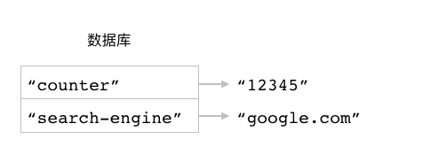
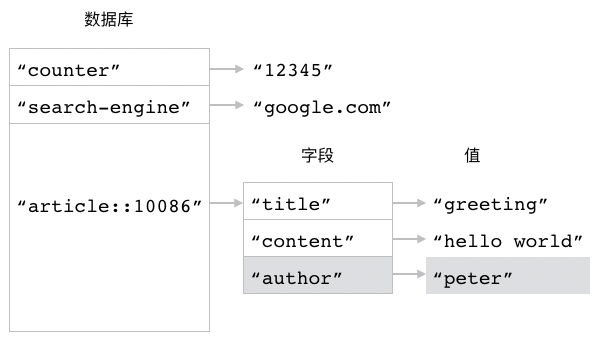
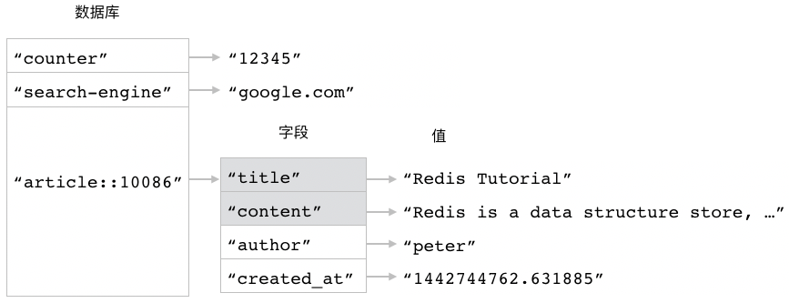
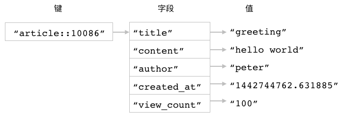
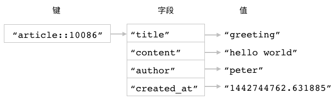
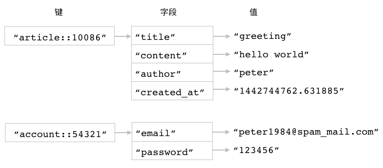
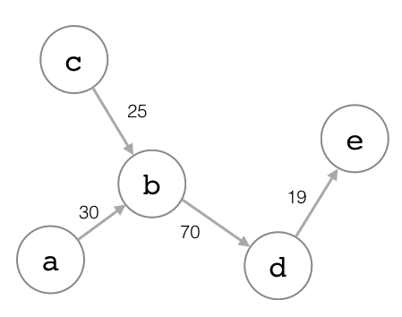
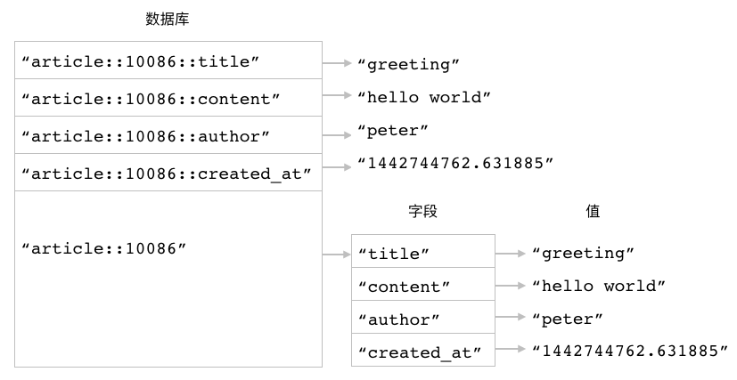

散列（Hash）
==================

在前面的《字符串》一章中，
我们曾经看到过如何使用多个字符串键去储存相关联的一组数据。
比如在字符串键实现的文章储存程序中，
程序就会为每篇文章创建四个字符串键，
并把文章的标题、内容、作者和创建时间分别储存到这四个字符串键里面，
图 3-1 就展示了一个使用字符串键储存文章数据的例子。

----

图 3-1 使用多个字符串键储存文章

.. image:: image/hash/IMAGE_ARTICLE_IN_STRINGS.png

----

使用多个字符串键储存相关联数据虽然在技术上是可行的，
但是在实际应用中却并不是最有效的方法，
这种储存方法至少存在以下三个问题：

- 首先，
  程序每储存一组相关联的数据，
  就必须在数据库里面同时创建多个字符串键，
  这样的数据越多，
  数据库包含的键数量也会越多。
  数量庞大的键会对数据库某些操作的执行速度产生影响，
  并且维护这些键也会产生大量的资源消耗。

- 其次，
  为了在数据库里面标识出相关联的字符串键，
  程序需要为它们加上相同的前缀，
  但键名实际上也是一种数据，
  储存键名也需要耗费内存空间，
  因此重复出现的键名前缀实际上导致很多内存空间被白白浪费了。
  此外，
  带前缀的键名还降低了键名的可读性，
  让人无法一眼看清键的真正用途，
  比如键名 ``article::10086::author`` 就远不如键名 ``author`` 简洁，
  而键名 ``article::10086::title`` 也远不如键名 ``title`` 来得简洁。

- 最后，
  虽然程序在逻辑上会把带有相同前缀的字符串键看作是相关联的一组数据，
  但是在 Redis 看来，
  它们只不过是储存在同一个数据库中的不同字符串键而已。
  因此当程序需要处理一组相关联的数据时，
  它就必须对所有有关的字符串键都执行相同的操作。
  比如说，
  如果程序想要删除 ID 为 ``10086`` 的文章，
  那么它就必须把 ``article::10086::title`` 、 ``article::10086::content`` 等四个字符串键都删掉才行，
  这给文章的删除操作带来了额外的麻烦，
  并且还可能会因为漏删或者错删了某个键而发生错误。

为了解决以上问题，
我们需要一种能够真正地把相关联的数据打包起来储存的数据结构，
而这种数据结构就是本章要介绍的散列键。

散列简介
--------------

Redis 的散列键会将一个键和一个散列在数据库里面关联起来，
用户可以在散列里面为任意多个字段（field）设置值。
跟字符串键一样，
散列的字段和值既可以是文本数据，
也可以是二进制数据。

通过使用散列键，
用户可以把相关联的多项数据储存到同一个散列里面，
以便对这些数据进行管理，
又或者针对它们执行批量操作。
比如图 3-2 就展示了一个使用散列储存文章数据的例子，
在这个例子中，
散列的键为 ``article::10086`` ，
而这个键对应的散列则包含了四个字段，
其中：

- ``"title"`` 字段储存着文章的标题 ``"greeting"`` ；

- ``"content"`` 字段储存着文章的内容 ``"hello world"`` ；

- ``"author"`` 字段储存着文章的作者名字 ``"peter"`` ；

- ``"create_at"`` 字段储存着文章的创建时间 ``"1442744762.631885"`` 。

----

图 3-2 使用散列储存文章数据

.. image:: image/hash/IMAGE_HASH_EXAMPLE.png

----

与之前使用字符串键储存文章数据的做法相比，
使用散列储存文章数据只需要在数据库里面创建一个键，
并且因为散列的字段名不需要添加任何前缀，
所以它们可以直接反映字段值储存的是什么数据。

Redis 为散列键提供了一系列操作命令， 
通过使用这些命令， 
用户可以：

- 为散列的字段设置值，
  又或者只在字段不存在的情况下为它设置值。

- 从散列里面获取给定字段的值。

- 对储存着数字值的字段执行加法操作或者减法操作。

- 检查给定字段是否存在于散列当中。

- 从散列里面删除指定字段。

- 查看散列包含的字段数量。

- 一次为散列的多个字段设置值，
  又或者一次从散列里面获取多个字段的值。

- 获取散列包含的所有字段、所有值又或者所有字段和值。

本章接下来将对以上提到的散列操作进行介绍，
说明如何使用这些操作去构建各种有用的应用程序，
并在最后详细地说明散列键与字符串键之间的区别。

HSET：为字段设置值
----------------------------------------------------

用户可以通过执行 ``HSET`` 命令，
为散列中的指定字段设置值：

::

    HSET hash field value

根据给定的字段是否已经存在于散列里面，
``HSET`` 命令的行为也会有所不同：

- 如果给定字段并不存在于散列当中，
  那么这次设置就是一次创建操作，
  命令将在散列里面关联起给定的字段和值，
  然后返回 ``1`` 。

- 如果给定的字段原本已经存在于散列里面，
  那么这次设置就是一次更新操作，
  命令将使用用户给定的新值去覆盖字段原有的旧值，
  然后返回 ``0`` 。

举个例子，
通过执行以下 ``HSET`` 命令，
我们可以创建出一个包含了四个字段的散列，
这四个字段分别储存了文章的标题、内容、作者以及创建日期：

::

    redis> HSET article::10086 title "greeting"
    (integer) 1

    redis> HSET article::10086 content "hello world"
    (integer) 1

    redis> HSET article::10086 author "peter"
    (integer) 1

    redis> HSET article::10086 created_at "1442744762.631885"
    (integer) 1

图 3-3 展示了以上这些 ``HSET`` 命令对散列 ``article::10086`` 进行设置的整个过程。

----

图 3-3 ``HSET`` 命令对 ``article::10086`` 进行设置的整个过程

``HSET`` 命令执行之前的数据库， ``article::10086`` 散列并不存在

执行 ``HSET article::10086 title "greeting"`` 命令之后

.. image:: image/hash/IMAGE_HSET_2.png

执行 ``HSET article::10086 content "hello world"`` 命令之后

.. image:: image/hash/IMAGE_HSET_3.png

执行 ``HSET article::10086 author "peter"`` 命令之后

执行 ``HSET article::10086 created_at "1442744762.631885"`` 命令之后

.. image:: image/hash/IMAGE_HSET_5.png

----

.. note::

    散列包含的字段就跟数据库包含的键一样，
    在实际中都是以无序方式进行排列的，
    不过本书为了展示方便，
    一般都会把新字段添加到散列的末尾，
    排在所有已有字段的后面。

使用新值覆盖旧值
^^^^^^^^^^^^^^^^^^^^^^^^^^

正如之前所说，
如果用户在调用 ``HSET`` 命令时，
给定的字段已经存在于散列当中，
那么 ``HSET`` 命令将使用用户给定的新值去覆盖字段已有的旧值，
并返回 ``0`` 表示这是一次更新操作。

比如说，
以下代码就展示了如何使用 ``HSET`` 命令去更新 ``article::10086`` 散列的 ``title`` 字段以及 ``content`` 字段：

::

    redis> HSET article::10086 title "Redis Tutorial" 
    (integer) 0

    redis> HSET article::10086 content "Redis is a data structure store, ..."
    (integer) 0

图 3-4 展示了被更新之后的 ``article::10086`` 散列。

----

图 3-4 被更新之后的 ``article::10086`` 散列

----

其他信息
^^^^^^^^^^^^^^^^^^^^^^

+-----------+-------------------------------------------+
| 属性      | 值                                        |
+===========+===========================================+
| 复杂度    | O(1)                                      |
+-----------+-------------------------------------------+
| 版本要求  | ``HSET`` 命令从 Redis 2.0.0 版本开始可用。|
+-----------+-------------------------------------------+

HSETNX：只在字段不存在的情况下为它设置值
----------------------------------------------------

``HSETNX`` 命令的作用和 ``HSET`` 命令的作用非常相似，
它们之间的区别在于，
``HSETNX`` 命令只会在指定字段不存在的情况下执行设置操作：

::

    HSETNX hash field value

``HSETNX`` 命令在字段不存在并且成功为它设置值时返回 ``1`` ，
在字段已经存在并导致设置操作未能成功执行时返回 ``0`` 。

----

图 3-5 ``HSETNX`` 命令执行之前的 ``article::10086`` 散列

.. image:: image/hash/IMAGE_BEFORE_HSETNX.png

----

举个例子，
对于图 3-5 所示的 ``article::10086`` 散列来说，
执行以下 ``HSETNX`` 命令将不会对散列产生任何影响，
因为 ``HSETNX`` 命令想要设置的 ``title`` 字段已经存在：

::

    redis> HSETNX article::10086 title "Redis Performance Test"
    (integer) 0    -- 设置失败

相反地，
如果我们使用 ``HSETNX`` 命令去对尚未存在的 ``view_count`` 字段进行设置，
那么这个命令将会顺利执行，
并将 ``view_count`` 字段的值设置为 ``100`` ：

::

    redis> HSETNX article::10086 view_count 100
    (integer) 1    -- 设置成功

图 3-6 展示了 ``HSETNX`` 命令成功执行之后的 ``article::10086`` 散列。

----

图 3-6 ``HSETNX`` 命令执行之后的 ``article::10086`` 散列

.. image:: image/hash/IMAGE_AFTER_HSETNX.png

----

其他信息
^^^^^^^^^^^^^^^^

+-----------+-----------------------------------------------+
| 属性      | 值                                            |
+===========+===============================================+
| 复杂度    | O(1)                                          |
+-----------+-----------------------------------------------+
| 版本要求  | ``HSETNX`` 命令从 Redis 2.0.0 版本开始可用。  |
+-----------+-----------------------------------------------+

HGET：获取字段的值
----------------------------------------------------

``HGET`` 命令可以根据用户给定的字段，
从散列里面获取该字段的值：

::

    HGET hash field

----

图 3-7 两个散列

.. image:: image/hash/IMAGE_HGET.png

----

比如对于图 3-7 所示的两个散列键来说，
执行以下命令可以从 ``article::10086`` 散列里面获取 ``author`` 字段的值：

::

    redis> HGET article::10086 author
    "peter"

而执行以下命令则可以从 ``article::10086`` 散列里面获取 ``created_at`` 字段的值：

::

    redis> HGET article::10086 created_at
    "1442744762.631885"

又比如说，
如果我们想要从 ``account::54321`` 散列里面获取 ``email`` 字段的值，
那么可以执行以下命令：

::

    redis> HGET account::54321 email
    "peter1984@spam_mail.com"

处理不存在的字段或者不存在的散列
^^^^^^^^^^^^^^^^^^^^^^^^^^^^^^^^^^^^^^^^

如果用户给定的字段并不存在于散列当中，
那么 ``HGET`` 命令将返回一个空值。

举个例子，
在以下代码中，
我们尝试从 ``account::54321`` 散列里面获取 ``location`` 字段的值，
但由于 ``location`` 字段并不存在于 ``account::54321`` 散列当中，
所以 ``HGET`` 命令将返回一个空值：

::

    redis> HGET account::54321 location
    (nil)

尝试从一个不存在的散列里面获取一个不存在的字段值，
得到的结果也是一样的：

::

    redis> HGET not-exists-hash not-exists-field
    (nil)

其他信息
^^^^^^^^^^^^^^^^^^

+-----------+-----------------------------------------------+
| 属性      | 值                                            |
+===========+===============================================+
| 复杂度    | O(1)                                          |
+-----------+-----------------------------------------------+
| 版本要求  | ``HGET`` 命令从 Redis 2.0.0 版本开始可用。    |
+-----------+-----------------------------------------------+

示例：实现短网址生成程序
-------------------------------

为了给用户提供更多发言空间，
并记录用户在网站上的链接点击行为，
大部分社交网站都会将用户输入的网址转换为相应的短网址。
比如说，
如果我们在新浪微博发言时输入网址 http://redisdoc.com/geo/index.html ，
那么微博将把这个网址转换为相应的短网址 http://t.cn/RqRRZ8n ，
当用户访问这个短网址时，
微博在后台就会对这次点击进行一些数据统计，
然后再引导用户的浏览器跳转到 http://redisdoc.com/geo/index.html 上面。

创建短网址本质上就是要创建出短网址 ID 与目标网址之间的映射，
并在用户访问短网址时，
根据短网址的 ID 从映射记录中找出与之相对应的目标网址。
比如在前面的例子中，
微博的短网址程序就将短网址 http://t.cn/RqRRZ8n 中的 ID 值 RqRRZ8n 映射到了 http://redisdoc.com/geo/index.html 这个网址上面：
当用户访问短网址 http://t.cn/RqRRZ8n 时，
程序就会根据这个短网址的 ID 值 RqRRZ8n ，
找出与之对应的目标网址 http://redisdoc.com/geo/index.html ，
并将用户引导至目标网址上面去。

作为示例，
图 3-8 展示了几个微博短网址 ID 与目标网址之间的映射关系。

----

图 3-8 微博短网址映射关系示例

.. image:: image/hash/IMAGE_URL_MAPPING.png

----

因为 Redis 的散列正好就非常适合用来储存短网址 ID 与目标网址之间的映射，
所以我们可以基于 Redis 的散列实现一个短网址程序，
代码清单 3-1 展示了一个这样的例子。

----

代码清单 3-1 使用散列实现的短网址程序：\ ``/hash/shorty_url.py``

.. literalinclude:: code/hash/shorty_url.py

----

代码清单 3-2 将 10 进制数字转换成 36 进制数字的程序：\ ``/hash/base36.py``

.. literalinclude:: code/hash/base36.py

----

``ShortyUrl`` 类的 ``shorten()`` 方法负责为输入的网址生成短网址 ID ，
它的工作包括以下四个步骤：

1. 为每个给定的网址创建一个 10 进制数字 ID 。

2. 将 10 进制数字 ID 转换为 36 进制，
   并将这个 36 进制数字用作给定网址的短网址 ID ，
   这种方法在数字 ID 长度较大时可以有效地缩短数字 ID 的长度。
   代码清单 3-2 展示了将数字从 10 进制转换成 36 进制的 ``base10_to_base36`` 函数的具体实现。

3. 将短网址 ID 和目标网址之间的映射关系储存到散列里面。

4. 向调用者返回刚刚生成的短网址 ID 。

另一方面，
``restore()`` 方法要做的事情和 ``shorten()`` 方法正好相反：
它会从储存着映射关系的散列里面取出与给定短网址 ID 相对应的目标网址，
然后将其返回给调用者。

以下代码简单地展示了使用 ``ShortyUrl`` 程序创建短网址 ID 的方法，
以及根据短网址 ID 获取目标网址的方法：

::

    >>> from redis import Redis
    >>> from shorty_url import ShortyUrl
    >>> client = Redis(decode_responses=True)
    >>> shorty_url = ShortyUrl(client)
    >>> shorty_url.shorten("RedisGuide.com")  # 创建短网址 ID
    '1'
    >>> shorty_url.shorten("RedisBook.com")
    '2'
    >>> shorty_url.shorten("RedisDoc.com")
    '3'
    >>> shorty_url.restore("1")  # 根据短网址 ID 查找目标网址
    'RedisGuide.com'
    >>> shorty_url.restore("2")
    'RedisBook.com'

图 3-9 展示了上面这段代码在数据库中创建的散列结构。

----

图 3-9 短网址程序在数据库中创建的散列结构

.. image:: image/hash/IMAGE_SHORTY_URL_EXAMPLE.png

----

HINCRBY：对字段储存的整数值执行加法或减法操作
-------------------------------------------------------

跟字符串键的 ``INCRBY`` 命令一样，
如果散列的字段里面储存着能够被 Redis 解释为整数的数字，
那么用户就可以使用 ``HINCRBY`` 命令为该字段的值加上指定的整数增量：

::

    HINCRBY hash field increment

``HINCRBY`` 命令在成功执行加法操作之后将返回字段当前的值作为命令的结果。

----

图 3-10 储存着文章数据的散列

----

比如说，
对于图 3-10 所示的 ``article::10086`` 散列，
我们可以通过执行以下命令，
为 ``view_count`` 字段的值加上 ``1`` ：

::

    redis> HINCRBY article::10086 view_count 1
    (integer) 101

也可以通过执行以下命令，
为 ``view_count`` 字段的值加上 ``30`` ：

::

    redis> HINCRBY article::10086 view_count 30
    (integer) 131

执行减法操作
^^^^^^^^^^^^^^^^^^^^

因为 Redis 只为散列提供了用于执行加法操作的 ``HINCRBY`` 命令，
但是却并没有为散列提供相应的用于执行减法操作的命令，
所以如果用户需要对字段储存的整数值执行减法操作的话，
那么他就需要将一个负数增量传给 ``HINCRBY`` 命令，
从而达到对值执行减法计算的目的。

以下代码展示了如何使用 ``HINCRBY`` 命令去对 ``view_count`` 字段储存的整数值执行减法计算：

::

    redis> HGET article::10086 view_count           -- 文章现在的浏览次数为 131 次
    "131"

    redis> HINCRBY article::10086 view_count -10    -- 将文章的浏览次数减少 10 次
    "121"

    redis> HINCRBY article::10086 view_count -21    -- 将文章的浏览次数减少 21 次
    "100"

    redis> HGET article::10086 view_count           -- 文章现在的浏览次数只有 100 次了
    "100"

处理异常情况
^^^^^^^^^^^^^^^^^^^^

``HINCRBY`` 命令只能对储存着整数值的字段执行，
并且用户给定的增量也必须为整数，
尝试对非整数值字段执行 ``HINCRBY`` 命令，
又或者向 ``HINCRBY`` 命令提供非整数增量，
都会导致 ``HINCRBY`` 命令拒绝执行并报告错误。

以下是一些导致 ``HINCRBY`` 命令报错的例子：

::

    redis> HINCRBY article::10086 view_count "fifty"    -- 增量必须能够被解释为整数
    (error) ERR value is not an integer or out of range

    redis> HINCRBY article::10086 view_count 3.14       -- 增量不能是浮点数
    (error) ERR value is not an integer or out of range

    redis> HINCRBY article::10086 content 100           -- 尝试向储存字符串值的字段执行 HINCRBY
    (error) ERR hash value is not an integer

其他信息
^^^^^^^^^^^^^^^^^

+-----------+-----------------------------------------------+
| 属性      | 值                                            |
+===========+===============================================+
| 复杂度    | O(1)                                          |
+-----------+-----------------------------------------------+
| 版本要求  | ``HINCRBY`` 命令从 Redis 2.0.0 版本开始可用。 |
+-----------+-----------------------------------------------+

HINCRBYFLOAT：对字段储存的数字值执行浮点数加法或减法操作
-----------------------------------------------------------------

``HINCRBYFLOAT`` 命令的作用和 ``HINCRBY`` 命令的作用类似，
它们之间的主要区别在于 ``HINCRBYFLOAT`` 命令不仅可以使用整数作为增量，
还可以使用浮点数作为增量：

::

    HINCRBYFLOAT hash field increment

``HINCRBYFLOAT`` 命令在成功执行加法操作之后，
将返回给定字段的当前值作为结果。

举个例子，
通过执行以下 ``HINCRBYFLOAT`` 命令，
我们可以将 ``geo::peter`` 散列 ``longitude`` 字段的值从原来的 ``100.0099647`` 修改为 ``113.2099647`` ：

::

    redis> HGET geo::peter longitude
    "100.0099647"

    redis> HINCRBYFLOAT geo::peter longitude 13.2  -- 将字段的值加上 13.2
    "113.2099647"
    
增量和字段值的类型限制
^^^^^^^^^^^^^^^^^^^^^^^^^^^^^^^

正如之前所说，
``HINCRBYFLOAT`` 命令不仅可以使用浮点数作为增量，
还可以使用整数作为增量：

::

    redis> HGET number float
    "3.14"

    redis> HINCRBYFLOAT number float 10086  -- 整数增量
    "10089.13999999999999968"

此外，
不仅储存浮点数的字段可以执行 ``HINCRBYFLOAT`` 命令，
储存整数的字段也一样可以执行 ``HINCRBYFLOAT`` 命令：

::

    redis> HGET number int  -- 储存整数的字段
    "100"

    redis> HINCRBYFLOAT number int 2.56
    "102.56"

最后，
如果加法计算的结果能够被表示为整数，
那么 ``HINCRBYFLOAT`` 命令将使用整数作为计算结果：

::

    redis> HGET number sum
    "1.5"

    redis> HINCRBYFLOAT number sum 3.5
    "5"  -- 结果被表示为整数 5
     
执行减法操作
^^^^^^^^^^^^^^^^^^^^^

跟 ``HINCRBY`` 命令的情况一样，
Redis 也没有为 ``HINCRBYFLOAT`` 命令提供对应的减法操作命令，
因此如果我们想要对字段储存的数字值执行浮点数减法操作，
那么只能通过向 ``HINCRBYFLOAT`` 命令传入负值浮点数来实现：

::

    redis> HGET geo::peter longitude
    "113.2099647"

    redis> HINCRBYFLOAT geo::peter longitude -50  -- 将字段的值减去 50
    "63.2099647"
        
其他信息
^^^^^^^^^^^^^^^^^

+-----------+---------------------------------------------------+
| 属性      | 值                                                |
+===========+===================================================+
| 复杂度    | O(1)                                              |
+-----------+---------------------------------------------------+
| 版本要求  | ``HINCRBYFLOAT`` 命令从 Redis 2.0.0 版本开始可用。|
+-----------+---------------------------------------------------+

示例：使用散列键重新实现计数器
-------------------------------------

前面的《字符串》一章曾经展示过怎样使用 ``INCRBY`` 命令和 ``DECRBY`` 命令去构建一个计数器程序，
在学习了 ``HINCRBY`` 命令之后，
我们同样可以通过类似的原理来构建一个使用散列实现的计数器程序，
就像代码清单 3-3 展示的那样。

----

代码清单 3-3 使用散列实现的计数器：\ ``/hash/counter.py``

.. literalinclude:: code/hash/counter.py

----

这个计数器实现充分地发挥了散列的特长：

- 它允许用户将多个相关联的计数器储存到同一个散列键里面实行集中管理，
  而不必像字符串计数器那样，
  为每个计数器单独设置一个字符串键。

- 与此同时，
  通过对散列中的不同字段执行 ``HINCRBY`` 命令，
  程序可以对指定的计数器执行加法操作和减法操作，
  而不会影响到储存在同一散列中的其他计数器。

作为例子，
以下代码展示了怎样将三个页面的浏览次数计数器储存到同一个散列里面：

::

    >>> from redis import Redis
    >>> from counter import Counter
    >>> client = Redis(decode_responses=True)
    >>> # 创建一个计数器，用于记录页面 /user/peter 被访问的次数
    >>> user_peter_counter = Counter(client, "page_view_counters", "/user/peter")
    >>> user_peter_counter.increase()
    1L
    >>> user_peter_counter.increase()
    2L
    >>> # 创建一个计数器，用于记录页面 /product/256 被访问的次数
    >>> product_256_counter = Counter(client, "page_view_counters", "/product/256")
    >>> product_256_counter.increase(100)
    100L
    >>> # 创建一个计数器，用于记录页面 /product/512 被访问的次数
    >>> product_512_counter = Counter(client, "page_view_counters", "/product/512")
    >>> product_512_counter.increase(300)
    300L

因为 ``user_peter_counter`` 、 ``product_256_counter`` 和 ``product_512_counter`` 这三个计数器都是用来记录页面浏览次数的，
所以这些计数器都被放到了 ``page_view_counters`` 这个散列里面；
与此类似，
如果我们要创建一些用途完全不一样的计数器，
那么只需要把新的计数器放到其他散列里面就可以了。

比如说，
以下代码就展示了怎样将文件 ``dragon_rises.mp3`` 和文件 ``redisbook.pdf`` 的下载次数计数器放到 ``download_counters`` 散列里面：

::

    >>> dragon_rises_counter = Counter(client, "download_counters", "dragon_rises.mp3")
    >>> dragon_rises_counter.increase(10086)
    10086L
    >>> redisbook_counter = Counter(client, "download_counters", "redisbook.pdf")
    >>> redisbook_counter.increase(65535)
    65535L

图 3-11 展示了 ``page_view_counters`` 和 ``download_counters`` 这两个散列以及它们包含的各个计数器的样子。

----

图 3-11 散列计数器数据结构示意图

.. image:: image/hash/IMAGE_COUNTERS_IN_HASH.png

----

通过使用不同的散列储存不同类型的计数器，
程序能够让代码生成的数据结构变得更容易理解，
并且在针对某种类型的计数器执行批量操作时也会变得更加方便。
比如说，
当我们不再需要下载计数器的时候，
只要把 ``download_counters`` 散列删掉就可以移除所有下载计数器了。

HSTRLEN：获取字段值的字节长度
----------------------------------------------------

用户可以通过使用 ``HSTRLEN`` 命令，
获取给定字段值的字节长度：

::

    HSTRLEN hash field

----

图 3-12 使用散列储存文章数据

----

比如对于图 3-12 所示的 ``article::10086`` 散列来说，
我们可以通过执行以下 ``HSTRLEN`` 命令，
取得 ``title`` 、 ``content`` 、 ``author`` 等字段值的字节长度：

::

    redis> HSTRLEN article::10086 title
    (integer) 8    -- title 字段的值 "greeting" 长 8 个字节

    redis> HSTRLEN article::10086 content
    (integer) 11    -- content 字段的值 "hello world" 长 11 个字节

    redis> HSTRLEN article::10086 author
    (integer) 5    -- author 字段的值 "peter" 长 6 个字节

如果给定的字段或散列并不存在，
那么 ``HSTRLEN`` 命令将返回 ``0`` 作为结果：

::

    redis> HSTRLEN article::10086 last_updated_at  -- 字段不存在
    (integer) 0

    redis> HSTRLEN not-exists-hash not-exists-key  -- 散列不存在
    (integer) 0

其他信息
^^^^^^^^^^^^^^^^^

+-----------+-----------------------------------------------+
| 属性      | 值                                            |
+===========+===============================================+
| 复杂度    | O(1)                                          |
+-----------+-----------------------------------------------+
| 版本要求  | ``HSTRLEN`` 命令从 Redis 3.2.0 版本开始可用。 |
+-----------+-----------------------------------------------+

HEXISTS：检查字段是否存在
----------------------------------------------------

``HEXISTS`` 命令可以检查用户给定的字段是否存在于散列当中：

::

    HEXISTS hash field

如果散列包含了给定的字段，
那么命令返回 ``1`` ；
否则的话，
命令返回 ``0`` 。

比如说，
以下代码就展示了如何使用 ``HEXISTS`` 命令去检查 ``article::10086`` 散列是否包含某些字段：

::

    redis> HEXISTS article::10086 author
    (integer) 1    -- 包含该字段

    redis> HEXISTS article::10086 content
    (integer) 1

    redis> HEXISTS article::10086 last_updated_at
    (integer) 0    -- 不包含该字段

从 ``HEXISTS`` 命令的执行结果可以看出，
``article::10086`` 散列包含了 ``author`` 字段和 ``content`` 字段，
但是却并没有包含 ``last_updated_at`` 字段。

如果用户给定的散列并不存在，
那么 ``HEXISTS`` 命令对于这个散列所有字段的检查结果都是不存在：

::

    redis> HEXISTS not-exists-hash not-exists-field
    (integer) 0

    redis> HEXISTS not-exists-hash another-not-exists-field
    (integer) 0

其他信息
^^^^^^^^^^^^^^^^

+-----------+-----------------------------------------------+
| 属性      | 值                                            |
+===========+===============================================+
| 复杂度    | O(1)                                          |
+-----------+-----------------------------------------------+
| 版本要求  | ``HEXISTS`` 命令从 Redis 2.0.0 版本开始可用。 |
+-----------+-----------------------------------------------+

HDEL：删除字段
----------------------------------------------------

``HDEL`` 命令用于删除散列中的指定字段及其相关联的值：

::

    HDEL hash field    

当给定字段存在于散列当中并且被成功删除时，
命令返回 ``1`` ；
如果给定字段并不存在于散列当中，
又或者给定的散列并不存在，
那么命令将返回 ``0`` 表示删除失败。

举个例子，
对于图 3-13 所示的 ``article::10086`` 散列，
我们可以使用以下命令去删除散列的 ``author`` 字段和 ``created_at`` 字段，
以及与这些字段相关联的值：

::

    redis> HDEL article::10086 author
    (integer) 1

    redis> HDEL article::10086 created_at
    (integer) 1

图 3-14 展示了以上两个 ``HDEL`` 命令执行之后，
``article::10086`` 散列的样子。

----

图 3-13 ``article::10086`` 散列

.. image:: image/hash/IMAGE_BEFORE_HDEL.png

----

图 3-14 删除了两个字段之后的 ``article::10086`` 散列

.. image:: image/hash/IMAGE_AFTER_HDEL.png

----

其他信息
^^^^^^^^^^^^^^^^^

+-----------+-----------------------------------------------+
| 属性      | 值                                            |
+===========+===============================================+
| 复杂度    | O(1)                                          |
+-----------+-----------------------------------------------+
| 版本要求  | ``HDEL`` 命令从 Redis 2.0.0 版本开始可用。    |
+-----------+-----------------------------------------------+

HLEN：获取散列包含的字段数量
----------------------------------------------------

用户可以通过使用 ``HLEN`` 命令获取给定散列包含的字段数量：

::

    HLEN hash

----

图 3-15 两个散列键

----

比如对于图 3-15 中展示的 ``article::10086`` 散列和 ``account::54321`` 散列来说，
我们可以通过执行以下命令来获取 ``article::10086`` 散列包含的字段数量：

::

    redis> HLEN article::10086
    (integer) 4    -- 这个散列包含 4 个字段

又或者通过执行以下命令来获取 ``account::54321`` 散列包含的字段数量：

::

    redis> HLEN account::54321
    (integer) 2    -- 这个散列包含 2 个字段

另一方面，
如果用户给定的散列并不存在，
那么 ``HLEN`` 命令将返回 ``0`` 作为结果：

::

    redis> HLEN not-exists-hash
    (integer) 0

其他信息
^^^^^^^^^^^^^^^^

+-----------+-----------------------------------------------+
| 属性      |                                               |
+===========+===============================================+
| 复杂度    | O(1)                                          |
+-----------+-----------------------------------------------+
| 版本要求  | ``HLEN`` 命令从 Redis 2.0.0 版本开始可用。    |
+-----------+-----------------------------------------------+

示例：实现用户登录会话
---------------------------------------------------

为了方便用户，
网站一般都会为已登录的用户生成一个加密令牌，
然后把这个令牌分别储存在服务器端和客户端，
之后每当用户再次访问该网站的时候，
网站就可以通过验证客户端提交的令牌来确认用户的身份，
从而使得用户不必重复地执行登录操作。

另一方面，
为了防止用户因为长时间不输入密码而导致遗忘密码，
并且为了保证令牌的安全性，
网站一般都会为令牌设置一个过期期限（比如一个月），
当期限到达之后，
用户的会话就会过时，
而网站则会要求用户重新登录。

上面描述的这种使用令牌来避免重复登录的机制一般被称为登录会话（login session），
通过使用 Redis 的散列，
我们可以构建出代码清单 3-4 所示的登录会话程序。

----

代码清单 3-4 使用散列实现的登录会话程序：\ ``/hash/login_session.py``

.. literalinclude:: code/hash/login_session.py

----

``LoginSession`` 的 ``create()`` 方法首先会计算出随机的会话令牌以及会话的过期时间戳，
然后使用用户 ID 作为字段，
将令牌和过期时间戳分别储存到两个散列里面。

在此之后，
每当客户端向服务器发送请求并提交令牌的时候，
程序就会使用 ``validate()`` 方法验证被提交令牌的正确性：
``validate()`` 方法会根据用户的 ID ，
从两个散列里面分别取出用户的会话令牌以及会话的过期时间戳，
然后通过一系列检查判断令牌是否正确以及会话是否过期。

最后，
``destroy()`` 方法可以在用户手动登出（logout）时调用，
它可以删除用户的会话令牌以及会话的过期时间戳，
让用户重新回到未登录状态。

在拥有 ``LoginSession`` 程序之后，
我们可以通过执行以下代码，
为用户 peter 创建出相应的会话令牌：

::

    >>> from redis import Redis
    >>> from login_session import LoginSession
    >>>
    >>> client = Redis(decode_responses=True)
    >>> session = LoginSession(client, "peter")
    >>>
    >>> token = session.create()
    >>> token
    '3b000071e59fcdcaa46b900bb5c484f653de67055fde622f34c255a65bd9a561'

并通过以下代码，
验证给定令牌的正确性：

::

    >>> session.validate("wrong_token")
    'SESSION_TOKEN_INCORRECT'
    >>>
    >>> session.validate(token)
    'SESSION_TOKEN_CORRECT'

然后在会话使用完毕之后，
通过执行以下代码来销毁会话：

::

    >>> session.destroy()
    >>>
    >>> session.validate(token)
    'SESSION_NOT_LOGIN'

图 3-16 展示了使用 ``LoginSession`` 程序在数据库里面创建多个会话时的样子。

----

图 3-16 登录会话程序数据结构示意图

.. image:: image/hash/IMAGE_SESSION_HASHS.png

----

HMSET：一次为多个字段设置值
----------------------------------------------------

用户可以通过 ``HMSET`` 命令，
一次为散列中的多个字段设置值：

::

    HMSET hash field value [field value ...]

``HMSET`` 命令在设置成功时返回 ``OK`` 。

----

图 3-17 储存文章数据的散列

.. image:: image/hash/IMAGE_HMSET.png

----

比如说，
为了构建图 3-17 所示的散列，
我们可能会执行以下四个 ``HSET`` 命令：

::

    redis> HSET article::10086 title "greeting"
    (integer) 1

    redis> HSET article::10086 content "hello world"
    (integer) 1

    redis> HSET article::10086 author "peter"
    (integer) 1

    redis> HSET article::10086 created_at "1442744762.631885"
    (integer) 1

但是接下来的这一条 ``HMSET`` 命令可以更方便地完成相同的工作：

::

    redis> HMSET article::10086 title "greeting" content "hello world" author "peter" created_at "1442744762.631885" 
    OK

此外，
因为客户端在执行这条 ``HMSET`` 命令时只需要与 Redis 服务器进行一次通信，
而上面的四条 ``HSET`` 命令则需要客户端与 Redis 服务器进行四次通信，
所以前者的执行速度要比后者快得多。

使用新值覆盖旧值
^^^^^^^^^^^^^^^^^^^^^^^^^^

如果用户给定的字段已经存在于散列当中，
那么 ``HMSET`` 命令将使用用户给定的新值去覆盖字段已有的旧值。

比如对于 ``title`` 和 ``content`` 这两个已经存在于 ``article::10086`` 散列的字段来说：

::

    redis> HGET article::10086 title
    "greeting"

    redis> HGET article::10086 content
    "hello world"

如果我们执行以下命令：

::

    redis> HMSET article::10086 title "Redis Tutorial" content "Redis is a data structure store, ..."
    OK

那么 ``title`` 字段和 ``content`` 字段已有的旧值将被新值覆盖：

::

    redis> HGET article::10086 title
    "Redis Tutorial"

    redis> HGET article::10086 content
    "Redis is a data structure store, ..."

其他信息
^^^^^^^^^^^^^^^^^^^^^^^^^^^

+-----------+-----------------------------------------------+
| 属性      | 值                                            |
+===========+===============================================+
| 复杂度    | O(N)，其中 N 为被设置的字段数量。             |
+-----------+-----------------------------------------------+
| 版本要求  | ``HMSET`` 命令从 Redis 2.0.0 版本开始可用。   |
+-----------+-----------------------------------------------+

HMGET：一次获取多个字段的值
----------------------------------------------------

通过使用 ``HMGET`` 命令，
用户可以一次从散列里面获取多个字段的值：

::

    HMGET hash field [field ...]

``HMGET`` 命令将按照用户给定字段的顺序依次返回与之对应的值。

----

图 3-18 储存文章数据的散列

.. image:: image/hash/IMAGE_HMGET_EXAMPLE.png

----

比如对于图 3-18 所示的 ``article::10086`` 散列来说，
我们可以使用以下命令来获取它的 ``author`` 字段和 ``created_at`` 字段的值：

::

    redis> HMGET article::10086 author created_at
    1) "peter"                -- author 字段的值
    2) "1442744762.631885"    -- created_at 字段的值

又或者使用以下命令来获取它的 ``title`` 字段和 ``content`` 字段的值：

::

    redis> HMGET article::10086 title content
    1) "greeting"       -- title 字段的值
    2) "hello world"    -- content 字段的值

跟 ``HGET`` 命令一样，
如果用户向 ``HMGET`` 命令提供的字段或者散列不存在，
那么 ``HMGET`` 命令将返回空值作为结果：

::

    redis> HMGET article::10086 title content last_updated_at
    1) "greeting"
    2) "hello world"
    3) (nil)    -- last_updated_at 字段不存在于 article::10086 散列

    redis> HMGET not-exists-hash field1 field2 field3  -- 散列不存在
    1) (nil)
    2) (nil)
    3) (nil)

其他信息
^^^^^^^^^^^^^^^^^

+-----------+-----------------------------------------------+
| 属性      | 值                                            |
+===========+===============================================+
| 复杂度    | O(N)，其中 N 为用户给定的字段数量。           |
+-----------+-----------------------------------------------+
| 版本要求  | ``HMGET`` 命令从 Redis 2.0.0 版本开始可用。   |
+-----------+-----------------------------------------------+

HKEYS、HVALS、HGETALL：获取所有字段、所有值或者所有字段和值
--------------------------------------------------------------------------

Redis 为散列提供了 ``HKEYS`` 、 ``HVALS`` 和 ``HGETALL`` 这三个命令，
它们可以分别用于获取散列包含的所有字段、所有值以及所有字段和值：

::

    HKEYS hash

    HVALS hash

    HGETALL hash

----

图 3-19 储存文章数据的散列

.. image:: image/hash/IMAGE_HKEYS_HVALS_HGETALL.png

----

举个例子，
对于图 3-19 所示的 ``article::10086`` 散列来说，
我们可以使用 ``HKEYS`` 命令去获取它包含的所有字段：

::

    redis> HKEYS article::10086
    1) "title"
    2) "content"
    3) "author"
    4) "created_at"

也可以使用 ``HVALS`` 命令去获取它包含的所有值：

::

    redis> HVALS article::10086
    1) "greeting"
    2) "hello world"
    3) "peter"
    4) "1442744762.631885"

还可以使用 ``HGETALL`` 命令去获取它包含的所有字段和值：

::

    redis> HGETALL article::10086
    1) "title"      -- 字段
    2) "greeting"   -- 字段的值
    3) "content"
    4) "hello world"
    5) "author"
    6) "peter"
    7) "created_at"
    8) "1442744762.631885"

在 ``HGETALL`` 命令返回的结果列表当中，
每两个连续的元素就代表了散列中的一对字段和值，
其中单数位置上的元素为字段，
而复数位置上的元素则为字段的值。

另一方面，
如果用户给定的散列并不存在，
那么 ``HKEYS`` 、 ``HVALS`` 和 ``HGETALL`` 都将返回一个空列表：

::

    redis> HKEYS not-exists-hash
    (empty list or set)

    redis> HVALS not-exists-hash
    (empty list or set)

    redis> HGETALL not-exists-hash
    (empty list or set)

字段在散列中的排列顺序
^^^^^^^^^^^^^^^^^^^^^^^^^^^^^^

Redis 散列包含的字段在底层是以无序方式储存的，
根据字段插入的顺序不同，
包含相同字段的散列在执行 ``HKEYS`` 命令、 ``HVALS`` 命令和 ``HGETALL`` 命令时可能会得到不同的结果，
因此用户在使用这三个命令的时候，
不应该对它们返回的元素的排列顺序做任何假设。
如果有需要的话，
用户可以对这些命令返回的元素进行排序，
使得它们从无序变为有序。

举个例子，
如果我们以不同的设置顺序创建两个完全相同的散列 ``hash1`` 和 ``hash2`` ：

::

    redis> HMSET hash1 field1 value1 field2 value2 field3 value3
    OK

    redis> HMSET hash2 field3 value3 field2 value2 field1 value1
    OK

那么 ``HKEYS`` 命令将以不同的顺序返回这两个散列的字段：

::

    redis> HKEYS hash1
    1) "field1"
    2) "field2"
    3) "field3"

    redis> HKEYS hash2
    1) "field3"
    2) "field2"
    3) "field1"

而 ``HVALS`` 命令则会以不同的顺序返回这两个散列的字段值：

::

    redis> HVALS hash1
    1) "value1"
    2) "value2"
    3) "value3"

    redis> HVALS hash2
    1) "value3"
    2) "value2"
    3) "value1"

至于 ``HGETALL`` 命令则会以不同的顺序返回这两个散列的字段和值：

::

    redis> HGETALL hash1
    1) "field1"
    2) "value1"
    3) "field2"
    4) "value2"
    5) "field3"
    6) "value3"

    redis> HGETALL hash2
    1) "field3"
    2) "value3"
    3) "field2"
    4) "value2"
    5) "field1"
    6) "value1"

其他信息
^^^^^^^^^^^^^^^^^^

+-----------+-----------------------------------------------------------------------------------+
| 属性      | 值                                                                                |
+===========+===================================================================================+
| 复杂度    | ``HKEYS`` 命令、 ``HVALS`` 命令和 ``HGETALL`` 命令的复杂度都为 O(N) ，            |
|           | 其中 N 为散列包含的字段数量。                                                     |
+-----------+-----------------------------------------------------------------------------------+
| 版本要求  | ``HKEYS`` 命令、 ``HVALS`` 命令和 ``HGETALL`` 命令都从 Redis 2.0.0 版本开始可用。 |
+-----------+-----------------------------------------------------------------------------------+

示例：储存图数据
-------------------------

在构建地图应用、设计电路图、进行任务调度、分析网络流量等多种任务中，
都需要对图（graph）数据结构实施建模，
并储存相关的图数据。
对于不少数据库来说，
想要高效直观地储存图数据并不是一件容易的事情，
但是 Redis 却能够以多种不同的方式表示图数据结构，
其中一种方法就是使用散列。

----

图 3-20 简单的带权重有向图

----

图 3-21 图对应的散列键

.. image:: image/hash/IMAGE_GRAPH_HASH.png

----

比如说，
假设我们想要储存图 3-20 所示的带权重有向图，
那么可以创建一个图 3-21 所示的散列键，
这个散列键会以 ``start_vertex->end_vertex`` 的形式，
将各个顶点之间的边储存到散列的字段里面，
并将字段的值设置成边的权重。
通过这种方法，
我们可以将图的所有相关数据全部储存到散列里面，
代码清单 3-5 展示了使用这种方法实现的图数据储存程序。

----

代码清单 3-5 使用散列实现的图数据储存程序：\ ``/hash/graph.py``

.. literalinclude:: code/hash/graph.py

----

这个图数据储存程序的核心概念就是把边（edge）的起点和终点组合成一个字段名，
并把边的权重（weight）用作字段的值，
然后使用 ``HSET`` 命令或者 ``HMSET`` 命令把它们储存到散列里面。
比如说，
如果用户输入的边起点为 ``"a"`` ，
终点为 ``"b"`` ，
权重为 ``"30"`` ，
那么程序将执行命令 ``HSET hash "a->b" 30`` ，
把 ``"a"`` 至 ``"b"`` 的这条边及其权重 ``30`` 储存到散列里面。

在此之后，
程序就可以使用 ``HDEL`` 命令去删除图的某条边，
使用 ``HGET`` 命令或者 ``HMGET`` 命令去获取边的权重，
使用 ``HEXISTS`` 命令去检查边是否存在，
又或者使用 ``HKEYS`` 命令和 ``HGETALL`` 命令去获取图的所有边以及权重。

比如说，
我们可以通过执行以下代码，
构建出前面展示过的带权重有向图 3-20 ：

::

    >>> from redis import Redis
    >>> from graph import Graph
    >>>
    >>> client = Redis(decode_responses=True)
    >>> graph = Graph(client, "test-graph")
    >>>
    >>> graph.add_edge("a", "b", 30)  # 添加边
    >>> graph.add_edge("c", "b", 25)
    >>> graph.add_multi_edges(("b", "d", 70), ("d", "e", 19))  # 添加多条边

然后通过执行程序提供的方法，
获取边的权重，
又或者检查给定的边是否存在：

::

    >>> graph.get_edge_weight("a", "b")  # 获取边 a->b 的权重
    '30'
    >>> graph.has_edge("a", "b")         # 边 a->b 存在
    True
    >>> graph.has_edge("b", "a")         # 边 b->a 不存在
    False

最后，
我们还可以获取图的所有边以及它们的权重：

::

    >>> graph.get_all_edges()  # 获取所有边
    {('b', 'd'), ('d', 'e'), ('a', 'b'), ('c', 'b')}
    >>>
    >>> graph.get_all_edges_with_weight()  # 获取所有边以及它们的权重
    {('c', 'b', '25'), ('a', 'b', '30'), ('d', 'e', '19'), ('b', 'd', '70')}

这里展示的图数据储存程序提供了针对边和权重的功能，
因为它能够非常方便地向图中添加边和移除边，
并且还可以快速地检查某条边是否存在，
所以它非常适合用来储存节点较多但边较少的稀疏图（sparse graph）。
在后续的章节中，
我们还会继续看到更多使用 Redis 储存图数据的例子。

示例：使用散列键重新实现文章储存程序
----------------------------------------------------

在稍早之前，
我们用散列重写了《字符串》一章介绍过的计数器程序，
但是除了计数器程序之外，
还有另一个程序也非常适合使用散列来重写，
那就是文章数据储存程序：
比起用多个字符串键来储存文章的各项数据，
更好的做法是把每篇文章的所有数据都储存到同一个散列里面，
代码清单 3-6 展示了这一想法的具体实现。

----

代码清单 3-6 使用散列实现的文章数据储存程序：\ ``/hash/article.py``

.. literalinclude:: code/hash/article.py

----

新的文章储存程序除了会用到散列之外，
还有两个需要注意的地方：

1. 虽然 Redis 为字符串提供了 ``MSET`` 命令和 ``MSETNX`` 命令，
   但是却并没有为散列提供 ``HMSET`` 命令对应的 ``HMSETNX`` 命令，
   所以这个程序在创建一篇新文章之前，
   需要先通过 ``is_exists()`` 方法检查文章是否存在，
   然后再考虑是否使用 ``HMSET`` 命令去进行设置。

2. 在使用字符串键储存文章数据的时候，
   为了避免数据库中出现键名冲突，
   程序必须为每篇文章的每个属性都设置一个独一无二的键，
   比如使用 ``article::10086::title`` 键去储存 ID 为 10086 的文章的标题，
   使用 ``article::12345::title`` 键去储存 ID 为 12345 的文章的标题，
   诸如此类。
   相反地，
   因为新的文章储存程序可以直接将一篇文章的所有相关信息都储存到同一个散列里面，
   所以它可以直接在散列里面使用 ``title`` 作为标题的字段，
   而不必担心出现命名冲突。

以下代码简单地展示了这个文章储存程序的使用方法：

::

    >>> from redis import Redis
    >>> from article import Article
    >>>
    >>> client = Redis(decode_responses=True)
    >>> article = Article(client, 10086)
    >>>
    >>> # 创建文章
    >>> article.create("greeting", "hello world", "peter")
    >>>
    >>> # 获取文章内容
    >>> article.get()
    {'content': 'hello world', 'id': '10086', 'created_at': '1442744762.631885', 'title': 'greeting', 'author': 'peter'}
    >>>
    >>> # 检查文章是否存在
    >>> article.is_exists()
    True
    >>> # 更新文章内容
    >>> article.update(content="good morning!")
    >>> article.get()
    {'content': 'good morning!', 'id': '10086',  'created_at': '1442744762.631885', 'title': 'greeting', 'author': 'peter'}

图 3-22 以图形方式展示了这段代码创建的散列键。

----

图 3-22 储存在散列里面的文章数据

.. image:: image/hash/IMAGE_ARTICLE_IN_HASH.png

----

散列与字符串
--------------------

本章从开头到现在，
陆续介绍了 HSET 、 HSETNX 、 HGET 、 HINCRBY 和 HINCRBYFLOAT 等多个散列命令，
如果读者对上一章介绍过的字符串命令还有印象的话，
那么应该会记得，
字符串也有类似的 SET 、 SETNX 、 GET 、 INCRBY 和 INCRBYFLOAT 命令。
这种相似并不是巧合，
正如表 3-1 所示，
散列的确拥有很多与字符串命令功能相似的命令。

----

表 3-1 字符串命令与类似的散列命令

+---------------------------------------------------------------+-------------------------------------------------------------------+ 
| 字符串                                                        | 散列                                                              |
+===============================================================+===================================================================+
| ``SET`` —— 为一个字符串键设置值。                             | ``HSET`` —— 为散列的给定字段设置值。                              |
+---------------------------------------------------------------+-------------------------------------------------------------------+ 
| ``SETNX`` —— 仅在字符串键不存在的情况下为它设置值。           | ``HSETNX`` —— 仅在散列不包含指定字段的情况下，为它设置值。        |
+---------------------------------------------------------------+-------------------------------------------------------------------+ 
| ``GET`` —— 获取字符串键的值。                                 | ``HGET`` —— 从散列里面获取给定字段的值。                          |
+---------------------------------------------------------------+-------------------------------------------------------------------+ 
| ``STRLEN`` —— 获取字符串值的字节长度。                        | ``HSTRLEN`` —— 获取给定字段值的字节长度。                         |
+---------------------------------------------------------------+-------------------------------------------------------------------+ 
| ``INCRBY`` —— 对字符串键储存的数字值执行整数加法操作。        | ``HINCRBY`` —— 对字段储存的数字值执行整数加法操作。               |
+---------------------------------------------------------------+-------------------------------------------------------------------+ 
| ``INCRBYFLOAT`` —— 对字符串键储存的数字值执行浮点数加法操作。 | ``HINCRBYFLOAT`` —— 对字段储存的数字值执行浮点数加法操作。        |
+---------------------------------------------------------------+-------------------------------------------------------------------+ 
| ``MSET`` —— 一次为多个字符串键设置值。                        | ``HMSET`` —— 一次为散列的多个字段设置值。                         |
+---------------------------------------------------------------+-------------------------------------------------------------------+ 
| ``MGET`` —— 一次获取多个字符串键的值。                        | ``HMGET`` —— 一次获取散列中多个字段的值。                         |
+---------------------------------------------------------------+-------------------------------------------------------------------+ 
| ``EXISTS`` —— 检查给定的键是否存在于数据库当中，              | ``HEXISTS`` —— 检查给定字段是否存在于散列当中。                   |
| 这个命令可以用于包括字符串键在内的所有数据库键，              |                                                                   |
| 本书稍后将在《数据库》一章对这个命令进行详细的介绍。          |                                                                   |
+---------------------------------------------------------------+-------------------------------------------------------------------+ 
| ``DEL`` —— 从数据库里面删除指定的键，                         | ``HDEL`` —— 从散列中删除给定字段，以及它的值。                    |
| 这个命令可以用于包括字符串键在内的所有数据库键，              |                                                                   |
| 本书稍后将在《数据库》一章对这个命令进行详细的介绍。          |                                                                   |
+---------------------------------------------------------------+-------------------------------------------------------------------+ 

----

对于表中列出的字符串命令和散列命令来说，
它们之间的最大区别就是前者处理的是字符串键，
而后者处理的则是散列键，
除此之外，
这些命令要做的事情几乎都是相同的。

Redis 之所以会选择同时提供字符串键和散列键这两种数据结构，
原因在于它们虽然在操作上非常相似，
但是各自却又拥有不同的优点，
这使得它们在某些场合无法被对方替代，
本节接下来将分别介绍这两种数据结构各自的优点。

散列键的优点
^^^^^^^^^^^^^^^^^^^^^^

散列的最大优势，
就是它只需要在数据库里面创建一个键，
就可以把任意多的字段和值储存到散列里面。
相反地，
因为每个字符串键只能储存一个键值对，
所以如果用户要使用字符串键去储存多个数据项的话，
那么就只能在数据库里面创建多个字符串键。

图 3-23 展示了使用字符串键和散列键储存相同数量的数据项时，
数据库中创建的字符串键和散列键。

----

图 3-23 使用字符串键和散列键去储存相同数量的数据项

----

从图中可以看到，
为了储存相同的四个数据项，
程序需要用到四个字符串键，
又或者一个散列键。
按此计算，
如果我们需要储存一百万篇文章，
那么在使用散列键的情况下，
程序只需要在数据库里面创建一百万个散列键就可以了；
但是如果使用字符串键的话，
那么程序就需要在数据库里面创建四百万个字符串键。

数据库键数量增多带来的问题主要和资源有关：

1. 为了对数据库以及数据库键的使用情况进行统计，
   Redis 会为每个数据库键储存一些额外的信息，
   并因此带来一些额外的内存消耗。
   对于单个数据库键来说，
   这些额外的内存消耗几乎可以忽略不计，
   但是，
   当数据库键的数量达到上百万、上千万甚至更多的时候，
   这些额外的内存消耗就会变得比较可观。

2. 当散列包含的字段数量比较少的时候，
   Redis 就会使用特殊的内存优化结构去储存散列中的字段和值：
   与字符串键相比，
   这种内存优化结构储存相同数据所需的内存要少得多。
   使用内存优化结构的散列越多，
   内存优化结构带来的效果也就越明显。
   在一定条件下，
   对于相同的数据，
   使用散列键进行储存比使用字符串键进行储存要节约一半以上的内存，
   有时候甚至会更多。

3. 除了需要耗费更多内存之外，
   更多的数据库键也需要占用更多的 CPU 。
   每当 Redis 需要对数据库中的键进行处理时，
   数据库包含的键越多，
   进行处理所需的 CPU 资源就会越多，
   处理所耗费的时间也会越长，
   典型的情况包括：
   
   - 统计数据库和数据库键的使用情况；
   
   - 对数据库执行持久化操作，
     又或者根据持久化文件还原数据库；
   
   - 通过模式匹配在数据库里面查找某个键，
     或者执行类似的查找操作；

   这些操作的执行时间都会受到数据库键数量的影响。

最后，
除了资源方面的优势之外，
散列键还可以有效地组织起相关的多项数据，
让程序产生出更容易理解的数据，
使得针对数据的批量操作变得更为方便。
比如在上面展示的图 3-23 中，
使用散列键储存文章数据的做法就比使用字符串键储存文章数据的做法要来得更为清晰、易懂。

字符串键的优点
^^^^^^^^^^^^^^^^^^^^^^^^

虽然使用散列键可以有效地节约资源并更好地组织数据，
但是字符串键也有自己的优点：

1. 虽然散列键命令和字符串命令在部分功能上有重合的地方，
   但是字符串键命令提供的操作比散列键命令要更为丰富。
   比如说，
   字符串能够使用 ``SETRANGE`` 命令和 ``GETRANGE`` 命令设置或者读取字符串值的其中一部分，
   又或者使用 ``APPEND`` 命令将新内容追加到字符串值的末尾，
   而散列键并不支持这些操作。

2. 本书稍后将在《自动过期》一章对 Redis 的键过期功能进行介绍，
   这一功能可以在指定时间到达时，
   自动删除指定的键。
   因为键过期功能针对的是整个键，
   用户无法为散列中的不同字段设置不同的过期时间，
   所以当一个散列键过期的时候，
   它包含的所有字段和值都将被删除。
   与此相反，
   如果用户使用字符串键储存信息项的话，
   就不会遇到这样的问题：
   用户可以为每个字符串键分别设置不同的过期时间，
   让它们根据实际的需要自动被删除掉。

字符串键和散列键的选择
^^^^^^^^^^^^^^^^^^^^^^^^^^^^^^^

表 3-2 从资源占用、支持的操作以及过期时间三个方面对比了字符串键和散列键的优缺点。

----

表 3-2 对比字符串键和散列键

+---------------+---------------------------------------------------------------------------------------------------------------------------+
| 比较的范畴    | 结果                                                                                                                      |
+===============+===========================================================================================================================+
| 资源占用      | 字符串键在数量较多的情况下，将占用大量的内存和 CPU 时间。                                                                 |
|               | 与此相反，将多个数据项储存到同一个散列里面可以有效地减少内存和 CPU 消耗。                                                 |
+---------------+---------------------------------------------------------------------------------------------------------------------------+
| 支持的操作    | 散列键支持的所有命令，几乎都有相应的字符串键版本，但字符串键支持的 ``SETRANGE`` 、 ``GETRANGE`` 等操作散列键并不具备。    |
+---------------+---------------------------------------------------------------------------------------------------------------------------+
| 过期时间      | 字符串键可以为每个键单独设置过期时间，独立删除某个数据项；而散列一旦到期，它包含的所有字段和值都会被删除。                |
+---------------+---------------------------------------------------------------------------------------------------------------------------+

----

既然字符串键和散列键各有优点，
那么我们在构建应用程序的时候，
什么时候应该使用字符串键，
而什么时候又应该使用散列键呢？
对于这个问题，
以下总结了一些选择的条件和方法：

1. 如果程序需要为每个数据项单独设置过期时间，
   那么使用字符串键。

2. 如果程序需要对数据项执行诸如 ``SETRANGE`` 、 ``GETRANGE`` 或者 ``APPEND`` 等操作，
   那么优先考虑使用字符串键。
   当然，
   用户也可以选择把数据储存在散列里面，
   然后将类似 ``SETRANGE`` 、 ``GETRANGE`` 这样的操作交给客户端执行。

3. 如果程序需要储存的数据项比较多，
   并且你希望尽可能地减少储存数据所需的内存，
   那么就应该优先考虑使用散列键。

4. 如果多个数据项在逻辑上属于同一组或者同一类，
   那么应该优先考虑使用散列键。

..
    字符串和散列之间的转换
    ^^^^^^^^^^^^^^^^^^^^^^^^^^^^

    在某些程序下，
    我们可能需要将储存在字符串键里面的数据转移到散列里面进行储存，
    又或者把散列里面储存的数据转移到多个不同的字符串键里面进行储存，
    这时，
    我们可以通过以下规则来判断转换操作是否可行：

    TODO 进一步简化和优化规则

    TODO SET 命令不能用 NX 或者 EX 等选项

    1. 如果一个程序只使用了表 TABLE-HASH-COMPARE-TO-STRING 所示的字符串命令，
       并且没有用到键过期功能，
       那么它总是可以将数据从字符串键转换到相应的散列键里面。

    2. 如果一个程序只使用了表 TABLE-HASH-COMPARE-TO-STRING 所示的散列命令，
       并且没有用到键过期功能，
       那么它总是可以将数据从散列键转换到相应的字符串键里面。

    3. 只要符合规则 2 ，
       一个使用了键过期功能的散列程序总可以转换为相应的字符串程序，
       它只要从原来的“针对整个散列设置过期时间”改为“针对各个键值对分别设置过期时间”就可以了。

    4. 与此相反，
       即使符合规则 1 ，
       一个使用了键过期功能的字符串程序并不总是能转换为相应的散列程序：
       如果一个程序需要为每个字符串键分别设置不同的过期时间，
       那么它就无法转换为散列程序。

    TODO 举个例子，演示如何将《字符串》一节的某个程序转换为散列程序。

    TODO 练习，让读者将《字符串》一章的某个程序转换为散列程序。

    hash -> string 的方法，为散列包含的每个键值对分别设置一个对应的字符串键。

    string -> hash ，将多个字符串键打包储存到同一个散列里面。

    TODO 说明方法，步骤 1 - 2 -3 ……

重点回顾
----------------

- 散列键会将一个键和一个散列在数据库里面关联起来， 
  用户可以在散列里面为任意多个字段设置值。 
  跟字符串键一样， 
  散列的字段和值既可以是文本数据， 
  也可以是二进制数据。

- 用户可以通过散列键把相关联的多项数据储存到同一个散列里面，
  以便对其进行管理，
  又或者针对它们执行批量操作。

- 因为 Redis 并没有为散列提供相应的减法操作命令，
  所以如果用户想对字段储存的数字值执行减法操作的话，
  那么就需要将负数增量传递给 ``HINCRBY`` 命令或 ``HINCRBYFLOAT`` 命令。

- Redis 散列包含的字段在底层是以无序方式储存的， 
  根据字段插入的顺序不同， 
  包含相同字段的散列在执行 ``HKEYS`` 、 ``HVALS`` 和 ``HGETALL`` 等命令时可能会得到不同的结果， 
  因此用户在使用这三个命令的时候， 
  不应该对命令返回元素的排列顺序作任何假设。

- 字符串键和散列键虽然在操作方式上非常相似，
  但是因为它们都拥有各自独有的优点和缺点，
  所以在一些情况下，
  这两种数据结构是没有办法完全代替对方的。
  因此用户在构建应用程序的时候，
  应该根据自己的实际需要来选择使用相应的数据结构。
  
