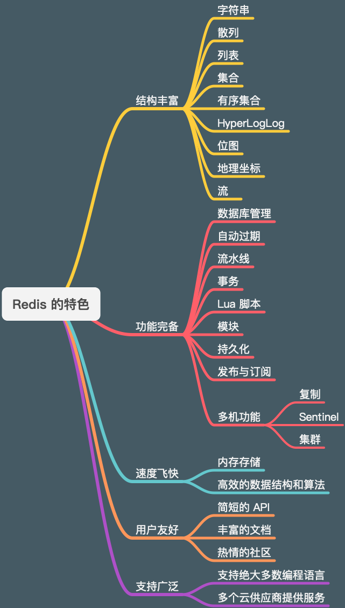

引言
===============

欢迎来到本书的第一章。
在这一章，
我们首先会了解到一些关于 Redis 的基本信息，
比如它提供了什么功能、它能做什么、它的优点是什么、有哪些公司使用它等等。

之后我们会快速地了解本书各个章节的具体编排，
并完成一些学习 Redis 的前期准备工作，
比如安装 Redis 服务器等等。
在一切准备就绪之后，
我们就会开始学习如何执行 Redis 命令，
以及如何通过配置选项对 Redis 服务器进行配置。

在本章的最后，
我们还会看到获取本书示例代码的方法，
并知悉本书使用的 Redis 版本以及本书配套的读者服务网站。


Redis 简介
----------------

Redis 是一个主要由 Salvatore Sanfilippo （antirez）开发的开源的内存数据结构存储器，
它经常被用作数据库、缓存以及消息代理等用途。

Redis 因为它丰富的数据结构、极快的速度、齐全的功能而为人所知，
它是目前内存数据库方面的事实标准，
在互联网上有非常广泛的应用，
包括微博、Twitter、GitHub、Stack Overflow、知乎等国内外公司都大量地使用了 Redis 。

Redis 之所以广受开发者欢迎，
跟它自身拥有强大的功能以及简洁的设计不无关系。

虽然 Redis 拥有各式各样的特点和优点，
但其中最重要的不外乎以下这些：

- **丰富多样的数据结构**

  Redis 为用户提供了字符串、散列、列表、集合、有序集合、HyperLogLog、位图、流、地理坐标等一系列丰富的数据结构，
  每种数据结构都适用于解决特定的问题。
  在有需要的时候，
  用户还可以通过事务、Lua 脚本、模块等特性，
  扩展已有数据结构的功能，
  甚至从零实现自己专属的数据结构。
  通过这些数据结构和特性，
  Redis 可以保证，
  用户总是可以使用最适合的工具去解决手头上的问题。

- **完备的功能**

  在上述这些数据结构的基础上，
  Redis 提供了很多非常有用和实用的附加功能，
  比如自动过期、流水线、事务、数据持久化等，
  这些功能能够帮助用户将 Redis 应用在更多不同的场景中，
  或者给予用户以方便。
  更重要的是，
  Redis 不仅可以单机使用，
  还可以多机使用：
  通过 Redis 自带的复制、Sentinel 和集群功能，
  用户可以将自己的数据库扩展至任意大小。
  无论你运营的是一个小型的个人网站，
  还是一个为上千万消费者服务的热门站点，
  你都可以在 Redis 找到你想要的功能，
  并将其部署到你的服务器里面。

- **风驰电掣般的执行速度**

  Redis 是一款内存数据库，
  它将所有数据都储存在内存里面。
  因为计算机访问内存的速度要远远高于访问硬盘的速度，
  因此与基于硬盘设计的传统数据库相比，
  Redis 在数据的存取速度方面具有天然的优势。
  虽然说“背靠大树好乘凉”，
  但 Redis 并没有因为自己拥有天然的速度优势就放弃了自己在效率方面的追求。
  与此相反，
  Redis 的开发者在实现各项数据结构和特性的时候都经过了大量考量，
  在底层选用了很多非常高效的数据结构和算法，
  以此来确保每个操作都可以在尽可能短的时间内完成，
  并且尽可能地节省内存。

- **对用户友好的API、文档以及社区**

  “虽然 Redis 提供了很多很棒的数据结构和特性，
  但如果它们使用起来非常困难的话，
  那么这一切就没有意义。”
  ——如果你对此有所担心的话，
  那么现在可以打消你的疑虑了！
  Redis API 遵循的是 UNIX “一次只做一件事，并把它做好”的设计哲学，
  Redis 的 API 虽然丰富，
  但它们大部分都非常简短，
  并且只需接受几个参数就可以完成用户指定的操作。
  更棒的是，
  Redis 在官方网站（redis.io）上为每个 API 以及相关特性都提供了详尽的文档，
  并且客户端本身也可以在线查询这些文档。
  当你遇到文档无法解决的问题时，
  还可以在 Redis 项目的 GitHub 页面（github.com/antirez/redis）、 Google Group（groups.google.com/forum/#!forum/redis-db）甚至作者的 Twitter（twitter.com/antirez） 上提问。

- **广泛的支持**

  正如之前所说，
  Redis 已经得到了互联网公司的广泛使用，
  许多开发者为不同的编程语言开发了相应的客户端（redis.io/clients），
  绝大多数编程语言的使用者都可以轻而易举地找到他们所需的客户端，
  然后直接开始使用 Redis 。
  此外，包括亚马逊、谷歌、RedisLabs、阿里云和腾讯云在内的多个云服务提供商都提供了基于 Redis 或兼容 Redis 的服务，
  如果你不打算自己搭建 Redis 服务器，
  那么上述的这些提供商可能是一个不错的选择。

----

图 1-1 Redis 特色一览



----


内容编排
---------------

本书由数据结构与应用、附加功能和多机功能三个部分共二十章组成。

在数据结构与应用部分，
书本介绍了 Redis 核心的九种数据结构，
列举了操作这些数据结构的众多命令及其详细信息，
并在其中穿插介绍了多个使用 Redis 命令构建应用程序的示例。
通过这些程序示例，
读者可以进一步加深对命令的认识，
并学会如何在实际中应用这些命令，
从而达到学而致用的目的。

附加功能部分介绍了 Redis 在数据结构的基础上，
为用户提供的额外功能。
其中包括管理数据结构的数据库管理功能和自动过期功能，
将数据结构持久化至硬盘从而避免数据丢失的持久化功能，
提高多条命令执行效率的流水线功能，
保证命令安全性的事务和 Lua 脚本功能，
还有扩展服务器特性的模块功能等等。
这些功能在为用户提供方便的同时，
也进一步扩大了 Redis 的适用范围，
读者可以通过阅读这一部分来学会如何将 Redis 应用在更多场景中。

多机功能部分介绍了 Redis 的三项多机功能，
它们分别是复制、Sentinel 和集群。
其中复制用于创建多个 Redis 服务器的副本，
并藉此提升整个 Redis 系统的读性能以及容灾能力。
至于 Sentinel 则在复制的基础上，
为 Redis 系统提供了自动的故障转移功能，
从而使得整个系统可以更健壮地运行。
最后，
通过使用 Redis 集群，
用户可以在线扩展 Redis 系统的读写能力。
读者可以通过阅读这一部分来获得扩展 Redis 读写性能的相关知识，
并根据自己的情况为 Redis 系统选择合适的扩展方式。


目标读者
--------------

本书面向所有 Redis 初学者和 Redis 使用者，
是学习和日常使用 Redis 必不可少的一本书。

一方面，
对于 Redis 初学者来说，
本书的章节经过妥善的编排，
按照从简单到复杂的顺序详细罗列了 Redis 的各项特性，
因此 Redis 初学者只需要沿着书本一直阅读下去就可以循序渐进地学习到具体的 Redis 知识，
而穿插其中的应用示例则让读者有机会亲自实践书中介绍的命令知识，
真正做到学以致用。

另一方面，
对于 Redis 使用者来说，
本书包含了大量 Redis 新版特性的介绍，
读者可以通过本书了解到最新的 Redis 知识。
除此之外，
对于日常的命令文档查找和应用示例查找，
本书在目录处也做了优化，
读者可以通过书本的目录快速定位命令和示例，
非常便于日常查阅。


预备工作
------------------

本书包含大量 Redis 命令操作实例和 Python 代码应用示例，
执行和测试这些示例需要用到 Redis 服务器及其附带的 redis-cli 客户端、Python 编程环境和 redis-py 客户端，
如果你尚未安装这些软件，
那么请查阅本书的附录 A 和附录 B 并按照指引进行安装。

在正确安装 Redis 服务器之后，
你应该可以通过执行以下命令来启动 Redis 服务器：

::
        
    $ redis-server
    28393:C 02 Jul 2019 23:49:25.952 # oO0OoO0OoO0Oo Redis is starting oO0OoO0OoO0Oo
    28393:C 02 Jul 2019 23:49:25.952 # Redis version=999.999.999, bits=64, commit=0cabe0cf, modified=1, pid=28393, just started
    28393:C 02 Jul 2019 23:49:25.952 # Warning: no config file specified, using the default config. In order to specify a config file use /Users/huangz/code/redis/src/redis-server /path/to/redis.conf
    28393:M 02 Jul 2019 23:49:25.953 * Increased maximum number of open files to 10032 (it was originally set to 256).
                    _._
               _.-``__ ''-._
          _.-``    `.  `_.  ''-._           Redis 999.999.999 (0cabe0cf/1) 64 bit
      .-`` .-```.  ```\/    _.,_ ''-._
     (    '      ,       .-`  | `,    )     Running in standalone mode
     |`-._`-...-` __...-.``-._|'` _.-'|     Port: 6379
     |    `-._   `._    /     _.-'    |     PID: 28393
      `-._    `-._  `-./  _.-'    _.-'
     |`-._`-._    `-.__.-'    _.-'_.-'|
     |    `-._`-._        _.-'_.-'    |           http://redis.io
      `-._    `-._`-.__.-'_.-'    _.-'
     |`-._`-._    `-.__.-'    _.-'_.-'|
     |    `-._`-._        _.-'_.-'    |
      `-._    `-._`-.__.-'_.-'    _.-'
          `-._    `-.__.-'    _.-'
              `-._        _.-'
                  `-.__.-'

    28393:M 02 Jul 2019 23:49:25.954 # Server initialized
    28393:M 02 Jul 2019 23:49:25.954 * Ready to accept connection

并通过以下命令启动 redis-cli 客户端：

::

    $ redis-cli
    127.0.0.1:6379>

以及通过以下命令启动 Python 解释器并载入 redis-py 库：

::

    $ python3
    Python 3.7.3 (default, Mar 27 2019, 09:23:15)
    [Clang 10.0.1 (clang-1001.0.46.3)] on darwin
    Type "help", "copyright", "credits" or "license" for more information.
    >>> from redis import Redis
    >>>

在上述准备工作圆满完成之后，
我们就可以开始学习 Redis 命令的基本知识了。


执行命令
-------------------

Redis 服务器通过接收客户端发送的命令请求来执行指定的命令，
并在命令执行完毕之后通过响应将命令的执行结果返回给客户端，
至于结果的内容则被称为命令回复。

----

图 1-2 命令请求与响应


----

Redis 为每种数据结构和功能特性都提供了一簇相应的命令，
学习如何使用这些命令是学习 Redis 的重中之重。
幸运的是，
大部分 Redis 命令都非常简单，
只需要接受少量几个参数就可以完成非常强大的操作。

Redis 的所有命令都由一个命令名后跟任意多个参数以及可选项组成：

::

    COMMAND [arg1 arg2 arg3 ...] [[OPTION1 value1] [OPTION2 value2] [...]]

在本书中，
命令和可选项的名字通常以大写字母形式出现，
而命令参数和可选项的值则以小写字母形式出现。
比如上例中的 ``COMMAND`` 就是命令的名字，
而 ``OPTION1`` 和 ``OPTION2`` 则是可选项的名字。
至于 ``arg1`` 、 ``arg2`` 和 ``arg3`` 则是命令的参数，
而 ``value1`` 和 ``value2`` 则是可选项的值。

命令描述中的方括号 ``[]`` 仅用于包围命令中可选的参数和选项，
在执行命令的时候并不需要给出这些方括号。
最后，
命令描述中的 ``...`` 用于表示命令接受任意数量的参数或可选项。

好的，
关于 Redis 命令格式的描述已经足够多了，
现在让我们来看一个实际的例子。
Redis 的 ``PING`` 命令接受一条可选的消息作为参数，
这个命令通常用于测试客户端和服务器之间的连接是否正常：

::

    PING [message]

如果用户以无参数形式执行这个命令，
那么服务器在连接正常的情况下，
将向客户端返回 ``"PONG"`` 作为回复：

::

    127.0.0.1:6379> PING
    PONG

但是，
如果用户给定了可选的消息，
那么服务器将原封不动地向客户端返回该消息：

::

    127.0.0.1:6379> PING "hello world"
    "hello world"

另一方面，
如果服务器与客户端的连接不正常，
那么客户端将返回一个错误：

::

    -- 客户端未能连接服务器，返回一个连接错误
    127.0.0.1:6379> PING
    Could not connect to Redis at 127.0.0.1:6379: Connection refused

我们为这个命令调用添加了一条注释，
用于说明客户端遇到的问题。
在本书中，
redis-cli 客户端的命令执行示例都使用 ``--`` 作为注释前缀，
这些注释仅用于对被执行的命令做进一步的说明，
它们并不是被执行命令的一部分。

----

图 1-3 在 redis-cli 中执行 Redis 命令

.. image:: image/introduction/IMAGE_COMMAND_PARTS.png

----


配置服务器
-----------------

在阅读本书的过程中，
有时候我们还需要使用配置选项对 Redis 服务器进行配置，
这一点可以通过两种方法来完成。

第一种方法是在启动 Redis 服务器的时候给定配置选项作为参数，
格式为：

::

    $ redis-server --OPTION1 [value1 value2 ...] --OPTION2 [value1 value2 ...] [...]

比如说，
Redis 服务器默认使用 ``6379`` 作为端口号，
但如果你想要使用 ``10086`` 而不是 ``6379`` 作为端口号的话，
那么可以在启动 Redis 服务器时通过给定 ``port`` 可选项来指定你想要的端口号：

::

    $ redis-server --port 10086

向 Redis 服务器提供配置选项的第二种方法则是在启动 Redis 服务器的时候为其提供配置文件，
并将想要修改的配置选项写在配置文件里面：

::

    $ redis-server /path/to/your/file

比如说，
为了将 Redis 服务器的端口号改为 12345 ，
我们可以在当前文件夹中创建配置文件 ``myredis.conf`` ，
并在文件中包含以下内容：

::

    port 10086

然后在启动 Redis 服务器时向其提供该配置文件：

::

    $ redis-server myredis.conf


示例代码
---------------

正如上面提到的那样，
本书提供了大量 Python 代码示例，
这些示例的源码可以通过访问以下页面获取：
github.com/huangz1990/RedisGuide-code 。

本书在展示代码示例的同时，
会在示例标题的旁边给出源代码的具体访问路径。
比如说，
对于代码清单 1-1 中展示的连接检查脚本 ``check_connection.py`` 来说，
该文件就位于 ``/introduction`` 文件夹中：

----

代码清单 1-1 检查连接的脚本：\ ``/introduction/check_connection.py``

.. literalinclude:: code/introduction/check_connection.py

----


版本说明
-----------------

本书基于 Redis 5.0 版本撰写，
它是书本创作期间 Redis 的最新版本。

为了方便使用旧版 Redis 的读者，
本书在介绍每个命令和特性的时候都指出了它们具体可用的版本，
读者通过查阅这一信息就可以知道特定的命令和特性在自己的版本中是否可用。

另一方面，
得益于 Redis 极好的向后兼容性，
即使读者将来使用的是 Redis 6.0 、7.0 甚至更新的版本，
本书的绝大部分知识对于读者来说仍将是有效的。


读者服务器网站
------------------

本书配套了读者服务网站 RedisGuide.com ，
上面列举了书本的介绍信息、购买链接、目录、试读章节、示例代码和勘误等内容，
有兴趣的读者朋友可以上去浏览一下。


启程！
-------------

一切准备就绪，
是时候开始我们的 Redis 旅程了。
在接下来的一章，
我们将开始学习 Redis 最基本的数据结构 —— 字符串。
