列表（List）
===============

Redis 的列表是一种线性的有序结构，
它可以按照元素被推入到列表中的顺序来储存元素，
这些元素既可以是文字数据，
又可以是二进制数据，
并且列表中的元素可以出现重复。

作为例子，
图 4-1 展示了一个包含多个字符串的列表，
这个列表按照从左到右的方式，
依次储存了 ``"one"`` 、 ``"two"`` 、 ``"three"`` 、 ``"four"`` 四个元素。

----

图 4-1 横向表示的列表

.. image:: image/list/IMAGE_GRAPH_LIST.jpeg

----

为了展示方便，
本书给出的列表图片一般都会像图 4-1 那样只展示列表本身而忽略列表的键名，
但是在有需要的时候，
本书也会像图 4-2 那样，
将列表及其键名一并给出。

----

图 4-2 完整的列表键视图

.. image:: image/list/IMAGE_LIST_WITH_KEY.jpeg

----

..
    图 IMAGE_VERTICAL_LIST 纵向表示的列表

    ::

        +---------+ <- top(left end)
        |  "one"  |
        +---------+
        |  "two"  |
        +---------+
        | "three" |
        +---------+
        | "four"  |
        +---------+ <- bottom(right end)

    ----

Redis 为列表提供了丰富的操作命令，
通过这些命令，
用户可以：

- 将新元素推入到列表的左端或者右端；

- 移除位于列表最左端或者最右端的元素；

- 移除列表最右端的元素，
  然后把被移除的元素推入到另一个列表的左端；

- 获取列表包含的元素数量；

- 获取列表在指定索引上的单个元素，
  又或者获取列表在指定索引范围内的多个元素；

- 为列表的指定索引设置新元素，
  或者把新元素添加到某个指定元素的前面或者后面；

- 对列表进行修剪，
  只保留指定索引范围内的元素；

- 从列表里面移除指定元素；

- 执行能够阻塞客户端的推入和移除操作；

本章接下来将对以上提到的各个列表操作命令进行介绍，
并说明如何使用这些命令去构建各种实用的程序。

..
    .. note:: Redis 列表的底层实现

        Redis 列表使用带有头尾指针的双向链表作为底层实现，
        这一实现决定了大部分列表操作的复杂度：

        - 获取列表包含的所有元素、访问列表在指定索引上的元素、在列表里面查找某个指定的元素等等，
          因为这些操作都需要对链表进行遍历，
          所以它们的复杂度都是 O(N) ；

        - 因为链表带有指向表头和表尾的指针，
          所以针对表头和表尾的单个添加或者移除操作的复杂度为 O(1) ；

        除此之外，
        因为 Redis 会把每个链表的长度都缓存起来，
        所以获取列表长度的复杂度仅为 O(1) ，
        而不是 O(N) 。

        作为例子，
        图 IMAGE-LIST-UNDER 展示了一个包含四个元素的列表对应的底层链表。

        ::

            linked_list
            +--------+
            | length |--> 4
            +--------+    +-------+ next  +-------+    +---------+    +--------+
            | head   |--> | "one" | ----> | "two" | -> | "three" | -> | "four" | <--+
            |        |    |       | <---- |       | <- |         | <- |        |    |
            |        |    +-------+ prev  +-------+    +---------+    +--------+    |
            +--------+                                                              |
            | tail   |--------------------------------------------------------------+
            +--------+

    .. || fix editor highlight

LPUSH：将元素推入到列表左端
----------------------------------

用户可以通过 ``LPUSH`` 命令，
将一个或多个元素推入到给定列表的左端：

::

    LPUSH list item [item item ...]

在推入操作执行完毕之后，
``LPUSH`` 命令会返回列表当前包含的元素数量作为返回值。

比如以下代码就展示了如何通过 ``LPUSH`` 命令，
将 ``"buy some milk"`` 、 ``"watch tv"`` 、 ``"finish homework"`` 等元素依次推入到 ``todo`` 列表的左端：

::

    redis> LPUSH todo "buy some milk"
    (integer) 1    -- 列表现在包含一个元素

    redis> LPUSH todo "watch tv"
    (integer) 2    -- 列表现在包含两个元素

    redis> LPUSH todo "finish homework"
    (integer) 3    -- 列表现在包含三个元素

图 4-3 展示了以上三个 ``LPUSH`` 命令的执行过程：

1. 首先，在操作执行之前， ``todo`` 列表为空，也即是不存在于数据库中；

2. 执行第一个 ``LPUSH`` 命令，将元素 ``"buy some milk"`` 推入到列表左端；

3. 执行完第一个 ``LPUSH`` 命令的列表现在包含一个元素；

4. 执行第二个 ``LPUSH`` 命令，将元素 ``"watch tv"`` 推入到列表左端；

5. 执行完第二个 ``LPUSH`` 命令的列表现在包含两个元素；

6. 执行第三个 ``LPUSH`` 命令，将元素 ``"finish homework"`` 推入到列表左端；

7. 执行完第三个 ``LPUSH`` 命令的 ``todo`` 列表现在包含三个元素。

----

图 4-3 ``LPUSH`` 命令执行过程

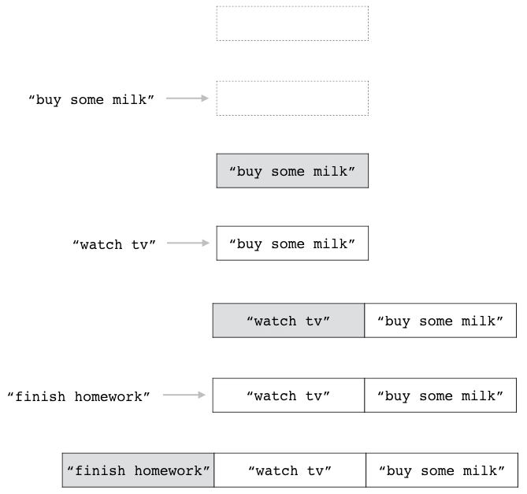

----

一次推入多个元素
^^^^^^^^^^^^^^^^^^^^^^^^

``LPUSH`` 命令允许用户一次将多个元素推入到列表左端：
如果用户在执行 ``LPUSH`` 命令时给定了多个元素，
那么 ``LPUSH`` 命令将按照元素给定的顺序，
从左到右依次地将所有给定元素推入到列表左端。

举个例子，
如果用户执行以下命令：

::

    redis> LPUSH another-todo "buy some milk" "watch tv" "finish homework"
    (integer) 3

那么 ``LPUSH`` 命令将按照图 4-4 所示的顺序，
将三个给定元素依次推入到 ``another-todo`` 列表的左端。

----

图 4-4 一次推入多个元素

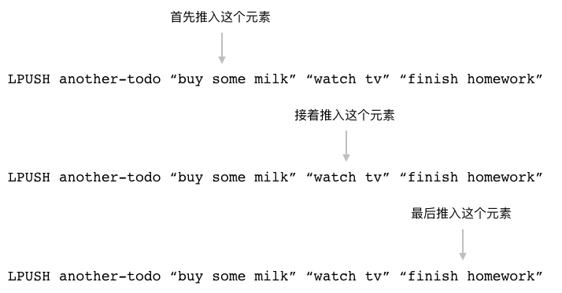

----

最终，
这条 ``LPUSH`` 命令将产生图 4-5 所示的列表，
它和上一小节使用三条 ``LPUSH`` 命令构建出的列表完全相同。

----

图 4-5 ``another-todo`` 列表及其包含的元素

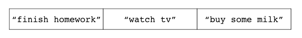

----

其他信息
^^^^^^^^^^^^^^^^^

+---------------+---------------------------------------------------------------------------+
| 属性          | 值                                                                        |
+===============+===========================================================================+
| 复杂度        | O(N)，其中 N 为被推入到列表的元素数量。                                   |
+---------------+---------------------------------------------------------------------------+
| 版本要求      | ``LPUSH`` 命令从 Redis 1.0.0 版本开始可用，                               |
|               | 但是只有 Redis 2.4.0 或以上版本的 ``LPUSH`` 命令可以一次推入多个元素，    |
|               | Redis 2.4.0 以下版本的 ``LPUSH`` 命令每次只能推入一个元素。               |
+---------------+---------------------------------------------------------------------------+

RPUSH：将元素推入到列表右端
----------------------------------

``RPUSH`` 命令和 ``LPUSH`` 命令类似，
这两个命令执行的都是元素推入操作，
它们之间唯一的区别就在于 ``LPUSH`` 命令会将元素推入列表左端，
而 ``RPUSH`` 命令则会将元素推入列表右端：

::

    RPUSH list item [item item ...]

在推入操作执行完毕之后，
``RPUSH`` 命令会返回列表当前包含的元素数量作为返回值。

举个例子，
以下代码展示了如何通过 ``RPUSH`` 命令，
将 ``"buy some milk"`` 、 ``"watch tv"`` 、 ``"finish homework"`` 等元素依次推入到 ``todo`` 列表的右端：

::

    redis> RPUSH todo "buy some milk"
    (integer) 1    -- 列表现在包含一个元素

    redis> RPUSH todo "watch tv"
    (integer) 2    -- 列表现在包含两个元素

    redis> RPUSH todo "finish homework"
    (integer) 3    -- 列表现在包含三个元素

图 4-6 展示了以上三个 ``RPUSH`` 命令的执行过程：

1. 首先，在操作执行之前， ``todo`` 列表为空，也即是不存在于数据库中；

2. 执行第一个 ``RPUSH`` 命令，
   将元素 ``"buy some milk"`` 推入到列表右端；

3. 执行完第一个 ``RPUSH`` 命令的列表现在包含一个元素；

4. 执行第二个 ``RPUSH`` 命令，
   将元素 ``"watch tv"`` 推入到列表右端；

5. 执行完第二个 ``RPUSH`` 命令的列表现在包含两个元素；

6. 执行第三个 ``RPUSH`` 命令，
   将元素 ``"finish homework"`` 推入到列表右端；

7. 执行完第三个 ``RPUSH`` 命令的 ``todo`` 列表现在包含三个元素。

----

图 4-6 ``RPUSH`` 命令执行过程

.. image:: image/list/IMAGE_RPUSH_EXAMPLE.jpeg

----

一次推入多个元素
^^^^^^^^^^^^^^^^^^^^^^^

跟 ``LPUSH`` 命令一样，
``RPUSH`` 命令也允许用户一次推入多个元素：
如果用户在执行 ``RPUSH`` 命令时给定了多个元素，
那么 ``RPUSH`` 命令将按照元素给定的顺序，
从左到右依次地将所有给定元素推入到列表右端。

举个例子，
如果用户执行以下命令：

::

    redis> RPUSH another-todo "buy some milk" "watch tv" "finish homework"
    (integer) 3

那么 ``RPUSH`` 命令将按照图 4-7 展示的顺序，
将三个给定元素依次推入到 ``another-todo`` 列表的右端。

----

图 4-7 一次推入多个元素

.. image:: image/list/IMAGE_MULTI_RPUSH.jpeg

----

最终，
这条 ``RPUSH`` 命令将产生图 4-8 所示的列表，
这个列表和上一小节使用三条 ``RPUSH`` 命令构建出的列表完全相同。

----

图 4-8 ``another-todo`` 列表及其包含的元素

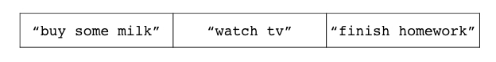

----

其他信息
^^^^^^^^^^^^^^^^

+---------------+---------------------------------------------------------------------------+
| 属性          | 值                                                                        |
+===============+===========================================================================+
| 复杂度        | O(N)，其中 N 为被推入到列表的元素数量。                                   |
+---------------+---------------------------------------------------------------------------+
| 版本要求      | ``RPUSH`` 命令从 Redis 1.0.0 版本开始可用，                               |
|               | 但是只有 Redis 2.4.0 或以上版本的 ``RPUSH`` 命令可以一次推入多个元素，    |
|               | Redis 2.4.0 以下版本的 ``RPUSH`` 命令每次只能推入一个元素。               |
+---------------+---------------------------------------------------------------------------+

LPUSHX、RPUSHX：只对已存在的列表执行推入操作
----------------------------------------------------

当用户调用 ``LPUSH`` 命令或是 ``RPUSH`` 命令尝试将元素推入到列表的时候，
如果给定的列表并不存在，
那么命令将自动创建一个空列表，
并将元素推入到刚刚创建的列表里面。

比如对于空列表 ``list1`` 和 ``list2`` 来说，
执行以下命令将创建图 4-9 所示的两个列表：

::

    redis> LPUSH list1 "item1"
    (integer) 1

    redis> RPUSH list2 "item1"
    (integer) 1    

----

图 4-9 两个只包含单个元素的列表

.. image:: image/list/IMAGE_LIST1_LIST2.jpeg

----

除了 ``LPUSH`` 命令和 ``RPUSH`` 命令之外，
Redis 还提供了 ``LPUSHX`` 命令和 ``RPUSHX`` 命令：

::

    LPUSHX list item

    RPUSHX list item

这两个命令对待空列表的方式跟 ``LPUSH`` 命令和 ``RPUSH`` 命令正好相反：

- ``LPUSHX`` 命令只会在列表已经存在的情况下，
  将元素推入列表左端；

- 而 ``RPUSHX`` 命令只会在列表已经存在的情况下，
  将元素推入列表右端；

如果给定列表并不存在，
那么 ``LPUSHX`` 命令和 ``RPUSHX`` 命令将放弃执行推入操作。

``LPUSHX`` 命令和 ``RPUSHX`` 命令在成功执行推入操作之后，
将返回列表当前的长度作为返回值；
如果推入操作未能成功执行，
那么命令将返回 ``0`` 作为结果。

举个例子，
如果我们对不存在的列表 ``list3`` 执行以下 ``LPUSHX`` 命令和 ``RPUSHX`` 命令，
那么这两个推入操作都将被拒绝：

::

    redis> LPUSHX list3 "item-x"
    (integer) 0    -- 没有推入任何元素

    redis> RPUSHX list3 "item-y"
    (integer) 0    -- 没有推入任何元素

另一方面，
如果我们先使用 ``LPUSH`` 命令，
将一个元素推入到 ``list3`` 列表里面，
使得 ``list3`` 变成非空列表，
那么 ``LPUSHX`` 命令和 ``RPUSHX`` 命令就可以成功地执行推入操作：

::

    redis> LPUSH list3 "item1"
    (integer) 1    -- 推入一个元素，使列表变为非空

    redis> LPUSHX list3 "item-x"
    (integer) 2    -- 执行推入操作之后，列表包含两个元素

    redis> RPUSHX list3 "item-y"
    (integer) 3    -- 执行推入操作之后，列表包含三个元素

图 4-10 展示了列表 ``list3`` 的整个变化过程：

1. 在最初的 ``LPUSHX`` 命令和 ``RPUSHX`` 命令执行之后，
   ``list3`` 仍然是一个空列表。

2. 执行 ``LPUSH`` 命令，
   将元素 ``"item1"`` 推入到列表里面，
   使之变为非空。

3. 执行 ``LPUSHX`` 命令，
   将元素 ``"item-x"`` 推入列表，
   使得列表包含两个元素。

4. 执行 ``RPUSHX`` 命令，
   将元素 ``"item-y"`` 推入列表，
   使得列表包含三个元素。

----

图 4-10 ``LPUSHX`` 命令和 ``RPUSHX`` 命令的执行过程

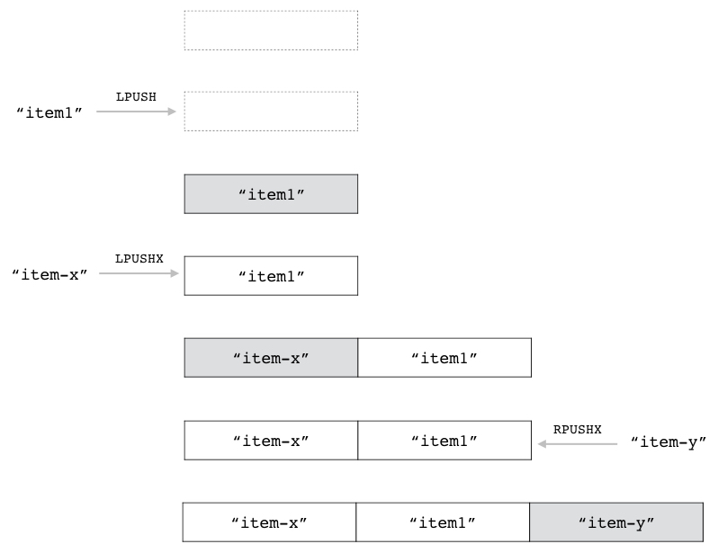

----

每次只能推入单个元素
^^^^^^^^^^^^^^^^^^^^^^^^^^^^^

跟 ``LPUSH`` 命令和 ``RPUSH`` 命令不一样，
``LPUSHX`` 命令和 ``RPUSHX`` 命令每次只能推入一个元素，
尝试向 ``LPUSHX`` 命令或 ``RPUSHX`` 命令给定多个元素将引发错误：

::

    redis> LPUSHX list "item1" "item2" "item3"
    (error) ERR wrong number of arguments for 'lpushx' command

    redis> RPUSHX list "item1" "item2" "item3"
    (error) ERR wrong number of arguments for 'rpushx' command

其他信息
^^^^^^^^^^^^^^^^

+---------------+---------------------------------------------------------------+
| 属性          | 值                                                            |
+===============+===============================================================+
| 复杂度        | O(1)                                                          |
+---------------+---------------------------------------------------------------+
| 版本要求      | ``LPUSHX`` 命令和 ``RPUSHX`` 命令从 Redis 2.2.0 版本开始可用。|
+---------------+---------------------------------------------------------------+

LPOP：弹出列表最左端的元素
-----------------------------------

用户可以通过 ``LPOP`` 命令移除位于列表最左端的元素，
并将被移除的元素返回给用户：

::

    LPOP list

比如说，
以下代码就展示了如何使用 ``LPOP`` 命令去弹出 ``todo`` 列表的最左端元素：

::

    redis> LPOP todo
    "finish homework"

    redis> LPOP todo
    "watch tv"

    redis> LPOP todo
    "buy some milk"    

图 4-11 展示了 ``todo`` 列表在 ``LPOP`` 命令执行时的整个变化过程：

1. 在 ``LPOP`` 命令执行之前，
   ``todo`` 列表包含三个元素；

2. 执行第一个 ``LPOP`` 命令，
   从列表中弹出 ``"finish homework"`` 元素；

3. 执行第二个 ``LPOP`` 命令，
   从列表中弹出 ``"watch tv"`` 元素；

4. 执行第三个 ``LPOP`` 命令，
   从列表中弹出 ``"buy some milk"`` 元素，
   并使得 ``todo`` 列表变为空。

----

图 4-11 ``LPOP`` 命令的执行过程

.. image:: image/list/IMAGE_LPOP_EXAMPLE.jpeg

----

另一方面，
如果用户给定的列表并不存在，
那么 ``LPOP`` 命令将返回一个空值，
表示列表为空，
没有元素可供弹出：

::

    redis> LPOP empty-list
    (nil)

其他信息
^^^^^^^^^^^^^^^

+---------------+-------------------------------------------+
| 属性          | 值                                        |
+===============+===========================================+
| 复杂度        | O(1)                                      |
+---------------+-------------------------------------------+
| 版本要求      | ``LPOP`` 命令从 Redis 1.0.0 版本开始可用。|
+---------------+-------------------------------------------+

RPOP：弹出列表最右端的元素
-----------------------------------

用户可以通过 ``RPOP`` 命令移除位于列表最右端的元素， 
并将被移除的元素返回给用户：

::

    RPOP list

比如说，
以下代码就展示了如何使用 ``RPOP`` 命令去弹出 ``todo`` 列表最右端的元素：

::

    redis> RPOP todo
    "finish homework"

    redis> RPOP todo
    "watch tv"

    redis> RPOP todo
    "buy some milk"

图 4-12 展示了 ``todo`` 列表在 ``RPOP`` 命令执行时的整个变化过程：

1. 在 ``RPOP`` 命令执行之前，
   ``todo`` 列表包含三个元素；

2. 执行第一个 ``RPOP`` 命令，
   从列表中弹出 ``"finish homework"`` 元素；

3. 执行第二个 ``RPOP`` 命令，
   从列表中弹出 ``"watch tv"`` 元素；

4. 执行第三个 ``RPOP`` 命令，
   从列表中弹出 ``"buy some milk"`` 元素，
   并使得 ``todo`` 列表变为空。

----

图 4-12 ``RPOP`` 命令的执行过程

.. image:: image/list/IMAGE_RPOP_EXAMPLE.jpeg

----
     
跟 ``LPOP`` 命令一样，
如果用户给定的列表并不存在，
那么 ``RPOP`` 命令将返回一个空值，
表示列表为空，
没有元素可供弹出：

::

    redis> RPOP empty-list
    (nil)

其他信息
^^^^^^^^^^^^^^^

+---------------+-------------------------------------------+
| 属性          | 值                                        |
+===============+===========================================+
| 复杂度        | O(1)                                      |
+---------------+-------------------------------------------+
| 版本要求      | ``RPOP`` 命令从 Redis 1.0.0 版本开始可用。|
+---------------+-------------------------------------------+

RPOPLPUSH：将右端弹出的元素推入到左端
-------------------------------------------------

``RPOPLPUSH`` 命令的行为和它的名字一样，
它首先使用 ``RPOP`` 命令将源列表最右端的元素弹出，
然后使用 ``LPUSH`` 命令将被弹出的元素推入到目标列表左端，
使之成为目标列表的最左端元素：

::

    RPOPLPUSH source target

``RPOPLPUSH`` 命令会返回被弹出的元素作为结果。

作为例子，
以下代码展示了如何使用 ``RPOPLPUSH`` 命令，
将列表 ``list1`` 的最右端元素弹出，
然后将其推入至列表 ``list2`` 的左端：

::

    redis> RPUSH list1 "a" "b" "c"    -- 创建两个示例列表 list1 和 list2
    (integer) 3

    redis> RPUSH list2 "d" "e" "f"
    (integer) 3

    redis> RPOPLPUSH list1 list2
    "c"

    redis> RPOPLPUSH list1 list2
    "b"

    redis> RPOPLPUSH list1 list2
    "a"

图 4-13 展示了列表 ``list1`` 和 ``list2`` 在执行以上 ``RPOPLPUSH`` 命令时的变化过程：

1. 在 ``RPOPLPUSH`` 命令执行之前，
   ``list1`` 和 ``list2`` 都包含三个元素；

2. 执行第一个 ``RPOPLPUSH`` 命令，
   弹出 ``list1`` 的最右端元素 ``"c"`` ，
   并将其推入至 ``list2`` 的左端；

3. 执行第二个 ``RPOPLPUSH`` 命令，
   弹出 ``list1`` 的最右端元素 ``"b"`` ，
   并将其推入至 ``list2`` 的左端；

4. 执行第三个 ``RPOPLPUSH`` 命令，
   弹出 ``list1`` 的最右端元素 ``"a"`` ，
   并将其推入至 ``list2`` 的左端；

5. 在以上三个 ``RPOPLPUSH`` 命令执行完毕之后，
   ``list1`` 将变为空列表，
   而 ``list2`` 则会包含六个元素。

----

图 4-13 ``RPOPLPUSH`` 命令的执行过程

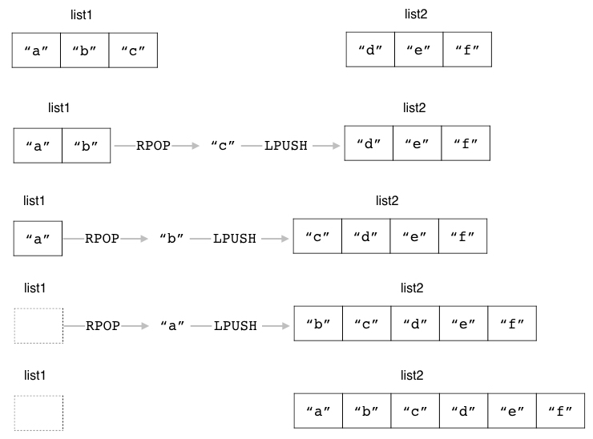

----

源列表和目标列表相同
^^^^^^^^^^^^^^^^^^^^^^^^^^^

``RPOPLPUSH`` 命令允许用户将源列表和目标列表设置为同一个列表：
在这种情况下，
``RPOPLPUSH`` 命令的效果就相当于将列表最右端的元素变成列表最左端的元素。

比如以下代码就展示了如何通过 ``RPOPLPUSH`` 命令，
将 ``rotate-list`` 列表的最右端元素变成列表的最左端元素：

::

    redis> RPUSH rotate-list "a" "b" "c"    -- 创建一个示例列表
    (integer) 3

    redis> RPOPLPUSH rotate-list rotate-list
    "c"

    redis> RPOPLPUSH rotate-list rotate-list
    "b"

    redis> RPOPLPUSH rotate-list rotate-list
    "a"

图 4-14 展示了以上三个 ``RPOPLPUSH`` 命令在执行时，
``rotate-list`` 列表的整个变化过程：

1. 在 ``RPOPLPUSH`` 命令执行之前，列表包含 ``"a"`` 、 ``"b"`` 、 ``"c"`` 三个元素。

2. 执行第一个 ``RPOPLPUSH`` 命令，将最右端元素 ``"c"`` 变为最左端元素。

3. 执行第二个 ``RPOPLPUSH`` 命令，将最右端元素 ``"b"`` 变为最左端元素。

4. 执行第三个 ``RPOPLPUSH`` 命令，将最右端元素 ``"a"`` 变为最左端元素。

5. 在以上三个 ``RPOPLPUSH`` 命令执行完毕之后，列表又重新回到了原样。

----

图 4-14 使用 ``RPOPLPUSH`` 对列表元素进行轮换

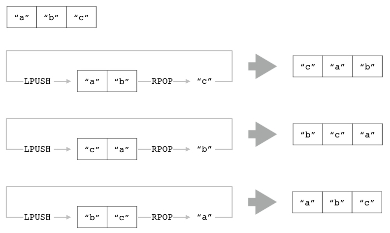

----

正如上面展示的例子所示，
通过对同一个列表重复执行 ``RPOPLPUSH`` 命令，
我们可以创建出一个对元素进行轮换的列表；
并且当我们对一个包含了 N 个元素的列表重复执行 N 次 ``RPOPLPUSH`` 命令之后，
列表元素的排列顺序将变回原来的样子。

处理空列表
^^^^^^^^^^^^^^^^^^^^^^

如果用户传给 ``RPOPLPUSH`` 命令的源列表并不存在，
那么 ``RPOPLPUSH`` 命令将放弃执行弹出和推入操作，
只返回一个空值表示命令执行失败：

::

    redis> RPOPLPUSH list-x list-y
    (nil)

另一方面，
如果源列表非空，
但是目标列表为空，
那么 ``RPOPLPUSH`` 命令将正常执行弹出操作和推入操作：

::

    redis> RPUSH list-x "a" "b" "c"    -- 将 list-x 变为非空列表
    (integer) 3

    redis> RPOPLPUSH list-x list-y
    "c"

图 4-15 展示了这条 ``RPOPLPUSH`` 命令执行之前和执行之后， 
``list-x`` 和 ``list-y`` 的变化：

1. 在执行 ``RPOPLPUSH`` 命令之前，
   ``list-x`` 包含三个元素，
   而 ``list-y`` 为空。

2. 执行 ``RPOPLPUSH`` 命令，
   将 ``list-x`` 的最右端元素 ``"c"`` 弹出，
   并将其推入至 ``list-y`` 的左端。

3. 在 ``RPOPLPUSH`` 命令执行完毕之后，
   ``list-x`` 将包含两个元素，
   而 ``list-y`` 则包含一个元素。

----

图 4-15 ``RPOPLPUSH`` 命令处理目标列表为空的例子

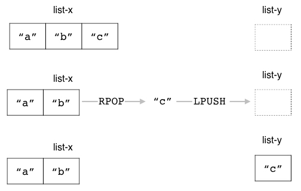

其他信息
^^^^^^^^^^^^^^^^^^

+---------------+---------------------------------------------------+
| 属性          | 值                                                |
+===============+===================================================+
| 复杂度        | O(1)                                              |
+---------------+---------------------------------------------------+
| 版本要求      | ``RPOPLPUSH`` 命令从 Redis 1.2.0 版本开始可用。   |
+---------------+---------------------------------------------------+

示例：先进先出队列
--------------------------------------

先进先出队列（first in first out queue）是一种非常常见的数据结构，
一般都会包含入队（enqueue）和出队（dequeue）这两个操作，
其中入队操作会将一个元素放入到队列中，
而出队操作则会从队列中移除最先被入队的元素。

先进先出队列的应用非常广泛，
它见诸于各式各样的应用程序当中。
举个例子，
很多电商网站都会在节日时推出一些秒杀活动，
这些活动会放出数量有限的商品供用户抢购，
秒杀系统的一个特点就是在短时间内会有大量用户同时进行相同的购买操作，
如果使用事务或者锁去实现秒杀程序，
那么就会因为锁和事务的重试特性而导致性能低下，
并且由于重试的存在，
成功购买商品的用户可能并不是最早执行购买操作的用户，
因此这种秒杀系统实际上是不公平的。

解决上述问题的其中一个方法就是把用户的购买操作都放入到先进先出队列里面，
然后以队列方式处理用户的购买操作，
这样程序就可以在不使用锁或者事务的情况下实现秒杀系统，
并且得益于先进先出队列的特性，
这种秒杀系统可以按照用户执行购买操作的顺序来判断哪些用户可以成功执行购买操作，
因此它是公平的。

代码清单 4-1 展示了一个使用 Redis 列表实现先进先出队列的方法。

----

代码清单 4-1 使用列表实现的先进先出队列：\ ``/list/fifo_queue.py``

.. literalinclude:: code/list/fifo_queue.py

----

作为例子，
我们可以通过执行以下代码，
载入并创建一个先进先出队列：

::

    >>> from redis import Redis
    >>> from fifo_queue import FIFOqueue
    >>> client = Redis(decode_responses=True)
    >>> q = FIFOqueue(client, "buy-request")

然后通过执行以下代码，
将三个用户的购买请求依次放入到队列里面：

::

    >>> q.enqueue("peter-buy-milk")
    1
    >>> q.enqueue("john-buy-rice")
    2
    >>> q.enqueue("david-buy-keyboard")
    3

最后，
按照先进先出顺序，
依次从队列中弹出相应的购买请求：

::

    >>> q.dequeue()
    'peter-buy-milk'
    >>> q.dequeue()
    'john-buy-rice'
    >>> q.dequeue()
    'david-buy-keyboard'

可以看到，
队列弹出元素的顺序跟元素入队时的顺序是完全相同的：
最先是 ``"peter-buy-milk"`` 元素，
接着是 ``"john-buy-rice"`` 元素，
最后是 ``"david-buy-keyboard"`` 元素。

..
    示例：栈
    -------------------------------------

    两种队列的 API 相同，只是调用的 Redis 命令不同

    后进先出队列也被称为“栈”（stack）

    TODO RPUSH 进 RPOP 出，或者 LPUSH 进 LPOP 出。

    TODO 练习：用相反的方向写一个栈实现。

    ----

    代码清单 CODE-STACK 使用列表实现的栈

    .. literalinclude:: code/list/stack.py

    ----

        

LLEN：获取列表的长度
---------------------------

用户可以通过执行 ``LLEN`` 命令来获取列表的长度，
也即是列表包含的元素数量：

::

    LLEN list

----

图 4-16 几个不同长度的列表

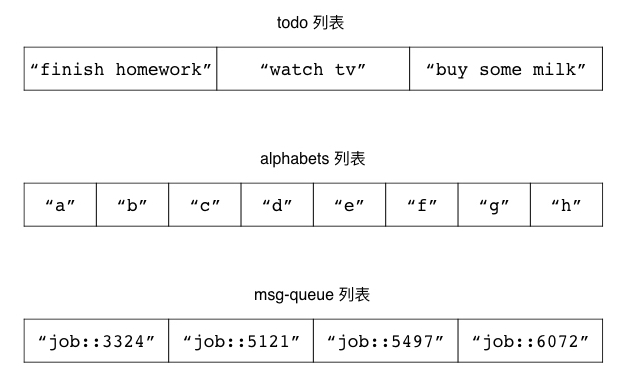

----

比如对于图 4-16 所示的几个列表来说，
对它们执行 ``LLEN`` 命令将获得以下结果：

::

    redis> LLEN todo
    (integer) 3

    redis> LLEN alphabets
    (integer) 8

    redis> LLEN msg-queue
    (integer) 4

另一方面，
对于不存在的列表，
``LLEN`` 命令将返回 ``0`` 作为结果：

::

    redis> LLEN not-exists-list
    (integer) 0

其他信息
^^^^^^^^^^^^^^^^^^^^^^^^^^^^^^

+-----------+-------------------------------------------+
| 属性      | 值                                        |
+===========+===========================================+
| 复杂度    | O(1)                                      |
+-----------+-------------------------------------------+
| 版本要求  | ``LLEN`` 命令从 Redis 1.0.0 版本开始可用。|
+-----------+-------------------------------------------+

LINDEX：获取指定索引上的元素
----------------------------------------------

Redis 列表包含的每个元素都有与之相对应的正数索引和负数索引：

- 正数索引从列表的左端开始计算，
  依次向右端递增：
  最左端元素的索引为 ``0`` ，
  左端排行第二的元素索引为 ``1`` ，
  左端排行第三的元素索引为 ``2`` ，
  以此类推。
  最大的正数索引为列表长度减一，
  也即是 ``N-1`` 。

- 负数索引从列表的右端开始计算，
  依次向左端递减：
  最右端元素的索引为 ``-1`` ，
  右端排行第二的元素索引为 ``-2`` ，
  右端排行第三的元素索引为 ``-3`` ，
  以此类推。
  最大的负数索引为列表长度的负数，
  也即是 ``-N`` 。

作为例子，
图 4-17 展示了一个包含多个元素的列表，
并给出了列表元素对应的正数索引和负数索引。

----

图 4-17 列表的索引

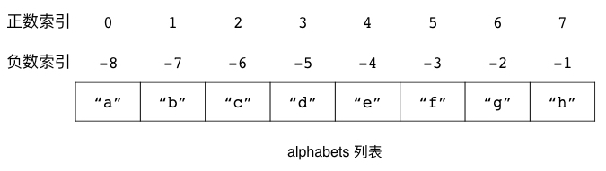

----

为了让用户可以方便地取得索引对应的元素，
Redis 提供了 ``LINDEX`` 命令：

::

    LINDEX list index

这个命令接受一个列表和一个索引作为参数，
然后返回列表在给定索引上的元素；
其中给定索引既可以是正数，
也可以是负数。

比如说，
对于前面展示的图 4-17 ，
我们可以通过执行以下命令，
取得 ``alphabets`` 列表在指定索引上的元素：

::

    redis> LINDEX alphabets 0
    "a"

    redis> LINDEX alphabets 3
    "d"

    redis> LINDEX alphabets 6
    "g"

    redis> LINDEX alphabets -3
    "f"

    redis> LINDEX alphabets -7
    "b"

处理超出范围的索引
^^^^^^^^^^^^^^^^^^^^^^^^^^^

对于一个长度为 ``N`` 的非空列表来说：

- 它的正数索引必然大于等于 ``0`` ，
  并且少于等于 ``N-1`` ；

- 而它的负数索引则必然小于等于 ``-1`` ，
  并且大于等于 ``-N`` ；

如果用户给定的索引超出了这一范围，
那么 ``LINDEX`` 命令将返回空值，
以此来表示给定索引上并不存在任何元素：

::

    redis> LINDEX alphabets 100
    (nil)

    redis> LINDEX alphabets -100
    (nil)

其他信息
^^^^^^^^^^^^^^^^^^^^^^

+---------------+-----------------------------------------------+
| 属性          | 值                                            |
+===============+===============================================+
| 复杂度        | O(N) ，其中 N 为给定列表的长度。              |
+---------------+-----------------------------------------------+
| 版本要求      | ``LINDEX`` 命令从 Redis 1.0.0 版本开始可用。  |
+---------------+-----------------------------------------------+

LRANGE：获取指定索引范围上的元素
----------------------------------------------

用户除了可以使用 ``LINDEX`` 命令获取给定索引上的单个元素之外，
还可以使用 ``LRANGE`` 命令获取给定索引范围上的多个元素：

::

    LRANGE list start end

``LRANGE`` 命令接受一个列表、一个开始索引和一个结束索引作为参数，
然后依次返回列表从开始索引到结束索引范围内的所有元素，
其中开始索引和结束索引对应的元素也会被包含在命令返回的元素当中。

作为例子，
以下代码展示了如何使用 ``LRANGE`` 命令去获取 ``alphabets`` 列表在不同索引范围内的元素：

::

    redis> LRANGE alphabets 0 3    -- 获取列表索引 0 至索引 3 上的所有元素
    1) "a"    -- 位于索引 0 上的元素
    2) "b"    -- 位于索引 1 上的元素
    3) "c"    -- 位于索引 2 上的元素
    4) "d"    -- 位于索引 3 上的元素

    redis> LRANGE alphabets 2 6
    1) "c"
    2) "d"
    3) "e"
    4) "f"
    5) "g"

    redis> LRANGE alphabets -5 -1
    1) "d"
    2) "e"
    3) "f"
    4) "g"
    5) "h"

    redis> LRANGE alphabets -7 -4
    1) "b"
    2) "c"
    3) "d"
    4) "e"

图 4-18 展示了这些 ``LRANGE`` 命令是如何根据给定的索引范围去获取列表元素的。

----

图 4-18 ``LRANGE`` 命令获取范围内元素的过程

.. image:: image/list/IMAGE_LRANGE_1.jpeg

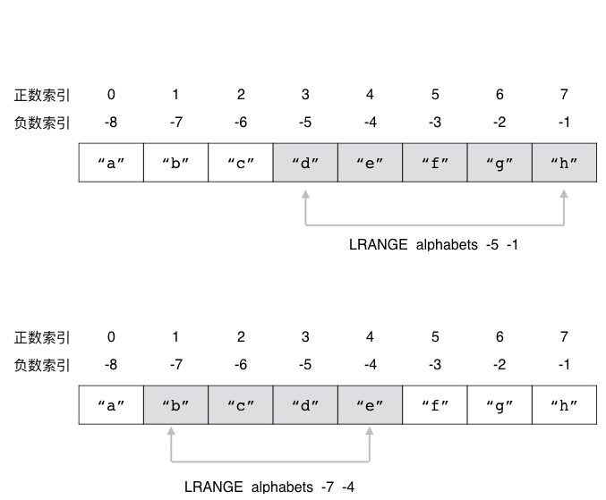

----

获取列表包含的所有元素
^^^^^^^^^^^^^^^^^^^^^^^^^^^^^^^^

一个快捷地获取列表包含的所有元素的方法，
就是使用 ``0`` 作为起始索引、 ``-1`` 作为结束索引去调用 ``LRANGE`` 命令，
这种方法非常适用于查看长度较短的列表：

::

    redis> LRANGE alphabets 0 -1
    1) "a"
    2) "b"
    3) "c"
    4) "d"
    5) "e"
    6) "f"
    7) "g"
    8) "h"

处理超出范围的索引
^^^^^^^^^^^^^^^^^^^^^^^^^^

跟 ``LINDEX`` 一样，
``LRANGE`` 命令也需要处理超出范围的索引：

- 如果用户给定的起始索引和结束索引都超出了范围，
  那么 ``LRANGE`` 命令将返回空列表作为结果；

- 如果用户给定的其中一个索引超出了范围，
  那么 ``LRANGE`` 命令将对超出范围的索引进行修正，
  然后再执行实际的范围获取操作；
  其中超出范围的起始索引会被修正为 ``0`` ，
  而超出范围的结束索引则会被修正为 ``-1`` 。

以下代码展示了 ``LRANGE`` 命令在遇到两个超出范围的索引时，
返回空列表的例子：

::

    redis> LRANGE alphabets 50 100
    (empty list or set)

    redis> LRANGE alphabets -100 -50
    (empty list or set)

另一方面，
以下代码展示了 ``LRANGE`` 命令在遇到只有一个超出范围的索引时，
对索引进行修正并返回元素的例子：

::

    redis> LRANGE alphabets -100 5
    1) "a"  -- 位于索引 0 上的元素
    2) "b"
    3) "c"
    4) "d"
    5) "e"
    6) "f"  -- 位于索引 5 上的元素

    redis> LRANGE alphabets 5 100
    1) "f"  -- 位于索引 5 上的元素
    2) "g"
    3) "h"  -- 位于索引 -1 上的元素

在执行 ``LRANGE alphabets -100 5`` 调用时，
``LRANGE`` 命令会把超出范围的起始索引 ``-100`` 修正为 ``0`` ，
然后执行 ``LRANGE alphabets 0 5`` 调用；
而在执行 ``LRANGE alphabets 5 100`` 调用时，
``LRANGE`` 命令会把超出范围的结束索引 ``100`` 修正为 ``-1`` ，
然后执行 ``LRANGE alphabets 5 -1`` 调用。

其他信息
^^^^^^^^^^^^^^^^^^^^^^^^^

+---------------+-------------------------------------------+
| 属性          | 值                                        |
+===============+===========================================+
| 复杂度        | O(N) ，其中 N 为给定列表的长度。          |
+---------------+-------------------------------------------+
| 版本要求      | ``LRANGE`` 命令从 Redis 1.0.0 开始可用。  |
+---------------+-------------------------------------------+

示例：分页
------------------------

对于互联网上每一个具有一定规模的网站来说，
分页程序都是必不可少的：
新闻站点、博客、论坛、搜索引擎等等，
都会使用分页程序将数量众多的信息分割为多个页面，
使得用户可以以页为单位浏览网站提供的信息，
并以此来控制网站每次取出的信息数量。
图 4-19 就展示了一个使用分页程序对用户发表的论坛主题进行分割的例子。

----

图 4-19 论坛中的分页示例

.. image:: image/list/IMAGE_V2EX_PAGING.png

----

代码清单 4-2 展示了一个使用列表实现分页程序的方法，
这个程序可以将给定的元素有序地放入到一个列表里面，
然后使用 ``LRANGE`` 命令从列表中取出指定数量的元素，
从而实现分页这一概念。

----

代码清单 4-2 使用列表实现的分页程序：\ ``/list/paging.py``

.. literalinclude:: code/list/paging.py

----

作为例子，
我们可以通过执行以下代码，
载入并创建出一个针对用户帖子的分页对象：

::

    >>> from redis import Redis
    >>> from paging import Paging
    >>> client = Redis(decode_responses=True)
    >>> topics = Paging(client, "user-topics")

并使用数字 ``1`` 至 ``19`` 作为用户帖子的 ID ，
将它们添加到分页列表里面：

::

    >>> for i in range(20):
    ...   topics.add(i)
    ...

然后我们就可以使用分页程序，
对这些帖子进行分页了：

::

    >>> topics.get_page(1, 5)   # 以每页 5 个帖子的方式，取出第 1 页的帖子
    ['19', '18', '17', '16', '15']
    >>> topics.get_page(2, 5)   # 以每页 5 个帖子的方式，取出第 2 页的帖子
    ['14', '13', '12', '11', '10']
    >>> topics.get_page(1, 10)  # 以每页 10 个帖子的方式，取出第 3 页的帖子
    ['19', '18', '17', '16', '15', '14', '13', '12', '11', '10']

最后，
我们可以通过执行以下代码，
取得分页列表目前包含的元素数量：

::

    >>> topics.size()
    20

..
    示例：构建有序的社交关系
    ----------------------------

    使用集合实现社交关系的效率虽然高，但是却是无序的，使用列表可以按照关注/被关注的顺序记录关注名单和被关注名单。

LSET：为指定索引设置新元素
-----------------------------------

用户可以通过 ``LSET`` 命令，
为列表的指定索引设置新元素：

::

    LSET list index new_element

``LSET`` 命令在设置成功时将返回 ``OK`` 。

比如对于以下这个 ``todo`` 列表来说：

::

    redis> LRANGE todo 0 -1
    1) "buy some milk"
    2) "watch tv"
    3) "finish homework"

我们可以通过执行以下 ``LSET`` 命令，
将 ``todo`` 列表索引 ``1`` 上的元素设置为 ``"have lunch"`` ：

::

    redis> LSET todo 1 "have lunch"
    OK

    redis> LRANGE todo 0 -1
    1) "buy some milk"
    2) "have lunch"  -- 新元素
    3) "finish homework"

图 4-20 展示了这个 ``LSET`` 命令的执行过程。

----

图 4-20 ``LSET`` 命令的执行过程

.. image:: image/list/IMAGE_LSET.jpeg

----

处理超出范围的索引
^^^^^^^^^^^^^^^^^^^^^^^^^^^^^

因为 ``LSET`` 命令只能对列表已存在的索引进行设置，
所以如果用户给定的索引超出了列表的有效索引范围，
那么 ``LSET`` 命令将返回一个错误：

::

    redis> LSET todo 100 "go to sleep"
    (error) ERR index out of range

其他信息
^^^^^^^^^^^^^^^^^^

+---------------+-------------------------------------------+
| 属性          | 值                                        |
+===============+===========================================+
| 复杂度        | O(N) ，其中 N 为给定列表的长度。          |
+---------------+-------------------------------------------+
| 版本要求      | ``LSET`` 命令从 Redis 1.0.0 版本开始可用。|
+---------------+-------------------------------------------+

LINSERT：将元素插入到列表
--------------------------------------------------------

通过使用 ``LINSERT`` 命令，
用户可以将一个新元素插入到列表某个指定元素的前面或者后面：

::

    LINSERT list BEFORE|AFTER target_element new_element

``LINSERT`` 命令第二个参数的值可以是 ``BEFORE`` 或者 ``AFTER`` ，
它们分别用于指示命令将新元素插入到目标元素的前面或者后面；
命令在完成插入操作之后会返回列表当前的长度作为返回值。

比如说，
对于以下这个 ``lst`` 列表：

::

    redis> LRANGE lst 0 -1
    1) "a"
    2) "b"
    3) "c"

我们可以通过执行以下 ``LINSERT`` 命令，
将元素 ``"10086"`` 插入到元素 ``"b"`` 的前面：

::

    redis> LINSERT lst BEFORE "b" "10086"
    (integer) 4

    redis> LRANGE lst 0 -1
    1) "a"
    2) "10086"
    3) "b"
    4) "c"

还可以通过执行以下 ``LINSERT`` 命令，
将元素 ``"12345"`` 插入到元素 ``"c"`` 的后面：

::

    redis> LINSERT lst AFTER "c" "12345"
    (integer) 5

    redis> LRANGE lst 0 -1
    1) "a"
    2) "10086"
    3) "b"
    4) "c"
    5) "12345"

图 4-21 展示了上述两个 ``LINSERT`` 命令的执行过程。

----

图 4-21 ``LINSERT`` 命令的执行过程

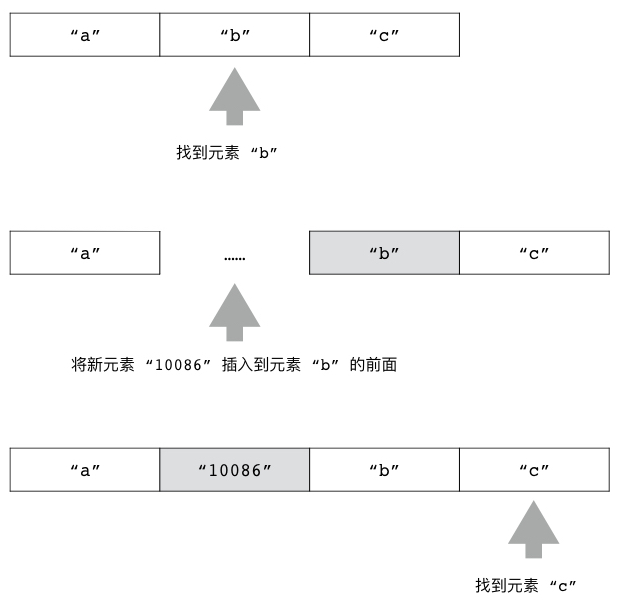

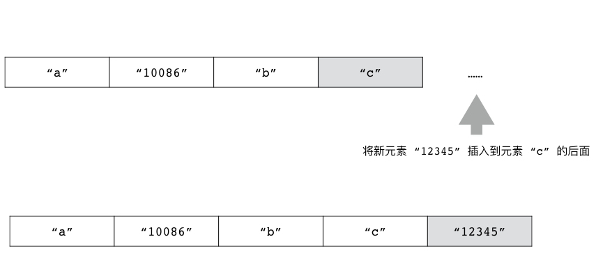

处理不存在的元素
^^^^^^^^^^^^^^^^^^^^^^^^^^

为了执行插入操作，
``LINSERT`` 命令要求用户给定的目标元素必须已经存在于列表当中；
相反地，
如果用户给定的目标元素并不存在，
那么 ``LINSERT`` 命令将返回 ``-1`` 表示插入失败：

::

    redis> LINSERT lst BEFORE "not-exists-element" "new element"
    (integer) -1

在插入操作执行失败的情况下，
列表包含的元素将不会发生任何变化。

其他信息
^^^^^^^^^^^^^^^^

+---------------+-----------------------------------------------+
| 属性          | 值                                            |
+===============+===============================================+
| 复杂度        | O(N) ，其中 N 为给定列表的长度。              |
+---------------+-----------------------------------------------+
| 版本要求      | ``LINSERT`` 命令从 Redis 2.2.0 版本开始可用。 |
+---------------+-----------------------------------------------+

LTRIM：修剪列表
--------------------------------

``LTRIM`` 命令接受一个列表和一个索引范围作为参数，
它会移除列表中位于给定索引范围之外的所有元素，
只保留给定范围之内的元素：

::

    LTRIM list start end

``LTRIM`` 命令在移除操作执行完毕之后将返回 ``OK`` 作为结果。

比如对于以下这个 ``alphabets`` 列表来说：

::

    redis> RPUSH alphabets "a" "b" "c" "d" "e" "f" "g" "h" "i" "j" "k"
    (integer) 11

执行以下命令可以让列表只保留索引 ``0`` 到索引 ``6`` 范围内的七个元素：

::

    redis> LTRIM alphabets 0 6
    OK

    redis> LRANGE alphabets 0 -1
    1) "a"
    2) "b"
    3) "c"
    4) "d"
    5) "e"
    6) "f"
    7) "g"

在此之后，
我们可以继续执行以下命令，
让列表只保留索引 ``3`` 到索引 ``5`` 范围内的三个元素：

::

    redis> LTRIM alphabets 3 5
    OK

    redis> LRANGE alphabets 0 -1
    1) "d"
    2) "e"
    3) "f"

图 4-22 展示了以上两个 ``LTRIM`` 命令对 ``alphabets`` 列表进行修剪的整个过程。

----

图 4-22 ``LTRIM`` 命令的执行过程

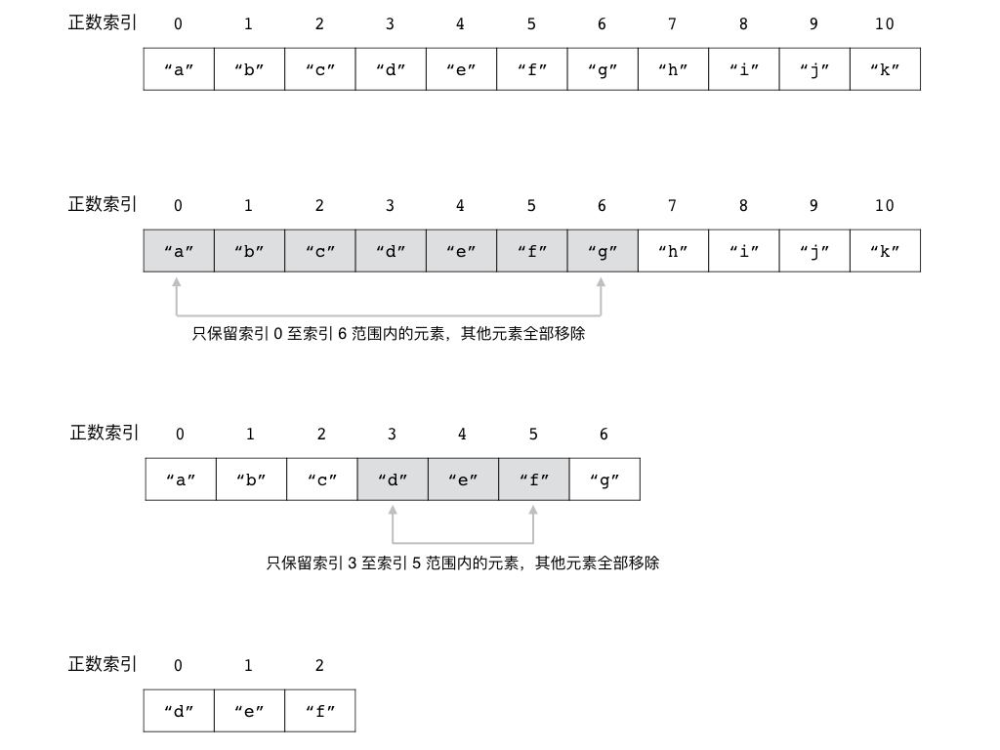

处理负数索引
^^^^^^^^^^^^^^^^^^^^^^

跟 ``LRANGE`` 命令一样，
``LTRIM`` 命令不仅可以接受正数索引，
还可以接受负数索引。

以下代码展示了如何通过给定负数索引，
让 ``LTRIM`` 命令只保留列表的最后五个元素：

::

    redis> RPUSH numbers 0 1 2 3 4 5 6 7 8 9
    (integer) 10

    redis> LTRIM numbers -5 -1
    OK

    redis> LRANGE numbers 0 -1
    1) "5"
    2) "6"
    3) "7"
    4) "8"
    5) "9"

其他信息
^^^^^^^^^^^^^^^^^^^

+---------------+-----------------------------------------------+
| 属性          | 值                                            |
+===============+===============================================+
| 复杂度        | O(N) ，其中 N 为给定列表的长度。              |
+---------------+-----------------------------------------------+
| 版本要求      | ``LTRIM`` 命令从 Redis 1.0.0 版本开始可用。   |
+---------------+-----------------------------------------------+

LREM：从列表中移除指定元素
---------------------------------

用户可以通过 ``LREM`` 命令移除列表中的指定元素：

::

    LREM list count element

``count`` 参数的值决定了 ``LREM`` 命令移除元素的方式：

- 如果 ``count`` 参数的值等于 ``0`` ，
  那么 ``LREM`` 命令将移除列表中包含的所有指定元素；

- 如果 ``count`` 参数的值大于 ``0`` ，
  那么 ``LREM`` 命令将从列表的左端开始向右进行检查，
  并移除最先发现的 ``count`` 个指定元素；

- 如果 ``count`` 参数的值小于 ``0`` ，
  那么 ``LREM`` 命令将从列表的右端开始向左进行检查，
  并移除最先发现的 ``abs(count)`` 个指定元素
  （\ ``abs(count)`` 即是 ``count`` 的绝对值）；

``LREM`` 命令在执行完毕之后将返回被移除的元素数量作为返回值。

举个例子，
对于以下三个包含相同元素的列表来说：

::

    redis> RPUSH sample1 "a" "b" "b" "a" "c" "c" "a"
    (integer) 7

    redis> RPUSH sample2 "a" "b" "b" "a" "c" "c" "a"
    (integer) 7

    redis> RPUSH sample3 "a" "b" "b" "a" "c" "c" "a"
    (integer) 7

执行以下命令将移除 ``sample1`` 列表包含的所有 ``"a"`` 元素：

::

    redis> LREM sample1 0 "a"
    (integer) 3  -- 移除了三个 "a" 元素

    redis> LRANGE sample1 0 -1
    1) "b"  -- 列表里面已经不再包含 "a" 元素
    2) "b"
    3) "c"
    4) "c"

而执行以下命令将移除 ``sample2`` 列表最靠近列表左端的两个 ``"a"`` 元素：

::

    redis> LREM sample2 2 "a"
    (integer) 2  -- 移除了两个 "a" 元素

    redis> LRANGE sample2 0 -1
    1) "b"
    2) "b"
    3) "c"
    4) "c"
    5) "a"

因为上面的 ``LREM`` 命令只要求移除最先发现的两个 ``"a"`` 元素，
所以位于列表最右端的 ``"a"`` 元素并没有被移除，
图 4-23 展示了这个 ``LREM`` 命令的执行过程。

----

图 4-23 从 ``sample2`` 列表中移除最靠近列表左端的两个 ``"a"`` 元素

.. image:: image/list/IMAGE_REMOVE_LEFT.jpeg

----

最后，
执行以下命令将移除 ``sample3`` 列表最靠近列表右端的两个 ``"a"`` 元素：

::

    redis> LREM sample3 -2 "a"
    (integer) 2  -- 移除了两个 "a" 元素

    redis> LRANGE sample3 0 -1
    1) "a"
    2) "b"
    3) "b"
    4) "c"
    5) "c"

因为上面的 ``LREM`` 调用只要求移除最先发现的两个 ``"a"`` 元素，
所以位于列表最左端的 ``"a"`` 元素并没有被移除，
图 4-24 展示了这个 ``LREM`` 调用的执行过程。

----

图 4-24 从 ``sample3`` 列表里面移除最靠近列表右端的两个 ``"a"`` 元素

.. image:: image/list/IMAGE_REMOVE_RIGHT.jpeg

----

其他信息
^^^^^^^^^^^^^^^^^^^

+---------------+-------------------------------------------+
| 属性          | 值                                        |
+===============+===========================================+
| 复杂度        | O(N) ，其中 N 为给定列表的长度。          |
+---------------+-------------------------------------------+
| 版本要求      | ``LREM`` 命令从 Redis 1.0.0 版本开始可用。|
+---------------+-------------------------------------------+

示例：待办事项列表
--------------------------

现在很多人都会使用待办事项软件（也就是通常说的TODO软件）去管理他们的待办事项，
这些软件通常会提供一些列表，
用户可以将他们要做的事情记录在待办事项列表里面，
并将已经完成的事项放入到已完成事项列表里面。
比如图 4-25 就展示了一个使用待办事项软件记录日常生活事项的例子。

----

图 4-25 使用待办事项软件记录日常生活事项

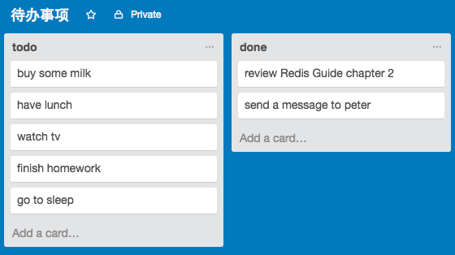

----

代码清单 4-3 展示了一个使用列表实现的待办事项程序，
这个程序的核心概念是使用两个列表来分别记录待办事项和已完成事项：

- 当用户添加一个新的待办事项时，
  程序就把这个事项放入到待办事项列表中。

- 当用户完成待办事项列表中的某个事项时，
  程序就把这个事项从待办事项列表中移除，
  并将它放入到已完成事项列表中。

----

代码清单 4-3 代码事项程序：\ ``/list/todo_list.py``

.. literalinclude:: code/list/todo_list.py

----

``done()`` 方法是 ``TodoList`` 程序的核心，
它首先会使用 ``LREM`` 命令从代办事项列表中移除指定的事项，
然后再将该事项添加到已完成事项列表中，
使得该事项可以在代办事项列表中消失，
转而出现在已完成列表中。

作为例子，
我们可以通过执行以下代码，
创建出一个 TODO 列表对象：

::

    >>> from redis import Redis
    >>> from todo_list import TodoList
    >>> client = Redis(decode_responses=True)
    >>> todo = TodoList(client, "peter's todo")

然后通过执行以下代码，
往 TODO 列表里面加入待完成事项：

::

    >>> todo.add("go to sleep")
    >>> todo.add("finish homework")
    >>> todo.add("watch tv")
    >>> todo.add("have lunch")
    >>> todo.add("buy some milk")
    >>> todo.show_todo_list()
    ['buy some milk', 'have lunch', 'watch tv', 'finish homework', 'go to sleep']

当我们完成某件事情之后，
我们可以把它从待完成事项列表移动到已完成事项列表：

::

    >>> todo.done("buy some milk")
    >>> todo.show_todo_list()
    ['have lunch', 'watch tv', 'finish homework', 'go to sleep']
    >>> todo.show_done_list()
    ['buy some milk']

最后，
如果我们不再需要去做某件事情，
那么可以把它从待完成列表里面移除：

::

    >>> todo.remove("watch tv")
    >>> todo.show_todo_list()
    ['have lunch', 'finish homework', 'go to sleep']

..
    示例：定长队列
    ------------------------

    在构建各种队列实现的时候，
    我们可能会需要让队列具有定长特性，
    也即是，
    通过一些机制来保证队列的长度不会超过给定的最大值。
    要做到这一点，
    有两种方法可以选择：

    1. 在队列推入新元素之后，
       对队列的长度进行检查，
       并在列表长度超过最大长度时，
       对列表进行修剪。

    2. 在队列推入新元素之前，
       对列表的长度进行检查：
       如果列表的长度尚未达到最大长度，
       那么推入新元素；
       与此相反，
       如果列表的长度已经到达最大长度，
       那么拒绝推入新元素。

    代码清单 CODE-FIXED-QUEUE 展示了一个使用第一种方法实现的定长队列，
    这个定长队列实现在将新元素推入到队列之后，
    会调用 ``LTRIM`` 命令对列表进行修剪，
    移除那些超出长度限制的元素，
    并根据列表的长度是否发生了变化来判断推入操作是否执行成功。

    ----

    代码清单 CODE-FIXED-QUEUE 使用列表实现的定长队列

    .. literalinclude:: code/list/fixed_length_queue.py

    ----

    以下代码简单地展示了这个定长队列的使用方法：

    ::

        >>> from redis import Redis
        >>> from fixed_length_queue import FixedLengthQueue
        >>> client = Redis(decode_responses=True)
        >>> queue = FixedLengthQueue(client, "fixed_length_message_queue")
        >>> queue.set_max_length(3)  # 这个队列最多只能储存三条消息
        >>> queue.enqueue("job001")  # 向队列推入三条消息，全部成功推入
        True
        >>> queue.enqueue("job002")
        True
        >>> queue.enqueue("job003")
        True
        >>> queue.enqueue("job004")  # 尝试向队列推入第四条消息，但是失败
        False
        >>> queue.len()  # 队列的长度为 3
        3
        >>> for i in range(queue.len()):  # 打印队列包含的消息
        ...   print(queue.dequeue())
        ... 
        job001
        job002
        job003

    定长队列不仅是一种数据结构，
    它还可以作为其中一种特性出现在其他消息队列里面，
    本章介绍的其他队列同样可以使用本节介绍的方法来为队列添加定长特性。

    示例：稠密图
    --------------------------

    TODO 把 map[0] 储存到一个列表， map[1] 储存到另一个列表，诸如此类。

    ----

    代码清单 CODE-DENSITY-MAP 使用列表实现的稠密图

    .. literalinclude:: code/list/density_map.py

BLPOP：阻塞式左端弹出操作
--------------------------------

``BLPOP`` 命令是带有阻塞功能的左端弹出操作，
它接受任意多个列表以及一个秒级精度的超时时限作为参数：

::

    BLPOP list [list ...] timeout

``BLPOP`` 命令会按照从左到右的顺序依次检查用户给定的列表，
并对最先遇到的非空列表执行左端元素弹出操作。
如果 ``BLPOP`` 命令在检查了用户给定的所有列表之后都没有发现可以执行弹出操作的非空列表，
那么它将阻塞执行该命令的客户端并开始等待，
直到某个给定列表变为非空，
又或者等待时间超出给定时限为止。

当 ``BLPOP`` 命令成功对某个非空列表执行了弹出操作之后，
它将向用户返回一个包含两个元素的数组：
数组的第一个元素记录了执行弹出操作的列表，
也即是被弹出元素的来源列表；
而数组的第二个元素则是被弹出元素本身。

比如在以下这个 ``BLPOP`` 命令执行示例里面，
被弹出的元素 ``"a"`` 就来源于列表 ``alphabets`` ：

::

    redis> BLPOP alphabets 5  -- 尝试弹出 alphabets 列表的最左端元素，最多阻塞 5 秒
    1) "alphabets"            -- 被弹出元素的来源列表
    2) "a"                    -- 被弹出元素

如果用户使用的是 ``redis-cli`` 客户端，
并且在执行 ``BLPOP`` 命令的过程中曾经被阻塞过，
那么客户端还会将被阻塞的时长也打印出来：

::

    redis> BLPOP message-queue 5
    1) "message-queue"
    2) "hello world!"
    (1.60s)    -- 客户端执行这个命令时被阻塞了 1.6 秒

注意，
这里展示的阻塞时长只是 ``redis-cli`` 客户端为了方便用户而添加的额外信息，
``BLPOP`` 命令返回的结果本身并不包含这一信息。

解除阻塞状态
^^^^^^^^^^^^^^^^^^^^

正如前面所说，
当 ``BLPOP`` 命令发现用户给定的所有列表都为空时，
它就会让执行命令的客户端进入阻塞状态。
如果在客户端被阻塞的过程中，
有另一个客户端向导致阻塞的列表推入了新的元素，
那么该列表就会变为非空，
而被阻塞的客户端也会随着 ``BLPOP`` 命令成功弹出列表元素而重新回到非阻塞状态。

作为例子，
表 4-1 展示了一个客户端从被阻塞到解除阻塞的整个过程。

----

表 4-1 客户端 A 从被阻塞到解除阻塞的整个过程

+-------+-------------------------------------------------------+-----------------------------------------------+
| 时间  | 客户端 A                                              | 客户端 B                                      |
+=======+=======================================================+===============================================+
| T1    | 执行 ``BLPOP lst 10`` ，                              |                                               |
|       | 因为 ``lst`` 为空而导致客户端被阻塞。                 |                                               |
+-------+-------------------------------------------------------+-----------------------------------------------+
| T2    |                                                       | 执行 ``RPUSH lst "hello"`` 命令，             |
|       |                                                       | 将 ``"hello"`` 元素推入到列表 ``lst`` 中。    |
+-------+-------------------------------------------------------+-----------------------------------------------+
| T3    | 服务器检测到导致这个客户端阻塞的                      |                                               |
|       | ``lst`` 列表已经非空，                                |                                               |
|       | 于是从列表中弹出 ``"hello"`` 元素并将其返回给客户端。 |                                               |
+-------+-------------------------------------------------------+-----------------------------------------------+
| T4    | 接收到 ``"hello"`` 元素的客户端重新回到非阻塞状态。   |                                               |
+-------+-------------------------------------------------------+-----------------------------------------------+

----

如果在同一时间，
有多个客户端因为同一个列表而被阻塞，
那么当导致阻塞的列表变为非空时，
服务器将按照“先阻塞先服务”的规则，
依次为被阻塞的各个客户端弹出列表元素。

比如表 4-2 就展示了一个服务器按照先阻塞先服务规则处理被阻塞客户端的例子：
在这个例子中，
A、B、C 三个客户端先后执行了 ``BLPOP lst 10`` 命令，
并且都因为 ``lst`` 列表为空而被阻塞，
如果在这些客户端被阻塞期间，
客户端 D 执行了 ``RPUSH lst "hello" "world" "again"`` 命令，
那么服务器首先会处理客户端 A 的 ``BLPOP`` 命令，
并将被弹出的 ``"hello"`` 元素返回给它；
接着处理客户端 B 的 ``BLPOP`` 命令，
并将被弹出的 ``"world"`` 元素返回给它；
最后处理客户端 C 的 ``BLPOP`` 命令，
并将被弹出的 ``"again"`` 元素返回给它。

----

表 4-2 先阻塞先服务器处理示例

+-------+---------------------------+---------------------------+---------------------------+-----------------------------------------------+
| 时间  | 客户端 A                  | 客户端 B                  | 客户端 C                  | 客户端 D                                      |
+=======+===========================+===========================+===========================+===============================================+
| T1    | 执行 ``BLPOP lst 10``     |                           |                           |                                               |
+-------+---------------------------+---------------------------+---------------------------+-----------------------------------------------+
| T2    |                           | 执行 ``BLPOP lst 10``     |                           |                                               |
+-------+---------------------------+---------------------------+---------------------------+-----------------------------------------------+
| T3    |                           |                           | 执行 ``BLPOP lst 10``     |                                               |
+-------+---------------------------+---------------------------+---------------------------+-----------------------------------------------+
| T4    |                           |                           |                           | 执行 ``RPUSH lst "hello" "world" "again"``    |
+-------+---------------------------+---------------------------+---------------------------+-----------------------------------------------+
| T5    | 从 ``lst`` 列表弹出       |                           |                           |                                               |
|       | ``"hello"``               |                           |                           |                                               |
|       | 元素并解除阻塞状态。      |                           |                           |                                               |
+-------+---------------------------+---------------------------+---------------------------+-----------------------------------------------+
| T6    |                           | 从 ``lst`` 列表弹出       |                           |                                               |
|       |                           | ``"world"``               |                           |                                               |
|       |                           | 元素并解除阻塞状态。      |                           |                                               |
+-------+---------------------------+---------------------------+---------------------------+-----------------------------------------------+
| T7    |                           |                           | 从 ``lst`` 列表弹出       |                                               |
|       |                           |                           | ``"again"``               |                                               |
|       |                           |                           | 元素并解除阻塞状态。      |                                               |
+-------+---------------------------+---------------------------+---------------------------+-----------------------------------------------+

----

最后，
如果被推入到列表的元素数量少于被阻塞的客户端数量，
那么先被阻塞的客户端将会先解除阻塞，
而未能解除阻塞的客户端则需要继续等待下次推入操作。

比如说，
如果有五个客户端因为列表为空而被阻塞，
但是推入到列表的元素只有三个，
那么最先被阻塞的三个客户端将会解除阻塞状态，
而剩下的两个客户端则会继续阻塞。

处理空列表
^^^^^^^^^^^^^^^^^^^^

如果用户向 ``BLPOP`` 命令传入的所有列表都是空列表，
并且这些列表在给定的时限之内一直没有变成非空列表，
那么 ``BLPOP`` 命令将在给定时限到达之后向客户端返回一个空值，
表示没有任何元素被弹出：

::

    redis> BLPOP empty-list 5
    (nil)
    (5.04s)

列表名的作用
^^^^^^^^^^^^^^^^^^^^

``BLPOP`` 命令之所以会返回被弹出元素的来源列表，
是为了让用户在传入多个列表的情况下，
知道被弹出的元素来源于哪个列表。

比如在以下这个示例里面，
通过 ``BLPOP`` 命令的回复，
我们可以知道被弹出的元素来自于列表 ``queue2`` ，
而不是 ``queue1`` 或者 ``queue3`` ：

::

    redis> BLPOP queue1 queue2 queue3 5
    1) "queue2"
    2) "hello world!"

阻塞效果的范围
^^^^^^^^^^^^^^^^^^^^^^^

``BLPOP`` 命令的阻塞效果只对执行这个命令的客户端有效，
其他客户端以及 Redis 服务器本身并不会因为这个命令而被阻塞。

其他信息
^^^^^^^^^^^^^^^^^^^

+---------------+-----------------------------------------------+
| 属性          | 值                                            |
+===============+===============================================+
| 复杂度        | O(N) ，其中 N 为用户给定的列表数量。          |
+---------------+-----------------------------------------------+
| 版本要求      | ``BLPOP`` 命令从 Redis 2.0.0 版本开始可用。   |
+---------------+-----------------------------------------------+

BRPOP：阻塞式右端弹出操作
--------------------------------

``BRPOP`` 命令是带有阻塞功能的右端弹出操作，
除了弹出的方向不同之外，
它的其他方面都和 ``BLPOP`` 命令一样：

::

    BRPOP list [list ...] timeout

作为例子，
以下代码展示了如何使用 ``BRPOP`` 命令去尝试弹出给定列表的最右端元素：

::

    redis> BRPOP queue1 queue2 queue3 10
    1) "queue2"    -- 被弹出元素的来源列表
    2) "bye bye"   -- 被弹出元素

其他信息
^^^^^^^^^^^^^^^^

+-----------+-----------------------------------------------+
| 属性      | 值                                            |
+===========+===============================================+
| 复杂度    | O(N) ，其中 N 为用户给定的列表数量。          |
+-----------+-----------------------------------------------+
| 版本要求  | ``BRPOP`` 命令从 Redis 2.0.0 版本开始可用。   |
+-----------+-----------------------------------------------+

BRPOPLPUSH：阻塞式弹出并推入操作
-----------------------------------------

``BRPOPLPUSH`` 命令是 ``RPOPLPUSH`` 命令的阻塞版本，
它接受一个源列表、一个目标列表以及一个秒级精度的超时时限作为参数：

::

    BRPOPLPUSH source target timeout

根据源列表是否为空，
``BRPOPLPUSH`` 命令会产生以下两种行为：

- 如果源列表非空，
  那么 ``BRPOPLPUSH`` 命令的行为就和 ``RPOPLPUSH`` 命令的行为一样：
  ``BRPOPLPUSH`` 命令会弹出位于源列表最右端的元素，
  并将该元素推入到目标列表的左端，
  最后向客户端返回被推入的元素。

- 如果源列表为空，
  那么 ``BRPOPLPUSH`` 命令将阻塞执行该命令的客户端，
  然后在给定的时限内等待可弹出的元素出现，
  又或者等待时间超过给定时限为止。

举个例子，
假设现在有 ``list3`` 、 ``list4`` 两个列表如下：

::

    client-1> LRANGE list3 0 -1
    1) "hello"

    client-1> LRANGE list4 0 -1
    1) "a"
    2) "b"
    3) "c"

如果我们以这两个列表作为输入执行 ``BRPOPLPUSH`` 命令，
由于源列表 ``list3`` 非空，
所以 ``BRPOPLPUSH`` 命令将不阻塞直接执行，
就像 ``RPOPLPUSH`` 命令一样：

::

    client-1> BRPOPLPUSH list3 list4 10
    "hello"

    client-1> LRANGE list3 0 -1
    (empty list or set)

    client-1> LRANGE list4 0 -1
    1) "hello"
    2) "a"
    3) "b"
    4) "c"

现在，
由于 ``list3`` 为空，
如果我们再次执行相同的 ``BRPOPLPUSH`` 命令，
那么客户端 ``client-1`` 将被阻塞，
直到我们从另一个客户端 ``client-2`` 向 ``list3`` 推入新元素为止：

::

    client-1> BRPOPLPUSH list3 list4 10
    "world"
    (1.42s)  -- 被阻塞了 1.42 秒

    client-1> LRANGE list3 0 -1
    (empty list or set)

    client-1> LRANGE list4 0 -1
    1) "world"
    2) "hello"
    3) "a"
    4) "b"
    5) "c"

::

    client-2> RPUSH list3 "world"
    (integer) 1

表 4-3 展示了客户端从被阻塞到解除阻塞的整个过程。

----

表 4-3 阻塞 ``BRPOPLPUSH`` 命令的执行过程

+-----------+---------------------------------------------------+---------------------------------------------------------------+
| 时间      | 客户端 ``client-1``                               | 客户端 ``client-2``                                           |
+===========+===================================================+===============================================================+
| T1        | 尝试执行 ``BRPOPLPUSH list3 list4 10`` 并被阻塞。 |                                                               |
+-----------+---------------------------------------------------+---------------------------------------------------------------+
| T2        |                                                   | 执行 ``RPUSH list3 "world"`` ，向列表 ``list3`` 推入新元素。  |
+-----------+---------------------------------------------------+---------------------------------------------------------------+
| T3        | 服务器执行 ``BRPOPLPUSH`` 命令，                  |                                                               |
|           | 并将元素 ``"world"`` 返回给客户端。               |                                                               |
+-----------+---------------------------------------------------+---------------------------------------------------------------+

处理源列表为空的情况
^^^^^^^^^^^^^^^^^^^^^^^^^^^^^

如果源列表在用户给定的时限内一直没有元素可供弹出，
那么 ``BRPOPLPUSH`` 命令将向客户端返回一个空值，
以此来表示此次操作没有弹出和推入任何元素：

::

    redis> BRPOPLPUSH empty-list another-list 5
    (nil)
    (5.05s)  -- 客户端被阻塞了 5.05 秒

跟 ``BLPOP`` 命令和 ``BRPOP`` 命令一样，
``redis-cli`` 客户端也会显示 ``BRPOPLPUSH`` 命令的阻塞时长。

其他信息
^^^^^^^^^^^^^^^^

+-----------+---------------------------------------------------+
| 属性      | 值                                                |
+===========+===================================================+
| 复杂度    | O(1)                                              |
+-----------+---------------------------------------------------+
| 版本要求  | ``BRPOPLPUSH`` 命令从 Redis 2.2.0 版本开始可用。  |
+-----------+---------------------------------------------------+

示例：带有阻塞功能的消息队列
------------------------------------

在构建应用程序的时候，
我们有时候会遇到一些非常耗时的操作，
比如发送邮件、将一条新微博同步给上百万个用户、对硬盘进行大量读写、执行庞大的计算等等。
因为这些操作是如此耗时，
所以如果我们直接在响应用户请求的过程中执行它们的话，
那么用户就需要等待非常长时间。

比如说，
为了验证用户身份的有效性，
有些网站在注册新用户的时候，
会向用户给定的邮件地址发送一封激活邮件，
用户只有在点击了验证邮件里面的激活链接之后，
新注册的帐号才能够正常使用。

下面这段伪代码展示了一个带有邮件验证功能的帐号注册函数，
这个函数不仅会为用户输入的用户名和密码创建新帐号，
还会向用户给定的邮件地址发送一封激活：

::

    def register(username, password, email):
        # 创建新帐号
        create_new_account(username, password)
        # 发送激活邮件
        send_validate_email(email)
        # 向用户返回注册结果
        ui_print("帐号注册成功，请访问你的邮箱并激活帐号。")

因为邮件发送操作需要进行复杂的网络信息交换，
所以它并不是一个快速的操作，
如果我们直接在 ``send_valid_email()`` 函数里面执行邮件发送操作的话，
那么用户可能就需要等待一段较长的时间才能看到 ``ui_print()`` 函数打印出的反馈信息。

为了解决这个问题，
在执行 ``send_validate_email()`` 函数的时候，
我们可以不立即执行邮件发送操作，
而是将邮件发送任务放入到一个队列里面，
然后由后台的线程负责实际执行。
这样的话，
程序只需要执行一个入队操作，
然后就可以直接向用户反馈注册结果了，
这比实际地发送邮件之后再向用户反馈结果要快得多。

代码清单 4-4 展示了一个使用 Redis 实现的消息队列，
它使用 ``RPUSH`` 命令将消息推入队列，
并使用 ``BLPOP`` 命令从队列里面取出待处理的消息。

----

代码清单 4-4 使用列表实现的消息队列：\ ``/list/message_queue.py``

.. literalinclude:: code/list/message_queue.py

----

为了使用这个消息队列，
我们通常需要用到两个客户端：

- 一个客户端作为消息的发送者（sender），
  它需要将待处理的消息推入到队列里面；

- 而另一个客户端则作为消息的接收者（receiver）和消费者（consumer），
  它负责从队列里面取出消息，
  并根据消息内容进行相应的处理工作。

下面的这段代码展示了一个简单的消息接收者，
在没有消息的时候， 
这个程序将阻塞在 ``mq.get_message()`` 调用上面；
当有消息（邮件地址）出现时，
程序就会打印出该消息并发送邮件：

::

    >>> from redis import Redis
    >>> from message_queue import MessageQueue
    >>> client = Redis(decode_responses=True)
    >>> mq = MessageQueue(client, 'validate user email queue')
    >>> while True:
    ...   email_address = mq.get_message()  # 阻塞直到消息出现
    ...   send_email(email_address)         # 打印出邮件地址并发送邮件
    ...
    peter@exampl.com
    jack@spam.com
    tom@blahblah.com

而以下代码则展示了消息发送者是如何将消息推入到队列里面的：

::

    >>> from redis import Redis
    >>> from message_queue import MessageQueue
    >>> client = Redis(decode_responses=True)
    >>> mq = MessageQueue(client, 'validate user email queue')
    >>> mq.add_message("peter@exampl.com")
    >>> mq.add_message("jack@spam.com")
    >>> mq.add_message("tom@blahblah.com")

阻塞弹出操作的应用
^^^^^^^^^^^^^^^^^^^^^^^^^^^^

本节展示的消息队列之所以使用 ``BLPOP`` 命令而不是 ``LPOP`` 命令来实现出队操作，
是因为阻塞弹出操作可以让消息接收者在队列为空的时候自动阻塞，
而不必手动进行休眠，
从而使得消息处理程序的编写变得更为简单直接，
并且还可以有效地节约系统资源。

作为对比，
以下代码展示了在使用 ``LPOP`` 命令实现出队操作的情况下，
如何实现类似上面展示的消息处理程序：

::

    while True:
        # 尝试获取消息，如果没有消息，那么返回 None
        email_address = mq.get_message()
        if email_address is not None:
            # 有消息，发送邮件
            send_email(email_address)
        else:
            # 没有消息可用，休眠一百毫秒之后再试
            sleep(0.1)

因为缺少自动的阻塞操作，
所以这个程序在没有取得消息的情况下，
只能以一百毫秒一次的频率去尝试获取消息，
如果队列为空的时间比较长，
那么这个程序就会发送很多多余的 ``LPOP`` 命令，
并因此浪费很多 CPU 资源和网络资源。

使用消息队列实现实时提醒
^^^^^^^^^^^^^^^^^^^^^^^^^^^^^^

消息队列除了可以在应用程序的内部中使用，
还可以用于实现面向用户的实时提醒系统。

比如说，
如果我们在构建一个社交网站的话，
那么可以使用 JavaScript 脚本，
让客户端以异步的方式调用 ``MessageQueue`` 类的 ``get_message()`` 方法，
然后程序就可以在用户被关注的时候、收到了新回复的时候又或者收到新私信的时候，
通过调用 ``add_message()`` 方法来向用户发送提醒信息。

重点回顾
------------------

- Redis 的列表是一种线性的有序结构， 
  它可以按照元素推入到列表中的顺序来储存元素，
  并且列表中的元素可以出现重复。

- 用户可以使用 ``LPUSH`` 、 ``RPUSH`` 、 ``RPOP`` 、 ``LPOP`` 等多个命令，
  从列表的两端推入或者弹出元素，
  也可以通过 ``LINSERT`` 命令，
  将新元素插入到列表已有元素的前面或后面。

- 用户可以使用 ``LREM`` 命令从列表中移除指定的元素，
  又或者直接使用 ``LTRIM`` 命令对列表进行修剪。

- 当用户传给 ``LRANGE`` 命令的索引范围超出了列表的有效索引范围时，
  ``LRANGE`` 命令将对传入的索引范围进行修正，
  并根据修正后的索引范围来获取列表元素。

- ``BLPOP`` 、 ``BRPOP`` 和 ``BRPOPLPUSH`` 是阻塞版本的弹出和推入命令，
  如果用户给定的所有列表都为空，
  那么执行命令的客户端将被阻塞，
  直到给定的阻塞时限到达又或者某个给定列表非空为止。

