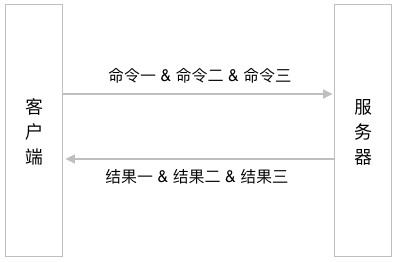

流水线与事务
==================

在前面的内容中，
我们学习了如何使用不同的命令去操作 Redis 提供的各种数据结构，
学习了如何使用数据库命令去对数据库中的各个键进行操作，
以及如何使用自动过期特性的相关命令去为键设置过期时间或者生存时间。

在执行这些命令的时候，
我们总是单独地执行每个命令，
也即是说，
先将一个命令发送到服务器，
等服务器执行完这个命令并将结果返回给客户端之后，
再执行下一个命令，
以此类推，
直到所有命令都执行完毕为止。

这种执行命令的方式虽然可行，
但在性能方面却不是最优的，
并且在执行时可能还会出现一些非常隐蔽的错误。
为了解决这些问题，
本章将会介绍 Redis 的流水线特性以及事务特性，
前者可以有效地提升 Redis 程序的性能，
而后者则可以避免单独执行命令时可能会出现的一些错误。

流水线
---------------

在一般情况下，
用户每执行一个 Redis 命令，
Redis 客户端和 Redis 服务器就需要执行以下步骤：

1. 客户端向服务器发送命令请求。

2. 服务器接收命令请求，
   并执行用户指定的命令调用，
   然后产生相应的命令执行结果。

3. 服务器向客户端返回命令的执行结果。

4. 客户端接收命令的执行结果，
   并向用户进行展示。

跟大多数网络程序一样，
执行 Redis 命令所消耗的大部分时间都用在了发送命令请求和接收命令结果上面：
Redis 服务器处理一个命令请求通常只需要很短的时间，
但客户端将命令请求发送给服务器以及服务器向客户端返回命令结果的过程却需要花费不少时间。
通常情况下，
程序需要执行的 Redis 命令越多，
它需要进行的网络通讯操作也会越多，
程序的执行速度也会因此而变慢。

为了解决这个问题，
我们可以使用 Redis 提供的流水线特性：
这个特性允许客户端把任意多条 Redis 命令请求打包在一起，
然后一次性地将它们全部发送给服务器，
而服务器则会在流水线包含的所有命令请求都处理完毕之后，
一次性地将它们的执行结果全部返回给客户端。

通过使用流水线特性，
我们可以将执行多个命令所需的网络通讯次数从原来的 N 次降低为一次，
这可以大幅度地减少程序在网络通讯方面耗费的时间，
使得程序的执行效率得到显著的提升。

作为例子，
图 13-1 展示了在没有使用流水线的情况下，
执行三个 Redis 命令产生的网络通讯示意图，
而 13-2 则展示了在使用流水线的情况下，
执行相同 Redis 命令产生的网络通讯示意图。
可以看到，
在使用了流水线之后，
程序进行网络通讯的次数从原来的三次降低成了一次。

----

图 13-1 在不使用流水线的情况下执行三个 Redis 命令产生的网络通讯操作

.. image:: image/pipeline-and-transaction/IMAGE_NON_PIPE.png

----

图 13-2 在使用流水线的情况下执行三个 Redis 命令产生的网络通讯操作

----

虽然 Redis 服务器提供了流水线特性，
但这个特性还需要客户端支持才能使用。
幸运的是，
包括 redis-py 在内的绝大部分 Redis 客户端都提供了对流水线特性的支持，
因此 Redis 用户在绝大部分情况下都能够享受到流水线特性带来的好处。

为了在 redis-py 客户端中使用流水线特性，
我们需要用到 ``pipeline()`` 方法，
调用这个方法会返回一个流水线对象，
用户只需要像平时执行 Redis 命令那样，
使用流水线对象调用相应的命令方法，
就可以把想要执行的 Redis 命令放入到流水线里面。

作为例子，
以下代码展示了如何以流水线方式执行 ``SET`` 、 ``INCRBY`` 和 ``SADD`` 命令：

::

    >>> from  redis import Redis
    >>> client = Redis(decode_responses=True)
    >>> pipe = client.pipeline(transaction=False)
    >>> pipe.set("msg", "hello world")
    Pipeline<ConnectionPool<Connection<host=localhost,port=6379,db=0>>>
    >>> pipe.incrby("pv_counter::12345", 100)
    Pipeline<ConnectionPool<Connection<host=localhost,port=6379,db=0>>>
    >>> pipe.sadd("fruits", "apple", "banana", "cherry")
    Pipeline<ConnectionPool<Connection<host=localhost,port=6379,db=0>>>
    >>> pipe.execute()
    [True, 100, 3]

这段代码首先使用 ``pipeline()`` 方法创建了一个流水线对象，
并将这个对象储存到了 ``pipe`` 变量里面
（\ ``pipeline()`` 方法中的 ``transaction=False`` 参数表示不在流水线中使用事务，这个参数的具体意义将在本章后续内容中说明）。
在此之后，
程序通过流水线对象分别调用了 ``set()`` 方法、 ``incrby()`` 方法和 ``sadd()`` 方法，
将这三个方法对应的命令调用放入到了流水线队列里面。
最后，
程序调用流水线对象的 ``execute()`` 方法，
将队列中的三个命令调用打包发送给服务器，
而服务器则会在执行完这些命令之后，
把各个命令的执行结果依次放入到一个列表里面，
然后将这个列表返回给客户端。

图 13-3 展示了以上代码在执行期间，
redis-py 客户端与 Redis 服务器之间的网络通讯情况。

----

图 13-3 使用流水线发送 Redis 命令

.. image:: image/pipeline-and-transaction/IMAGE_PIPE_EXAMPLE.png

----

.. note::

    流水线使用注意事项

    虽然 Redis 服务器并不会限制客户端在流水线里面包含的命令数量，
    但是却会为客户端的输入缓冲区设置默认值为 1GB 的体积上限：
    当客户端发送的数据量超过这一限制时，
    Redis 服务器将强制关闭该客户端。
    因此用户在使用流水线特性时，
    最好不要一下子把大量命令或者一些体积非常庞大的命令放到同一个流水线里面执行，
    以免触碰到 Redis 的这一限制。

    除此之外，
    很多客户端本身也带有隐含的缓冲区大小限制，
    如果你在使用流水线特性的过程中，
    发现某些流水线命令没有被执行，
    又或者流水线返回的结果不完整，
    那么很可能就是你的程序触碰到了客户端内置的缓冲区大小限制。
    在遇到这种情况时，
    请缩减流水线命令的数量及其体积，
    然后再进行尝试。

示例：使用流水线优化随机键创建程序
---------------------------------------------

在《数据库》一章的《示例：数据库取样程序》一节中，
我们曾经展示过代码清单 13-1 所示的程序，
它可以根据用户给定的数量创建多个类型随机的数据库键。

----

代码清单 13-1 原版的随机键创建程序：\ ``/database/create_random_type_keys.py``

.. literalinclude:: code/database/create_random_type_keys.py

----

通过分析代码可知，
这个程序每创建一个键，
redis-py 客户端就需要与 Redis 服务器进行一次网络通讯：
考虑到这个程序执行的都是一些非常简单的命令，
每次网络通讯只执行一个命令的做法无疑是非常低效的。
为了解决这个问题，
我们可以使用流水线把程序生成的所有命令都包裹起来，
这样的话，
创建多个随机键所需的网络通讯次数就会从原来的 N 次降低为 1 次。
代码清单 13-2 展示了修改之后的流水线版本随机键创建程序。

----

代码清单 13-2 流水线版本的随机键创建程序：\ ``/pipeline-and-transaction/create_random_type_keys.py``

.. literalinclude:: code/pipeline-and-transaction/create_random_type_keys.py

----

即使只在本地网络里面进行测试，
新版的随机键创建程序也有 5 倍的性能提升。
当客户端与服务器处于不同的网络之中，
特别是它们之间的连接速度较慢时，
流水线版本的性能提升还会更大。

事务
---------------

虽然 Redis 的 ``LPUSH`` 命令和 ``RPUSH`` 命令允许用户一次向列表推入多个元素，
但是列表的弹出命令 ``LPOP`` 和 ``RPOP`` 每次却只能弹出一个元素：

::

    redis> RPUSH lst 1 2 3 4 5 6    -- 一次推入五个元素
    (integer) 6

    redis> LPOP lst    -- 弹出一个元素
    "1"

    redis> LPOP lst
    "2"

    redis> LPOP lst
    "3"

因为 Redis 并没有提供能够一次弹出多个列表元素的命令，
所以为了方便地执行这一任务，
用户可能会写出代码清单 13-3 所示的代码。

----

代码清单 13-3 不安全的 ``mlpop()`` 实现：\ ``/pipeline-and-transaction/unsafe_mlpop.py``

.. literalinclude:: code/pipeline-and-transaction/unsafe_mlpop.py

----

``mlpop()`` 函数通过将多条 ``LPOP`` 命令发送至服务器来达到弹出多个元素的目的。
遗憾的是，
这个函数并不能保证它发送的所有 ``LPOP`` 命令都会被服务器执行：
如果服务器在执行多个 ``LPOP`` 命令的过程中下线了，
那么 ``mlpop()`` 发送的这些 ``LPOP`` 命令将只有一部分会被执行。

举个例子，
如果我们执行调用 ``mlpop(client, "lst", 3)`` ，
尝试从 ``"lst"`` 列表中弹出三个元素，
那么 ``mlpop()`` 将向服务器连续发送三个 ``LPOP`` 命令，
但如果服务器在顺利执行前两个 ``LPOP`` 命令之后因为故障下线了，
那么 ``"lst"`` 列表将只有两个元素会被弹出。

需要注意的是，
即使我们使用上一节介绍的流水线特性，
把多条 ``LPOP`` 命令打包在一起发送，
也不能保证所有命令都会被服务器执行：
这是因为流水线只能保证多条命令会一起被发送至服务器，
但它并不保证这些命令都会被服务器执行。

为了实现一个正确且安全的 ``mlpop()`` 函数，
我们需要一种能够让服务器将多个命令打包起来一并执行的技术，
而这正是本节将要介绍的事务特性：

- 事务可以将多个命令打包成一个命令来执行，
  当事务成功执行时，
  事务中包含的所有命令都会被执行；

- 相反地，
  如果事务没有成功执行，
  那么它包含的所有命令都不会被执行。

通过使用事务，
用户可以保证自己想要执行的多个命令要么全部都被执行，
要么就一个都不执行。
以 ``mlpop()`` 函数为例，
通过使用事务，
我们可以保证被调用的多个 ``LPOP`` 命令要么全部都执行，
要么就一个都不执行，
从而杜绝了只有其中一部分 ``LPOP`` 命令被执行的情况出现。

本节接下来的内容将会介绍 Redis 事务特性的使用方法以及相关事项，
至于事务版本 ``mlpop()`` 函数的具体实现则会留到下一节再行介绍。

MULTI：开启事务
^^^^^^^^^^^^^^^^^^^^^^^^^^^^^^^^^^^^^^^^^

用户可以通过执行 ``MULTI`` 命令来开启一个新的事务，
这个命令在成功执行之后将返回 ``OK`` ：

::

    MULTI

在一般情况下，
除了少数阻塞命令之外，
用户键入到客户端里面的数据操作命令总是会立即执行：

::

    redis> SET title "Hand in Hand"
    OK

    redis> SADD fruits "apple" "banana" "cherry"
    (integer) 3

    redis> RPUSH numbers 123 456 789
    (integer) 3

但是当一个客户端执行 ``MULTI`` 命令之后，
它就进入了事务模式，
这时用户键入的所有数据操作命令都不会立即执行，
而是会按顺序被放入到一个事务队列里面，
等待事务执行时再统一执行。

比如说，
以下代码就展示了在 ``MULTI`` 命令执行之后，
将一个 ``SET`` 命令、一个 ``SADD`` 命令和一个 ``RPUSH`` 命令放入到事务队列里面的例子：

::

    redis> MULTI
    OK

    redis> SET title "Hand in Hand"
    QUEUED

    redis> SADD fruits "apple" "banana" "cherry"
    QUEUED

    redis> RPUSH numbers 123 456 789
    QUEUED

正如代码所示，
服务器在把客户端发送的命令放入到事务队列之后，
会向客户端返回一个 ``QUEUED`` 作为结果。

其他信息
"""""""""""""""""

+-----------+-----------------------------------------------+
| 属性      | 值                                            |
+===========+===============================================+
| 复杂度    | O(1)                                          |
+-----------+-----------------------------------------------+
| 版本要求  | ``MULTI`` 命令从 Redis 1.2.0 版本开始可用。   |
+-----------+-----------------------------------------------+

EXEC：执行事务
^^^^^^^^^^^^^^^^^^^^^^^^^^^^^^^^^^^^^^^^^

在使用 ``MULTI`` 命令开启事务并将任意多个命令放入到事务队列之后，
用户就可以通过执行 ``EXEC`` 命令来执行事务了：

::

    EXEC

当事务成功执行时，
``EXEC`` 命令将返回一个列表作为结果，
这个列表会按照命令的入队顺序依次包含各个命令的执行结果。

作为例子，
以下代码展示了一个事务从开始到执行的整个过程：

::

    redis> MULTI                       -- 1) 开启事务
    OK

    redis> SET title "Hand in Hand"    -- 2) 命令入队
    QUEUED

    redis> SADD fruits "apple" "banana" "cherry"
    QUEUED

    redis> RPUSH numbers 123 456 789
    QUEUED

    redis> EXEC         -- 3) 执行事务
    1) OK               -- SET 命令的执行结果
    2) (integer) 3      -- SADD 命令的执行结果
    3) (integer) 3      -- RPUSH 命令的执行结果

其他信息
""""""""""""""""

+---------------+-----------------------------------------------+
| 属性          | 值                                            |
+===============+===============================================+
| 复杂度        | 事务包含的所有命令的复杂度之和。              |
+---------------+-----------------------------------------------+
| 版本要求      | ``EXEC`` 命令从 Redis 1.2.0 版本开始可用。    |
+---------------+-----------------------------------------------+

DISCARD：放弃事务
^^^^^^^^^^^^^^^^^^^^^^^^^^^^^^^^^^^^^^^^^

如果用户在开启事务之后，
不想要执行事务而是想要放弃事务，
那么只需要执行以下命令即可：

::

    DISCARD

``DISCARD`` 命令会清空事务队列中已有的所有命令，
并让客户端退出事务模式，
最后返回 ``OK`` 表示事务已被取消。

以下代码展示了一个使用 ``DISCARD`` 命令放弃事务的例子:

::

    redis> MULTI
    OK

    redis> SET page_counter 10086
    QUEUED

    redis> SET download_counter 12345
    QUEUED

    redis> DISCARD
    OK

其他信息
""""""""""""""

+-----------+-----------------------------------------------+
| 属性      | 值                                            |
+===========+===============================================+
| 复杂度    | O(N)，其中 N 为事务队列包含的命令数量。       |
+-----------+-----------------------------------------------+
| 版本要求  | ``DISCARD`` 命令从 Redis 2.0.0 版本开始可用。 |
+-----------+-----------------------------------------------+

事务的安全性
^^^^^^^^^^^^^^^^^^^^^^^^^^^^^^^^^^^^^^^^^

在对数据库的事务特性进行介绍时，
人们一般都会通过数据库对 ACID 性质的支持程度去判断数据库的事务是否安全。

具体来说，
Redis 的事务总是具有 ACID 性质中的 A、C、I 性质：

- 原子性（Atomic）：
  如果事务成功执行，
  那么事务中包含的所有命令都会被执行；
  相反，
  如果事务执行失败，
  那么事务中包含的所有命令都不会被执行。

- 一致性（Consistent）：
  Redis 服务器会对事务及其包含的命令进行检查，
  确保无论事务是否执行成功，
  事务本身都不会对数据库造成破坏。

- 隔离性（Isolate）：
  每个 Redis 客户端都拥有自己独立的事务队列，
  并且每个 Redis 事务都是独立执行的，
  不同事务之间不会互相干扰。

除此之外，
当 Redis 服务器运行在特定的持久化模式之下时，
Redis 的事务也具有 ACID 性质中的 D 性质：

- 耐久性（Durable）：
  当事务执行完毕时，
  它的结果将被储存在硬盘里面，
  即使服务器在此之后停机，
  事务对数据库所做的修改也不会丢失。

稍后的《持久化》一章将对事务的耐久性做补充说明。

事务对服务器的影响
^^^^^^^^^^^^^^^^^^^^^^^^^^^^^^^^^^^^^^^

因为事务在执行时会独占服务器，
所以用户应该避免在事务里面执行过多命令，
更不要将一些需要大量计算的命令放入到事务里面，
以免造成服务器阻塞。

流水线与事务
^^^^^^^^^^^^^^^^^^^^^^

正如前面所言，
流水线与事务虽然在概念上有些相似，
但是在作用上却并不相同：
流水线的作用是将多个命令打包然后一并发送至服务器，
而事务的作用则是将多个命令打包然后让服务器一并执行它们。
    
因为 Redis 的事务在 ``EXEC`` 命令执行之前并不会产生实际效果，
所以很多 Redis 客户端都会使用流水线去包裹事务命令，
并将入队的命令缓存在本地，
等到用户键入 ``EXEC`` 命令之后，
再将所有事务命令通过流水线一并发送至服务器，
这样客户端在执行事务时就可以达到“打包发送，打包执行”的最优效果。

本书使用的 redis-py 客户端就是这样处理事务命令的客户端之一，
当我们使用 ``pipeline()`` 方法开启一个事务时，
redis-py 默认将使用流水线包裹事务队列中的所有命令。

举个例子，
对于以下代码来说：

::

    >>> from redis import Redis
    >>> client = Redis(decode_responses=True)
    >>> transaction = client.pipeline()             # 开启事务
    >>> transaction.set("title", "Hand in Hand")    # 将命令放入事务队列
    Pipeline<ConnectionPool<Connection<host=localhost,port=6379,db=0>>>
    >>> transaction.sadd("fruits", "apple", "banana", "cherry")
    Pipeline<ConnectionPool<Connection<host=localhost,port=6379,db=0>>>
    >>> transaction.rpush("numbers", "123", "456", "789")
    Pipeline<ConnectionPool<Connection<host=localhost,port=6379,db=0>>>
    >>> transaction.execute()                       # 执行事务
    [True, 3, 3L]

在执行 ``transaction.execute()`` 调用时，
redis-py 将通过流水线向服务器发送以下命令：

::

    MULTI
    SET title "Hand in Hand"
    SADD fruits "apple" "banana" "cherry"
    RPUSH numbers "123" "456" "789"
    EXEC

这样的话，
无论事务包含了多少个命令，
redis-py 也只需要与服务器进行一次网络通讯。

另一方面，
如果用户只需要用到流水线特性而不是事务特性，
那么可以在调用 ``pipeline()`` 方法时通过 ``transaction=False`` 参数显式地关闭事务特性，
就像这样：

::

    >>> pipe = client.pipeline(transaction=False)   # 开启流水线
    >>> pipe.set("download_counter", 10086)         # 将命令放入流水线队列
    Pipeline<ConnectionPool<Connection<host=localhost,port=6379,db=0>>>
    >>> pipe.get("download_counter")
    Pipeline<ConnectionPool<Connection<host=localhost,port=6379,db=0>>>
    >>> pipe.hset("user::123::profile", "name", "peter")
    Pipeline<ConnectionPool<Connection<host=localhost,port=6379,db=0>>>
    >>> pipe.execute()                              # 将流水线队列中的命令打包发送至服务器
    [True, '10086', 1L]

在执行 ``pipe.execute()`` 调用时，
redis-py 将通过流水线向服务器发送以下命令：

::

    SET download_counter 10086
    GET download_counter
    HSET user::123::profile "name" "peter"

因为这三个命令并没有被事务包裹，
所以客户端只保证它们会一并被发送至服务器，
至于这些命令在何时会以何种方式执行则由服务器本身决定。

示例：实现 ``MLPOP`` 函数
--------------------------------

在了解了事务的使用方法之后，
现在是时候用它来重新实现一个安全且正确的 ``mlpop`` 函数了：
为此，
我们需要使用事务包裹被执行的所有 ``LPOP`` 命令，
就像代码清单 13-4 所示的那样。

----

代码清单 13-4 事务版本的 ``mlpop()`` 函数：\ ``/pipeline-and-transaction/mlpop.py``

.. literalinclude:: code/pipeline-and-transaction/mlpop.py

----

新版的 ``mlpop()`` 函数通过事务确保自己发送的多个 ``LPOP`` 命令要么全部都执行，
要么就全部都不执行，
以此来避免只有一部分 ``LPOP`` 命令被执行了的情况出现。

举个例子，
如果我们执行函数调用：

::

    mlpop(client, "lst", 3)

那么 ``mlpop()`` 函数将向服务器发送以下命令序列：

::

    MULTI
    LPOP "lst"
    LPOP "lst"
    LPOP "lst"
    EXEC

如果这个事务能够成功执行，
那么它包含的三个 ``LPOP`` 命令也将成功执行；
相反，
如果这个事务执行失败，
那么它包含的三个 ``LPOP`` 命令也不会被执行。

以下是新版 ``mlpop()`` 函数的实际运行示例：

::

    >>> from redis import Redis
    >>> from mlpop import mlpop
    >>> client = Redis(decode_responses=True)
    >>> client.rpush("lst", "123", "456", "789")    # 向列表右端推入三个元素
    3L
    >>> mlpop(client, "lst", 3)                     # 从列表左端弹出三个元素
    ['123', '456', '789']

带有乐观锁的事务
------------------------------

本书在前面的《字符串》一章实现了具有基本获取和释放功能的锁程序，
并在《自动过期》一章为该程序加上了自动释放功能，
但是这两个锁程序都有一个问题，
那就是，
它们的释放操作都是不安全的：

- 无论某个客户端是否是锁的持有者，
  只要它调用 ``release()`` 方法，
  锁就会被释放。

- 在锁被占用期间，
  如果某个不是持有者的客户端错误地调用了 ``release()`` 方法，
  那么锁将在持有者不知情的情况下释放，
  并导致系统中同时存在多个锁。

为了解决这个问题，
我们需要修改锁实现，
给它加上身份验证功能：

- 客户端在尝试获取锁的时候，
  除了需要输入锁的最大使用时限之外，
  还需要输入一个代表身份的标识符，
  当客户端成功取得锁时，
  程序将把这个标识符储存在代表锁的字符串键里面。

- 当客户端调用 ``release()`` 方法时，
  它需要将自己的标识符传给 ``release()`` 方法，
  而 ``release()`` 方法则需要验证客户端传入的标识符与锁键储存的标识符是否相同，
  以此来判断调用 ``release()`` 方法的客户端是否就是锁的持有者，
  从而决定是否释放锁。

根据以上描述，
我们可能会写出代码清单 13-5 所示的代码。

----

代码清单 13-5 不安全的锁实现：\ ``/pipeline-and-transaction/unsafe_identity_lock.py``

.. literalinclude:: code/pipeline-and-transaction/unsafe_identity_lock.py

-----

这个锁实现在绝大部分情况下都能够正常运行，
但它的 ``release()`` 方法包含了一个非常隐蔽的错误：
在程序使用 ``GET`` 命令获取锁键的值以后，
直到程序调用 ``DEL`` 命令删除锁键的这段时间里面，
锁键的值有可能已经发生了变化，
因此程序执行的 ``DEL`` 命令有可能会导致当前持有者的锁被错误地释放。

举个例子，
表 13-1 就展示了一个锁被错误释放的例子：
客户端 A 是锁原来的持有者，
它调用 ``release()`` 方法尝试释放自己的锁，
但是当客户端 A 执行完 ``GET`` 命令并确认自己就是锁的持有者之后，
锁键却因为过期而自动被移除了，
紧接着客户端 B 又通过执行 ``acquire()`` 方法成功取得了锁，
然而客户端 A 并未察觉这一变化，
它以为自己还是锁的持有者，
并调用 ``DEL`` 命令把属于客户端 B 的锁给释放了。

----

表 13-1 一个错误地释放锁的例子

+-------+-----------------------------------+-----------------------------------+-------------------+
| 时间  | 客户端 A                          | 客户端 B                          | 服务器            |
+=======+===================================+===================================+===================+
| 0000  | 调用 ``release()`` 方法           |                                   |                   |
+-------+-----------------------------------+-----------------------------------+-------------------+
| 0001  | 执行 ``GET`` 命令，获取锁键的值   |                                   |                   |
+-------+-----------------------------------+-----------------------------------+-------------------+
| 0002  | 检查锁键的值，确认自己就是持有者  |                                   |                   |
+-------+-----------------------------------+-----------------------------------+-------------------+
| 0003  |                                   |                                   | 移除过期的锁键    |
+-------+-----------------------------------+-----------------------------------+-------------------+
| 0004  |                                   | 执行 ``acquire()`` 方法并取得锁   |                   |
+-------+-----------------------------------+-----------------------------------+-------------------+
| 0005  | 执行 ``DEL`` 命令，删除锁键       | (在不知情的状况下失去了锁）       |                   |
+-------+-----------------------------------+-----------------------------------+-------------------+

----

为了正确地实现 ``release()`` 方法，
我们需要一种机制，
它可以保证如果锁键的值在 ``GET`` 命令执行之后发生了变化，
那么 ``DEL`` 命令将不会被执行。
在 Redis 里面，
这种机制被称为乐观锁。

本节接下来的内容将对 Redis 的乐观锁机制进行介绍，
并在之后给出一个使用乐观锁实现的、正确的、具有身份验证功能的锁。

WATCH：对键进行监视
^^^^^^^^^^^^^^^^^^^^^^^^^^^^^^^^^^^^^^^^^

客户端可以通过执行 ``WATCH`` 命令，
要求服务器对一个或多个数据库键实施监视，
如果在客户端尝试执行事务之前，
这些键的值发生了变化，
那么服务器将拒绝执行客户端发送的事务，
并向它返回一个空值：

::

    WATCH key [key ...]

与此相反，
如果所有被监视的键都没有发生任何变化，
那么服务器将会如常地执行客户端发送的事务。

通过同时使用 ``WATCH`` 命令和 Redis 事务，
我们可以构建出一种针对被监视键的乐观锁机制，
确保事务只会在被监视键没有发生任何变化的情况下执行，
从而保证事务对被监视键的所有修改都是安全、正确和有效的。

以下代码展示了一个因为乐观锁机制而导致事务执行失败的例子：

::

    redis> WATCH user_id_counter
    OK

    redis> GET user_id_counter                      -- 获取当前最新的用户 ID
    "256"

    redis> MULTI
    OK

    redis> SET user::256::email "peter@spamer.com"  -- 尝试使用这个 ID 来储存用户信息
    QUEUED

    redis> SET user::256::password "topsecret"
    QUEUED

    redis> INCR user_id_counter                     -- 创建新的用户 ID
    QUEUED

    redis> EXEC
    (nil)                                           -- user_id_counter 键已被修改，事务被拒绝执行

----

表 13-2 展示了这个事务执行失败的具体原因：
因为客户端 A 监视了 ``user_id_counter`` 键，
而客户端 B 却在客户端 A 执行事务之前对该键进行了修改，
所以服务器最终拒绝了客户端 A 的事务执行请求。

----

表 13-2 事务被拒绝执行的完整过程

+-------+-----------------------------------------------+-------------------------------+
| 时间  | 客户端 A                                      | 客户端 B                      |
+=======+===============================================+===============================+
| 0000  | ``WATCH user_id_counter``                     |                               |
+-------+-----------------------------------------------+-------------------------------+
| 0001  | ``GET user_id_counter``                       |                               |
+-------+-----------------------------------------------+-------------------------------+
| 0002  | ``MULTI``                                     |                               |
+-------+-----------------------------------------------+-------------------------------+
| 0003  | ``SET user::256::email "peter@spamer.com"``   |                               |
+-------+-----------------------------------------------+-------------------------------+
| 0004  | ``SET user::256::password "topsecret"``       |                               |
+-------+-----------------------------------------------+-------------------------------+
| 0005  |                                               | ``SET user_id_counter 10000`` |
+-------+-----------------------------------------------+-------------------------------+
| 0006  | ``INCR user_id_counter``                      |                               |
+-------+-----------------------------------------------+-------------------------------+
| 0007  | ``EXEC``                                      |                               |
+-------+-----------------------------------------------+-------------------------------+

----

其他信息
""""""""""""""""

+---------------+-----------------------------------------------+
| 属性          | 值                                            |
+===============+===============================================+
| 时间复杂度    | O(N)，其中 N 为被监视键的数量。               |
+---------------+-----------------------------------------------+
| 版本要求      | ``WATCH`` 命令从 Redis 2.2.0 版本开始可用。   |
+---------------+-----------------------------------------------+

UNWATCH：取消对键的监视
^^^^^^^^^^^^^^^^^^^^^^^^^^^^^^^^^^^^^^^^^

客户端可以通过执行 ``UNWATCH`` 命令，
取消对所有键的监视：

::

    UNWATCH

服务器在接收到客户端发送的 ``UNWATCH`` 命令之后，
将不会再对之前 ``WATCH`` 命令指定的键实施监视，
这些键也不会再对客户端发送的事务造成任何影响。

以下代码展示了一个 ``UNWATCH`` 命令的执行示例：

::

    redis> WATCH "lock_key" "user_id_counter" "msg"
    OK

    redis> UNWATCH    -- 取消对以上三个键的监视
    OK

除了显式地执行 ``UNWATCH`` 命令之外，
使用 ``EXEC`` 命令执行事务和使用 ``DISCARD`` 取消事务，
同样会导致客户端撤销对所有键的监视，
这是因为这两个命令在执行之后都会隐式地调用 ``UNWATCH`` 命令。

其他信息
"""""""""""""""

+---------------+-----------------------------------------------+
| 属性          | 值                                            |
+===============+===============================================+
| 复杂度        | O(N)，其中 N 为被取消监视的键数量。           |
+---------------+-----------------------------------------------+
| 版本要求      | ``UNWATCH`` 命令从 Redis 2.2.0 版本开始可用。 |
+---------------+-----------------------------------------------+

示例：带有身份验证功能的锁
--------------------------------

在了解了乐观锁机制的使用方法之后，
现在是时候使用它来实现一个正确的带身份验证功能的锁了。

之前展示的锁实现的问题在于，
在 ``GET`` 命令执行之后直到 ``DEL`` 命令执行之前的这段时间里，
锁键的值有可能会发生变化，
并出现误删锁键的情况。
为了解决这个问题，
我们需要使用乐观锁去保证 ``DEL`` 命令只会在锁键的值没有发生任何变化的情况下执行，
代码清单 13-6 展示了修改之后的锁实现。

----

代码清单 13-6 带有身份验证功能的锁实现：\ ``/pipeline-and-transaction/identity_lock.py``

.. literalinclude:: code/pipeline-and-transaction/identity_lock.py

----

注意，
因为乐观锁的效果只会在同时使用 ``WATCH`` 命令以及事务的情况下产生，
所以程序除了需要使用 ``WATCH`` 命令对锁键实施监视之外，
还需要将 ``DEL`` 命令包裹在事务里面，
这样才能确保 ``DEL`` 命令只会在锁键的值没有发生任何变化的情况下执行。

以下代码展示了这个锁实现的使用方法：

::

    >>> from redis import Redis
    >>> from identity_lock import IdentityLock
    >>> client = Redis(decode_responses=True)
    >>> lock = IdentityLock(client, "test-lock")
    >>> lock.acquire("peter", 3600)  # 使用 "peter" 作为标识符，获取一个使用时限为 3600 秒的锁
    True
    >>> lock.release("tom")          # 尝试使用错误的标识符去释放锁，失败
    False
    >>> lock.release("peter")        # 使用正确的标识符去释放锁，成功
    True

示例：带有身份验证功能的计数信号量
------------------------------------------

本书前面介绍了如何使用锁去获得一项资源的独占使用权，
并给出了几个不同的锁实现。
但是除了独占一项资源之外，
有时候我们也会想要让多个用户共享一项资源，
只要共享者的数量不超过我们限制的数量即可。

举个例子，
假设我们的系统有一项需要大量计算的操作，
如果很多用户同时执行这项操作的话，
那么系统的计算资源将会被耗尽。
为了保证系统的正常运作，
我们可以使用计数信号量来限制在同一时间内能够执行该操作的最大用户数量。

计数信号量（counter semaphore）跟锁非常相似，
它们都可以限制资源的使用权，
但是跟锁只允许单个客户端使用资源的做法不同，
计数信号量允许多个客户端同时使用资源，
只要这些客户端的数量不超过指定的限制即可。

代码清单 13-7 展示了一个带有身份验证功能的计数信号量实现：

- 这个程序会把所有成功取得信号量的客户端的标识符储存在格式为 ``semaphore::<name>::holders`` 的集合键里面，
  至于信号量的最大可获取数量则储存在格式为 ``semaphore::<name>::max_size`` 的字符串键里面。

- 在使用计数信号量之前，
  用户需要先通过 ``set_max_size()`` 方法设置计数信号量的最大可获取数量。

- ``get_max_size()`` 方法和 ``get_current_size()`` 方法可以分别获取计数信号量的最大可获取数量以及当前已获取数量。

- 获取信号量的 ``acquire()`` 方法是程序的核心：
  在获取信号量之前，
  程序会先使用两个 ``GET`` 命令分别获取信号量的当前已获取数量以及最大可获取数量，
  如果信号量的当前已获取数量并未超过最大可获取数量，
  那么程序将执行 ``SADD`` 命令，
  将客户端给定的标识符添加到 ``holders`` 集合里面。

- 由于 ``GET`` 命令执行之后直到 ``SADD`` 命令执行之前的这段时间里，
  可能会有其他客户端抢先取得了信号量，
  并导致可用信号量数量发生变化。
  因此程序需要使用 ``WATCH`` 命令监视 ``holders`` 键，
  并使用事务包裹 ``SADD`` 命令，
  以此通过乐观锁机制确保信号量获取操作的安全性。

- 因为 ``max_size`` 键的值也会影响信号量获取操作的执行结果，
  并且这个键的值在 ``SADD`` 命令执行之前也可能会被其他客户端修改，
  所以程序在监视 ``holders`` 键的同时，
  也需要监视 ``max_size`` 键。

- 当客户端想要释放自己持有的信号量时，
  它只需要把自己的标识符传给 ``release()`` 方法即可：
  ``release()`` 方法将调用 ``SREM`` 命令，
  从 ``holders`` 集合中查找并移除客户端给定的标识符。

----

代码清单 13-7 计数信号量实现：\ ``/pipeline-and-transaction/semaphore.py``

.. literalinclude:: code/pipeline-and-transaction/semaphore.py

----

以下代码简单地展示了这个计数信号量的使用方法：

::

    >>> from redis import Redis
    >>> from semaphore import Semaphore
    >>> client = Redis(decode_responses=True)
    >>> semaphore = Semaphore(client, "test-semaphore")  # 创建计数信号量
    >>> semaphore.set_max_size(3)   # 设置信号量的最大可获取数量
    >>> semaphore.acquire("peter")  # 获取信号量
    True
    >>> semaphore.acquire("jack")
    True
    >>> semaphore.acquire("tom")
    True
    >>> semaphore.acquire("mary")     # 可用的三个信号量都已被获取，无法取得更多信号量
    False
    >>> semaphore.release("jack")     # 释放一个信号量
    True
    >>> semaphore.get_current_size()  # 目前有两个信号量已被获取
    2
    >>> semaphore.get_max_size()      # 信号量的最大可获取数量为三个
    3

重点回顾
--------------

- 在通常情况下， 
  程序需要执行的 Redis 命令越多， 
  它需要进行的网络通讯次数也会越多， 
  程序的执行速度也会变得越慢。
  通过使用 Redis 的流水线特性，
  程序可以一次把多个命令发送给 Redis 服务器，
  这可以将执行多个命令所需的网络通讯次数从原来的 N 次降低为 1 次，
  从而使得程序的执行效率得到显著的提升。

- 通过使用 Redis 的事务特性，
  用户可能将多个命令打包成一个命令执行：
  当事务成功执行时， 
  事务中包含的所有命令都会被执行；
  相反地， 
  如果事务执行失败，
  那么它包含的所有命令都不会被执行。

- Redis 事务总是具有 ACID 性质中的原子性、一致性和隔离性，
  至于是否具有耐久性则取决于 Redis 使用的持久化模式。
 
- 流水线与事务虽然在概念上有相似之处，
  但它们并不相等：
  流水线的作用是打包发送多条命令，
  而事务的作用则是打包执行多条命令。 

- 为了优化事务的执行效率，
  很多 Redis 客户端都会把待执行的事务命令缓存在本地，
  然后在用户执行 ``EXEC`` 命令时，
  通过流水线一次把所有事务命令发送至 Redis 服务器。

- 通过同时使用 ``WATCH`` 命令和事务，
  用户可以构建起一种乐观锁机制，
  这种机制可以确保事务只会在指定键没有发生任何变化的情况下执行。
