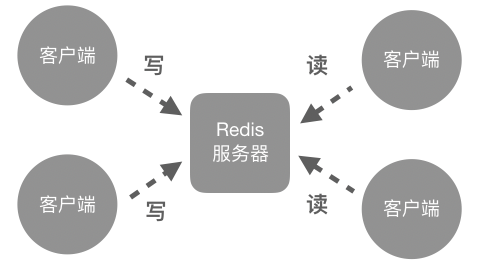
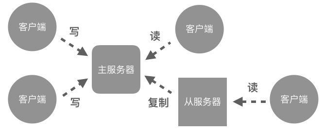
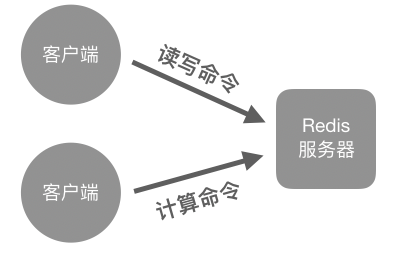

复制
============

Redis 的复制功能是 Redis 提供的多机功能中最基础的一个，
这个功能是通过主从复制（master-slave replication）模式实现的，
它允许用户为储存着目标数据库的服务器创建出多个拥有相同数据库副本的服务器，
其中储存目标数据库的服务器被称为主服务器（master server），
而储存数据库副本的服务器则被称为从服务器（slave server，或者简称 replica），
如图 18-1 所示。

----

图 18-1 主服务器和从服务器

.. image:: image/replication/IMAGE_MASTER_AND_SLAVE.png

----

对于 Redis 来说，
一个主服务器可以拥有任意多个从服务器，
而从服务器本身也可以用作其他服务器的主服务器，
并以此构建出一个树状的服务器结构，
如图 18-2 所示。
需要注意的是，
虽然一个主服务器可以拥有多个从服务器，
但一个从服务器只能拥有一个主服务器。
换句话说，
Redis 提供的是单主复制功能，
而不是多主复制功能。

----

图 18-2 树状服务器结构

.. image:: image/replication/IMAGE_REPLICATION_TREE.png

----

在默认情况下，
处于复制模式的主服务器既可以执行写操作也可以执行读操作，
而从服务器则只能执行读操作，
图 18-3 和 18-4 分别展示了 Redis 服务器在无复制和有复制两种状态下的客户端访问模式。

----

图 18-3 没有启用复制功能的 Redis 服务器可以执行读写操作

----

图 18-4 启用了复制功能的主服务器可以执行读写操作，但从服务器默认只能执行读操作

----

对于开启了复制功能的主从服务器，
主服务器在每次执行写操作之后，
都会与所有从服务器进行数据同步，
以此来将写操作产生的改动反映到各个从服务器之上。
举个例子，
在主服务器执行了客户端发来的写命令 W 之后，
主服务器会将相同的写命令 W 发送至所有从服务器执行，
以此来保持主从服务器之间的数据一致性，
如图 18-5 所示。

----

图 18-5 主服务器将执行过的写命令发送给从服务器执行

.. image:: image/replication/IMAGE_REPL_SYNC.png

----

Redis 的复制功能可以从性能、安全性和可用性三个方面提升整个 Redis 系统：

- 首先，
  在性能方面，
  Redis 的复制功能可以给系统的读性能带来线性级别的提升。
  从理论上来说，
  用户每增加一倍数量的从服务器，
  整个系统的读性能就会提升一倍。

- 其次，
  通过增加从服务器的数量，
  用户可以降低系统在遭遇灾难故障时丢失数据的可能性。
  具体来说，
  如果用户只有一台服务器储存着目标数据库，
  那么当这个服务器遭遇灾难故障时，
  目标数据库很有可能会随着服务器故障而丢失。
  但如果用户为 Redis 服务器（也即是主服务器）设置了从服务器，
  那么即使主服务器遭遇灾难故障，
  用户也可以通过从服务器访问数据库。
  从服务器的数量越多，
  因为主服务器遭遇灾难故障而出现数据库丢失的可能性就越低。

- 最后，
  通过同时使用 Redis 的复制功能和 Sentinel 功能，
  用户可以为整个 Redis 系统提供高可用特性。
  具有这一特性的 Redis 系统在主服务器停机时，
  将会自动挑选一个从服务器作为新的主服务器，
  以此来继续为客户提供服务，
  避免造成整个系统停机。

在本章接下来的内容中，
我们将会学到：

- 如何为主服务器创建从服务器，
  从而开启 Redis 的主从复制功能；

- 如何查看服务器在复制中担当的角色以及相关数据；

- Redis 复制功能的实现原理；

- 如何在主服务器不创建 RDB 文件的情况下实现数据同步；

- 如何通过复制功能提升不同类型 Redis 命令的执行效率；

在本章的最后，
我们还会看到 Redis 服务器通过复制传播 Lua 脚本的方法，
至于 Sentinel 相关的内容将在下一章再行介绍。

REPLICAOF：将服务器设置为从服务器
-------------------------------------------

.. note:: 复制命令的命名变化

    在很长的一段时间里，
    Redis 一直使用 ``SLAVEOF`` 作为复制命令，
    但是从 5.0.0 版本开始，
    Redis 正式将 ``SLAVEOF`` 命令改名成了 ``REPLICAOF`` 命令并逐渐废弃原来的 ``SLAVEOF`` 命令。
    因此，
    如果你使用的是 Redis 5.0.0 之前的版本，
    那么请使用 ``SLAVEOF`` 命令代替本章中的 ``REPLICAOF`` 命令，
    并使用 ``slaveof`` 配置选项代替本章中的 ``replicaof`` 配置选项。
    与此相反，
    如果你使用的是 Redis 5.0.0 或之后的版本，
    那么就应该使用 ``REPLICAOF`` 命令而不是 ``SLAVEOF`` 命令，
    因为后者可能会在未来的某个时候被正式废弃。

用户可以通过执行 ``REPLICAOF`` 命令，
将接收这个命令的 Redis 服务器设置为另一个 Redis 服务器的从服务器：

::

    REPLICAOF host port

命令的 ``host`` 参数用于指定主服务器的地址，
而 ``port`` 参数则用于指定主服务器的端口号。
因为 Redis 的复制操作是以异步方式进行的，
所以收到 ``REPLICAOF`` 命令的服务器在记录主服务器的地址和端口之后就会向客户端返回 ``OK`` ，
至于实际的复制操作则会在后台开始执行。

现在，
假设我们的客户端正连接着服务器 ``127.0.0.1:12345`` ，
如果我们想让这个服务器成为 ``127.0.0.1:6379`` 的从服务器，
那么只需要执行以下命令即可：

::

    127.0.0.1:12345> REPLICAOF 127.0.0.1 6379
    OK

在接收到 ``REPLICAOF`` 命令之后，
主从服务器将执行数据同步操作：
从服务器原有的数据将被清空，
取而代之的是主服务器传送过来的数据副本。
数据同步完成之后，
主从服务器将拥有相同的数据。

在将 ``127.0.0.1:12345`` 设置为 ``127.0.0.1:6379`` 的从服务器之后，
如果我们在主服务器 ``127.0.0.1:6379`` 执行以下命令，
创建出一个 ``msg`` 键：

::

    127.0.0.1:6379> SET msg "hello world"
    OK

    127.0.0.1:6379> GET msg
    "hello world"

那么这个 ``msg`` 键在从服务器 ``127.0.0.1:12345`` 上应该也能够访问到：

::

    127.0.0.1:12345> GET msg
    "hello world"

通过配置选项设置从服务器
^^^^^^^^^^^^^^^^^^^^^^^^^^^^^^^^^^

用户除了可以使用 ``REPLICAOF`` 命令将运行中的 Redis 服务器设置为从服务器之外，
还可以通过设置 ``replicaof`` 配置选项，
在启动 Redis 服务器的同时将它设置为从服务器：

::

    replicaof <host> <port>

比如说，
通过执行以下命令，
我们可以在启动服务器 ``127.0.0.1:10086`` 的同时，
将它设置为 ``127.0.0.1:6379`` 的从服务器：

::

    $ redis-server --port 10086 --replicaof 127.0.0.1 6379

取消复制
^^^^^^^^^^^^^^^^^^^^^^^^^^^^^

在使用 ``REPLICAOF`` 命令或者 ``replicaof`` 配置选项将一个服务器设置为从服务器之后，
我们可以通过执行以下命令，
让从服务器停止进行复制，
重新变回主服务器：

::

    REPLICAOF no one

服务器在停止复制之后不会清空数据库，
而是会继续保留复制产生的所有数据。

..
    之后在介绍 Redis Sentinel 的时候我们就会看到，
    Redis Sentinel 就是通过这一点来创建主服务器的备份的。

比如说，
对于之前设置的从服务器 ``127.0.0.1:12345`` ，
我们可以通过执行以下命令，
让它停止进行复制，
重新变回主服务器：

::

    127.0.0.1:12345> REPLICAOF no one
    OK 

命令返回 ``OK`` 表示复制已经停止。
因为服务器在停止复制之后仍然会保留复制时产生的数据，
所以我们可以继续访问之前设置的 ``msg`` 键：

::

    127.0.0.1:12345> GET msg
    "hello world"
  
其他信息
^^^^^^^^^^^^^^^^^^^^^

+---------------+---------------------------------------------------+
| 属性          | 值                                                |
+===============+===================================================+
| 复杂度        | ``REPLICAOF`` 命令本身的复杂度为 O(1) ，          |
|               | 但它引起的异步复制操作的复杂度为 O(N) ，          |
|               | 其中 N 为主服务器包含的键值对总数量。             |
|               | ``REPLICAOF no one`` 命令的复杂度为 O(1) 。       |
+---------------+---------------------------------------------------+
| 版本要求      | ``REPLICAOF`` 命令从 Redis 5.0.0 版本开始可用。   |
|               | ``SLAVEOF`` 命令从 1.0.0 版本开始可用，           |
|               | 但从 5.0.0 版本开始逐渐废弃。                     |
+---------------+---------------------------------------------------+

ROLE：查看服务器的角色
-------------------------------------

用户可以通过执行 ``ROLE`` 命令来查看服务器当前担任的角色：

::

    ROLE

``ROLE`` 命令在主服务器或者从服务器上执行将产生不同的结果，
以下两个小节将分别介绍这两种情况。

主服务器执行 ``ROLE`` 命令
^^^^^^^^^^^^^^^^^^^^^^^^^^^^^^^^^^^^^^^^^

如果执行 ``ROLE`` 命令的是主服务器，
那么命令将返回一个由三个元素组成的数组作为结果：

- 数组的第一个元素是字符串 ``"master"`` ，
  它表示这个服务器的角色为主服务器。

- 数组的第二个元素是这个主服务器的复制偏移量（replication offset），
  它是一个整数，
  记录了主服务器目前向复制数据流发送的数据数量。

- 数组的第三个元素是一个数组，
  它记录了这个主服务器属下的所有从服务器。
  这个数组的每个元素都由三个子元素组成，
  第一个子元素为从服务器的 IP 地址，
  第二个子元素为从服务器的端口号，
  而第三个子元素则为从服务器的复制偏移量。
  从服务器的复制偏移量记录了从服务器通过复制数据流接收到的复制数据数量，
  当从服务器的复制偏移量跟主服务器的复制偏移量保持一致时，
  它们的数据就是一致的。

以下是一个主服务器执行 ``ROLE`` 命令的例子：

::

    127.0.0.1:6379> ROLE
    1) "master"             -- 这是一个主服务器
    2) (integer) 155        -- 它的复制偏移量为 155
    3) 1) 1) "127.0.0.1"    -- 第一个从服务器的 IP 地址为 127.0.0.1
          2) "12345"        -- 这个从服务器的端口号为 12345
          3) "155"          -- 它的复制偏移量为 155
       2) 1) "127.0.0.1"    -- 第二个从服务器的 IP 地址为 127.0.0.1
          2) "10086"        -- 端口号为 10086
          3) "155"          -- 复制偏移量为 155

从服务器执行 ``ROLE`` 命令
^^^^^^^^^^^^^^^^^^^^^^^^^^^^^^^^^^^^^

如果执行 ``ROLE`` 命令的是从服务器，
那么命令将返回一个由五个元素组成的数组作为结果：

- 数组的第一个元素是字符串 ``"slave"`` ，
  它表示这个服务器的角色是从服务器。

- 数组的第二个元素和第三个元素记录了这个从服务器正在复制的主服务器的 IP 地址和端口号。

- 数组的第四个元素是主服务器与从服务器当前的连接状态，
  这个状态的值及其表示的意思如下：

  - ``"none"`` ：主从服务器尚未建立连接；

  - ``"connect"`` ：主从服务器正在握手；

  - ``"connecting"`` ：主从服务器成功建立了连接；

  - ``"sync"`` ：主从服务器正在进行数据同步；

  - ``"connected"`` ：主从服务器已经进入在线更新状态；

  - ``"unknown"`` ：主从服务器连接状态未知。

- 数组的第五个元素是从服务器当前的复制偏移量。

以下是一个从服务器执行 ``ROLE`` 命令的例子：

::

    127.0.0.1:12345> ROLE
    1) "slave"          -- 这是一个从服务器
    2) "127.0.0.1"      -- 主服务器的 IP 地址
    3) (integer) 6379   -- 主服务器的端口号
    4) "connected"      -- 主从服务器已经进入在线更新状态
    5) (integer) 1765   -- 这个从服务器的复制偏移量为 1765

其他信息
^^^^^^^^^^^^^^^^^^

+---------------+-----------------------------------------------+
| 属性          | 值                                            |
+===============+===============================================+
| 复杂度        | O(1)                                          |
+---------------+-----------------------------------------------+
| 版本要求      | ``ROLE`` 命令从 Redis 2.8.12 版本开始可用。   |
+---------------+-----------------------------------------------+

数据同步
----------------------

当用户将一个服务器设置为从服务器，
让它去复制另一个服务器的时候，
主从服务器需要通过数据同步机制来让两个服务器的数据库状态保持一致。

这一节将对 Redis 主从服务器的数据同步机制进行介绍，
理解同步机制的运作原理是阅读本章后续内容的基础。

完整同步
^^^^^^^^^^^^^^^^^^

当一个 Redis 服务器接收到 ``REPLICAOF`` 命令，
开始对另一个服务器进行复制的时候，
主从服务器会执行以下操作：

1. 主服务器执行 ``BGSAVE`` 命令，
   生成一个 RDB 文件，
   并使用缓冲区储存起在 ``BGSAVE`` 命令之后执行的所有写命令。

2. 在 RDB 文件创建完毕之后，
   主服务器会通过套接字，
   将 RDB 文件传送给从服务器。

3. 从服务器在接收完主服务器传送过来的 RDB 文件之后，
   就会载入这个 RDB 文件，
   从而获得主服务器在执行 ``BGSAVE`` 命令时的所有数据。

4. 当从服务器完成 RDB 文件载入操作，
   并开始上线接受命令请求时，
   主服务器就会把之前储存在缓存区里面的所有写命令发送给从服务器执行。

因为主服务器储存的写命令都是在执行 ``BGSAVE`` 命令之后执行的，
所以当从服务器载入完 RDB 文件，
并执行完主服务器储存在缓冲区里面的所有写命令之后，
主从服务器两者包含的数据库数据将完全相同。

这个通过创建、传送并载入 RDB 文件来达成数据一致的步骤，
我们称之为完整同步操作。
每个从服务器在刚开始进行复制的时候，
都需要与主服务器进行一次完整同步。

.. note:: 在进行数据同步时重用 RDB 文件

    为了提高数据同步操作的执行效率，
    如果主服务器在接收到 ``REPLICAOF`` 命令之前已经完成了一次 RDB 创建操作，
    并且它的数据库在创建 RDB 文件之后没有发生过任何变化，
    那么主服务器将直接向从服务器发送已有的 RDB 文件，
    以此来避免无谓的 RDB 文件生成操作。

    此外，
    如果在主服务器创建 RDB 文件期间，
    有多个从服务器向主服务器发送数据同步请求，
    那么主服务器将把发送请求的从服务器全部放入到队列里面，
    等到 RDB 文件创建完毕之后，
    再把它发送给队列里面的所有从服务器，
    以此来复用 RDB 文件并避免多余的 RDB 文件创建操作。

在线更新
^^^^^^^^^^^^^^^^

主从服务器在执行完完整同步操作之后，
它们的数据就达到了一致状态，
但这种一致并不是永久的：
每当主服务器执行了新的写命令之后，
它的数据库就会被改变，
这时主从服务器的数据一致性就会被破坏。

为了让主从服务器的数据一致性可以保持下去，
让它们一直拥有相同的数据，
Redis 会对从服务器进行在线更新：

- 每当主服务器执行完一个写命令之后，
  它就会将相同的写命令又或者具有相同效果的写命令发送给从服务器执行。

- 因为完整同步之后的主从服务器在执行最新出现的写命令之前，
  两者的数据库是完全相同的，
  而导致两者数据库出现不一致的正是最新被执行的写命令。
  因此从服务器只要接收并执行主服务器发来的写命令，
  就可以让自己的数据库重新与主服务器数据库保持一致。

只要从服务器一直与主服务器保持连接，
在线更新操作就会不断进行，
使得从服务器的数据库可以一直被更新，
并与主服务器的数据库保持一致。

.. note:: 异步更新引起的数据不一致

    需要注意的是，
    因为在线更新是异步进行的，
    所以在主服务器执行完写命令之后，
    直到从服务器也执行完相同写命令的这段时间里，
    主从服务器的数据库将出现短暂的不一致，
    因此要求强一致性的程序可能需要直接读取主服务器而不是读取从服务器。

    此外，
    因为主服务器可能在执行完写命令并向从服务器发送相同写命令的过程中由于故障而下线，
    所以从服务器在主服务器下线之后可能会丢失主服务器已经执行的一部分写命令，
    导致从服务器的数据库与下线之前的主服务器数据库处于不一致状态。

    因为在线更新的异步本质，
    Redis 的复制功能是无法杜绝不一致的。
    不过本章之后会介绍一种方法，
    它可以尽量减少不一致出现的可能性。

部分同步
^^^^^^^^^^^^^^^^^^

当故障下线的从服务器重新上线时，
主从服务器的数据通常已经不再一致，
因此它们必须重新进行同步，
让两者的数据库再次回到一致状态。

在 Redis 2.8 版本以前，
重同步操作是通过直接进行完整同步来实现的，
但是，
这种重同步方法在从服务器只是短暂下线的情况下是非常浪费资源的：
主从服务器的数据库在连接断开之前一直都是相同的，
造成数据不一致的原因可能仅仅是因为主服务器比从服务器多执行了几个写命令，
而为了补上这小部分写命令所产生的数据，
却要大费周章地重新进行一次完整同步，
这毫无疑问是非常低效的。

为了解决这个问题，
Redis 从 2.8 版本开始使用新的重同步功能去代替原来的重同步功能：

- 当一个 Redis 服务器成为另一个服务器的主服务器时，
  它会把每个被执行的写命令都记录到一个特定长度的先进先出队列里面。

- 当断线的从服务器尝试重新连接主服务器的时候，
  主服务器将检查从服务器断线期间，
  被执行的那些写命令是否仍然保存在队列里面。
  如果是的话，
  那么主服务器就会直接把从服务器缺失的那些写命令发送给从服务器执行，
  从服务器通过执行这些写命令就可以重新与主服务器保持一致，
  这样就避免了重新进行完整同步的麻烦。

- 另一方面，
  如果从服务器缺失的那些写命令已经不存在于队列当中，
  那么主从服务器将进行一次完整同步。

因为新的重同步功能需要使用先进先出队列来记录主服务器执行过的写命令，
所以这个队列的体积越大，
它能够记录的写命令就越多，
从服务器断线之后能够快速地重新回到一致状态的机会也就越大。
Redis 为这个队列设置的默认大小为 1 MB ，
用户也可以根据自己的需要，
通过配置选项 ``repl-backlog-size`` 来修改这个队列的大小。

无需硬盘的复制
--------------------

正如之前所说，
主服务器在进行完整同步的时候，
需要在本地创建 RDB 文件，
然后通过套接字将这个 RDB 文件传送给从服务器。

但是，
如果主服务器所在宿主机器的硬盘负载非常大又或者性能不佳，
创建 RDB 文件引起的大量硬盘写入将对主服务器的性能造成影响，
并导致复制进程变慢。

为了解决这个问题，
Redis 从 2.8.18 版本开始引入无需硬盘的复制特性（diskless replication）：
启用了这个特性的主服务器在接收到 ``REPLICAOF`` 命令时将不会再在本地创建 RDB 文件，
而是会派生出一个子进程，
然后由子进程通过套接字直接将 RDB 文件写入至从服务器。
这样主服务器就可以在不创建 RDB 文件的情况下，
完成与从服务器的数据同步。

要使用无需硬盘的复制特性，
我们只需要将 ``repl-diskless-sync`` 配置选项的值设置为 ``yes`` 就可以了：

::

    repl-diskless-sync <yes|no>

比如以下代码就展示了如何在启动 Redis 服务器的同时，
启用服务器的无需硬盘复制特性：

::

    $ redis-server --repl-diskless-sync yes

最后要注意的是，
无需硬盘的复制特性只是避免了在主服务器上创建 RDB 文件，
但仍然需要在从服务器上创建 RDB 文件。
Redis 目前还无法在完全不使用硬盘的情况下完成完整数据同步，
但不排除将来会出现这样的功能。

..
    .. note:: 无需硬盘的复制仍然需要在从服务器创建 RDB 文件

        无需硬盘的复制特性只是不用在主服务器所在的机器上创建 RDB 文件，
        但仍然需要在从服务器所在的机器上创建 RDB 文件。
        换句话说，
        这个特性只是将原来进行同步时的四个步骤：

        1. 主服务器创建 RDB 文件。

        2. 主服务器将 RDB 文件传送给从服务器。

        3. 从服务器通过载入 RDB 文件来进行数据同步。

        4. 主服务器将传送 RDB 文件期间执行的所有写命令发送给从服务器执行。

        简化成了以下三个步骤：

        1. 主服务器通过子进程将 RDB 文件直接写入到从服务器所在的机器上。

        2. 从服务器通过载入 RDB 文件来进行数据同步。    

        3. 主服务器将写入 RDB 文件期间执行的所有写命令发送给从服务器执行。

降低数据不一致的出现几率
------------------------------

本章前面在介绍复制原理时曾经提到过，
因为复制的在线更新操作以异步方式进行，
所以当主从服务器之间的连接不稳定，
又或者从服务器未能收到主服务器发送的更新命令时，
主从服务器就会出现数据不一致的情况。

为了尽可能地降低数据不一致的出现几率，
Redis 从 2.8 版本开始引入了两个以 ``min-replicas`` 开头的配置选项：

::

    min-replicas-max-lag <seconds>

    min-replicas-to-write <numbers>

用户设置了这两个配置选项之后，
主服务器只会在从服务器的数量大于等于 ``min-replicas-to-write`` 选项的值，
并且这些从服务器与主服务器最后一次成功通讯的间隔不超过 ``min-replicas-max-lag`` 选项的值时才会执行写命令。

举个例子，
假设我们想要让主服务器只在拥有至少 3 个从服务器，
并且这些从服务器与主服务器最后一次成功通讯的间隔不超过 10 秒钟的情况下才执行写命令，
那么可以使用配置选项：

::

    min-replicas-max-lag 10

    min-replicas-to-write 3

通过使用这两个配置选项，
我们可以让主服务器只在主从服务器连接良好的情况下执行写命令。
因为在线更新的异步性质，
``min-replicas-max-lag`` 和 ``min-replicas-to-write`` 并没有办法完全地杜绝数据不一致出现，
但它们可以有效地减少因为主从服务器连接不稳定而导致的数据不一致，
并降低因为没有从服务器可用而导致数据丢失的可能性。

可写的从服务器
---------------------------

从 Redis 2.6 版本开始，
Redis 的从服务器在默认状态下只允许执行读命令。
如果用户尝试对一个只读从服务器执行写命令，
那么从服务器将返回以下错误信息：

::

    127.0.0.1:12345> REPLICAOF 127.0.0.1 6379
    OK

    127.0.0.1:12345> SET msg "hello world"
    (error) READONLY You can't write against a read only replica.

Redis 之所以将从服务器默认设置为只读服务器，
是为了确保从服务器只能通过与主服务器进行数据同步来得到更新，
从而保证主从服务器之间的数据一致性。

但在某些情况下，
我们可能想要将一些不太重要或者临时性的数据储存在从服务器里面，
又或者不得不在从服务器里面执行一些带有写性质的命令
（比如 ``ZINTERSTORE`` 命令，它只能将计算结果储存在数据库里面，不能直接返回计算结果）。
这时我们可以通过将 ``replica-read-only`` 配置选项的值设置为 ``no`` 来打开从服务器的写功能：

::

    replica-read-only <yes|no>

比如说，
如果我们在启动服务器 ``127.0.0.1:12345`` 的时候，
将 ``replica-read-only`` 配置选项的值设置为 ``no`` ：

::

    $ redis-server --port 12345 --replica-read-only no

那么即使它变成了一个从服务器，
它也能够正常地执行客户端发送的写命令：

::

    127.0.0.1:12345> REPLICAOF 127.0.0.1 6379
    OK

    127.0.0.1:12345> SET msg "hello world again!"
    OK

    127.0.0.1:12345> GET msg
    "hello world again!"

.. note:: 使用可写从服务器的注意事项

    在使用可写的从服务器时，
    用户需要注意以下几个方面：

    - 在主从服务器都可写的情况下，
      程序必须将写命令发送到正确的服务器上面，
      不能把需要在主服务器执行的写命令发送给从服务器执行，
      也不能把需要在从服务器执行的写命令发送给主服务器执行，
      否则就会出现数据错误。

    - 从服务器执行写命令得到的数据，
      可能会被主服务器发送的写命令覆盖。
      比如说，
      如果从服务器在执行了客户端发送的 ``SET msg "hello from client"`` 命令之后，
      又接收到了主服务器发送的 ``SET msg "hello from master"`` 命令，
      那么客户端写入的 ``msg`` 键将被主服务器写入的 ``msg`` 键覆盖。
      因为这个原因，
      客户端在从服务器上面执行写命令时，
      应该尽量避免与主服务器发生键冲突，
      换句话说，
      用户应该让客户端和主服务器分别对从服务器数据库中不同的键进行写入，
      而不要让客户端和主服务器都去写相同的键。

    - 当从服务器与主服务器进行完整同步时，
      从服务器数据库包含的所有数据都将被清空，
      其中包括客户端写入的数据。

    - 为了减少内存占用，
      降低键冲突发生的可能性，
      并确保主从服务器的数据同步操作可以顺利进行，
      客户端写入到从服务器的数据应该在使用完毕之后尽快删除。
      一个比较简单的方法是在客户端向从服务器写入数据的同时，
      为数据设置一个比较短的过期时间，
      使得这些数据可以在使用完毕之后自动被删除。

示例：使用从服务器处理复杂计算操作
-------------------------------------------

Redis 的数据相关命令基本上可以划分为两个种类：

- 第一种是简单的读写操作，
  比如 ``GET`` 命令、 ``SET`` 命令、 ``ZADD`` 命令等等，
  这种命令只需要对数据库进行简单的读写，
  它们的执行速度一般都非常快。

- 第二种是比较复杂的计算操作，
  比如 ``SUNION`` 命令、 ``ZINTERSTORE`` 命令、 ``BITOP`` 命令等等，
  这种命令需要对数据库中的元素进行聚合计算，
  并且随着元素数量的增加，
  计算耗费的时间也会增加，
  因此这种命令的执行速度一般都比较慢。

从效率的角度考虑，
如果我们在同一个 Redis 服务器里面同时处理以上两种命令，
那么执行第二种命令产生的阻塞时间将导致第一种命令执行时的延迟值显著地增加。

为此，
我们可以通过复制功能创建出当前服务器的从服务器，
然后让主服务器只处理第一种命令，
而第二种命令则交给从服务器处理，
如图 18-6 所示。

----

图 18-6 使用从服务器执行计算命令

之前：使用服务器处理简单的读写命令和计算命令

之后：使用主服务器处理简单的读写命令，使用从服务器处理计算命令

.. image:: image/replication/IMAGE_SPEEDUP_CMD_2.png

----

为了能够在从服务器执行诸如 ``ZINTERSTORE`` 这样的写命令，
我们需要把从服务器的可写特性打开，
并且在将计算结果储存到从服务器之后，
为它设置一个比较短的过期时间，
使得结果可以自动过期。
又或者在客户端获得结果之后，
由客户端将结果写入到主服务器进行保存。

如果只使用一个从服务器处理第二种命令的速度还不够快，
我们可以继续增加从服务器，
直到从服务器处理第二种命令的速度和延迟值达到我们的要求为止。

脚本复制
------------------

在了解了 Redis 服务器传播普通 Redis 命令的方法之后，
我们接下来要了解的将是 Redis 传播 Lua 脚本的具体方法。

Redis 服务器拥有两种不同的脚本复制模式，
第一种是从 Redis 2.6 版本开始支持的脚本传播模式（whole script replication），
而另一种则是从 Redis 3.2 版本开始支持的命令传播模式（script effect replication），
本节接下来将分别介绍这两种模式。

脚本传播模式
^^^^^^^^^^^^^^^^^^^^^

处于脚本传播模式的主服务器会将被执行的脚本及其参数（也即是 ``EVAL`` 命令本身）复制到 AOF 文件以及从服务器里面。
因为带有副作用的函数在不同服务器上运行时可能会产生不同的结果，
从而导致主从服务器不一致，
所以在这一模式下执行的脚本必须是纯函数：
换句话说，
对于相同的数据集，
相同的脚本以及参数必须产生相同的效果。

为了保证脚本的纯函数性质，
Redis 对处于脚本传播模式的 Lua 脚本设置了以下限制：

- 脚本不能访问 Lua 的时间模块、内部状态又或者除给定参数之外的其他外部信息。

- 在 Redis 的命令当中，
  存在着一部分带有随机性质的命令，
  这些命令对于相同的数据集以及相同的参数可能会返回不同的结果。
  如果脚本在执行这类带有随机性质的命令之后，
  尝试继续执行写命令，
  那么 Redis 将拒接执行该命令并返回一个错误。
  带有随机性质的 Redis 命令分别为：
  ``SPOP`` 、
  ``SRANDMEMBER`` 、
  ``SCAN`` 、
  ``SSCAN`` 、
  ``ZSCAN`` 、
  ``HSCAN`` 、
  ``RANDOMKEY`` 、
  ``LASTSAVE`` 、
  ``PUBSUB`` 、
  ``TIME`` 。

- 当用户在脚本中调用 ``SINTER`` 、 ``SUNION`` 、 ``SDIFF`` 、 ``SMEMBERS`` 、 ``HKEYS`` 、 ``HVALS`` 、 ``KEYS`` 这七个会以随机顺序返回结果元素的命令时，
  为了消除其随机性质，
  Lua 环境在返回这些命令的结果之前会先对结果中包含的元素进行排序，
  以此来确保命令返回的元素总是有序的。

- Redis 会确保每个被执行的脚本都拥有相同的随机数生成器种子，
  这意味着如果用户不主动修改这一种子，
  那么所有脚本在默认情况下产生的伪随机数列都将是相同的。

脚本传播模式是 Redis 复制脚本时默认使用的模式。
如果用户在执行脚本之前没有修改过相关的配置选项，
那么 Redis 将使用脚本传播模式来复制脚本。

作为例子，
如果我们在启用了脚本传播模式的主服务器执行以下命令：

::

    EVAL "redis.call('SET', KEYS[1], 'hello world');redis.call('SET', KEYS[2], 10086);redis.call('SADD', KEYS[3], 'apple', 'banana', 'cherry')" 3 'msg' 'number' 'fruits'

那么主服务器将向从服务器发送完全相同的 ``EVAL`` 命令：

::

    EVAL "redis.call('SET', KEYS[1], 'hello world');redis.call('SET', KEYS[2], 10086);redis.call('SADD', KEYS[3], 'apple', 'banana', 'cherry')" 3 'msg' 'number' 'fruits'

命令传播模式
^^^^^^^^^^^^^^^^^^^^^

处于命令传播模式的主服务器会将执行脚本产生的所有写命令用事务包裹起来，
然后将事务复制到 AOF 文件以及从服务器里面。
因为命令传播模式复制的是写命令而不是脚本本身，
所以即使脚本本身包含副作用，
主服务器给所有从服务器复制的写命令仍然是相同的，
因此处于命令传播模式的主服务器能够执行带有副作用的非纯函数脚本。

除了脚本可以不是纯函数之外，
与脚本传播模式相比，
命令传播模式对 Lua 环境还有以下放松：

- 用户可以在执行 ``RANDOMKEY`` 、 ``SRANDMEMBER`` 等带有随机性质的命令之后继续执行写命令。

- 脚本的伪随机数生成器在每次调用之前，
  都会随机地设置种子。
  换句话说，
  被执行的每个脚本在默认情况下产生的伪随机数列都是不一样的。

除了以上两点之外，
命令传播模式跟脚本传播模式的 Lua 环境限制是一样的，
比如说，
即使在命令传播模式下，
脚本还是无法访问 Lua 的时间模块以及内部状态。

为了开启命令传播模式，
用户在使用脚本执行任何写操作之前，
需要先在脚本里面调用以下函数：

::

    redis.replicate_commands()

``redis.replicate_commands()`` 只对调用该函数的脚本有效：
在使用命令传播模式执行完当前脚本之后，
服务器将自动切换回默认的脚本传播模式。

作为例子，
如果我们在主服务器执行以下命令：

::

    EVAL "redis.replicate_commands();redis.call('SET', KEYS[1], 'hello world');redis.call('SET', KEYS[2], 10086);redis.call('SADD', KEYS[3], 'apple', 'banana', 'cherry')" 3 'msg' 'number' 'fruits'

那么主服务器将向从服务器复制以下命令：

::

    MULTI
    SET "msg" "hello world"
    SET "number" "10086"
    SADD "fruits" "apple" "banana" "cherry"
    EXEC

选择性命令传播
^^^^^^^^^^^^^^^^^^^^^^^^^^

为了进一步提升命令传播模式的威力，
Redis 允许用户在脚本里面选择性地打开或者关闭命令传播功能，
这一点可以通过在脚本里面调用 ``redis.set_repl()`` 函数并向它传入以下四个值来完成：

- ``redis.REPL_ALL`` —— 默认值，将写命令传播至 AOF 文件以及所有从服务器。

- ``redis.REPL_AOF`` —— 只将写命令传播至 AOF 文件。

- ``redis.REPL_SLAVE`` —— 只将写命令传播至所有从服务器。

- ``redis.REPL_NONE`` —— 不传播写命令。

跟 ``redis.replicate_commands()`` 函数一样，
``redis.set_repl()`` 函数也只对执行该函数的脚本有效。
用户可以通过这一功能来定制被传播的命令序列，
以此来确保只有真正需要的命令会被传播至 AOF 文件以及从服务器。

----

代码清单 18-1 储存并集计算结果的脚本

.. literalinclude:: code/replication/union_random.lua

----

举个例子，
代码清单 18-1 所示的脚本会将给定的两个集合的并集计算结果储存到一个集合里面，
接着使用 ``SRANDMEMBER`` 命令从结果集合里面随机选出指定数量的元素，
然后删除结果集合并向调用者返回被选中的随机元素。

如果我们使用以下方式执行这个脚本：

::

    redis-cli --eval union_random.lua set_a set_b union_random , 3
    
那么主服务器将向从服务器复制以下写命令：

::

    MULTI
    SUNIONSTORE "union_random" "set_a" "set_b"
    DEL "union_random"
    EXEC

但仔细地思考一下就会发现，
``SUNIONSTORE`` 命令创建的 ``union_random`` 实际上只是一个临时集合，
脚本在取出并集元素之后就会使用 ``DEL`` 命令将其删除，
因此主服务器即使不将 ``SUNIONSTORE`` 命令和 ``DEL`` 命令复制给从服务器，
主从服务器包含的数据也是相同的。

代码清单 18-2 展示了根据上述想法对脚本进行修改之后得出的新脚本，
新旧两个脚本在执行时将得到相同的结果，
但主服务器在执行新脚本时将不会向从服务器复制任何命令。

----

代码清单 18-2 带有选择性命令传播特性的脚本

.. literalinclude:: code/replication/no_repl_union_random.lua

----

需要注意的是，
虽然选择性复制功能非常强大，
但用户如果没有正确地使用这个功能的话，
那么就可能会导致主从服务器的数据出现不一致，
因此用户在使用这个功能的时候必须慎之又慎。

模式的选择
^^^^^^^^^^^^^^^^^^^^^^

既然存在着两种不同的脚本复制模式，
那么如何选择正确的模式来复制脚本就显得至关重要了。
一般来说，
用户可以根据以下情况来判断应该使用哪种复制模式：

- 如果脚本的体积不大，
  执行的计算也不多，
  但是却会产生大量命令调用，
  那么使用脚本传播模式可以有效地节约网络资源。

- 相反地，
  如果一个脚本的体积非常大，
  执行的计算非常多，
  但是只会产生少量命令调用，
  那么使用命令传播模式可以通过重用已有的计算结果来节约计算资源以及网络资源。

举个例子，
假设我们正在开发一个游戏系统，
该系统的其中一项功能就是在节日给符合条件的一批用户增加指定数量的金币。
为此，
我们可能会写出包含以下代码的脚本，
并在执行这个脚本的时候，
通过 ``KEYS`` 变量将数量庞大的用户余额键名传递给脚本：

.. literalinclude:: code/replication/increment_balance.lua

很明显，
这个脚本将产生相当于传入键数量的 ``INCRBY`` 命令：
在用户数量极其庞大的情况下，
使用命令传播模式对这个脚本进行复制将耗费大量网络资源，
但使用脚本传播模式来复制这个脚本则会是一件非常容易的事。

现在，
考虑另一种情况，
假设我们正在开发一个数据聚合脚本，
它包含了一个需要进行大量聚合计算以及大量数据库读写操作的 ``aggregate_work()`` 函数：

.. literalinclude:: code/replication/aggregate_work.lua

因为执行 ``aggregate_work()`` 函数需要耗费大量计算资源，
所以如果我们直接复制整个脚本的话，
那么相同的操作就要在每个从服务器上面都执行一遍，
这对于宝贵的计算资源来说无疑是一种巨大的浪费；
相反地，
如果我们使用命令传播模式来复制这个脚本，
那么主服务器在执行完这个脚本之后，
就可以通过 ``SET`` 命令直接将函数的计算结果复制给各个从服务器。

重点回顾
-------------------

- Redis 的复制功能允许用户为一个服务器创建出多个副本，
  其中被复制的服务器为主服务器，
  而复制产生的副本则是从服务器。

- Redis 提供的复制功能是通过主从复制模式实现的，
  一个主服务器可以有多个从服务器，
  但每个从服务器只能有一个主服务器。

- Redis 的复制功能可以从性能、安全性和可用性三个方面提升整个 Redis 系统。

- Redis 主从服务器的数据同步涉及三个操作：1）完整同步；2）在线更新；3）部分同步。

- Redis 的复制功能提供了脚本传播模式和命令传播模式两种脚本复制模式可用，
  前者传播的是 Lua 脚本本身，
  而后者传播的则是 Redis 命令。
  这两种传播模式各有特色，
  用户应该根据自己的需求选择合适的模式。
