集合（Set）
================

Redis 的集合键允许用户将任意多个各不相同的元素储存到集合里面，
这些元素既可以是文本数据，
也可以是二进制数据。
虽然上一章介绍的列表键也允许我们储存多个元素，
但是跟列表相比，
集合有以下两个明显的区别：

1. 列表可以储存重复元素，
   而集合只会储存非重复元素，
   尝试将一个已存在的元素添加到集合将被忽略。

2. 列表以有序方式储存元素，
   而集合则以无序方式储存元素。

这两个区别带来的差异主要跟命令的复杂度有关：

- 在执行像 ``LINSERT`` 和 ``LREM`` 这样的列表命令时，
  即使命令只针对单个列表元素，
  程序有时候也不得不遍历整个列表以确定指定的元素是否存在，
  因此这些命令的复杂度都为 O(N) 。

- 另一方面，
  对于集合来说，
  因为所有针对单个元素的集合命令都不需要遍历整个集合，
  所以它们的复杂度都为 O(1) 。

因此当我们需要储存多个元素时，
就可以考虑这些元素是否可以以无序的方式储存，
并且是否不会出现重复，
如果是的话，
那么就可以使用集合来储存这些元素，
从而有效地利用集合操作的效率优势。

作为例子，
图 5-1 展示了一个名为 ``databases`` 的集合，
这个集合里面包含了 ``"Redis"`` 、 ``"MongoDB"`` 、 ``"MySQL"`` 等八个元素。

----

图 5-1 集合示例

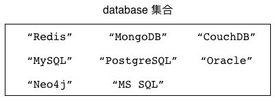

----

Redis 为集合键提供了一系列操作命令，
通过使用这些命令，
用户可以：

- 将新元素添加到集合里面，或者从集合里面移除已有的元素。

- 将指定的元素从一个集合移动到另一个集合。

- 获取集合包含的所有元素。

- 获取集合包含的元素数量。

- 检查给定元素是否存在于集合。

- 从集合里面随机地获取指定数量的元素。

- 对多个集合执行交集、并集、差集计算。

本章接下来将对 Redis 集合键的各个命令进行介绍，
并说明如何使用这些命令去解决各种实际存在的问题。

SADD：将元素添加到集合
-------------------------------

通过使用 ``SADD`` 命令，
用户可以将一个或多个元素添加到集合里面：

::

    SADD set element [element ...]

这个命令会返回成功添加的新元素数量作为返回值。

以下代码展示了如何使用 ``SADD`` 命令去构建一个 ``databases`` 集合：

::

    redis> SADD databases "Redis"
    (integer) 1    -- 集合新添加了一个元素

    redis> SADD databases "MongoDB" "CouchDB"
    (integer) 2    -- 集合新添加了两个元素

    redis> SADD databases "MySQL" "PostgreSQL" "MS SQL" "Oracle"
    (integer) 4    -- 集合新添加了四个元素

图 5-2 展示了以上三个 ``SADD`` 命令构建出 ``databases`` 集合的整个过程。

----

图 5-2 使用 ``SADD`` 命令构建集合的整个过程

执行 ``SADD databases "Redis"``

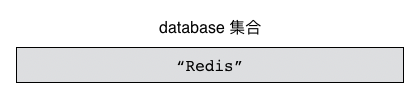

执行 ``SADD databases "MongoDB" "CouchDB"``

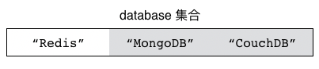

执行 ``SADD databases "MySQL" "PostgreSQL" "MS SQL" "Oracle"``

.. image:: image/set/IMAGE_SADD_3.png

忽略已存在元素
^^^^^^^^^^^^^^^^^^^^^^

因为集合不储存相同的元素，
所以用户在使用 ``SADD`` 命令向集合里面添加元素的时候，
``SADD`` 命令会自动忽略已存在的元素，
只将不存在于集合的新元素添加到集合里面。

在以下展示的代码中，
我们分别尝试向 ``databases`` 集合添加元素 ``"Redis"`` 、 ``"MySQL"`` 以及 ``"PostgreSQL"`` ，
但是因为这些元素都已经存在于 ``databases`` 集合，
所以 ``SADD`` 命令将忽略这些元素：

::

    redis> SADD databases "Redis"
    (integer) 0    -- 成功添加的新元素数量为 0 ，表示没有任何新元素被添加到集合当中

    redis> SADD databases "MySQL" "PostgreSQL"
    (integer) 0    -- 同样，这次也没有任何元素被添加到集合里面

而在以下代码中，
``SADD`` 命令会将新元素 ``"Neo4j"`` 添加到集合里面，
并忽略 ``"Redis"`` 和 ``"MySQL"`` 这两个已存在的元素：

::

    redis> SADD databases "Redis" "MySQL" "Neo4j"
    (integer) 1

其他信息
^^^^^^^^^^^^^^^^^^

+---------------+-----------------------------------------------------------------------+
| 属性          | 值                                                                    |
+===============+=======================================================================+
| 复杂度        | O(N)，其中 N 为用户给定的元素数量。                                   |
+---------------+-----------------------------------------------------------------------+
| 版本要求      | ``SADD`` 命令从 Redis 1.0.0 版本开始可用，                            |
|               | 但是只有 Redis 2.4 或以上版本的 ``SADD`` 命令可以一次添加多个元素，   |
|               | Redis 2.4 以下版本的 ``SADD`` 命令每次只能添加一个元素。              |
+---------------+-----------------------------------------------------------------------+

SREM：从集合中移除元素
-------------------------------------

通过使用 ``SREM`` 命令，
用户可以从集合里面移除一个或多个已存在的元素：

::

    SREM set element [element ...]

这个命令会返回被移除的元素数量作为返回值。

以下代码展示了如何使用 ``SREM`` 命令去移除 ``databases`` 集合中的 ``"Neo4j"`` 等元素：

::

    redis> SREM databases Neo4j
    (integer) 1    -- 有一个元素被移除

    redis> SREM databases "MS SQL" "Oracle" "CouchDB"
    (integer) 3    -- 有三个元素被移除

图 5-3 展示了 ``databases`` 集合在执行 ``SREM`` 命令过程中的变化。

----

图 5-3 ``databases`` 集合的整个变化过程

执行 ``SREM`` 命令之前

.. image:: image/set/IMAGE_SREM_1.png

执行 ``SREM databases "Neo4j"`` 之后

.. image:: image/set/IMAGE_SREM_2.png

执行 ``SREM databases "MS SQL" "Oracle" "CouchDB"`` 之后

.. image:: image/set/IMAGE_SREM_3.png

忽略不存在的元素
^^^^^^^^^^^^^^^^^^^^^^^^^

如果用户给定的元素并不存在于集合当中，
那么 ``SREM`` 命令将忽略不存在的元素，
只移除那些确实存在的元素。

在以下代码中，
因为元素 ``"Memcached"`` 并不存在于 ``databases`` 集合，
所以 ``SREM`` 命令没有从集合里面移除任何元素：

::

    redis> SREM databases "Memcached"
    (integer) 0    -- 没有元素被移除

其他信息
^^^^^^^^^^^^^^^^^^^^^^^^^

+---------------+-----------------------------------------------------------------------+
| 属性          | 值                                                                    |
+===============+=======================================================================+
| 复杂度        | O(N)，其中 N 为用户给定的元素数量。                                   |
+---------------+-----------------------------------------------------------------------+
| 版本要求      | ``SREM`` 命令从 Redis 1.0.0 版本开始可用，                            |
|               | 但是只有 Redis 2.4 或以上版本的 ``SREM`` 命令可以一次删除多个元素，   |
|               | Redis 2.4 以下版本的 ``SREM`` 命令每次只能删除一个元素。              |
+---------------+-----------------------------------------------------------------------+

SMOVE：将元素从一个集合移动到另一个集合
---------------------------------------------------

``SMOVE`` 命令允许用户将指定的元素从源集合移动到目标集合：

::

    SMOVE source target element

``SMOVE`` 命令在移动操作成功执行时返回 ``1`` ；
如果指定的元素并不存在于源集合，
那么 ``SMOVE`` 命令将返回 ``0`` ，
表示移动操作执行失败。

以下代码展示了如何通过 ``SMOVE`` 命令，
将存在于 ``databases`` 集合的 ``"Redis"`` 元素以及 ``"MongoDB"`` 元素移动到 ``nosql`` 集合里面：

::

    redis> SMOVE databases nosql "Redis"
    (integer) 1    -- 移动成功

    redis> SMOVE databases nosql "MongoDB"
    (integer) 1    -- 移动成功

图 5-4 展示了这两个 ``SMOVE`` 命令的执行过程。

----

图 5-4 ``SMOVE`` 命令的执行过程：

执行 ``SMOVE`` 命令之前的 ``databases`` 集合和 ``nosql`` 集合

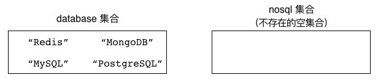

执行 ``SMOVE databases nosql "Redis"`` 之后

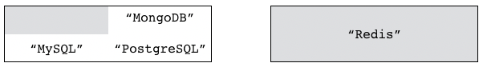

执行 ``SMOVE databases nosql "MongoDB"`` 之后

.. image:: image/set/IMAGE_SMOVE_3.png

忽略不存在的元素
^^^^^^^^^^^^^^^^^^^^^^^

如果用户想要移动的元素并不存在于源集合，
那么 ``SMOVE`` 将放弃执行移动操作，
并返回 ``0`` 表示移动操作执行失败。

举个例子，
对于图 5-5 所示的 ``fruits`` 集合和 ``favorite-fruits`` 集合来说，
尝试把不存在于 ``fruits`` 集合的 ``"dragon fruit"`` 元素移动到 ``favorite-fruits`` 集合将会导致 ``SMOVE`` 命令执行失败：

::

    redis> SMOVE fruits favorite-fruits "dragon fruit"
    (integer) 0    -- 没有元素被移动

----

图 5-5 ``fruits`` 集合和 ``favorite-fruits`` 集合

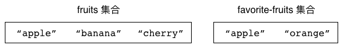

覆盖已存在的元素
^^^^^^^^^^^^^^^^^^^^^^^^

即使用户想要移动的元素已经存在于目标集合，
``SMOVE`` 命令仍然会将指定的元素从源集合移动到目标集合，
并覆盖目标集合里面的相同元素。
从结果来看，
这种移动不会改变目标集合包含的元素，
只会导致被移动的元素从源集合中消失。

以图 5-5 中展示的 ``fruits`` 集合和 ``favorite-fruits`` 集合为例，
如果我们执行以下代码：

::

    redis> SMOVE fruits favorite-fruits "apple"
    (integer) 1

那么 ``fruits`` 集合中的 ``"apple"`` 元素将被移动到 ``favorite-fruits`` 集合里面，
覆盖掉 ``favorite-fruits`` 集合原有的 ``"apple"`` 元素。
从结果来看，
``"apple"`` 元素将从 ``fruits`` 集合中消失，
而 ``favorite-fruits`` 集合包含的元素则不会发生变化。
图 5-6 展示了上面的 ``SMOVE`` 命令执行之后，
``fruits`` 集合和 ``favorite-fruits`` 集合的样子。

----

图 5-6 执行 ``SMOVE`` 命令之后的 ``fruits`` 集合和 ``favorite-fruits`` 集合

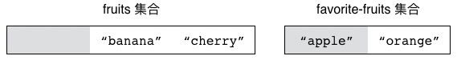

其他信息
^^^^^^^^^^^^^^^^^^^

+---------------+-----------------------------------------------+
| 属性          | 值                                            |
+===============+===============================================+
| 复杂度        | O(1)                                          |
+---------------+-----------------------------------------------+
| 版本要求      | ``SMOVE`` 命令从 Redis 1.0.0 版本开始可用。   |
+---------------+-----------------------------------------------+

SMEMBERS：获取集合包含的所有元素
---------------------------------------

通过使用 ``SMEMBERS`` 命令，
用户可以取得集合包含的所有元素：

::

    SMEMBERS set

以下代码展示了如何使用 ``SMEMBERS`` 命令去获取 ``fruits`` 集合、 ``favorite-numbers`` 集合以及 ``databases`` 集合的所有元素：

::

    redis> SMEMBERS fruits
    1) "banana"
    2) "cherry"
    3) "apple"

    redis> SMEMBERS favorite-numbers
    1) "12345"
    2) "999"
    3) "3.14"
    4) "1024"
    5) "10086"

    redis> SMEMBERS databases
    1) "Redis"
    2) "PostgreSQL"
    3) "MongoDB"
    4) "MySQL"

元素的无序排列
^^^^^^^^^^^^^^^^^^^^^^

因为 Redis 集合以无序的方式储存元素，
并且 ``SMEMBERS`` 命令在获取集合元素时也不会对元素进行任何排序动作，
所以根据元素添加顺序的不同，
两个包含相同元素的集合在执行 ``SMEMBERS`` 命令时的结果也可能会有所不同。

比如在以下代码中，
我们就以相反的顺序向 ``fruits-a`` 和 ``fruits-b`` 两个集合添加了相同的三个元素，
但是这两个集合在执行 ``SMEMBERS`` 命令时的结果并不相同：

::

    redis> SADD fruits-a "apple" "banana" "cherry"
    (integer) 3

    redis> SMEMBERS fruits-a
    1) "cherry"
    2) "banana"
    3) "apple"

    redis> SADD fruits-b "cherry" "banana" "apple"
    (integer) 3

    redis> SMEMBERS fruits-b
    1) "cherry"
    2) "apple"
    3) "banana"

因此我们在使用 ``SMEMBERS`` 命令以及集合的时候， 
不应该对集合元素的排列顺序做任何假设。 
如果有需要的话， 
我们可以在客户端里面对 ``SMEMBERS`` 命令返回的元素进行排序，
又或者直接使用 Redis 提供的有序结构（比如列表和有序集合）。

其他信息
^^^^^^^^^^^^^^^

+---------------+---------------------------------------------------+
| 属性          | 值                                                |
+===============+===================================================+
| 复杂度        | O(N)，其中 N 为集合包含的元素数量。               |
+---------------+---------------------------------------------------+
| 版本要求      | ``SMEMBERS`` 命令从 Redis 1.0.0 版本开始可用。    |
+---------------+---------------------------------------------------+

SCARD：获取集合包含的元素数量
-------------------------------------------

通过使用 ``SCARD`` 命令，
用户可以取得给定集合的大小，
也即是集合包含的元素数量：

::

    SCARD set

以下代码展示了如何使用 ``SCARD`` 命令去获取 ``databases`` 集合、 ``fruits`` 集合以及 ``favorite-numbers`` 集合的大小：

::

    redis> SCARD databases
    (integer) 4    -- 这个集合包含四个元素

    redis> SCARD fruits
    (integer) 3    -- 这个集合包含三个元素

    redis> SCARD favorite-numbers
    (integer) 5    -- 这个集合包含五个元素

其他信息
^^^^^^^^^^^^^^^

+---------------+-----------------------------------------------+
| 属性          | 值                                            |
+===============+===============================================+
| 复杂度        | O(1)                                          |
+---------------+-----------------------------------------------+
| 版本要求      | ``SCARD`` 命令从 Redis 1.0.0 版本开始可用。   |
+---------------+-----------------------------------------------+

SISMEMBER：检查给定元素是否存在于集合
---------------------------------------------

通过使用 ``SISMEMBER`` 命令，
用户可以检查给定的元素是否存在于集合当中：

::

    SISMEMBER set element

``SISMEMBER`` 命令返回 ``1`` 表示给定的元素存在于集合当中，
而返回 ``0`` 则表示给定元素不存在于集合当中。

举个例子，
对于以下这个 ``databases`` 集合来说：

::

    redis> SMEMBERS databases
    1) "Redis"
    2) "MySQL"
    3) "MongoDB"
    4) "PostgreSQL"

使用 ``SISMEMBER`` 命令去检测已经存在于集合中的 ``"Redis"`` 元素、 ``"MongoDB"`` 元素以及 ``"MySQL"`` 元素都将得到肯定的回答：

::

    redis> SISMEMBER databases "Redis"
    (integer) 1

    redis> SISMEMBER databases "MongoDB"
    (integer) 1

    redis> SISMEMBER databases "MySQL"
    (integer) 1

而使用 ``SISMEMBER`` 命令去检测不存在于集合当中的 ``"Oracle"`` 元素、 ``"Neo4j"`` 元素以及 ``"Memcached"`` 元素则会得到否定的回答：

::

    redis> SISMEMBER databases "Oracle"
    (integer) 0

    redis> SISMEMBER databases "Neo4j"
    (integer) 0

    redis> SISMEMBER databases "Memcached"
    (integer) 0

其他信息
^^^^^^^^^^^^^^^^

+-----------+---------------------------------------------------+
| 属性      | 值                                                |
+===========+===================================================+
| 复杂度    | O(1)                                              |
+-----------+---------------------------------------------------+
| 版本要求  | ``SISMEMBER`` 命令从 Redis 1.0.0 版本开始可用。   |
+-----------+---------------------------------------------------+

示例：唯一计数器
--------------------------

本书前面在对字符串键以及散列键进行介绍的时候，
曾经展示过如何使用这两种键去实现计数器程序。
我们当时实现的计数器的作用都非常单纯：
每当某个动作被执行时，
程序就可以调用计数器的加法操作或者减法操作，
对动作的执行次数进行记录。

以上这种简单的计数行为在大部分时候都是有用的，
但是在某些情况下，
我们需要一种要求更为严格的计数器，
这种计数器只会对特定的动作或者对象进行一次计数而不是多次计数。

举个例子，
一个网站的受欢迎程度通常可以用浏览量和用户数量这两个指标进行描述：

- 浏览量记录的是网站页面被用户访问的总次数，
  网站的每个用户都可以重复地对同一个页面进行多次访问，
  而这些访问会被浏览量计数器一个不漏地被记录起来。

- 至于用户数量记录的则是访问网站的 IP 地址数量，
  即使同一个 IP 地址多次访问相同的页面，
  用户数量计数器也只会对这个 IP 地址进行一次计数。

对于网站的浏览量，
我们可以继续使用字符串键或者散列键实现的计数器进行计数；
但如果我们想要记录网站的用户数量，
那么就需要构建一个新的计数器，
这个计数器对于每个特定的 IP 地址只会进行一次计数，
我们把这种对每个对象只进行一次计数的计数器称之为唯一计数器（unique counter）。

代码清单 5-1 展示了一个使用集合实现的唯一计数器，
这个计数器通过把被计数的对象添加到集合来保证每个对象只会被计数一次，
然后通过获取集合的大小来判断计数器目前总共对多少个对象进行了计数。

----

代码清单 5-1 使用集合实现唯一计数器：\ ``/set/unique_counter.py``

.. literalinclude:: code/set/unique_counter.py

----

以下代码展示了如何使用唯一计数器去计算网站的用户数量：

::

    >>> from redis import Redis
    >>> from unique_counter import UniqueCounter
    >>> client = Redis(decode_responses=True)
    >>> counter = UniqueCounter(client, 'ip counter')
    >>> counter.count_in('8.8.8.8')  # 将一些 IP 地址添加到计数器当中
    True
    >>> counter.count_in('9.9.9.9')
    True
    >>> counter.count_in('10.10.10.10')
    True
    >>> counter.get_result()         # 获取计数结果
    3
    >>> counter.count_in('8.8.8.8')  # 添加一个已存在的 IP 地址
    False
    >>> counter.get_result()         # 计数结果没有发生变化
    3
                    

示例：打标签
---------------------------------

为了对网站上的内容进行分类标识，
很多网站都提供了打标签（tagging）功能：

- 比如论坛可能会允许用户为帖子添加标签，
  这些标签既可以对帖子进行归类，
  又可以让其他用户快速地了解到帖子要讲述的内容；

- 又比如说，
  一个图书分类网站可能会允许用户为自己收藏的每一本书添加标签，
  使得用户可以快速地找到被添加了某个标签的所有图书，
  并且网站还可以根据用户的这些标签进行数据分析，
  从而帮助用户找到他们可能会感兴趣的图书；

- 除此之外，
  购物网站也可以为自己的商品加上标签，
  比如“新上架”、“热销中”、“原装进口”等等，
  方便顾客了解每件商品的不同特点和属性；

类似的例子还有很多很多。

代码清单 5-2 展示了一个使用集合实现的打标签程序，
通过这个程序，
我们可以为不同的对象添加任意多个标签：
同一个对象的所有标签都会被放到同一个集合里面，
集合里的每一个元素就是一个标签。

----

代码清单 5-2 使用集合实现的打标签程序：\ ``/set/tagging.py``

.. literalinclude:: code/set/tagging.py

----

以下代码展示了如何使用这个打标签程序去为《The C Programming Language》这本书添加标签：

::

    >>> from redis import Redis
    >>> from tagging import Tagging
    >>> client = Redis(decode_responses=True)
    >>> book_tags = Tagging(client, "The C Programming Language")
    >>> book_tags.add('c')          # 添加标签
    >>> book_tags.add('programming')
    >>> book_tags.add('programming language')
    >>> book_tags.get_all_tags()    # 查看所有标签
    set(['c', 'programming', 'programming language'])
    >>> book_tags.count()           # 查看标签的数量
    3

作为例子，
图 5-7 展示了一些使用打标签程序创建出的集合数据结构。

----

图 5-7 使用打标签程序创建出的集合

.. image:: image/set/IMAGE_TAGS_1.png

|

.. image:: image/set/IMAGE_TAGS_2.png

|

.. image:: image/set/IMAGE_TAGS_3.png

----

示例：点赞
---------------------------------

为了让用户表达自己对某一项内容的喜欢和赞赏之情，
很多网站都提供了点赞（like）功能：
通过这一功能，
用户可以给自己喜欢的内容进行点赞，
也可以查看给相同内容进行了点赞的其他用户，
还可以查看给相同内容进行点赞的用户数量，
诸如此类。

除了点赞之外，
很多网站还有诸如“+1”、“顶”、“喜欢”等功能，
这些功能的名字虽然各有不同，
但它们在本质上和点赞功能是一样的。

代码清单 5-3 展示了一个使用集合实现的点赞程序，
这个程序使用集合来储存对内容进行了点赞的用户，
从而确保每个用户只能对同一内容点赞一次，
并通过使用不同的集合命令来实现查看点赞数量、查看所有点赞用户以及取消点赞等功能。

----

代码清单 5-3 使用集合实现的点赞程序：\ ``/set/like.py``

.. literalinclude:: code/set/like.py

----

以下代码展示了如何使用点赞程序去记录一篇帖子的点赞信息：

::

    >>> from redis import Redis
    >>> from like import Like
    >>> client = Redis(decode_responses=True)
    >>> like_topic = Like(client, 'topic::10086::like')
    >>> like_topic.cast('peter')          # 用户对帖子进行点赞
    True
    >>> like_topic.cast('john')
    True
    >>> like_topic.cast('mary')
    True
    >>> like_topic.get_all_liked_users()  # 获取所有为帖子点过赞的用户
    set(['john', 'peter', 'mary'])
    >>> like_topic.count()                # 获取为帖子点过赞的用户数量
    3
    >>> like_topic.is_liked('peter')      # peter 为帖子点过赞了
    True
    >>> like_topic.is_liked('dan')        # dan 还没有为帖子点过赞
    False 

示例：投票
----------------------

问答网站、文章推荐网站、论坛这类注重内容质量的网站上通常都会提供投票功能，
用户可以通过投票来支持一项内容或者反对一项内容：

- 一项内容获得的支持票数越多，
  它就会被网站安排到越显眼的位置，
  使得网站的用户可以更快速地浏览到高质量的内容。

- 与此相反，
  一项内容获得的反对票数越多，
  它就会被网站安排到越不显眼的位置，
  甚至被当作广告或者无用内容而被隐藏起来，
  使得用户可以忽略这些低质量的内容。

根据网站性质的不同，
不同的网站可能会为投票功能设置不同的称呼，
比如有些网站可能会把“支持”和“反对”叫做“推荐”和“不推荐”，
而有些网站可能会使用“喜欢”和“不喜欢”来表示“支持”和“反对”，
诸如此类，
但这些网站的投票功能在本质上都是一样的。

作为示例，
图 5-8 展示了 StackOverflow 问答网站的一个截图，
这个网站允许用户对问题及其答案进行投票，
从而帮助用户发现高质量的问题和答案。

----

图 5-8 StackOverflow 网站的投票示例，图中所示的问题获得了 10 个推荐

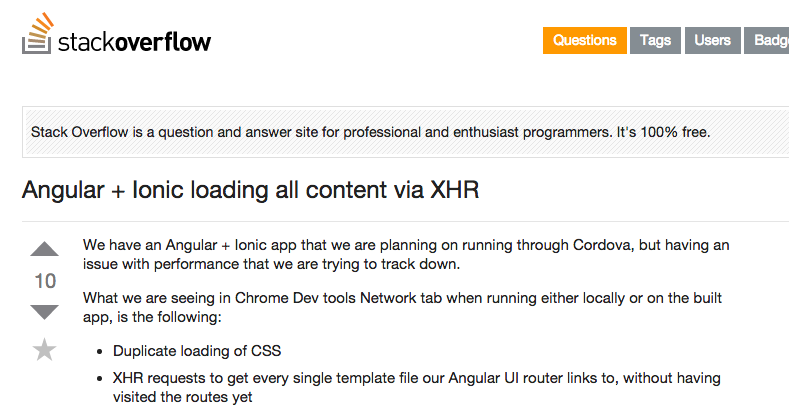

----

代码清单 5-4 展示了一个使用集合实现的投票程序：
对于每一项需要投票的内容，
这个程序都会使用两个集合来分别储存投支持票的用户以及投反对票的用户，
然后通过对这两个集合执行命令来实现投票、取消投票、统计投票数量、获取已投票用户名单等功能。

----

代码清单 5-4 使用集合实现的投票程序，用户可以选择支持或者反对一项内容：\ ``/set/vote.py``

.. literalinclude:: code/set/vote.py

----

以下代码展示了如何使用这个投票程序去记录一个问题的投票信息：

::

    >>> from redis import Redis
    >>> from vote import Vote
    >>> client = Redis(decode_responses=True)
    >>> question_vote = Vote(client, 'question::10086')  # 记录问题的投票信息
    >>> question_vote.vote_up('peter')    # 投支持票
    True
    >>> question_vote.vote_up('jack')
    True
    >>> question_vote.vote_up('tom')
    True
    >>> question_vote.vote_down('mary')  # 投反对票
    True
    >>> question_vote.vote_up_count()    # 统计支持票数量
    3
    >>> question_vote.vote_down_count()  # 统计反对票数量
    1
    >>> question_vote.get_all_vote_up_users()    # 获取所有投支持票的用户
    {'jack', 'peter', 'tom'}
    >>> question_vote.get_all_vote_down_users()  # 获取所有投反对票的用户
    {'mary'}

图 5-9 展示了这段代码创建出的两个集合，
以及这两个集合包含的元素。

----

图 5-9 投票程序创建出的两个集合

.. image:: image/set/IMAGE_VOTE_EXAMPLE.png

----

示例：社交关系
---------------------------------

微博、twitter 以及类似的社交网站都允许用户通过加关注或者加好友的方式，
构建一种社交关系：
这些网站上的每个用户都可以关注其他用户，
也可以被其他用户关注。
通过正在关注名单（following list），
用户可以查看自己正在关注的用户及其人数；
而通过关注者名单（follower llist），
用户可以查看有哪些人正在关注自己，
以及有多少人正在关注自己。

代码清单 5-5 展示了一个使用集合来记录社交关系的方法：

- 程序为每个用户维持两个集合，
  一个集合储存用户的正在关注名单，
  而另一个集合则储存用户的关注者名单。

- 当一个用户（关注者）关注另一个用户（被关注者）的时候，
  程序会将被关注者添加到关注者的正在关注名单里面，
  并将关注者添加到被关注者的关注者名单里面。

- 当关注者取消对被关注者的关注时，
  程序会将被关注者从关注者的正在关注名单中移除，
  并将关注者从被关注者的关注者名单中移除。

----

代码清单 5-5 使用集合实现社交关系：\ ``/set/relationship.py``

.. literalinclude:: code/set/relationship.py

----

以下代码展示了社交关系程序的基本使用方法：

::

    >>> from redis import Redis
    >>> from relationship import Relationship
    >>> client = Redis(decode_responses=True)
    >>> peter = Relationship(client, 'peter')  # 这个对象记录的是 peter 的社交关系
    >>> peter.follow('jack')  # 关注一些人
    >>> peter.follow('tom')
    >>> peter.follow('mary')
    >>> peter.get_all_following()  # 获取目前正在关注的所有人
    set(['mary', 'jack', 'tom'])
    >>> peter.count_following()    # 统计目前正在关注的人数
    3
    >>> jack = Relationship(client, 'jack')    # 这个对象记录的是 jack 的社交关系
    >>> jack.get_all_follower()    # peter 前面关注了 jack ，所以他是 jack 的关注者
    set(['peter'])
    >>> jack.count_follower()      # jack 目前只有一个关注者
    1

----

图 5-10 展示了以上代码创建的各个集合。

----

图 5-10 社交关系集合示例

.. image:: image/set/IMAGE_RELATIONSHIP_EXAMPLE.png

 
SRANDMEMBER：随机地获取集合中的元素
---------------------------------------------

通过使用 ``SRANDMEMBER`` 命令，
用户可以从集合里面随机地获取指定数量的元素。
``SRANDMEMBER`` 命令接受一个可选的 ``count`` 参数，
用于指定用户想要获取的元素数量，
如果用户没有给定这个参数，
那么 ``SRANDMEMBER`` 命令默认只获取一个元素：

::

    SRANDMEMBER set [count]

需要注意的一点是，
被 ``SRANDMEMBER`` 命令返回的元素仍然会存在于集合当中，
它们不会被移除。

举个例子，
对于包含以下元素的 ``databases`` 集合来说：

::

    redis> SMEMBERS databases
    1) "Neo4j"
    2) "Redis"
    3) "PostgreSQL"
    4) "CouchDB"
    5) "Oracle"
    6) "MS SQL"
    7) "MongoDB"
    8) "MySQL"

我们可以使用 ``SRANDMEMBER`` 命令去随机地获取集合包含的元素：

::

    redis> SRANDMEMBER databases
    "MySQL"

    redis> SRANDMEMBER databases
    "PostgreSQL"

    redis> SRANDMEMBER databases
    "Neo4j"

    redis> SRANDMEMBER databases
    "CouchDB"

再次提醒，
``SRANDMEMBER`` 命令不会移除被返回的集合元素，
这一点可以通过查看 ``databases`` 集合包含的元素来确认：

::

    redis> SMEMBERS databases  -- 集合包含的元素和执行 SRANDMEMBER 之前完全一样
    1) "Neo4j"
    2) "Redis"
    3) "PostgreSQL"
    4) "CouchDB"
    5) "Oracle"
    6) "MS SQL"
    7) "MongoDB"
    8) "MySQL"

返回指定数量的元素
^^^^^^^^^^^^^^^^^^^^^^^^^^^

通过可选的 ``count`` 参数，
用户可以指定 ``SRANDMEMBER`` 命令返回的元素数量，
其中 ``count`` 参数的值既可以是正数也可以是负数。

如果 ``count`` 参数的值为正数， 
那么 ``SRANDMEMBER`` 命令将返回 ``count`` 个不重复的元素：

::

    redis> SRANDMEMBER databases 2  -- 随机地返回两个不重复的元素
    1) "MySQL"
    2) "Oracle"

    redis> SRANDMEMBER databases 3  -- 随机地返回三个不重复的元素
    1) "PostgreSQL"
    2) "Oracle"
    3) "MS SQL"

当 ``count`` 参数的值大于集合包含的元素数量时，
``SRANDMEMBER`` 命令将返回集合包含的所有元素：

::

    redis> SRANDMEMBER databases 10
    1) "Neo4j"          -- 因为 databases 集合的元素数量少于 10 个
    2) "Redis"          -- 所以命令会返回集合包含的全部 8 个元素
    3) "PostgreSQL"    
    4) "CouchDB"
    5) "Oracle"
    6) "MongoDB"
    7) "MS SQL"
    8) "MySQL"

另一方面，
如果 ``count`` 参数的值为负数，
那么 ``SRANDMEMBER`` 命令将随机地返回 ``abs(count)`` 个元素（\ ``abs(count)`` 也即是 ``count`` 的绝对值），
并且在这些元素当中允许出现重复的元素：

::

    redis> SRANDMEMBER databases -3  -- 随机地返回三个可能会重复的元素
    1) "Neo4j"
    2) "CouchDB"
    3) "MongoDB"

    redis> SRANDMEMBER databases -5  -- 随机地返回五个可能会重复的元素
    1) "Neo4j"
    2) "MySQL"  -- 出现了两个 "MySQL" 元素
    3) "MySQL"
    4) "CouchDB"
    5) "Oracle"

因为 ``count`` 参数为负数的 ``SRANDMEMBER`` 命令允许返回重复元素， 
所以即使 ``abs(count)`` 的值大于集合包含的元素数量， 
``SRANDMEMBER`` 命令也会按照要求返回 ``abs(count)`` 个元素：

::

    redis> SRANDMEMBER databases -10  -- 随机地返回十个可能会相同的元素
    1) "Redis"
    2) "MySQL"
    3) "CouchDB"
    4) "PostgreSQL"
    5) "Neo4j"
    6) "MS SQL"
    7) "MS SQL"
    8) "MySQL"
    9) "Neo4j"
    10) "Redis"

其他信息
^^^^^^^^^^^^^^^

+---------------+---------------------------------------------------------------------------+
| 属性          | 值                                                                        |
+===============+===========================================================================+
| 复杂度        | O(N)，其中 N 为被返回的元素数量。                                         |
+---------------+---------------------------------------------------------------------------+
| 版本要求      | 不带 ``count`` 参数的 ``SRANDMEMBER`` 命令从 Redis 1.0.0 版本开始可用；   |
|               | 带有 ``count`` 参数的 ``SRANDMEMBER`` 命令从 Redis 2.6.0 版本开始可用。   |
+---------------+---------------------------------------------------------------------------+

SPOP：随机地从集合里面移除指定数量的元素
--------------------------------------------------

通过使用 ``SPOP`` 命令，
用户可以从集合里面随机地移除指定数量的元素。
``SPOP`` 命令接受一个可选的 ``count`` 参数，
用于指定需要被移除的元素数量；
如果用户没有给定这个参数，
那么 ``SPOP`` 命令默认只移除一个元素：

::

    SPOP key [count]

``SPOP`` 命令会返回被移除的元素作为命令的返回值。

举个例子，
对于包含以下元素的 ``databases`` 集合来说：

::

    redis> SMEMBERS databases
    1) "MS SQL"
    2) "MongoDB"
    3) "Redis"
    4) "Neo4j"
    5) "PostgreSQL"
    6) "MySQL"
    7) "Oracle"
    8) "CouchDB"

我们可以使用 ``SPOP`` 命令随机地移除 ``databases`` 集合中的元素：

::

    redis> SPOP databases      -- 随机地移除一个元素
    "CouchDB"                  -- 被移除的是 "CouchDB" 元素

    redis> SPOP databases      -- 随机地移除一个元素
    "Redis"                    -- 被移除的是 "Redis" 元素

    redis> SPOP databases 3    -- 随机地移除三个元素
    1) "Neo4j"                 -- 被移除的元素是 "Neo4j" 、 "PostgreSQL" 和 "MySQL"
    2) "PostgreSQL"
    3) "MySQL"

图 5-11 展示了 ``databases`` 集合在执行各个 ``SPOP`` 命令时的变化过程。

----

图 5-11 ``databases`` 集合在执行 ``SPOP`` 命令时的变化过程

执行 ``SPOP`` 命令之前的 ``databases`` 集合

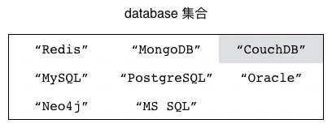

执行 ``SPOP databases`` ，导致元素 ``"CouchDB"`` 被移除

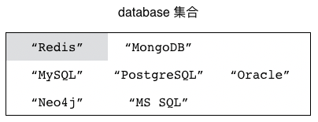

执行 ``SPOP databases`` ，导致元素 ``"Redis"`` 被移除

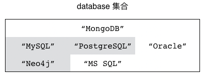

执行 ``SPOP databases 3`` ，导致元素 ``"Neo4j"`` 、 ``"PostgreSQL"`` 和 ``"MySQL"`` 被移除

.. image:: image/set/IMAGE_SPOP_4.png

``SPOP`` 与 ``SRANDMEMBER`` 的区别
^^^^^^^^^^^^^^^^^^^^^^^^^^^^^^^^^^^^^^^^^^^^

``SPOP`` 命令和 ``SRANDMEMBER`` 命令的主要区别在于：
``SPOP`` 命令会移除被随机选中的元素，
而 ``SRANDMEMBER`` 命令则不会移除被随机选中的元素。

通过查看 ``databases`` 集合目前包含的元素，
我们可以证实之前被 ``SPOP`` 命令选中的元素已经不再存在于集合当中：

::

    redis> SMEMBERS databases
    1) "MS SQL"
    2) "MongoDB"
    3) "Oracle"

``SPOP`` 命令和 ``SRANDMEMBER`` 命令之间的另一个不同在于，
``SPOP`` 命令只接受正数 ``count`` 值，
尝试向 ``SPOP`` 命令提供负数 ``count`` 值将引发错误，
因为负数 ``count`` 值对于 ``SPOP`` 命令是没有意义的：

::

    redis> SPOP databases -3
    (error) ERR index out of range

其他信息
^^^^^^^^^^^^^^^^^

+---------------+-------------------------------------------------------------------+
| 属性          | 值                                                                |
+===============+===================================================================+
| 复杂度        | O(N)，其中 N 为被移除的元素数量。                                 |
+---------------+-------------------------------------------------------------------+
| 版本要求      | 不带 ``count`` 参数的 ``SPOP`` 命令从 Redis 1.0.0 版本开始可用；  |
|               | 带有 ``count`` 参数的 ``SPOP`` 命令从 Redis 3.2.0 版本开始可用。  |
+---------------+-------------------------------------------------------------------+

示例：抽奖
------------------

为了推销商品并反馈消费者，
商家经常会举办一些抽奖活动，
每个符合条件的消费者都可以参加这种抽奖，
而商家则需要从所有参加抽奖的消费者里面选出指定数量的获奖者，
并给他们赠送物品、金钱或者购物优惠。

代码清单 5-6 展示了一个使用集合实现的抽奖程序，
这个程序会把所有参与抽奖活动的玩家都添加到一个集合里面，
然后通过 ``SRANDMEMBER`` 命令随机地选出获奖者。

----

代码清单 5-6 使用集合实现的抽奖程序：\ ``/set/lottery.py``

.. literalinclude:: code/set/lottery.py

----

考虑到保留完整的抽奖者名单可能会有用，
所以这个抽奖程序使用了随机地获取元素的 ``SRANDMEMBER`` 命令而不是随机地移除元素的 ``SPOP`` 命令；
在不需要保留完整的抽奖者名单的情况下，
我们也可以使用 ``SPOP`` 命令去实现抽奖程序。

以下代码简单地展示了这个抽奖程序的使用方法：

::

    >>> from redis import Redis
    >>> from lottery import Lottery
    >>> client = Redis(decode_responses=True)
    >>> lottery = Lottery(client, 'birthday party lottery')  # 这是一次生日派对抽奖活动
    >>> lottery.add_player('peter')  # 添加抽奖者
    >>> lottery.add_player('jack')
    >>> lottery.add_player('tom')
    >>> lottery.add_player('mary')
    >>> lottery.add_player('dan')
    >>> lottery.player_count()       # 查看抽奖者数量
    5
    >>> lottery.draw(1)  # 抽取一名获奖者
    ['dan']              # dan 中奖了！
        

SINTER、SINTERSTORE：对集合执行交集计算
----------------------------------------------------

``SINTER`` 命令可以计算出用户给定的所有集合的交集，
然后返回这个交集包含的所有元素：

::

    SINTER set [set ...]

比如对于以下这两个集合来说：

::

    redis> SMEMBERS s1
    1) "a"
    2) "b"
    3) "c"
    4) "d"

    redis> SMEMBERS s2
    1) "c"
    2) "d"
    3) "e"
    4) "f"

我们可以通过执行以下命令，
计算出这两个集合的交集：

::

    redis> SINTER s1 s2
    1) "c"
    2) "d"

从结果可以看出，
``s1`` 和 ``s2`` 的交集包含了 ``"c"`` 和 ``"d"`` 这两个元素。

``SINTERSTORE`` 命令
^^^^^^^^^^^^^^^^^^^^^^^^^^^^^^

除了 ``SINTER`` 命令之外，
Redis 还提供了 ``SINTERSTORE`` 命令，
这个命令可以把给定集合的交集计算结果储存到指定的键里面：

::

    SINTERSTORE destination_key set [set ...]

如果给定的键已经存在，
那么 ``SINTERSTORE`` 命令在执行储存操作之前会先删除已有的键。
``SINTERSTORE`` 命令在执行完毕之后会返回被储存的交集元素数量作为返回值。

比如说，
通过执行以下命令，
我们可以把 ``s1`` 和 ``s2`` 的交集计算结果储存到集合 ``s1-inter-s2`` 里面：

::

    redis> SINTERSTORE s1-inter-s2 s1 s2
    (integer) 2  -- 交集包含两个元素

    redis> SMEMBERS s1-inter-s2
    1) "c"
    2) "d"

其他信息
^^^^^^^^^^^^^^^^^

+---------------+---------------------------------------------------------------------------------------+
| 属性          | 值                                                                                    |
+===============+=======================================================================================+
| 复杂度        | ``SINTER`` 命令和 ``SINTERSTORE`` 命令的复杂度都是 O(N*M)，                           |
|               | 其中 N 为给定集合的数量，                                                             |
|               | 而 M 则是所有给定集合当中，                                                           |
|               | 包含元素最少的那个集合的大小。                                                        |
+---------------+---------------------------------------------------------------------------------------+
| 版本要求      | ``SINTER`` 命令和 ``SINTERSTORE`` 命令从 Redis 1.0.0 版本开始可用。                   |
+---------------+---------------------------------------------------------------------------------------+

SUNION、SUNIONSTORE：对集合执行并集计算
----------------------------------------------------

``SUNION`` 命令可以计算出用户给定的所有集合的并集，
然后返回这个并集包含的所有元素：

::

    SUNION set [set ...]

比如对于以下这两个集合来说：

::

    redis> SMEMBERS s1
    1) "a"
    2) "b"
    3) "c"
    4) "d"

    redis> SMEMBERS s2
    1) "c"
    2) "d"
    3) "e"
    4) "f"

我们可以通过执行以下命令，
计算出这两个集合的并集：

::

    redis> SUNION s1 s2
    1) "a"
    2) "b"
    3) "c"
    4) "d"
    5) "e"
    6) "f"

从结果可以看出，
``s1`` 和 ``s2`` 的并集共包含六个元素。

``SUNIONSTORE`` 命令
^^^^^^^^^^^^^^^^^^^^^^^^^^^^^^

跟 ``SINTERSTORE`` 命令类似，
Redis 也为 ``SUNION`` 提供了相应的 ``SUNIONSTORE`` 命令，
这个命令可以把给定集合的并集计算结果储存到指定的键里面，
并在键已经存在的情况下，
自动覆盖已有的键：

::

    SUNIONSTORE destination_key set [set ...]

``SUNIONSTORE`` 命令在执行完毕之后，
将返回并集元素的数量作为返回值。

比如说，
通过执行以下命令，
我们可以把 ``s1`` 和 ``s2`` 的并集计算结果储存到集合 ``s1-union-s2`` 里面：

::

    redis> SUNIONSTORE s1-union-s2 s1 s2
    (integer) 6  -- 并集共包含六个元素

    redis> SMEMBERS s1-union-s2
    1) "a"
    2) "b"
    3) "c"
    4) "d"
    5) "e"
    6) "f"

其他信息
^^^^^^^^^^^^^^^^^

+---------------+-----------------------------------------------------------------------+
| 属性          | 值                                                                    |
+===============+=======================================================================+
| 复杂度        | ``SUNION`` 命令和 ``SUNIONSTORE`` 命令的复杂度都是 O(N) ，            |
|               | 其中 N 为所有给定集合包含的元素数量总和。                             |
+---------------+-----------------------------------------------------------------------+
| 版本要求      | ``SUNION`` 命令和 ``SUNIONSTORE`` 命令从 Redis 1.0.0 版本开始可用。   |
+---------------+-----------------------------------------------------------------------+

SDIFF、SDIFFSTORE：对集合执行差集计算
----------------------------------------------------

``SDIFF`` 命令可以计算出给定集合之间的差集，
并返回差集包含的所有元素：

::

    SDIFF set [set ...]

``SDIFF`` 命令会按照用户给定集合的顺序，
从左到右依次地对给定的集合执行差集计算。

举个例子，
对于以下这三个集合来说：

::

    redis> SMEMBERS s1
    1) "a"
    2) "b"
    3) "c"
    4) "d"

    redis> SMEMBERS s2
    1) "c"
    2) "d"
    3) "e"
    4) "f"

    redis> SMEMBERS s3
    1) "b"
    2) "f"
    3) "g"

如果我们执行以下命令：

::

    redis> SDIFF s1 s2 s3
    1) "a"

那么 ``SDIFF`` 命令首先会对集合 ``s1`` 和集合 ``s2`` 执行差集计算，
得到一个包含元素 ``"a"`` 和 ``"b"`` 的临时集合，
然后再使用这个临时集合与集合 ``s3`` 执行差集计算。
换句话说，
这个 ``SDIFF`` 命令首先会计算出 ``s1-s2`` 的结果，
然后再计算 ``(s1-s2)-s3`` 的结果。

``SDIFFSTORE`` 命令
^^^^^^^^^^^^^^^^^^^^^^^^^^^^

跟 ``SINTERSTORE`` 命令和 ``SUNIONSTORE`` 命令一样，
Redis 也为 ``SDIFF`` 命令提供了相应的 ``SDIFFSTORE`` 命令，
这个命令可以把给定集合之间的差集计算结果储存到指定的键里面，
并在键已经存在的情况下，
自动覆盖已有的键：

::

    SDIFFSTORE destination_key set [set ...]

``SDIFFSTORE`` 命令会返回被储存的差集元素数量作为返回值。

作为例子，
以下代码展示了怎样将集合 ``s1`` 、 ``s2`` 、 ``s3`` 的差集计算结果储存到集合 ``diff-result`` 里面：

::

    redis> SDIFFSTORE diff-result s1 s2 s3
    (integer) 1  -- 计算出的差集只包含一个元素

    redis> SMEMBERS diff-result
    1) "a"

其他信息
^^^^^^^^^^^^^^^^^^

+---------------+-------------------------------------------------------------------+
| 属性          | 值                                                                |
+===============+===================================================================+
| 复杂度        | ``SDIFF`` 命令和 ``SDIFFSTORE`` 命令的复杂度都是 O(N) ，          |
|               | 其中 N 为所有给定集合包含的元素数量总和。                         |
+---------------+-------------------------------------------------------------------+
| 版本要求      | ``SDIFF`` 命令和 ``SDIFFSTORE`` 命令从 Redis 1.0.0 版本开始可用。 |
+---------------+-------------------------------------------------------------------+

.. note:: 执行集合计算的注意事项

    因为对集合执行交集、并集、差集等集合计算需要耗费大量的资源，
    所以在有可能的情况下，
    用户都应该尽量使用 ``SINTERSTORE`` 等命令来储存并重用计算结果，
    而不要每次都重复进行计算。

    此外，
    当集合计算涉及的元素数量非常巨大时，
    Redis 服务器在进行计算时可能会被阻塞。
    这时，
    我们可以考虑使用 Redis 的复制功能，
    通过从服务器来执行集合计算任务，
    从而确保主服务器可以继续处理其他客户端发送的命令请求。

    本书将在之后的《复制》一章中对 Redis 的复制功能进行介绍。

   
示例：共同关注与推荐关注
------------------------------------

在前面的内容中，
我们学习了如何使用集合去储存社交网站的好友关系，
但是除了基本的关注和被关注之外，
社交网站通常还会提供一些额外的功能，
帮助用户去发现一些自己可能会感兴趣的人。

比如说，
当我们在微博上访问某个用户的个人页面时，
页面上就会展示出我们和这个用户都在关注的人，
就像图 5-12 所示那样。

----

图 5-12 微博上的共同关注示例

----

除了共同关注之外，
一些社交网站还会通过算法和数据分析，
为用户推荐一些他可能会感兴趣的人，
比如图 5-13 就展示了 twitter 是如何向用户推荐他可能会感兴趣的关注对象的。

----

图 5-13 twitter 的推荐关注功能示例

.. image:: image/set/IMAGE_TWITTER_RECOMMEND_FOLLOW.png

----

在接下来的两个小节中，
我们将分别学习如何使用集合去实现以上展示的共同关注功能和推荐关注功能。

共同关注
^^^^^^^^^^^^^^^^^^

要实现共同关注功能，
程序需要做的就是计算出两个用户的正在关注集合之间的交集，
这一点可以通过前面介绍的 ``SINTER`` 命令和 ``SINTERSTORE`` 命令来完成，
代码清单 5-7 展示了使用这一原理实现的共同关注程序。

----

代码清单 5-7 共同关注功能的实现：\ ``/set/common_following.py``

.. literalinclude:: code/set/common_following.py

----

以下代码展示了共同关注程序的具体用法：

::

    >>> from redis import Redis
    >>> from relationship import Relationship
    >>> from common_following import CommonFollowing
    >>> client = Redis(decode_responses=True)
    >>> peter = Relationship(client, "peter")
    >>> jack = Relationship(client, "jack")
    >>> peter.follow("tom")   # peter 关注一些用户
    >>> peter.follow("david")
    >>> peter.follow("mary")
    >>> jack.follow("tom")    # jack 关注一些用户
    >>> jack.follow("david")
    >>> jack.follow("lily")
    >>> common_following = CommonFollowing(client)
    >>> common_following.calculate("peter", "jack")  # 计算 peter 和 jack 的共同关注用户
    set(['tom', 'david'])                            # 他们都关注了 tom 和 david

推荐关注
^^^^^^^^^^^^^^^^^^^^^^^^^^

代码清单 5-8 展示了一个推荐关注程序的实现代码，
这个程序会从用户的正在关注集合中随机地选出指定数量的人作为种子用户，
然后对这些种子用户的正在关注集合执行并集计算，
最后再从这个并集里面随机地选出一些人作为推荐关注的对象。

----

代码清单 5-8 推荐关注功能的实现：\ ``/set/recommend_follow.py``

.. literalinclude:: code/set/recommend_follow.py

----

以下代码展示了这个推荐关注程序的使用方法：

::

    >>> from redis import Redis
    >>> from recommend_follow import RecommendFollow
    >>> client = Redis(decode_responses=True)
    >>> recommend_follow = RecommendFollow(client, "peter")
    >>> recommend_follow.calculate(3)       # 随机选择 3 个正在关注的人作为种子用户
    30
    >>> recommend_follow.fetch_result(10)   # 获取 10 个推荐关注对象
    ['D6', 'M0', 'S4', 'M1', 'S8', 'M3', 'S3', 'M7', 'M4', 'D7']

在执行这段代码之前，
用户 ``peter`` 关注了 ``tom`` 、 ``david`` 、 ``jack`` 、 ``mary`` 和 ``sam`` 这五个用户，
而这五个用户又分别关注了如图 5-14 所示的一些用户，
从结果来看，
推荐程序随机选中了 ``david`` 、 ``sam`` 和 ``mary`` 作为种子用户，
然后又从这三个用户的正在关注集合的并集中，
随机地选出了 10 个人作为 ``peter`` 的推荐关注对象。

----

图 5-14 ``peter`` 的正在关注关系图

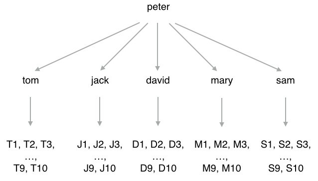

----

需要注意的是，
这里展示的推荐关注程序使用的是非常简单的推荐算法，
它假设用户会对自己正在关注的人的关注对象感兴趣，
但实际的情况可能并非如此。
为了获得更为精准的推荐效果，
实际的社交网站通常会使用更为复杂的推荐算法，
有兴趣的读者可以自行查找这方面的资料。

示例：使用反向索引构建商品筛选器
------------------------------------------

在光顾网店或者购物网站的时候，
我们经常会看见图 5-15 这样的商品筛选器，
对于不同的条件，
这些筛选器会给出不同的选项，
用户可以通过点击不同的选项来快速找到自己想要的商品。

----

图 5-15 笔记本电脑商品筛选器

----

比如对于图 5-15 展示的笔记本电脑筛选器来说，
如果我们点击图中“品牌”一栏的“ThinkPad”图标，
那么筛选器将只在页面里展示 ThinkPad 品牌的笔记本电脑。
如果我们继续点击“尺寸”一栏中的“13.3英寸”选项，
那么筛选器将只在页面里展示 ThinkPad 品牌的 13.3 英寸笔记本电脑，
诸如此类。

实现商品筛选器的其中一种方法是使用反向索引，
这种数据结构可以为每个物品添加多个关键字，
然后根据关键字去反向地获取相应的物品。
举个例子，
对于 ``"X1 Carbon"`` 这台笔记本电脑来说，
我们可以为它添加 ``"ThinkPad"`` 、 ``"14inch"`` 、 ``"Windows"`` 等关键字，
然后通过这些关键字来反向获取 ``"X1 Carbon"`` 这台电脑。

实现反向索引的关键是要在物品和关键字之间构建起双向的映射关系，
比如对于刚刚提到的 ``"X1 Carbon"`` 电脑来说，
反向索引程序需要构建出图 5-16 所示的两种映射关系：

- 第一种映射关系将 ``"X1 Carbon"`` 映射至它带有的各个关键字；

- 而第二种映射关系则将 ``"ThinkPad"`` 、 ``"14inch"`` 、 ``"Windows"`` 等多个关键字映射至 ``"X1 Carbon"`` 。 

----

图 5-16 X1 Carbon 电脑及其关键字的映射关系

.. image:: image/set/IMAGE_X1_INDEX_1.png

.. image:: image/set/IMAGE_X1_INDEX_2.png

----

代码清单 5-9 展示了一个使用集合实现的反向索引程序，
对于用户给定的每一件物品，
这个程序都会使用一个集合去储存物品带有的多个关键字；
与此同时，
对于这件物品的每一个关键字，
程序都会使用一个集合去储存关键字与物品之间的映射。
因为构建反向索引所需的这两种映射都是一对多映射，
所以使用集合来储存这两种映射关系的做法是可行的。

----

代码清单 5-9 反向索引程序：\ ``/set/inverted_index.py``

.. literalinclude:: code/set/inverted_index.py

----

为了测试这个反向索引程序，
我们在以下代码中，
把一些笔记本电脑产品的名称及其关键字添加到了反向索引里面：

::

    >>> from redis import Redis
    >>> from inverted_index import InvertedIndex
    >>> client = Redis(decode_responses=True)
    >>> laptops = InvertedIndex(client)
    >>> laptops.add_index("MacBook Pro", "Apple", "MacOS", "13inch")  # 为电脑及其关键字建立索引
    3
    >>> laptops.add_index("MacBook Air", "Apple", "MacOS", "13inch")
    3
    >>> laptops.add_index("X1 Carbon", "ThinkPad", "Windows", "13inch")
    3
    >>> laptops.add_index("T450", "ThinkPad", "Windows", "14inch")
    3
    >>> laptops.add_index("XPS", "DELL", "Windows", "13inch")
    3

在此之后，
我们可以通过以下语句来找出 ``"T450"`` 电脑带有的所有关键字：

::

    >>> laptops.get_keywords("T450")
    set(['Windows', '14inch', 'ThinkPad'])

也可以使用以下语句来找出所有屏幕大小为 13 英寸的笔记本电脑：

::

    >>> laptops.get_items("13inch")
    set(['MacBook Pro', 'X1 Carbon', 'MacBook Air', 'XPS'])

还可以使用以下语句来找出所有屏幕大小为 13 英寸并且使用 Windows 系统的笔记本电脑：

::

    >>> laptops.get_items("13inch", "Windows")
    set(['XPS', 'X1 Carbon'])

或者使用以下语句来找出所有屏幕大小为 13 英寸并且使用 Windows 系统的 ThinkPad 品牌笔记本电脑：

::

    >>> laptops.get_items("13inch", "Windows", "ThinkPad")
    set(['X1 Carbon'])

图 5-17 展示了以上代码在数据库中为物品创建的各个集合，
而图 5-18 则展示了以上代码在数据库中为关键字创建的各个集合。

----

图 5-17 反向索引程序为物品创建的集合

.. image:: image/set/IMAGE_II_ITEM_INDEX.png

----

图 5-18 反向索引程序为关键字创建的集合

.. image:: image/set/IMAGE_II_KEYWORD_INDEX.png

重点回顾
--------------------

- 集合允许用户储存任意多个各不相同的元素。

- 所有针对单个元素的集合操作，复杂度都为 O(1) 。

- 在使用 ``SADD`` 命令向集合中添加元素时，
  已存在于集合中的元素会自动被忽略。

- 因为集合以无序的方式储存元素，
  所以两个包含相同元素的集合在使用 ``SMEMBERS`` 命令时可能会得到不同的结果。

- ``SRANDMEMBER`` 命令不会移除被随机选中的元素，
  而 ``SPOP`` 命令的做法则与此相反。

- 因为集合计算需要使用大量的计算资源，
  所以我们应该尽量储存并重用集合计算的结果，
  在有需要的情况下，
  还可以把集合计算放到从服务器中进行。

