字符串（String）
====================

字符串键是 Redis 最基本的键值对类型，
这种类型的键值对会在数据库里面把单独的一个键和单独的一个值关联起来，
被关联的键和值既可以是普通的文字数据，
也可以是图片、视频、音频、压缩文件等更为复杂的二进制数据。

作为例子，
图 2-1 展示了数据库视角下的四个字符串键，
其中：

- 与键 ``"message"`` 相关联的值是 ``"hello world"`` ；

- 与键 ``"number"`` 相关联的值是 ``"10086"`` ；

- 与键 ``"homepage"`` 相关联的值是 ``"redis.io"`` ；

- 与键 ``"redis-logo.jpg"`` 相关联的值是二进制数据 ``"\xff\xd8\xff\xe0\x00\x10JFIF\x00..."`` 。

----

图 2-1 数据库中的字符串键示例

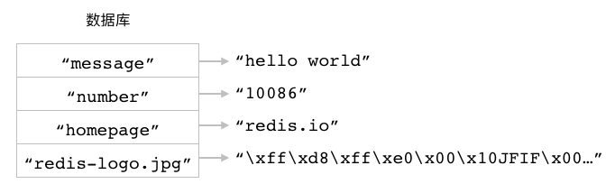

----

Redis 为字符串键提供了一系列操作命令，
通过使用这些命令，
用户可以：

- 为字符串键设置值。

- 获取字符串键的值。

- 在获取旧值的同时为字符串键设置新值。

- 同时为多个字符串键设置值，或者同时获取多个字符串键的值。

- 取得字符串值的长度。

- 获取字符串值指定索引范围上的内容，或者对字符串值指定索引范围上的内容进行修改。

- 将一些内容追加到字符串值的末尾。

- 对字符串键储存的整数值或者浮点数值执行加法操作或减法操作。

本章接下来将对以上提到的这些字符串键命令进行介绍，
并演示如何使用这些命令去解决各种实际的问题。

SET：为字符串键设置值
-------------------------------

创建字符串键最常用的方法就是使用 ``SET`` 命令，
这个命令可以为一个字符串键设置相应的值。
在最基本的情况下，
用户只需要向 ``SET`` 命令提供一个键和一个值就可以了：

::

    SET key value

跟之前提到过的一样，
这里的键和值既可以是文字也可以是二进制数据。

``SET`` 命令在成功创建字符串键之后将返回 ``OK`` 作为结果。
比如说，
通过执行以下命令，
我们可以创建出一个字符串键，
它的键为 ``"number"`` ，
值为 ``"10086"`` ：

::

    redis> SET number "10086"
    OK

又比如说，
通过执行以下命令，
我们可以创建出一个键为 ``"book"`` ，
值为 ``"The Design and Implementation of Redis"`` 的字符串键：

::

    redis> SET book "The Design and Implementation of Redis"
    OK

.. TODO 添加输入格式的解释，比如为什么不给键添加双引号（只有在键包含空格时，双引号才是必须的），以及数字是否加双引号都可以——因为Redis会自动把它转换为字符表示（也即是自动加上双引号）。

图 2-2 和图 2-3 分别展示了数据库在以上两条 ``SET`` 命令执行之前以及执行之后的状态。

----

图 2-2 执行 ``SET`` 命令之前，数据库的状态

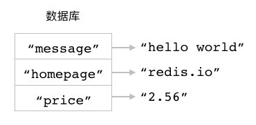

----

图 2-3 执行 ``SET`` 命令之后，数据库的状态

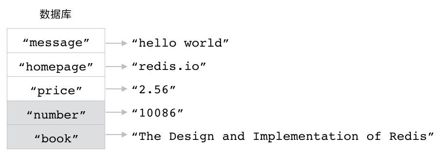

----

.. note:: 数据库键的存放方式

    为了方便阅读，
    本书总会将数据库中新出现的键放置到已有键的下方。
    比如在上面展示的数据库图 2-3 里面，
    我们就将新添加的 ``"number"`` 键和 ``"book"`` 键放置到了已有键的下方。

    在实际中，
    Redis 数据库是以无序的方式存放数据库键的，
    一个新加入的键可能会出现在数据库的任何位置上，
    因此我们在使用 Redis 的过程中不应该对键在数据库中的摆放位置做任何假设，
    以免造成错误。

改变覆盖规则
^^^^^^^^^^^^^^^^^^^^^^^^^^^^^^^^^^^

在默认情况下，
对一个已经设置了值的字符串键执行 ``SET`` 命令将导致键的旧值被新值覆盖。

举个例子，
如果我们连续执行以下两条 ``SET`` 命令，
那么第一条 ``SET`` 命令设置的值将被第二条 ``SET`` 命令设置的值所覆盖：

::

    redis> SET song_title "Get Wild"
    OK

    redis> SET song_title "Running to Horizon"
    OK

在第二条 ``SET`` 命令执行完毕之后，
``song_title`` 键的值将从原来的 ``"Get Wild"`` 变为 ``"Running to Horizon"`` 。

从 Redis 2.6.12 版本开始，
用户可以通过向 ``SET`` 命令提供可选的 ``NX`` 选项或者 ``XX`` 选项来指示 ``SET`` 命令是否要覆盖一个已经存在的值：

::

    SET key value [NX|XX]

..
    TODO 添加命令格式的说明
    使用竖线 ``|`` 分隔开 ``NX`` 选项和 ``XX`` 选项，
    这表示用户每次只能使用这两个选项中的一个；
    而使用中括号 ``[]`` 包围起 ``NX|XX`` 则表示 ``NX`` 和 ``XX`` 都是可选的选项/参数。
    本书后续在介绍其他命令的时候也会继续沿用这一格式。

如果用户在执行 ``SET`` 命令时给定了 ``NX`` 选项，
那么 ``SET`` 命令只会在键没有值的情况下执行设置操作，
并返回 ``OK`` 表示设置成功；
如果键已经存在，
那么 ``SET`` 命令将放弃执行设置操作，
并返回空值 ``nil`` 表示设置失败。

以下代码展示了带有 ``NX`` 选项的 ``SET`` 命令的行为：

::

    redis> SET password "123456" NX
    OK    -- 对尚未有值的 password 键进行设置，成功 

    redis> SET password "999999" NX
    (nil)    -- password 键已经有了值，设置失败

因为第二条 ``SET`` 命令没有改变 ``password`` 键的值，
所以 ``password`` 键的值仍然是刚开始时设置的 ``"123456"`` 。

另一方面，
如果用户在执行 ``SET`` 命令时给定了 ``XX`` 选项，
那么 ``SET`` 命令只会在键已经有值的情况下执行设置操作，
并返回 ``OK`` 表示设置成功；
如果给定的键并没有值，
那么 ``SET`` 命令将放弃执行设置操作，
并返回空值表示设置失败。

举个例子，
如果我们对一个没有值的键 ``mongodb-homepage`` 执行以下 ``SET`` 命令，
那么命令将因为 ``XX`` 选项的作用而放弃执行设置操作：

::

    redis> SET mongodb-homepage "mongodb.com" XX
    (nil)

相反地，
如果我们对一个已经有值的键执行带有 ``XX`` 选项的 ``SET`` 命令，
那么命令将使用新值去覆盖已有的旧值：

::

    redis> SET mysql-homepage "mysql.org"
    OK    -- 为键 mysql-homepage 设置一个值

    redis> SET mysql-homepage "mysql.com" XX
    OK    -- 对键的值进行更新

在第二条 ``SET`` 命令执行之后，
``mysql-homepage`` 键的值将从原来的 ``"mysql.org"`` 更新为 ``"mysql.com"`` 。

其他信息
^^^^^^^^^^^^^^^^^^^

+---------------+-------------------------------------------------------------------------------+
| 属性          | 值                                                                            |
+===============+===============================================================================+
| 复杂度        | O(1)                                                                          |
+---------------+-------------------------------------------------------------------------------+
| 版本要求      | 不带任何可选项的 ``SET`` 命令从 Redis 1.0.0 版本开始可用；                    |
|               | 带有 ``NX`` 、 ``XX`` 等可选项的 ``SET`` 命令从 Redis 2.6.12 版本开始可用。   |
+---------------+-------------------------------------------------------------------------------+

GET：获取字符串键的值
----------------------------

用户可以通过使用 ``GET`` 命令，
从数据库里面获取指定字符串键的值：

::

    GET key

``GET`` 命令接受一个字符串键作为参数，
然后返回与该键相关联的值。

比如对于图 2-4 所示的数据库来说，
我们可以通过执行以下 ``GET`` 命令来取得各个字符串键相关联的值：

::

    redis> GET message
    "hello world"

    redis> GET number
    "10086"

    redis> GET homepage
    "redis.io"

----

图 2-4 使用 ``GET`` 命令获取数据库键的值

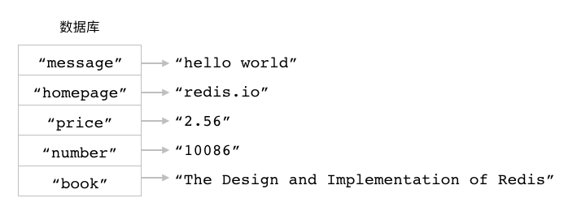

----

另一方面，
如果用户给定的字符串键在数据库中并没有与之相关联的值，
那么 ``GET`` 命令将返回一个空值：

::

    redis> GET date
    (nil)

上面这个 ``GET`` 命令的执行结果表示数据库中并不存在 ``date`` 键，
它也没有与之相关联的值。

因为 Redis 的数据库要求所有键必须拥有与之相关联的值，
所以如果一个键有值，
那么我们就说这个键存在于数据库；
相反地，
如果一个键没有值，
那么我们就说这个键不存在于数据库。
比如对于上面展示的几个键来说，
``date`` 键就不存在于数据库，
而 ``message`` 键、 ``number`` 键和 ``homepage`` 键则存在于数据库。

其他信息
^^^^^^^^^^^^^^^^^^^^^^^^

+-----------+---------------------------------------+
| 属性      | 值                                    |
+===========+=======================================+
| 复杂度    | O(1)                                  |
+-----------+---------------------------------------+
| 版本要求  | ``GET`` 命令从 Redis 1.0.0 开始可用。 |
+-----------+---------------------------------------+

GETSET：获取旧值并设置新值
------------------------------------------------------

``GETSET`` 命令就像 ``GET`` 命令和 ``SET`` 命令的组合版本，
它首先获取字符串键目前已有的值，
接着为键设置新值，
最后把之前获取到的旧值返回给用户：

::

    GETSET key new_value

以下代码展示了如何使用 ``GETSET`` 命令去获取 ``number`` 键的旧值并为它设置新值：

::

    redis> GET number    -- number 键现在的值为 "10086"
    "10086"

    redis> GETSET number "12345"
    "10086"    -- 返回旧值

    redis> GET number    -- number 键的值已被更新为 "12345"
    "12345"

另一方面，
如果被设置的键并不存在于数据库，
那么 ``GETSET`` 命令将返回空值作为键的旧值：

::

    redis> GET counter
    (nil)    -- 键不存在

    redis> GETSET counter 50
    (nil)    -- 返回空值作为旧值

    redis> GET counter
    "50"

其他信息
^^^^^^^^^^^^^^^^^

+---------------+-------------------------------------------+
| 属性          | 值                                        |
+===============+===========================================+
| 复杂度        | O(1)                                      |
+---------------+-------------------------------------------+
| 版本要求      | ``GETSET`` 命令从 Redis 1.0.0 开始可用。  |
+---------------+-------------------------------------------+

示例：缓存
-----------------------

对数据进行缓存是 Redis 最常见的用法之一：
因为 Redis 把数据储存在内存而不是硬盘上面，
并且访问内存数据的速度比访问硬盘数据的速度要快得多，
所以用户可以通过把需要快速访问的数据储存在 Redis 里面来提升应用程序访问这些数据时的速度。

代码清单 2-1 展示了一个使用 Redis 实现的缓存程序代码，
这个程序使用 ``SET`` 命令来将需要被缓存的数据储存到指定的字符串键里面，
并使用 ``GET`` 命令来从指定的字符串键里面获取被缓存的数据。

----

代码清单 2-1 使用字符串键实现的缓存程序：\ ``/string/cache.py``

.. literalinclude:: code/string/cache.py

----

除了用于设置缓存的 ``set()`` 方法以及用于获取缓存的 ``get()`` 方法之外，
缓存程序还提供了由 ``GETSET`` 命令实现的 ``update()`` 方法：
这个方法可以让用户在对缓存进行设置的同时，
获得之前被缓存的旧值。
用户可以根据自己的需要决定是使用 ``set()`` 方法还是 ``update()`` 方法对缓存进行设置。

以下代码展示了怎样使用这个程序来缓存一个 HTML 页面，
并在有需要时获取它：

::

    >>> from redis import Redis
    >>> from cache import Cache
    >>> client = Redis(decode_responses=True)  # 使用文本编码方式打开客户端
    >>> cache = Cache(client)
    >>> cache.set("greeting-page", "<html>
hello world
</html>")
    >>> cache.get("greeting-page")
    '<html>
hello world
</html>'
    >>> cache.update("greeting-page", "<html>
good morning
</html>")
    '<html>
hello world
</html>'
    >>> cache.get("greeting-page")
    '<html>
good morning
</html>'

因为 Redis 的字符串键不仅可以储存文本数据，
还可以储存二进制数据，
所以这个缓存程序不仅可以用来缓存网页等文本数据，
还可以用来缓存图片和视频等二进制数据。
比如说，
如果你正在运营一个图片网站，
那么你同样可以使用这个缓存程序来缓存网站上的热门图片，
从而提高用户访问这些热门图片的速度。

作为例子，
以下代码展示了将 Redis 的 Logo 图片缓存到键 ``redis-logo.jpg`` 里面的方法：

::

    >>> from redis import Redis
    >>> from cache import Cache
    >>> client = Redis()                      # 使用二进制编码方式打开客户端
    >>> cache = Cache(client)
    >>> image = open("redis-logo.jpg", "rb")  # 以二进制只读方式打开图片文件
    >>> data = image.read()                   # 读取文件内容
    >>> image.close()                         # 关闭文件
    >>> cache.set("redis-logo.jpg", data)     # 将内存缓存到键 redis-logo.jpg 里面
    >>> cache.get("redis-logo.jpg")[:20]      # 读取二进制数据的前 20 个字节
    b'\xff\xd8\xff\xe0\x00\x10JFIF\x00\x01\x01\x01\x00H\x00H\x00\x00'

.. note::

    在测试以上两段代码的时候，
    请务必以正确的编码方式打开客户端（第一段代码采用文本方式，第二段代码采用二进制方式），
    否则测试代码将会出现编码错误。

示例：锁
------------------

锁是一种同步机制，
它可以保证一项资源在任何时候只能被一个进程使用，
如果有其他进程想要使用相同的资源，
那么它们就必须等待，
直到正在使用资源的进程放弃使用权为止。

一个锁实现通常会有获取（acquire）和释放（release）这两种操作：

- 获取操作用于取得资源的独占使用权。
  在任何时候，
  最多只能有一个进程取得锁，
  我们把成功取得锁的这个进程称之为锁的持有者。
  在锁已经被持有的情况下，
  所有尝试再次获取锁的操作都会失败。

- 释放操作用于放弃资源的独占使用权，
  一般由锁的持有者调用。
  在锁被释放之后，
  其他进程就可以再次尝试获取这个锁了。

代码清单 2-2 展示了一个使用字符串键实现的锁程序，
这个程序会根据给定的字符串键是否有值来判断锁是否已经被获取，
而针对锁的获取操作和释放操作则是分别通过设置字符串键和删除字符串键来完成的。

----

代码清单 2-2 使用字符串键实现的锁程序：\ ``/string/lock.py``

.. literalinclude:: code/string/lock.py

----

获取操作 ``acquire()`` 方法是通过执行带有 ``NX`` 选项的 ``SET`` 命令来实现的：

::

    result = self.client.set(self.key, VALUE_OF_LOCK, nx=True)

``NX`` 选项的效果确保了代表锁的字符串键只会在没有值的情况下被设置：

- 如果给定的字符串键没有值，
  那么说明锁尚未被获取，
  ``SET`` 命令将执行设置操作，
  并将 ``result`` 变量的值设置为 ``True`` ；

- 与此相反，
  如果给定的字符串键已经有值了，
  那么说明锁已经被获取，
  ``SET`` 命令将放弃执行设置操作，
  并将 ``result`` 变量的值将为 ``None`` ；

``acquire()`` 方法最后会通过检查 ``result`` 变量的值是否为 ``True`` 来判断自己是否成功取得了锁。

释放操作 ``release()`` 方法使用了本书之前没有介绍过的 ``DEL`` 命令，
这个命令接受一个或多个数据库键作为参数，
尝试删除这些键以及与之相关联的值，
并返回被成功删除的键数量作为结果：

::

    DEL key [key ...]

因为 Redis 的 ``DEL`` 命令和 Python 的 ``del`` 关键字重名，
所以在 redis-py 客户端中，
执行 ``DEL`` 命令实际上是通过调用 ``delete()`` 方法来完成的：

::

    self.client.delete(self.key) == 1

``release()`` 方法通过检查 ``delete()`` 方法的返回值是否为 ``1`` 来判断删除操作是否执行成功：
如果用户尝试对一个尚未被获取的锁执行 ``release()`` 方法，
那么方法将返回 ``false`` ，
表示没有锁被释放。

在使用 ``DEL`` 命令删除代表锁的字符串键之后，
字符串键将重新回到没有值的状态，
这时用户就可以再次调用 ``acquire()`` 方法去获取锁了。

以下代码演示了这个锁的使用方法：

::

    >>> from redis import Redis
    >>> from lock import Lock
    >>> client = Redis(decode_responses=True)
    >>> lock = Lock(client, 'test-lock')
    >>> lock.acquire()  # 成功获取锁
    True
    >>> lock.acquire()  # 锁已被获取，无法再次获取
    False
    >>> lock.release()  # 释放锁
    True
    >>> lock.acquire()  # 锁释放之后可以再次被获取
    True

虽然代码清单 2-2 中展示的锁实现了基本的获取和释放功能，
但它并不完美：

1. 因为这个锁的释放操作无法验证进程的身份，
   所以无论执行释放操作的进程是否就是锁的持有者，
   锁都会被释放。
   如果锁被持有者以外的其他进程释放了的话，
   那么系统中可能就会同时出现多个锁，
   导致锁的唯一性被破坏。

2. 这个锁的获取操作不能设置最大加锁时间，
   它无法让锁在超过给定的时限之后自动释放。
   因此，
   如果持有锁的进程因为故障或者编程错误而没有在退出之前主动释放锁，
   那么锁就会一直处于已被获取的状态，
   导致其他进程永远无法取得锁。

本书后续将继续改进这个锁实现，
使得它可以解决这两个问题。

MSET：一次为多个字符串键设置值
----------------------------------------

除了 ``SET`` 命令和 ``GETSET`` 命令之外，
Redis 还提供了 ``MSET`` 命令用于对字符串键进行设置。
跟 ``SET`` 命令和 ``GETSET`` 命令只能设置单个字符串键的做法不同，
``MSET`` 命令可以一次为多个字符串键设置值：

::

    MSET key value [key value ...]

作为例子，
以下代码展示了如何使用一条 ``MSET`` 命令去设置 ``message`` 、 ``number`` 和 ``homepage`` 三个键：

::

    redis> MSET message "hello world" number "10086" homepage "redis.io"
    OK

    redis> GET message
    "hello world"

    redis> GET number
    "10086"

    redis> GET homepage
    "redis.io"

跟 ``SET`` 命令一样，
``MSET`` 命令也会在执行设置操作之后返回 ``OK`` 表示设置成功。
此外，
如果给定的字符串键已经有相关联的值，
那么 ``MSET`` 命令也会直接使用新值去覆盖已有的旧值。

比如以下代码就展示了怎样使用 ``MSET`` 命令去覆盖上一个 ``MSET`` 命令为 ``message`` 键和 ``number`` 键设置的值：

::

    redis> MSET message "good morning!" number "12345"
    OK

    redis> GET message
    "good morning!"

    redis> GET number
    "12345"

``MSET`` 命令除了可以让用户更为方便地执行多个设置操作之外，
还能够有效地提高程序的效率：
执行多条 ``SET`` 命令需要客户端和服务器之间进行多次网络通信，
并因此耗费大量的时间；
通过使用一条 ``MSET`` 命令去代替多条 ``SET`` 命令，
可以将原本所需的多次网络通信降低为只需一次网络通信，
从而有效地减少程序执行多个设置操作时所需的时间。

其他信息
^^^^^^^^^^^^^^^^^^

+---------------+-----------------------------------------------+
| 属性          | 值                                            |
+===============+===============================================+
| 复杂度        | O(N)，其中 N 为用户给定的字符串键数量。       |
+---------------+-----------------------------------------------+
| 版本要求      | ``MSET`` 命令从 Redis 1.0.1 开始可用。        |
+---------------+-----------------------------------------------+

MGET：一次获取多个字符串键的值
-------------------------------------------

``MGET`` 命令就是一个多键版本的 ``GET`` 命令，
它接受一个或多个字符串键作为参数，
并返回这些字符串键的值：

::

    MGET key [key ...]

``MGET`` 命令返回一个列表作为结果，
这个列表按照用户执行命令时给定键的顺序排列各个键的值：
比如说，
列表的第一个元素就是第一个给定键的值，
而列表的第二个元素则是第二个给定键的值，
以此类推。

作为例子，
以下代码展示了如何使用一条 ``MGET`` 命令去获取 ``message`` 、 ``number`` 和 ``homepage`` 三个键的值：

::

    redis> MGET message number homepage
    1) "hello world"    -- message 键的值
    2) "10086"          -- number 键的值
    3) "redis.io"       -- homepage 键的值

跟 ``GET`` 命令一样，
``MGET`` 命令在碰到不存在的键时也会返回空值：

::

    redis> MGET not-exists-key
    1) (nil)

跟 ``MSET`` 命令类似，
``MGET`` 命令也可以将执行多个获取操作所需的网络通信次数从原来的 N 次降低至只需一次，
从而有效地提高程序的运行效率。

其他信息
^^^^^^^^^^^^^^^^^

+-----------+-------------------------------------------+
| 属性      | 值                                        |
+===========+===========================================+
| 复杂度    | O(N)，其中 N 为用户给定的字符串键数量。   |
+-----------+-------------------------------------------+
| 版本要求  | ``MGET`` 命令从 Redis 1.0.0 开始可用。    |
+-----------+-------------------------------------------+

MSETNX：只在键不存在的情况下，一次为多个字符串键设置值
--------------------------------------------------------------------

``MSETNX`` 命令跟 ``MSET`` 命令一样，
都可以对多个字符串键进行设置：

::

    MSETNX key value [key value ...]

``MSETNX`` 跟 ``MSET`` 的主要区别在于 ``MSETNX`` 只会在所有给定键都不存在的情况下对键进行设置，
而不会像 ``MSET`` 那样直接覆盖键已有的值：
如果在给定键当中，
有哪怕一个键已经有值了，
那么 ``MSETNX`` 命令也会放弃对所有给定键的设置操作。
``MSETNX`` 命令在成功执行设置操作时返回 ``1`` ，
在放弃执行设置操作时则返回 ``0`` 。

在以下的这段代码中，
因为键 ``k4`` 已经存在，
所以 ``MSETNX`` 将放弃对键 ``k1`` 、 ``k2`` 、 ``k3`` 和 ``k4`` 进行设置操作：

::

    redis> MGET k1 k2 k3 k4
    1) (nil)            -- 键 k1 、 k2 和 k3 都不存在
    2) (nil)
    3) (nil)
    4) "hello world"    -- 键 k4 已存在

    redis> MSETNX k1 "one" k2 "two" k3 "three" k4 "four"
    (integer) 0    -- 因为键 k4 已存在，所以 MSETNX 未能执行设置操作

    redis> MGET k1 k2 k3 k4    -- 各个键的值没有变化
    1) (nil)
    2) (nil)
    3) (nil)
    4) "hello world"

但是如果我们只对不存在的键 ``k1`` 、 ``k2`` 和 ``k3`` 进行设置，
那么 ``MSETNX`` 可以正常地完成设置操作：

::

    redis> MSETNX k1 "one" k2 "two" k3 "three"
    (integer) 1    -- 所有给定键都不存在，成功执行设置操作

    redis> MGET k1 k2 k3 k4
    1) "one"            -- 刚刚使用 MSETNX 设置的三个值
    2) "two"
    3) "three"
    4) "hello world"    -- 之前已经存在的键 k4 的值没有改变

其他信息
^^^^^^^^^^^^^^^^^^

+---------------+-------------------------------------------+
| 属性          | 值                                        |
+===============+===========================================+
| 复杂度        | O(N)，其中 N 为用户给定的字符串键数量。   |
+---------------+-------------------------------------------+
| 版本要求      | ``MSETNX`` 命令从 Redis 1.0.1 开始可用。  |
+---------------+-------------------------------------------+

示例：储存文章信息
----------------------------

在构建应用程序的时候，
我们经常会需要批量地设置和获取多项信息。
以博客程序为例子：

- 当用户想要注册成为博客的作者时，
  程序就需要把这位作者的名字、账号、密码、注册时间等多项信息储存起来，
  并在用户登录的时候取出这些信息。

- 又比如说，
  当博客的作者想要撰写一篇新文章的时候，
  程序就需要把文章的标题、内容、作者、发表时间等多项信息储存起来，
  并在用户阅读文章的时候取出这些信息。

通过使用 ``MSET`` 命令、 ``MSETNX`` 命令以及 ``MGET`` 命令，
我们可以实现上面提到的这些批量设置操作和批量获取操作。
比如代码清单 2-3 就展示了一个文章储存程序，
这个程序使用 ``MSET`` 命令和 ``MSETNX`` 命令将文章的标题、内容、作者、发表时间等多项信息储存到不同的字符串键里面，
并通过 ``MGET`` 命令从这些键里面获取文章的各项信息。

----

代码清单 2-3 文章储存程序：\ ``/string/article.py``

::

    from time import time  # time() 函数用于获取当前 Unix 时间戳

    class Article:

        def __init__(self, client, article_id):
            self.client = client
            self.id = str(article_id)
            self.title_key = "article::" + self.id + "::title"
            self.content_key = "article::" + self.id + "::content"
            self.author_key = "article::" + self.id + "::author"
            self.create_at_key = "article::" + self.id + "::create_at"

        def create(self, title, content, author):
            """
            创建一篇新的文章，创建成功时返回 True ，
            因为文章已存在而导致创建失败时返回 False 。
            """
            article_data = {
                self.title_key: title,
                self.content_key: content,
                self.author_key: author,
                self.create_at_key: time()
            }
            return self.client.msetnx(article_data)

        def get(self):
            """
            返回 ID 对应的文章信息。
            """
            result = self.client.mget(self.title_key,
                                      self.content_key,
                                      self.author_key,
                                      self.create_at_key)
            return {"id": self.id, "title": result[0], "content": result[1], 
                    "author": result[2], "create_at": result[3]}

        def update(self, title=None, content=None, author=None):
            """
            对文章的各项信息进行更新，
            更新成功时返回 True ，失败时返回 False 。
            """
            article_data = {}
            if title is not None:
                article_data[self.title_key] = title
            if content is not None:
                article_data[self.content_key] = content
            if author is not None:
                article_data[self.author_key] = author
            return self.client.mset(article_data)

----

这个文章储存程序比较长，
让我们来逐个分析它的各项功能。
首先，
``Article`` 类的初始化方法 ``__init__()`` 接受一个 Redis 客户端和一个文章 ID 作为参数，
并将文章 ID 从数字转换为字符串：

::

    self.id = str(article_id)

接着程序会使用这个字符串格式的文章 ID ，
构建出用于储存文章各项信息的字符串键的键名：

::

    self.title_key = "article::" + self.id + "::title"
    self.content_key = "article::" + self.id + "::content"
    self.author_key = "article::" + self.id + "::author"
    self.create_at_key = "article::" + self.id + "::create_at"

在这些键当中，
第一个键将用于储存文章的标题，
第二个键将用于储存文章的内容，
第三个键将用于储存文章的作者，
而第四个键则会用于储存文章的创建时间。

当用户想要根据给定的文章 ID 创建具体的文章时，
他就需要调用 ``create()`` 方法，
并传入文章的标题、内容以及作者作为参数。
``create()`` 方法会把以上这些信息以及当前的 UNIX 时间戳放入到一个 Python 字典里面：

::

    article_data = {
        self.title_key: title,
        self.content_key: content,
        self.author_key: author,
        self.create_at_key: time()
    }

``article_data`` 字典的键储存了代表文章各项信息的字符串键的键名，
而与这些键相关联的则是这些字符串键将要被设置的值。
接下来，
程序会调用 ``MSETNX`` 命令，
对字典中给定的字符串键进行设置：

::

    self.client.msetnx(article_data)

因为 ``create()`` 方法的设置操作是通过 ``MSETNX`` 命令来进行的，
所以这一操作只会在所有给定字符串键都不存在的情况下进行：

- 如果给定的字符串键已经有值了，
  那么说明与给定 ID 相对应的文章已经存在。
  在这种情况下，
  ``MSETNX`` 命令将放弃执行设置操作，
  并且 ``create()`` 方法也会向调用者返回 ``False`` 表示文章创建失败。

- 与此相反，
  如果给定的字符串键尚未有值，
  那么 ``create()`` 方法将根据用户给定的信息创建文章，
  并在成功之后返回 ``True`` 。

在成功创建文章之后，
用户就可以使用 ``get()`` 方法去获取文章的各项信息了。
``get()`` 方法会调用 ``MGET`` 命令，
从各个字符串键里面取出文章的标题、内容、作者等信息，
并把这些信息储存到 ``result`` 列表中：

::

    result = self.client.mget(self.title_key,
                              self.content_key,
                              self.author_key,
                              self.create_at_key)

为了让用户可以更方便地访问文章的各项信息，
``get()`` 方法会将储存在 ``result`` 列表里面的文章信息放入到一个字典里面，
然后再返回给用户：

::

    return {"id": self.id, "title": result[0], "content": result[1], 
            "author": result[2], "create_at": result[3]}

这样做的好处有两点：

1. 它隐藏了 ``get()`` 方法由 ``MGET`` 命令实现这一底层细节。
   如果程序直接向用户返回 ``result`` 列表，
   那么用户就必须知道列表中的各个元素代表文章的哪一项信息，
   然后通过列表索引来访问文章的各项信息。
   这种做法非常不方便，
   而且也非常容易出错。

2. 返回一个字典可以让用户以 ``dict[key]`` 这样的方式去访问文章的各个属性，
   比如使用 ``article["title"]`` 去访问文章的标题，
   使用 ``article["content"]`` 去访问文章的内容，
   诸如此类，
   这使得针对文章数据的各项操作可以更方便地进行。

另外要注意的一点是，
虽然用户可以通过访问 ``Article`` 类的 ``id`` 属性来获得文章的 ID ，
但是为了方便起见，
``get()`` 方法在返回文章信息的时候也会将文章的 ID 包含在字典里面一并返回。

对文章信息进行更新的 ``update()`` 方法是整个程序最复杂的部分。
首先，
为了让用户可以自由选择需要更新的信息项，
这个函数在定义时使用了 Python 的具名参数特性：

::

    def update(self, title=None, content=None, author=None):

通过具名参数，
用户可以根据自己想要更新的文章信息项来决定传入哪个参数，
而不需要更新的信息项则会被赋予默认值 ``None`` ：

- 比如说，
  如果用户只想要更新文章的标题，
  那么只需要调用 ``update(title=new_title)`` 即可；

- 又比如说，
  如果用户想要同时更新文章的内容和作者，
  那么只需要调用 ``update(content=new_content, author=new_author)`` 即可；

诸如此类。

在定义了具名参数之后，
``update()`` 方法会检查各个参数的值，
并将那些不为 ``None`` 的参数以及与之相对应的字符串键键名放入到 ``article_data`` 字典里面：

::

    article_data = {}
    if title is not None:
        article_data[self.title_key] = title
    if content is not None:
        article_data[self.content_key] = content
    if author is not None:
        article_data[self.author_key] = author

``article_data`` 字典中的键就是需要更新的字符串键的键名，
而与之相关联的则是这些字符串键的新值。

在一切准备就绪之后，
``update()`` 方法会根据 ``article_data`` 字典中设置好的键值对，
调用 ``MSET`` 命令对文章进行更新：

::

    self.client.mset(article_data)

以下代码展示了这个文章储存程序的使用方法：

::

    >>> from redis import Redis
    >>> from article import Article
    >>> client = Redis(decode_responses=True)
    >>> article = Article(client, 10086)                   # 指定文章 ID
    >>> article.create('message', 'hello world', 'peter')  # 创建文章
    True
    >>> article.get()                                      # 获取文章
    {'id': '10086', 'title': 'message', 'content': 'hello world', 
     'author': 'peter', 'create_at': '1551199163.4296808'}
    >>> article.update(author="john")                      # 更新文章的作者
    True
    >>> article.get()                                      # 再次获取文章
    {'id': '10086', 'title': 'message', 'content': 'hello world', 
     'author': 'john', 'create_at': '1551199163.4296808'}

表 1-1 展示了上面这段代码创建出的键，以及这些键的值。

----

表 1-1 文章数据储存示例

+-------------------+-------------------------------+---------------------------+
| 被储存的内容      | 数据库中的键                  | 键的值                    |
+===================+===============================+===========================+
| 文章的标题        | ``article::10086::title``     | ``'message'``             |
+-------------------+-------------------------------+---------------------------+
| 文章的内容        | ``article::10086::content``   | ``'hello world'``         |
+-------------------+-------------------------------+---------------------------+
| 文章的作者        | ``article::10086::author``    | ``'john'``                |
+-------------------+-------------------------------+---------------------------+
| 文章的创建时间戳  | ``article::10086::create_at`` | ``'1461145575.631885'``   |
+-------------------+-------------------------------+---------------------------+

.. note:: 键的命名格式

    ``Article`` 程序使用了多个字符串键去储存文章信息，
    并且每个字符串键的名字都是以 ``article::<id>::<attribute>`` 格式命名的，
    这是一种 Redis 使用惯例：
    Redis 用户通常会为逻辑上相关联的键设置相同的前缀，
    并通过分隔符来区分键名的各个部分，
    以此来构建一种键的命名格式。

    比如对于 ``article::10086::title`` 、 ``article::10086::author`` 这些键来说，
    ``article`` 前缀表明这些键都储存着与文章信息相关的数据，
    而分隔符 ``::`` 则区分开了键名里面的前缀、ID 以及具体的属性。
    除了 ``::`` 符号之外，
    常用的键名分隔符还包括 ``.`` 符号，
    比如 ``article.10086.title`` ；
    或者 ``->`` 符号，
    比如 ``article->10086->title`` ；
    又或者 ``|`` 符号，
    比如 ``article|10086|title`` ；
    诸如此类。

    分隔符的选择通常只是一个个人喜好的问题，
    而键名的具体格式也可以根据需要进行构造：
    比如说，
    如果你不喜欢 ``article::<id>::<attribute>`` 格式，
    那么也可以考虑使用 ``article::<attribute>::<id>`` 格式，
    诸如此类。
    唯一需要注意的是，
    一个程序应该只使用一种键名分隔符，
    并且持续地使用同一种键名格式，
    以免造成混乱。

    通过使用相同的格式去命名逻辑上相关联的键，
    我们可以让程序产生的数据结构变得更容易被理解，
    并且在有需要的时候，
    还可以根据特定的键名格式，
    在数据库里面以模式匹配的方式查找指定的键。

STRLEN：获取字符串值的字节长度
--------------------------------------

通过对字符串键执行 ``STRLEN`` 命令，
用户可以取得字符串键储存的值的字节长度：

::

    STRLEN key

以下代码展示了如何使用 ``STRLEN`` 去获取不同字符串值的字节长度：

::

    redis> GET number
    "10086"

    redis> STRLEN number    -- number 键的值长 5 字节
    (integer) 5

    redis> GET message
    "hello world"

    redis> STRLEN message   -- message 键的值长 11 字节
    (integer) 11

    redis> GET book
    "The Design and Implementation of Redis"

    redis> STRLEN book      -- book 键的值长 38 字节
    (integer) 38

对于不存在的键，
``STRLEN`` 命令将返回 ``0`` ：

::

    redis> STRLEN not-exists-key
    (integer) 0

其他信息
^^^^^^^^^^^^^^

+-----------+-------------------------------------------+
| 属性      | 值                                        |
+===========+===========================================+
| 复杂度    | O(1)                                      |
+-----------+-------------------------------------------+
| 版本要求  | ``STRLEN`` 命令从 Redis 2.2.0 开始可用。  |
+-----------+-------------------------------------------+

字符串值的索引
---------------------

因为每个字符串都是由一系列连续的字节组成的，
所以字符串中的每个字节实际上都拥有与之相对应的索引。
Redis 为字符串键提供了一系列索引操作命令，
这些命令允许用户通过正数索引或者负数索引，
对字符串值的某个字节或者某个部分进行处理，
其中：

- 字符串值的正数索引以 0 为开始，
  从字符串的开头向结尾不断递增；

- 字符串值的负数索引以 -1 为开始，
  从字符串的结尾向开头不断递减。

图 2-5 就展示了值为 ``"hello world"`` 的字符串，
以及它的各个字节相对应的正数索引和负数索引。

----

图 2-5 字符串的索引示例

.. image:: image/string/IMAGE_STRING_INDEX.png

----

本章接下来将对 ``GETRANGE`` 和 ``SETRANGE`` 这两个字符串键的索引操作命令进行介绍。

GETRANGE：获取字符串值指定索引范围上的内容
--------------------------------------------------

通过使用 ``GETRANGE`` 命令，
用户可以获取字符串值从 ``start`` 索引开始，
直到 ``end`` 索引为止的所有内容：

::

    GETRANGE key start end

``GETRANGE`` 命令接受的是闭区间索引范围，
也即是说，
位于 ``start`` 索引和 ``end`` 索引上的值也会被包含在命令返回的内容当中。

举个例子，
以下代码展示了如何使用 ``GETRANGE`` 命令去获取 ``message`` 键的值的不同部分：

::

    redis> GETRANGE message 0 4     -- 获取字符串值索引 0 至索引 4 上的内容
    "hello"

    redis> GETRANGE message 6 10    -- 获取字符串值索引 6 至索引 10 上的内容
    "world"

    redis> GETRANGE message 3 7     -- 获取字符串值的中间部分
    "lo wo"

    redis> GETRANGE message -11 -7  -- 使用负数索引获取指定内容
    "hello"

图 2-6 展示了上面的这四个命令是如何根据索引去获取值的内容的。

----

图 2-6 ``GETRANGE`` 命令执行示例

.. image:: image/string/IMAGE_GETRANGE_1.png
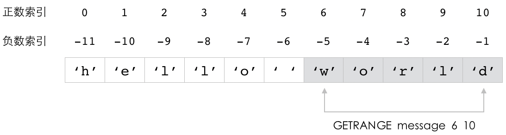
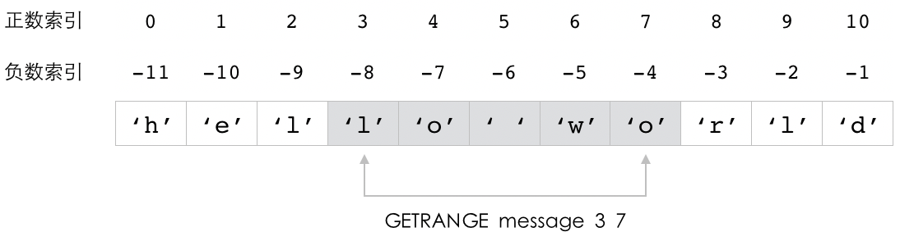
.. image:: image/string/IMAGE_GETRANGE_4.png

----

其他信息
^^^^^^^^^^^^^^^^^

+-----------+-----------------------------------------------+
| 属性      | 值                                            |
+===========+===============================================+
| 复杂度    | O(N)，其中 N 为被返回内容的长度。             |
+-----------+-----------------------------------------------+
| 版本要求  | ``GETRANGE`` 命令从 Redis 2.4.0 开始可用。    |
+-----------+-----------------------------------------------+

SETRANGE：对字符串值的指定索引范围进行设置
-----------------------------------------------------

通过使用 ``SETRANGE`` 命令，
用户可以将字符串键的值从索引 ``index`` 开始的部分替换为指定的新内容，
被替换内容的长度取决于新内容的长度：

::

    SETRANGE key index substitute

``SETRANGE`` 命令在执行完设置操作之后，
会返回字符串值当前的长度作为结果。

比如说，
我们可以通过执行以下命令，
将 ``message`` 键的值从原来的 ``"hello world"`` 修改为 ``"hello Redis"`` ：

::

    redis> GET message
    "hello world"

    redis> SETRANGE message 6 "Redis"
    (integer) 11    -- 字符串值当前的长度为 11 字节

    redis> GET message
    "hello Redis"

这个例子中的 ``SETRANGE`` 命令会将 ``message`` 键的值从索引 6 开始的内容替换为 ``"Redis"`` ，
图 2-7 展示了这个命令的执行过程。

----

图 2-7 ``SETRANGE`` 命令修改 ``message`` 键的过程

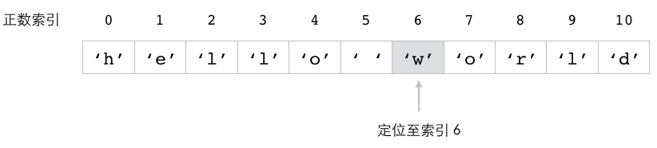
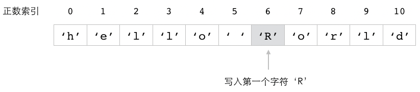
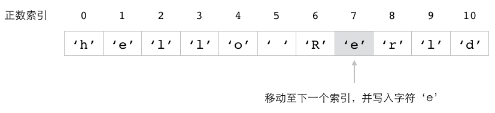
.. image:: image/string/IMAGE_SETRANGE_MESSAGE_4.png
.. image:: image/string/IMAGE_SETRANGE_MESSAGE_5.png
.. image:: image/string/IMAGE_SETRANGE_MESSAGE_6.png

自动扩展被修改的字符串
^^^^^^^^^^^^^^^^^^^^^^^^^^^^^^^^^^^^^

当用户给定的新内容比被替换的内容更长时，
``SETRANGE`` 命令就会自动扩展被修改的字符串值，
从而确保新内容可以顺利写入。

比如说，
以下代码就展示了如何通过 ``SETRANGE`` 命令，
将 ``message`` 键的值从原来的 11 字节长修改为 41 字节长：

::

    redis> GET message
    "hello Redis"

    redis> SETRANGE message 5 ", this is a message send from peter."
    (integer) 41

    redis> GET message
    "hello, this is a message send from peter."

图 2-8 展示了这个 ``SETRANGE`` 命令扩展字符串并进行写入的过程。

----

图 2-8  ``SETRANGE`` 命令的执行过程示例

SETRANGE 命令执行之前的字符串值

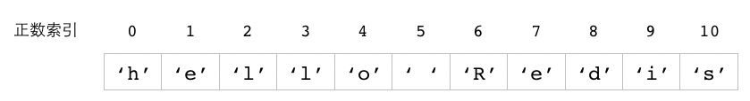

将字符串值扩展至 41 字节长

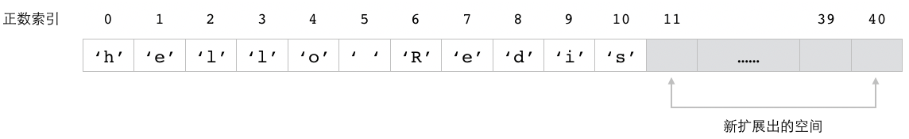

对字符串值进行设置

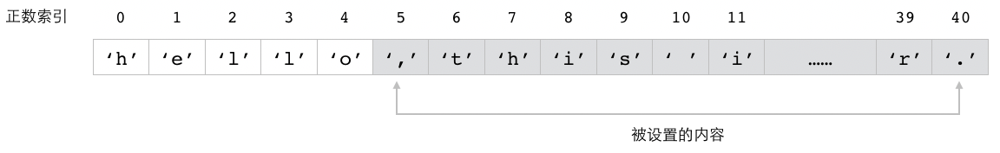

在值里面填充空字节
^^^^^^^^^^^^^^^^^^^^^^^^^

``SETRANGE`` 命令除了会根据用户给定的新内容自动扩展字符串值之外，
还会根据用户给定的 ``index`` 索引扩展字符串：
当用户给定的 ``index`` 索引超出字符串值的长度时，
字符串值末尾直到索引 ``index-1`` 之间的部分将使用空字节进行填充，
换句话说，
这些字节的所有二进制位都会被设置为 ``0`` 。

举个例子，
对于字符串键 ``greeting`` 来说：

::

    redis> GET greeting
    "hello"

当我们执行以下命令时：

::

    redis> SETRANGE greeting 10 "world"
    (integer) 15

``SETRANGE`` 命令会先将字符串值扩展为 ``15`` 个字节长，
然后将 ``"hello"`` 末尾直到索引 ``9`` 之间的所有字节都填充为空字节，
最后再将索引 ``10`` 到索引 ``14`` 的内容设置为 ``"world"`` 。
图 2-9 展示了这个扩展、填充、最后设置的过程。

----

图 2-9 ``SETRANGE greeting 10 "world"`` 的执行过程

执行 SETRANGE 之前的字符串值

.. image:: image/string/IMAGE_FILLED_SETRANGE_1.png

将字符串值从 5 个字节扩展至 15 个字节

.. image:: image/string/IMAGE_FILLED_SETRANGE_2.png

使用空字节填充索引 5 至索引 9

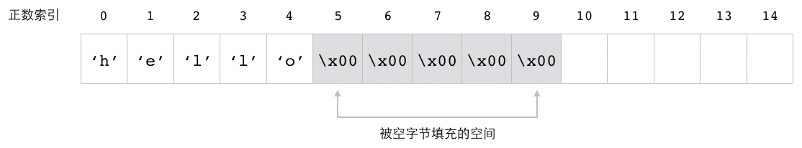

将索引 10 至索引 14 的内容设置为 "world" 

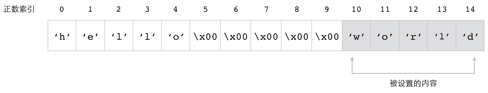

----

通过执行 ``GET`` 命令，
我们可以取得 ``greeting`` 键在执行 ``SETRANGE`` 命令之后的值：

::

    redis> GET greeting
    "hello\x00\x00\x00\x00\x00world"

可以看到，
``greeting`` 键的值现在包含了多个 ``\x00`` 符号，
而每个 ``\x00`` 符号就代表一个空字节。

其他信息
^^^^^^^^^^^^^^^^^^^

+-----------+-----------------------------------------------+
| 属性      | 值                                            |
+===========+===============================================+
| 复杂度    | O(N)，其中 N 为被修改内容的长度。             |
+-----------+-----------------------------------------------+
| 版本要求  | ``SETRANGE`` 命令从 Redis 2.2.0 开始可用。    |
+-----------+-----------------------------------------------+

示例：给文章储存程序加上文章长度计数功能和文章预览功能
---------------------------------------------------------------

在前面的内容中，
我们使用 ``MSET`` 、 ``MGET`` 等命令构建了一个储存文章信息的程序，
在学习了 ``STRLEN`` 命令和 ``GETRANGE`` 命令之后，
我们可以给这个文章储存程序加上两个新功能，
其中一个是文章长度计数功能，
而另一个则是文章预览功能：

- 文章长度计数功能用于显示文章内容的长度，
  读者可以通过这个长度值来了解一篇文章大概有多长，
  从而决定是否阅读一篇文章。

- 文章预览功能则用于显示文章开头的一部分内容，
  这些内容可以帮助读者快速地了解文章本身，
  并吸引读者进一步阅读整篇文章。

代码清单 2-4 展示了这两个功能的具体实现代码，
其中文章长度计数功能是通过对文章内容执行 ``STRLEN`` 命令来实现的，
而文章预览功能则是通过对文章内容执行 ``GETRANGE`` 命令来实现的。

----

代码清单 2-4 带有长度计数功能和预览功能的文章储存程序：\ ``/string/article.py``

::

    from time import time  # time() 函数用于获取当前 Unix 时间戳

    class Article:

        # 省略之前展示过的 __init__()、create() 、update() 等方法……

        def get_content_len(self):
            """
            返回文章内容的字节长度。
            """
            return self.client.strlen(self.content_key)

        def get_content_preview(self, preview_len):
            """
            返回指定长度的文章预览内容。
            """
            start_index = 0
            end_index = preview_len-1
            return self.client.getrange(self.content_key, start_index, end_index)

----

``get_content_len()`` 方法的实现非常简单直接，
没有什么需要说明的。
与此相比，
``get_content_preview()`` 方法显得更复杂一些，
让我们来对它进行一些分析。

首先，
``get_content_preview()`` 方法会接受一个 ``preview_len`` 参数，
用于记录调用者指定的预览长度。
接着程序会根据这个预览长度，
计算出预览内容的起始索引和结束索引：

::

    start_index = 0
    end_index = preview_len-1

因为预览功能要做的就是返回文章内容的前 ``preview_len`` 个字节，
所以上面的这两条赋值语句要做的就是计算并记录文章前 ``preview_len`` 个字节所在的索引范围，
其中 ``start_index`` 的值总是 ``0`` ，
而 ``end_index`` 的值则为 ``preview_len`` 减一。
举个例子，
假如用户输入的预览长度为 ``150`` ，
那么 ``start_index`` 将被赋值为 ``0`` ，
而 ``end_index`` 将被赋值为 ``149`` 。

最后，
程序会调用 ``GETRANGE`` 命令，
根据上面计算出的两个索引，
从储存着文章内容的字符串键里面取出指定的预览内容：

::

    self.client.getrange(self.content_key, start_index, end_index)

以下代码展示了如何使用文章长度计数功能以及文章预览功能：

::

    >>> from redis import Redis
    >>> from article import Article
    >>> client = Redis(decode_responses=True)
    >>> article = Article(client, 12345)
    >>> title = "Improving map data on GitHub"
    >>> content = "You've been able to view and diff geospatial data on GitHub for a while, but now, in addition to being able to collaborate on the GeoJSON files you upload to GitHub, you can now more easily contribute to the underlying, shared basemap, that provides your data with context."
    >>> author = "benbalter"
    >>> article.create(title, content, author)  # 将一篇比较长的文章储存起来
    True
    >>> article.get_content_len()               # 文章总长 273 字节
    273
    >>> article.get_content_preview(100)        # 获取文章前 100 字节的内容
    "You've been able to view and diff geospatial data on GitHub for a while, but now, in addition to bei"

APPEND：追加新内容到值的末尾
-------------------------------------

通过调用 ``APPEND`` 命令，
用户可以将给定的内容追加到字符串键已有值的末尾：

::

    APPEND key suffix

``APPEND`` 命令在执行追加操作之后，
会返回字符串值当前的长度作为返回值。

举个例子，
对于以下这个名为 ``description`` 的键来说：

::

    redis> GET description
    "Redis"

我们可以通过执行以下命令，
将字符串 ``" is a database"`` 追加到 ``description`` 键已有值的末尾：

::

    redis> APPEND description " is a database"
    (integer) 19    -- 追加操作执行完毕之后，值的长度

以下是 ``description`` 键在执行完追加操作之后的值：

::

    redis> GET description
    "Redis is a database"

在此之后，
我们可以继续执行以下 ``APPEND`` 命令，
将字符串 ``" with many different data structure."`` 追加到 ``description`` 键已有值的末尾：

::

    redis> APPEND description " with many different data structure."
    (integer) 55

现在，
``description`` 键的值又变成了以下这个样子：

::

    redis> GET description
    "Redis is a database with many different data structure."

..
    以下代码展示了如何使用 ``APPEND`` 命令将一些内容追加到字符串值的末尾：

    ::

        redis> SET description "Redis"
        OK

        redis> GET description    -- description 键当前的值
        "Redis"

        redis> APPEND description " is a database"
        (integer) 19    -- 追加操作执行完毕之后，值的长度

        redis> GET description
        "Redis is a database"

        redis> APPEND description " with many different data structure."
        (integer) 55

        redis> GET description
        "Redis is a database with many different data structure."

    在最开始，
    键 ``description`` 的值只有 ``"Redis"`` 五个字符；
    之后的第一次 ``APPEND`` 调用将 ``" is a database"`` 追加到了 ``description`` 键已有值的末尾，
    使得 ``description`` 键的值变成了 ``"Redis is a database"`` ；
    而之后的第二次 ``APPEND`` 调用又将 ``" with many different data structure."`` 追加到了 ``description`` 键已有值的末尾，
    使得整个值变成了 ``"Redis is a database with many different data structure."`` 。

图 2-10 展示了 ``description`` 键的值是如何随着 ``APPEND`` 命令的执行而变化的。

----

图 2-10 ``description`` 键的值随着 ``APPEND`` 命令的执行而变化

.. image:: image/string/IMAGE_APPEND.png

处理不存在的键
^^^^^^^^^^^^^^^^^^^^^^^^^

如果用户给定的键并不存在，
那么 ``APPEND`` 命令会先将键的值初始化为空字符串 ``""`` ，
然后再执行追加操作，
最终效果跟使用 ``SET`` 命令为键设置值的情况类似：

::

    redis> GET append_msg  -- 键不存在
    (nil)

    redis> APPEND append_msg "hello"  -- 效果相当于执行 SET append_msg "hello"
    (integer) 5

    redis> GET append_msg
    "hello"

当键有了值之后，
``APPEND`` 又会像平时一样，
将用户给定的值追加到已有值的末尾：

::

    redis> APPEND append_msg ", how are you?"
    (integer) 19

    redis> GET append_msg
    "hello, how are you?"

图 2-11 展示了 ``APPEND`` 命令是如何根据键是否存在来判断应该执行哪种操作的。

----

图 2-11 ``APPEND`` 的判断过程

.. image:: image/string/IMAGE_TWO_CASE_APPEND.png

----

其他信息
^^^^^^^^^^^^^^^^^

+---------------+-------------------------------------------+
| 属性          | 值                                        |
+===============+===========================================+
| 复杂度        | O(N)，其中 N 为新追加内容的长度。         |
+---------------+-------------------------------------------+
| 版本要求      | ``APPEND`` 命令从 Redis 2.0.0 开始可用。  |
+---------------+-------------------------------------------+

示例：储存日志
----------------------

很多程序在运行的时候都会生成一些日志，
这些日志记录了程序的运行状态以及执行过的重要操作。

比如说，
以下展示的就是 Redis 服务器运行时输出的一些日志，
这些日志记录了 Redis 开始运行的时间，
载入数据库所耗费的时长，
接收客户端连接所使用的端口号，
以及进行数据持久化操作的时间点等信息：

::

    6066:M 06 Jul 17:40:49.611 # Server started, Redis version 3.1.999
    6066:M 06 Jul 17:40:49.627 * DB loaded from disk: 0.016 seconds
    6066:M 06 Jul 17:40:49.627 * The server is now ready to accept connections on port 6379
    6066:M 06 Jul 18:29:20.009 * DB saved on disk

为了记录程序运行的状态，
又或者为了对日志进行分析，
我们有时候会需要把程序生成的日志储存起来。

比如说，
我们可以通过使用 ``SET`` 命令，
将日志的生成时间用作键、日志的内容用作值，
把上面展示的日志储存到多个字符串键里面：

::

    redis> SET "06 Jul 17:40:49.611" "# Server started, Redis version 3.1.999"
    OK

    redis> SET "06 Jul 17:40:49.627" "* DB loaded from disk: 0.016 seconds"
    OK

    redis> SET "06 Jul 17:40:49.627" "* The server is now ready to accept connections on port 6379"
    OK

    redis> SET "06 Jul 18:29:20.009" "* DB saved on disk"
    OK

遗憾的是，
这种日志储存方式并不理想，
它的主要问题有两个：

1. 这种方法需要在数据库里面创建非常多的键。
   因为 Redis 每创建一个键就需要消耗一定的额外资源（overhead）来对键进行维护，
   所以键的数量越多，
   消耗的额外资源就会越多。

2. 这种方法将全部日志分散地储存在不同的键里面，
   当程序想要对特定的日志进行分析的时候，
   它就需要花费额外的时间和资源去查找指定的日志，
   这给分析操作带来了额外的麻烦和资源消耗。

代码清单 2-5 展示了另一种更为方便和高效的日志储存方式，
这个程序会把同一天之内产生的所有日志都储存在同一个字符串键里面，
从而使得用户可以非常高效地取得指定日期内产生的所有日志。

----

代码清单 2-5 使用字符串键实现高效的日志储存程序：\ ``/string/log.py``

.. literalinclude:: code/string/log.py

----

日志储存程序的 ``add()`` 方法负责将新日志储存起来。
这个方法首先会将分隔符追加到新日志的末尾：

::

    new_log += LOG_SEPARATOR

然后调用 ``APPEND`` 命令，
将新日志追加到已有日志的末尾：

::

    self.client.append(self.key, new_log)

举个例子，
如果用户输入的日志是：

::

    "this is log1"

那么 ``add()`` 方法首先会把分隔符 ``"\n"`` 追加到这行日志的末尾，
使之变成：

::

    "this is log1\n"

然后调用以下命令，
将新日志追到已有日志的末尾：

::

    APPEND key "this is log1\n"

负责获取所有日志的 ``get_all()`` 方法比较复杂，
因为它不仅需要从字符串键里面取出包含了所有日志的字符串值，
还需要从这个字符串值里面分割出每一条日志。
首先，
这个方法使用 ``GET`` 命令从字符串键里面取出包含了所有日志的字符串值：

::

    all_logs = self.client.get(self.key)

接着，
程序会检查 ``all_logs`` 这个值是否为空，
如果为空则表示没有日志被储存，
程序直接返回空列表 ``[]`` 作为 ``get_all()`` 方法的执行结果；
另一方面，
如果值不为空，
那么程序将调用 Python 的 ``split()`` 方法对字符串值进行分割，
并将分割结果储存到 ``log_list`` 列表里面：

::

    log_list = all_logs.split(LOG_SEPARATOR)

因为 ``split()`` 方法会在结果中包含一个空字符串，
而我们并不需要这个空字符串，
所以程序还会调用 ``remove()`` 方法，
将空字符串从分割结果中移除，
使得 ``log_list`` 列表里面只保留被分割的日志：

::

    log_list.remove("")

在此之后，
程序只需要将包含了多条日志的 ``log_list`` 列表返回给调用者就可以了：

::

    return log_list

举个例子，
假设我们使用 ``add()`` 方法，
在一个字符串键里面储存了 ``"this is log1"`` 、 ``this is log2"`` 、 ``this is log3"`` 这三条日志，
那么 ``get_all()`` 方法在使用 ``GET`` 命令获取字符串键的值时，
将得到以下结果：

::

    "this is log1\nthis is log2\nthis is log3"

在使用 ``split(LOG_SEPARATOR)`` 方法对这个结果进行分割之后，
程序将得到一个包含四个元素的列表，
其中列表最后的元素为空字符串：

::

    ["this is log1", "this is log2", "this is log3", ""]

在调用 ``remove("")`` 方法移除列表中的空字符串之后，
列表里面就只会包含被储存的日志：

::

    ["this is log1", "this is log2", "this is log3"]

这时 ``get_all()`` 方法只需要把这个列表返回给调用者就可以了。

以下代码展示了这个日志储存程序的使用方法：

::

    >>> from redis import Redis
    >>> from log import Log
    >>> client = Redis(decode_responses=True)
    >>> # 按日期归类日志
    >>> log = Log(client, "06 Jul")
    >>> # 储存日志
    >>> log.add("17:40:49.611 # Server started, Redis version 3.1.999")
    >>> log.add("17:40:49.627 * DB loaded from disk: 0.016 seconds")
    >>> log.add("17:40:49.627 * The server is now ready to accept connections on port 6379")
    >>> log.add("18:29:20.009 * DB saved on disk")
    >>> # 以列表形式返回所有日志
    >>> log.get_all()    
    ['17:40:49.611 # Server started, Redis version 3.1.999', '17:40:49.627 * DB loaded from disk: 0.016 seconds', '17:40:49.627 * The server is now ready to accept connections on port 6379', '18:29:20.009 * DB saved on disk']
    >>> # 单独打印每条日志
    >>> for i in log.get_all():
    ...   print(i)
    ... 
    17:40:49.611 # Server started, Redis version 3.1.999
    17:40:49.627 * DB loaded from disk: 0.016 seconds
    17:40:49.627 * The server is now ready to accept connections on port 6379
    18:29:20.009 * DB saved on disk

使用字符串键储存数字值
-------------------------------

每当用户将一个值储存到字符串键里面的时候，
Redis 都会对这个值进行检测，
如果这个值能够被解释为以下两种类型的其中一种，
那么 Redis 就会把这个值当做数字来处理：

- 一种是能够使用 C 语言的 ``long long int`` 类型储存的整数，
  在大多数系统中，
  这种类型储存的都是 64 位长度的有符号整数，
  取值范围介于 ``-9223372036854775808`` 和 ``9223372036854775807`` 之间；

- 第二种是能够使用 C 语言的 ``long double`` 类型储存的浮点数，
  在大多数系统中，
  这种类型储存的都是 128 位长度的有符号浮点数，
  取值范围介于 ``3.36210314311209350626e-4932`` 和 ``1.18973149535723176502e+4932L`` 之间。

作为例子，
表 1-2 展示了一些不同类型的值，
并说明了 Redis 对它们的解释方式。

----

表 1-2 一些能够被 Redis 解释为数字的例子

+---------------------------+---------------------------------------------------------------+
| 值                        | Redis 解释这个值的方式                                        |
+===========================+===============================================================+
| ``10086``                 | 解释为整数。                                                  |
+---------------------------+---------------------------------------------------------------+
| ``+894``                  | 解释为整数。                                                  |
+---------------------------+---------------------------------------------------------------+
| ``-123``                  | 解释为整数。                                                  |
+---------------------------+---------------------------------------------------------------+
| ``3.14``                  | 解释为浮点数。                                                |
+---------------------------+---------------------------------------------------------------+
| ``+2.56``                 | 解释为浮点数。                                                |
+---------------------------+---------------------------------------------------------------+
| ``-5.12``                 | 解释为浮点数。                                                |
+---------------------------+---------------------------------------------------------------+
| ``12345678901234567890``  | 这个值虽然是整数，                                            |
|                           | 但是因为它的大小超出了 ``long long int`` 类型能够容纳的范围， |
|                           | 所以只能被解释为字符串。                                      |
+---------------------------+---------------------------------------------------------------+
| ``3.14e5``                | 因为 Redis 不能解释使用科学记数法表示的浮点数，               |
|                           | 所以这个值只能被解释为字符串。                                |
+---------------------------+---------------------------------------------------------------+
| ``"one"``                 | 解释为字符串。                                                |
+---------------------------+---------------------------------------------------------------+
| ``"123abc"``              | 解释为字符串。                                                |
+---------------------------+---------------------------------------------------------------+

----

为了能够更方便地处理那些使用字符串键储存的数字值，
Redis 提供了一系列加法操作命令以及减法操作命令，
用户可以通过这些命令直接对字符串键储存的数字值执行加法操作或减法操作，
本章接下来将对这些命令进行介绍。

INCRBY、DECRBY：对整数值执行加法操作和减法操作
---------------------------------------------------------

当字符串键储存的值能够被 Redis 解释为整数时，
用户就可以通过 ``INCRBY`` 命令和 ``DECRBY`` 命令，
对被储存的整数值执行加法操作或是减法操作。

``INCRBY`` 命令用于为整数值加上指定的整数增量，
并返回键在执行加法操作之后的值：

::

    INCRBY key increment

以下代码展示了如何使用 ``INCRBY`` 命令去增加一个字符串键的值：

::

    redis> SET number 100
    OK

    redis> GET number
    "100"

    redis> INCRBY number 300     -- 将键的值加上 300
    (integer) 400

    redis> INCRBY number 256     -- 将键的值加上 256
    (integer) 656

    redis> INCRBY number 1000    -- 将键的值加上 1000
    (integer) 1656

    redis> GET number
    "1656"

与 ``INCRBY`` 命令的作用正好相反，
``DECRBY`` 命令用于为整数值减去指定的整数减量，
并返回键在执行减法操作之后的值：

::

    DECRBY key increment

以下代码展示了如何使用 ``DECRBY`` 命令去减少一个字符串键的值：

::

    redis> SET number 10086
    OK

    redis> GET number
    "10086"

    redis> DECRBY number 300     -- 将键的值减去 300
    (integer) 9786

    redis> DECRBY number 786     -- 将键的值减去 786
    (integer) 9000

    redis> DECRBY number 5500    -- 将键的值减去 5500
    (integer) 3500

    redis> GET number
    "3500"

类型限制
^^^^^^^^^^^^^^^^^^

当字符串键的值不能被 Redis 解释为整数时，
对键执行 ``INCRBY`` 命令或是 ``DECRBY`` 命令将返回一个错误：

::

    redis> SET pi 3.14
    OK

    redis> INCRBY pi 100    -- 不能对浮点数值执行
    (error) ERR value is not an integer or out of range

    redis> SET message "hello world"
    OK

    redis> INCRBY message    -- 不能对字符串值执行
    (error) ERR wrong number of arguments for 'incrby' command

    redis> SET big-number 123456789123456789123456789
    OK

    redis> INCRBY big-number 100    -- 不能对超过 64 位长度的整数执行
    (error) ERR value is not an integer or out of range

另外需要注意的一点是，
``INCRBY`` 和 ``DECRBY`` 的增量和减量也必须能够被 Redis 解释为整数，
使用其他类型的值作为增量或减量将返回一个错误：

::

    redis> INCRBY number 3.14    -- 不能使用浮点数作为增量
    (error) ERR value is not an integer or out of range

    redis> INCRBY number "hello world"    -- 不能使用字符串值作为增量
    (error) ERR value is not an integer or out of range
    

处理不存在的键
^^^^^^^^^^^^^^^^^^^^^^^

当 ``INCRBY`` 命令或 ``DECRBY`` 命令遇到不存在的键时，
命令会先将键的值初始化为 ``0`` ，
然后再执行相应的加法操作或减法操作。

以下代码展示了 ``INCRBY`` 命令是如何处理不存在的键 ``x`` 的：

::

    redis> GET x    -- 键 x 不存在
    (nil)

    redis> INCRBY x 123    -- 先将键 x 的值初始化为 0 ，然后再执行加上 123 的操作
    (integer) 123

    redis> GET x
    "123"

而以下代码则展示了 ``DECRBY`` 命令是如何处理不存在的键 ``y`` 的：

::

    redis> GET y    -- 键 y 不存在
    (nil)

    redis> DECRBY y 256    -- 先将键 y 的值初始化为 0 ，然后再执行减去 256 的操作
    (integer) -256

    redis> GET y
    "-256"

..
    .. note:: 注意数字命令的返回值

        不同客户端在返回数字值时会采取不同的方法，
        有些客户端总是直接返回字符串格式的数字，
        而有些客户端则会将字符串格式的数字转换回数字类型，
        甚至同一个客户端的不同命令都会对数字采取不同的返回方式，
        忘记值的类型经常会导致编程错误。
        因此在需要对 Redis 中储存的数字进行操作时，
        请一定要确认你的客户端以及你正在使用的命令是如何处理数字的。

其他信息
^^^^^^^^^^^^^^^^^^

+---------------+---------------------------------------------------------------+
| 属性          | 值                                                            |
+===============+===============================================================+
| 复杂度        | O(1)                                                          |
+---------------+---------------------------------------------------------------+
| 版本要求      | ``INCRBY`` 命令和 ``DECRBY`` 命令从 Redis 1.0.0 开始可用。    |
+---------------+---------------------------------------------------------------+

INCR、DECR：对整数值执行加一操作和减一操作
---------------------------------------------------------

因为对整数值执行加一操作或是减一操作的场景经常会出现，
所以为了能够更方便地执行这两个操作，
Redis 分别提供了用于执行加一操作的 ``INCR`` 命令以及用于执行减一操作的 ``DECR`` 命令。

``INCR`` 命令的作用就是将字符串键储存的整数值加上一，
它的效果相当于执行 ``INCRBY key 1`` ：

::

    INCR key

而 ``DECR`` 命令的作用就是将字符串键储存的整数值减去一，
它的效果相当于执行 ``DECRBY key 1`` ：

::

    DECR key

以下代码展示了 ``INCR`` 命令和 ``DECR`` 命令的作用：

::

    redis> SET counter 100
    OK

    redis> INCR counter    -- 对整数值执行加一操作
    (integer) 101

    redis> INCR counter
    (integer) 102

    redis> INCR counter
    (integer) 103

    redis> DECR counter    -- 对整数值执行减一操作
    (integer) 102

    redis> DECR counter
    (integer) 101

    redis> DECR counter
    (integer) 100

除了增量和减量被固定为一之外，
``INCR`` 命令和 ``DECR`` 命令的其他方面与 ``INCRBY`` 命令以及 ``DECRBY`` 命令完全相同。

其他信息
^^^^^^^^^^^^^^^^^^

+-----------+-----------------------------------------------------------+
| 属性      | 值                                                        |
+===========+===========================================================+
| 复杂度    | O(1)                                                      |
+-----------+-----------------------------------------------------------+
| 版本要求  | ``INCR`` 命令和 ``DECR`` 命令从 Redis 1.0.0 开始可用。    |
+-----------+-----------------------------------------------------------+

INCRBYFLOAT：对数字值执行浮点数加法操作
---------------------------------------------------------

除了用于执行整数加法操作的 ``INCR`` 命令以及 ``INCRBY`` 命令之外，
Redis 还提供了用于执行浮点数加法操作的 ``INCRBYFLOAT`` 命令：

::

    INCRBYFLOAT key increment

``INCRBYFLOAT`` 命令可以把一个浮点数增量加到字符串键储存的数字值上面，
并返回键在执行加法操作之后的数字值作为命令的返回值。

以下代码展示了如何使用 ``INCRBYFLOAT`` 命令去增加一个浮点数的值：

::

    redis> SET decimal 3.14    -- 一个储存着浮点数值的键
    OK

    redis> GET decimal
    "3.14"

    redis> INCRBYFLOAT decimal 2.55    -- 将键 decimal 的值加上 2.55
    "5.69"

    redis> GET decimal
    "5.69"

处理不存在的键
^^^^^^^^^^^^^^^^^^^^^^^^

``INCRBYFLOAT`` 命令在遇到不存在的键时，
会先将键的值初始化为 ``0`` ，
然后再执行相应的加法操作。

在以下展示的代码里面，
``INCRBYFLOAT`` 命令就是先把 ``x-point`` 键的值初始化为 ``0`` ，
然后再执行加法操作的：

::

    redis> GET x-point    -- 不存在的键
    (nil)

    redis> INCRBYFLOAT x-point 12.7829
    "12.7829"

    redis> GET x-point
    "12.7829"

使用 ``INCRBYFLOAT`` 执行浮点数减法操作
^^^^^^^^^^^^^^^^^^^^^^^^^^^^^^^^^^^^^^^^^^^^^^^^

Redis 为 ``INCR`` 命令提供了相应的减法版本 ``DECR`` 命令， 
也为 ``INCRBY`` 命令提供了相应的减法版本 ``DECRBY`` 命令， 
但是并没有为 ``INCRBYFLOAT`` 命令提供相应的减法版本，
因此用户只能通过给 ``INCRBYFLOAT`` 命令传入负数增量来执行浮点数减法操作。

以下代码展示了如何使用 ``INCRBYFLOAT`` 命令执行浮点数减法计算：

::

    redis> SET pi 3.14
    OK

    redis> GET pi
    "3.14"

    redis> INCRBYFLOAT pi -1.1    -- 值减去 1.1
    "2.04"

    redis> INCRBYFLOAT pi -0.7    -- 值减去 0.7
    "1.34"

    redis> INCRBYFLOAT pi -1.3    -- 值减去 1.3
    "0.04"

``INCRBYFLOAT`` 与整数值
^^^^^^^^^^^^^^^^^^^^^^^^^^^^^^^^^^

``INCRBYFLOAT`` 命令对于类型限制的要求比 ``INCRBY`` 命令和 ``INCR`` 命令要宽松得多，
``INCRBYFLOAT`` 命令不仅可以用于处理浮点数值， 
它还可以用于处理整数值：

1. ``INCRBYFLOAT`` 命令既可用于浮点数值，
   也可以用于整数值。

2. ``INCRBYFLOAT`` 命令的增量既可以是浮点数， 
   又可以是整数。

3. 当 ``INCRBYFLOAT`` 命令的执行结果可以表示为整数时， 
   命令的执行结果将以整数形式储存。

以下代码展示了如何使用 ``INCRBYFLOAT`` 去处理一个储存着整数值的键：

::

    redis> SET pi 1    -- 创建一个整数值
    OK

    redis> GET pi
    "1"

    redis> INCRBYFLOAT pi 2.14
    "3.14"

以下代码展示了如何使用整数值作为 ``INCRBYFLOAT`` 命令的增量：

::

    redis> SET pi 3.14
    OK

    redis> GET pi
    "3.14"

    redis> INCRBYFLOAT pi 20    -- 增量为整数值
    "23.14"

而以下代码则展示了 ``INCRBYFLOAT`` 命令是如何把计算结果储存为整数的：

::

    redis> SET pi 3.14
    OK

    redis> GET pi
    "3.14"

    redis> INCRBYFLOAT pi 0.86    -- 计算结果被储存为整数
    "4"

小数位长度限制
^^^^^^^^^^^^^^^^^^^^^^^^^^^^

虽然 Redis 并不限制字符串键储存的浮点数的小数位长度，
但是在使用 ``INCRBYFLOAT`` 命令处理浮点数的时候，
命令最多只会保留计算结果小数点后的 17 位数字，
超过这个范围的小数将被截断：

::

    redis> GET i
    "0.01234567890123456789"    -- 这个数字的小数部分有 20 位长

    redis> INCRBYFLOAT i 0
    "0.01234567890123457"    -- 执行加法操作之后，小数部分只保留了 17 位

其他信息
^^^^^^^^^^^^^^^^^^

+-----------+-------------------------------------------------------+
| 属性      | 值                                                    |
+===========+=======================================================+
| 复杂度    | O(1)                                                  |
+-----------+-------------------------------------------------------+
| 版本要求  | ``INCRBYFLOAT`` 命令从 Redis 2.6.0 开始可用。         |        
+-----------+-------------------------------------------------------+

示例：ID 生成器
----------------------

在构建应用程序的时候，
我们经常会用到各式各样的 ID （identifier，标识符）。
比如说，
储存用户信息的程序在每次出现一个新用户的时候就需要创建一个新的用户 ID ，
而博客程序在作者每次发表一篇新文章的时候也需要创建一个新的文章 ID ，
诸如此类。

ID 通常会以数字形式出现，
并且通过递增的方式来创建出新的 ID 。
比如说，
如果当前最新的 ID 值为 ``10086`` ，
那么下一个 ID 就应该是 ``10087`` ，
而再下一个 ID 则是 ``10088`` ，
以此类推。

代码清单 2-6 展示了一个使用字符串键实现的 ID 生成器，
这个生成器通过执行 ``INCR`` 命令来产生新的 ID ，
并且它还可以通过执行 ``SET`` 命令来保留指定数字之前的 ID ，
从而避免用户为了得到某个指定的 ID 而生成大量无效 ID 。

----

代码清单 2-6 使用字符串键实现的 ID 生成器：\ ``/string/id_generator.py``

.. literalinclude:: code/string/id_generator.py

----

在这个 ID 生成器程序中，
``produce()`` 方法要做的就是调用 ``INCR`` 命令，
对字符串键储存的整数值执行加一操作，
并将执行加法操作之后得到的新值用作 ID 。

另一方面，
用于保留指定 ID 的 ``reserve()`` 方法是通过执行 ``SET`` 命令为键设置值来实现的：
当用户把一个字符串键的值设置为 ``N`` 之后，
对这个键执行 ``INCR`` 命令总是会返回比 ``N`` 更大的值，
因此在效果上就相当于把所有小于等于 ``N`` 的 ID 都保留下来了。

需要注意的是，
这种保留 ID 的方法只能在字符串键还没有值的情况下使用，
如果用户已经使用过 ``produce()`` 方法来生成 ID ，
又或者已经执行过 ``reserve()`` 方法来保留 ID ，
那么再使用 ``SET`` 命令去设置 ID 值可能就会导致 ``produce()`` 方法产生出一些已经用过的 ID ，
并因此引发 ID 冲突。

为此，
``reserve()`` 方法在设置字符串键时使用了带有 ``NX`` 选项的 ``SET`` 命令，
从而确保了对键的设置操作只会在键不存在的情况下执行：

::

    self.client.set(self.key, n, nx=True)

以下代码展示了这个 ID 生成器的使用方法：

::

    >>> from redis import Redis
    >>> from id_generator import IdGenerator
    >>> client = Redis(decode_responses=True)
    >>> id_generator = IdGenerator(client, "user::id")
    >>> id_generator.reserve(1000000)  # 保留前一百万个 ID
    True
    >>> id_generator.produce()         # 生成 ID ，这些 ID 的值都大于一百万
    1000001
    >>> id_generator.produce()
    1000002
    >>> id_generator.produce()
    1000003
    >>> id_generator.reserve(1000)     # 键已经有值，无法再次执行 reserve() 方法
    False

示例：计数器
-------------------

除了 ID 生成器之外，
计数器也是构建应用程序时必不可少的组件之一：
网站的访客数量、用户执行某个操作的次数、某首歌或者某个视频的播放量、论坛帖子的回复数量等等，
记录这些信息都需要用到计数器。
实际上，
计数器在互联网中几乎无处不在，
因此如何简单高效地实现计数器一直都是构建应用程序时经常会遇到的一个问题。

代码清单 2-7 展示了一个计数器实现，
这个程序把计数器的值储存在一个字符串键里面，
并通过 ``INCRBY`` 命令和 ``DECRBY`` 命令，
对计数器的值执行加法操作和减法操作；
在有需要的时候，
用户还可以通过调用 ``GETSET`` 方法来清零计数器并取得清零之前的旧值。

----

代码清单 2-7 使用字符串键实现的计数器：\ ``/string/counter.py``

.. literalinclude:: code/string/counter.py

----

在这个程序中，
``increase()`` 方法和 ``decrease()`` 方法在定义时都使用了 Python 的参数默认值特性：

::

    def increase(self, n=1):

::

    def decrease(self, n=1):

以上定义表明，
如果用户直接以无参数的方式调用 ``increase()`` 或者 ``decrease()`` ，
那么参数 ``n`` 的值将会被设置为 ``1`` 。

在设置了参数 ``n`` 之后，
``increase()`` 方法和 ``decrease()`` 方法会分别调用 ``INCRBY`` 命令和 ``DECRBY`` 命令，
根据参数 ``n`` 的值，
对给定的键执行加法或减法操作：

::
    
    # increase() 方法
    return self.client.incr(self.key, n)

::

    # decrease() 方法
    return self.client.decr(self.key, n)

注意，
``increase()`` 方法在内部调用的是 ``incr()`` 方法而不是 ``incrby()`` 方法，
并且 ``decrease()`` 方法在内部调用的也是 ``decr()`` 方法而不是 ``decrby()`` 方法，
这是因为在 redis-py 客户端中，
``INCR`` 命令和 ``INCRBY`` 命令都是由 ``incr()`` 方法负责执行的：

- 如果用户在调用 ``incr()`` 方法时没有给定增量，
  那么 ``incr()`` 方法就默认用户指定的增量为 ``1`` ，
  并执行 ``INCR`` 命令；

- 另一方面，
  如果用户在调用 ``incr()`` 方法时给定了增量，
  那么 ``incr()`` 方法就会执行 ``INCRBY`` 命令，
  并根据给定的增量执行加法操作；

``decr()`` 方法的情况也与此类似，
只是被调用的命令变成了 ``DECR`` 命令和 ``DECRBY`` 命令。

以下代码展示了这个计数器的使用方法：

::

    >>> from redis import Redis
    >>> from counter import Counter
    >>> client = Redis(decode_responses=True)
    >>> counter = Counter(client, "counter::page_view")
    >>> counter.increase()    # 将计数器的值加上 1
    1
    >>> counter.increase()    # 将计数器的值加上 1
    2
    >>> counter.increase(10)  # 将计数器的值加上 10
    12
    >>> counter.decrease()    # 将计数器的值减去 1
    11
    >>> counter.decrease(5)   # 将计数器的值减去 5
    6
    >>> counter.reset()       # 重置计数器，并返回旧值
    6
    >>> counter.get()         # 返回计数器当前的值
    0

示例：限速器
-------------------

为了保障系统的安全性和性能，
并保证系统的重要资源不被滥用，
应用程序常常会对用户的某些行为进行限制，
比如说：

- 为了防止网站内容被网络爬虫抓取，
  网站管理者通常会限制每个 IP 地址在固定时间段内能够访问的页面数量
  —— 比如一分钟之内最多只能访问 30 个页面 ——
  超过这一限制的用户将被要求进行身份验证，
  确认本人并非网络爬虫，
  又或者等到限制解除了之后再进行访问。

- 为了防止用户的账号遭到暴力破解，
  网上银行通常会对访客的密码试错次数进行限制，
  如果一个访客在尝试登录某个账号的过程中，
  连续好几次输入了错误的密码，
  那么这个账号将被冻结，
  只能等到第二天再尝试登录，
  有的银行还会向账号持有者的手机发送通知来汇报这一情况。

实现这些限制机制的其中一种方法是使用限速器，
它可以限制用户在指定时间段之内能够执行某项操作的次数。

代码清单 2-8 展示了一个使用字符串键实现的限速器，
这个限速器程序会把操作的最大可执行次数储存在一个字符串键里面，
然后在用户每次尝试执行被限制的操作之前，
使用 ``DECR`` 命令将操作的可执行次数减去一，
最后通过检查可执行次数的值来判断是否执行该操作。

----

代码清单 2-8 倒计时式的限速器：\ ``/string/limiter.py``

.. literalinclude:: code/string/limiter.py

----

这个限速器的关键在于 ``set_max_execute_times()`` 方法和 ``still_valid_to_execute()`` 方法：
前者用于将最大可执行次数储存在一个字符串键里面，
而后者则会在每次被调用时对可执行次数执行减一操作，
并检查目前剩余的可执行次数是否已经变为负数：
如果为负数则表示可执行次数已经耗尽，
不为负数则表示操作可以继续执行。

以下代码展示了这个限制器的使用方法：

::

    >>> from redis import Redis
    >>> from limiter import Limiter
    >>> client = Redis(decode_responses=True)
    >>> limiter = Limiter(client, 'wrong_password_limiter')  # 密码错误限制器
    >>> limiter.set_max_execute_times(3)  # 最多只能输入错三次密码
    >>> limiter.still_valid_to_execute()  # 前三次操作能够顺利执行
    True
    >>> limiter.still_valid_to_execute()
    True
    >>> limiter.still_valid_to_execute()
    True
    >>> limiter.still_valid_to_execute()  # 从第四次开始，操作将被拒绝执行
    False
    >>> limiter.still_valid_to_execute()
    False

而以下伪代码则展示了如何使用这个限速器去限制密码的错误次数：

::

    # 试错次数未超过限制
    while limiter.still_valid_to_execute():
        # 获取访客输入的账号和密码
        account, password = get_user_input_account_and_password()
        # 验证账号和密码是否匹配
        if password_match(account, password):
            ui_print("密码验证成功")
        else:
            ui_print("密码验证失败，请重新输入")
    # 试错次数已超过限制
    else:
        # 锁定账号
        lock_account(account)
        ui_print("连续尝试登录失败，账号已被锁定，请明天再来尝试登录。")

重点回顾
-------------------

- Redis 的字符串键可以把单独的一个键和单独的一个值在数据库里面关联起来，
  并且这个键和值既可以储存文字数据，
  又可以储存二进制数据。

- ``SET`` 命令在默认情况下会直接覆盖字符串键已有的值，
  如果我们只想在键不存在的情况下为它设置值，
  那么可以使用带有 ``NX`` 选项的 ``SET`` 命令；
  相反地，
  如果我们只想在键已经存在的情况下为它设置新值，
  那么可以使用带有 ``XX`` 选项的 ``SET`` 命令。

- 使用 ``MSET`` 、 ``MSETNX`` 以及 ``MGET`` 命令可以有效地减少程序的网络通信次数，
  从而提升程序的执行效率。

- Redis 用户可以通过制定命名格式来提升 Redis 数据的可读性并避免键名冲突。

- 字符串值的正数索引以 ``0`` 为开始，
  从字符串的开头向结尾不断递增；
  字符串值的负数索引以 ``-1`` 为开始，
  从字符串的结尾向开头不断递减。

- ``GETRANGE key start end`` 命令接受的是闭区间索引范围，
  位于 ``start`` 索引和 ``end`` 索引上的值也会被包含在命令返回的内容当中。

- ``SETRANGE`` 命令在有需要时会自动对字符串值进行扩展，
  并使用空字节填充新扩展空间中没有内容的部分。

- ``APPEND`` 命令在键不存在时执行设置操作，
  在键存在时执行追加操作。

- Redis 会把能够被表示为 ``long long int`` 类型的整数以及能够被表示为 ``long double`` 类型的浮点数当做数字来处理。
